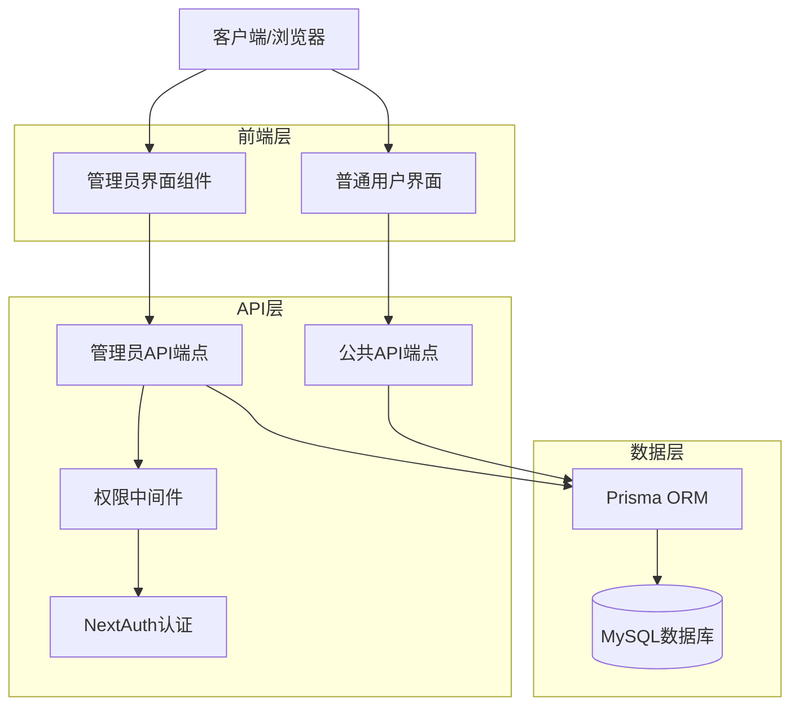
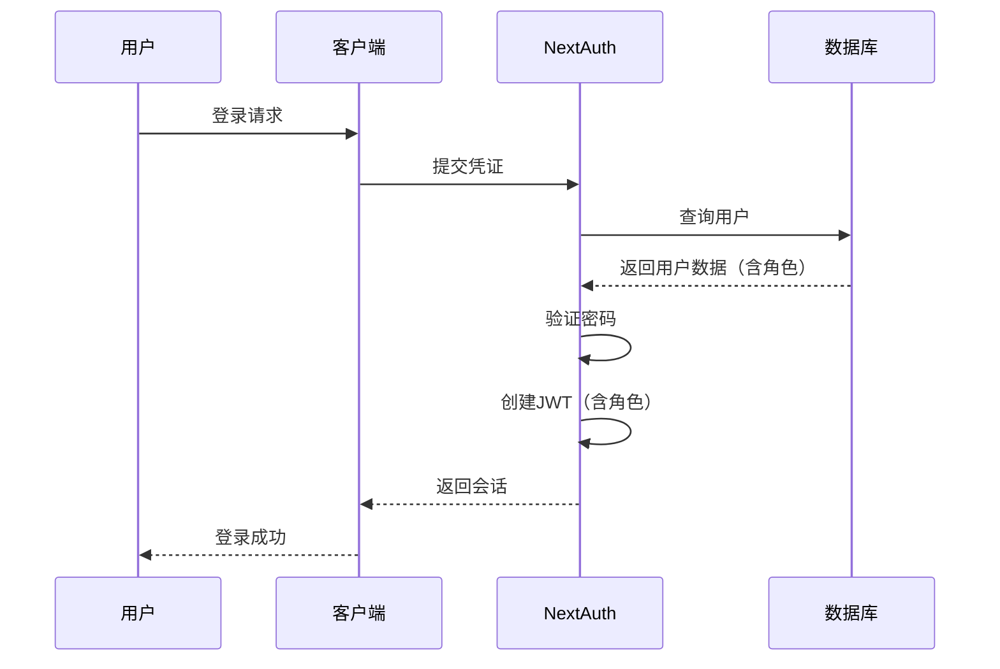
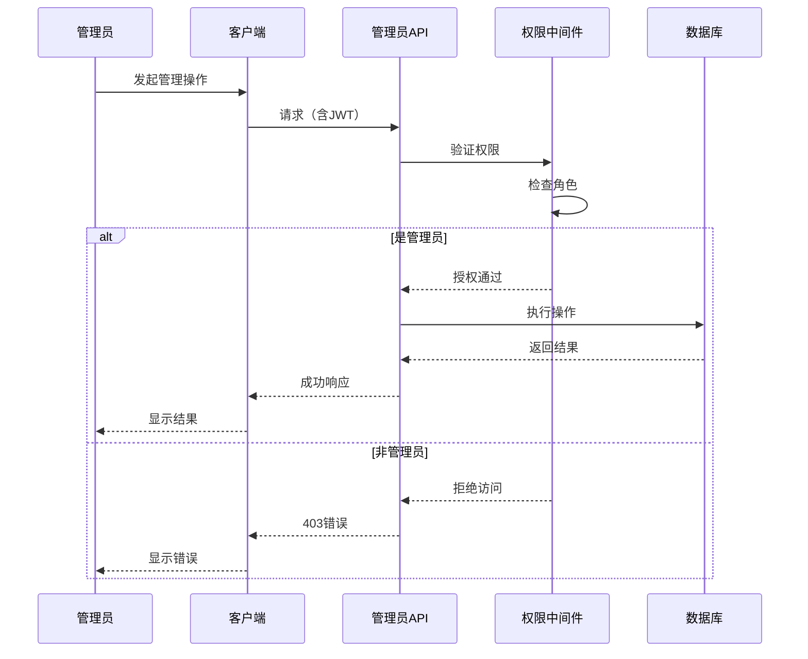

# 设计文档

## 概述

本设计文档描述了管理员功能的技术实现方案。该功能将在现有的Next.js应用基础上添加基于角色的访问控制（RBAC），使管理员能够通过专门的API端点和用户界面管理文章和用户。

核心设计原则：
- 使用NextAuth的JWT回调扩展会话以包含用户角色
- 创建可重用的中间件函数来验证管理员权限
- 遵循RESTful API设计模式
- 保持与现有代码库的一致性
- 确保数据完整性和安全性

## 架构

### 系统架构图



### 认证流程



### 管理员API访问流程



## 组件和接口

### 1. 数据库模型扩展

需要在User模型中添加role字段：

```prisma
model User {
  id        String        @id @default(cuid())
  email     String        @unique
  password  String
  name      String?
  role      String        @default("user") // 新增字段
  createdAt DateTime      @default(now())
  updatedAt DateTime      @updatedAt
  
  progress  UserProgress?
  
  @@map("users")
}
```

### 2. 类型定义

```typescript
// types.ts 扩展
export enum UserRole {
  User = 'user',
  Admin = 'admin',
}

export interface AdminUser {
  id: string;
  email: string;
  name: string | null;
  role: UserRole;
  createdAt: Date;
  updatedAt: Date;
}

export interface UserWithProgress extends AdminUser {
  progress: UserProgress | null;
}

export interface AdminStats {
  totalUsers: number;
  totalArticles: number;
  totalAdmins: number;
  recentUsers: number; // 最近7天注册的用户数
}
```

### 3. NextAuth配置扩展

修改NextAuth配置以在JWT和会话中包含用户角色：

```typescript
// app/api/auth/[...nextauth]/route.ts
callbacks: {
  async jwt({ token, user }) {
    if (user) {
      token.role = user.role;
      token.id = user.id;
    }
    return token;
  },
  async session({ session, token }) {
    if (token && session.user) {
      session.user.id = token.id;
      session.user.role = token.role;
    }
    return session;
  }
}
```

### 4. 权限验证中间件

创建可重用的权限验证函数：

```typescript
// lib/auth.ts
import { getServerSession } from "next-auth";
import { authOptions } from "@/app/api/auth/[...nextauth]/route";

export async function requireAdmin() {
  const session = await getServerSession(authOptions);
  
  if (!session || !session.user) {
    return { error: "未认证", status: 401 };
  }
  
  if (session.user.role !== 'admin') {
    return { error: "需要管理员权限", status: 403 };
  }
  
  return { user: session.user, status: 200 };
}
```

### 5. API端点

#### 文章管理API

- `GET /api/admin/articles` - 获取所有文章（含管理元数据）
- `GET /api/admin/articles/[id]` - 获取单篇文章详情
- `POST /api/admin/articles` - 创建新文章
- `PUT /api/admin/articles/[id]` - 更新文章
- `DELETE /api/admin/articles/[id]` - 删除文章

#### 用户管理API

- `GET /api/admin/users` - 获取所有用户列表
- `GET /api/admin/users/[id]` - 获取用户详情（含进度）
- `DELETE /api/admin/users/[id]` - 删除用户
- `PUT /api/admin/users/[id]/role` - 更新用户角色

#### 统计API

- `GET /api/admin/stats` - 获取管理员仪表板统计数据

### 6. 前端组件

#### AdminLayout组件
- 提供管理员界面的布局框架
- 包含导航菜单和权限检查
- 非管理员用户重定向到首页

#### ArticleManagement组件
- 文章列表展示
- 创建/编辑文章表单
- 删除确认对话框

#### UserManagement组件
- 用户列表展示
- 用户详情查看
- 角色管理功能
- 删除用户功能

#### AdminDashboard组件
- 显示系统统计数据
- 快速访问链接
- 最近活动概览

## 数据模型

### User模型（扩展）

```typescript
{
  id: string;           // CUID
  email: string;        // 唯一
  password: string;     // bcrypt哈希
  name: string | null;  // 可选
  role: 'user' | 'admin'; // 新增
  createdAt: Date;
  updatedAt: Date;
  progress: UserProgress | null;
}
```

### Article模型（现有）

```typescript
{
  id: string;
  date: string;
  titleEn: string;
  titleZh: string;
  summaryEn: string;
  summaryZh: string;
  content: ContentBlock[];
  difficulty: Difficulty;
  durationSeconds: number;
  audioUrl: string | null;
  createdAt: Date;
  updatedAt: Date;
}
```

## 正确性属性

*属性是一个特征或行为，应该在系统的所有有效执行中保持为真——本质上是关于系统应该做什么的正式声明。属性作为人类可读规范和机器可验证正确性保证之间的桥梁。*


### 属性1：新用户默认角色
*对于任何*新创建的用户账户，其角色字段应该被自动设置为"user"
**验证：需求 1.1**

### 属性2：管理员端点访问验证
*对于任何*管理员端点的访问请求，系统应该验证请求者的角色是否为"admin"
**验证：需求 1.2**

### 属性3：普通用户访问拒绝
*对于任何*角色为"user"的用户尝试访问管理员端点，系统应该返回403状态码
**验证：需求 1.3**

### 属性4：认证令牌包含角色
*对于任何*用户的认证过程，生成的JWT令牌应该包含用户的角色信息
**验证：需求 1.4**

### 属性5：文章列表完整性
*对于任何*管理员请求文章列表，返回的文章数量应该等于数据库中的文章总数
**验证：需求 2.1**

### 属性6：文章数据完整性
*对于任何*返回的文章对象，应该包含id、titleEn、titleZh、date、difficulty和所有必需的元数据字段
**验证：需求 2.2**

### 属性7：文章列表排序
*对于任何*文章列表请求，返回的文章应该按照createdAt字段降序排列
**验证：需求 2.4**

### 属性8：文章详情完整性
*对于任何*有效的文章ID，请求详情应该返回包含所有双语字段（titleEn、titleZh、summaryEn、summaryZh、content）的完整数据
**验证：需求 2.5**

### 属性9：文章创建必需字段验证
*对于任何*缺少必需字段（titleEn、titleZh、summaryEn、summaryZh、content、difficulty、durationSeconds）的文章创建请求，系统应该返回400状态码
**验证：需求 3.1, 3.2, 3.3**

### 属性10：文章ID唯一性
*对于任何*两篇不同的文章，它们的ID应该是不同的
**验证：需求 3.4**

### 属性11：文章创建时间戳
*对于任何*新创建的文章，createdAt字段应该被自动设置为创建时的时间戳
**验证：需求 3.5**

### 属性12：难度值验证
*对于任何*difficulty字段不是"Beginner"、"Intermediate"或"Advanced"之一的文章创建或更新请求，系统应该拒绝并返回400状态码
**验证：需求 3.6**

### 属性13：时长正整数验证
*对于任何*durationSeconds不是正整数的文章创建或更新请求，系统应该拒绝并返回400状态码
**验证：需求 3.7**

### 属性14：内容格式验证
*对于任何*content字段不是双语内容块数组的文章创建或更新请求，系统应该拒绝并返回400状态码
**验证：需求 3.8**

### 属性15：文章更新ID验证
*对于任何*不存在的文章ID的更新请求，系统应该返回404状态码
**验证：需求 4.1, 4.2**

### 属性16：部分更新支持
*对于任何*只包含部分字段的文章更新请求，系统应该只更新提供的字段，保持其他字段不变
**验证：需求 4.3, 4.6**

### 属性17：更新时间戳自动更新
*对于任何*文章更新操作，updatedAt字段应该被自动更新为当前时间戳
**验证：需求 4.4**

### 属性18：更新验证规则一致性
*对于任何*文章更新请求中的字段，应该遵循与创建时相同的验证规则
**验证：需求 4.5**

### 属性19：文章删除ID验证
*对于任何*不存在的文章ID的删除请求，系统应该返回404状态码
**验证：需求 5.1, 5.2**

### 属性20：文章删除完整性
*对于任何*被删除的文章，后续查询该文章ID应该返回404或null
**验证：需求 5.3**

### 属性21：删除后数据完整性
*对于任何*被删除的文章，如果该文章ID存在于用户的completedArticleIds中，用户进度记录应该保持有效（不会因为引用不存在的文章而损坏）
**验证：需求 5.5**

### 属性22：用户列表完整性
*对于任何*管理员请求用户列表，返回的用户数量应该等于数据库中的用户总数
**验证：需求 6.1**

### 属性23：用户数据完整性
*对于任何*返回的用户对象，应该包含id、email、name、role和createdAt字段
**验证：需求 6.2**

### 属性24：密码安全性
*对于任何*用户数据的API响应，不应该包含password或password hash字段
**验证：需求 6.3, 7.5**

### 属性25：用户列表排序
*对于任何*用户列表请求，返回的用户应该按照createdAt字段降序排列
**验证：需求 6.4**

### 属性26：用户详情ID验证
*对于任何*不存在的用户ID的详情请求，系统应该返回404状态码
**验证：需求 7.1, 7.2**

### 属性27：用户详情完整性
*对于任何*有效的用户ID，请求详情应该返回用户基本信息和完整的进度数据（包括completedArticlesCount、streak信息和activityLog）
**验证：需求 7.3, 7.4**

### 属性28：用户删除ID验证
*对于任何*不存在的用户ID的删除请求，系统应该返回404状态码
**验证：需求 8.1, 8.2**

### 属性29：用户删除级联
*对于任何*被删除的用户，其关联的UserProgress记录也应该被删除
**验证：需求 8.3, 8.4**

### 属性30：管理员自删除保护
*对于任何*管理员尝试删除自己账户的请求，系统应该拒绝并返回400状态码
**验证：需求 8.6**

### 属性31：统计数据完整性
*对于任何*管理员仪表板统计请求，返回的数据应该包含totalUsers、totalArticles和recentActivity字段
**验证：需求 9.4**

### 属性32：角色更新ID验证
*对于任何*不存在的用户ID的角色更新请求，系统应该返回404状态码
**验证：需求 10.1**

### 属性33：角色值验证
*对于任何*角色值不是"user"或"admin"的角色更新请求，系统应该返回400状态码
**验证：需求 10.2, 10.3**

### 属性34：角色更新持久化
*对于任何*成功的角色更新操作，后续查询该用户应该返回更新后的角色值
**验证：需求 10.4**

### 属性35：角色更新响应
*对于任何*成功的角色更新操作，响应应该包含更新后的用户信息，其中role字段为新的角色值
**验证：需求 10.5**

## 错误处理

### 认证错误
- **401 Unauthorized**: 用户未登录或会话过期
- **403 Forbidden**: 用户已登录但没有管理员权限

### 验证错误
- **400 Bad Request**: 请求数据格式错误或缺少必需字段
  - 缺少必需字段
  - 字段类型不正确
  - 字段值不符合验证规则

### 资源错误
- **404 Not Found**: 请求的资源（文章或用户）不存在
- **409 Conflict**: 资源冲突（例如尝试删除自己的管理员账户）

### 服务器错误
- **500 Internal Server Error**: 数据库连接失败或其他服务器错误

### 错误响应格式

所有错误响应应该遵循统一的格式：

```typescript
{
  error: string;        // 错误消息
  code?: string;        // 可选的错误代码
  details?: any;        // 可选的详细信息
}
```

## 测试策略

### 单元测试

单元测试将验证特定的功能和边缘情况：

1. **权限中间件测试**
   - 测试有效的管理员令牌
   - 测试无效的令牌
   - 测试普通用户令牌
   - 测试缺失的令牌

2. **API端点测试**
   - 测试每个端点的成功场景
   - 测试错误场景（404、400、403）
   - 测试边缘情况（空列表、空字符串等）

3. **数据验证测试**
   - 测试必需字段验证
   - 测试字段类型验证
   - 测试字段值范围验证

### 属性测试

属性测试将使用**fast-check**库（JavaScript/TypeScript的属性测试库）来验证通用属性在所有输入下都成立。

**配置要求**：
- 每个属性测试应该运行至少100次迭代
- 每个属性测试必须使用注释标记其对应的设计文档中的正确性属性
- 标记格式：`// Feature: admin-management, Property {number}: {property_text}`

**测试覆盖**：

1. **角色和权限属性**（属性1-4）
   - 生成随机用户数据，验证默认角色
   - 生成随机的管理员和普通用户，验证端点访问控制
   - 验证JWT令牌包含角色信息

2. **文章管理属性**（属性5-21）
   - 生成随机文章数据，验证CRUD操作
   - 生成无效的文章数据，验证验证规则
   - 验证排序、过滤和数据完整性

3. **用户管理属性**（属性22-35）
   - 生成随机用户数据，验证CRUD操作
   - 验证密码不会泄露
   - 验证级联删除
   - 验证角色更新

**测试策略**：
- 使用智能生成器来约束输入空间（例如，生成有效的email格式、有效的难度值等）
- 对于需要数据库状态的测试，使用测试数据库或事务回滚
- 测试应该是独立的，不依赖于执行顺序

### 集成测试

集成测试将验证完整的工作流程：

1. **管理员工作流**
   - 管理员登录 → 访问仪表板 → 查看统计
   - 管理员创建文章 → 编辑文章 → 删除文章
   - 管理员查看用户 → 更改用户角色 → 删除用户

2. **权限工作流**
   - 普通用户尝试访问管理员功能（应该被拒绝）
   - 用户被提升为管理员后可以访问管理员功能
   - 管理员被降级为普通用户后无法访问管理员功能

3. **数据完整性工作流**
   - 删除文章后，用户进度仍然有效
   - 删除用户后，其进度数据也被删除
   - 更新文章后，所有字段正确保存

## 安全考虑

1. **密码安全**
   - 密码使用bcrypt哈希存储
   - API响应永远不包含密码哈希

2. **会话安全**
   - 使用JWT进行会话管理
   - 令牌包含用户ID和角色
   - 每个请求都验证令牌有效性

3. **权限控制**
   - 所有管理员端点都需要管理员角色
   - 使用中间件统一验证权限
   - 防止权限提升攻击

4. **输入验证**
   - 所有用户输入都经过验证
   - 防止SQL注入（通过Prisma ORM）
   - 防止XSS攻击（通过输入清理）

5. **数据完整性**
   - 使用数据库约束确保数据一致性
   - 级联删除防止孤立记录
   - 事务确保操作的原子性

## 性能考虑

1. **数据库查询优化**
   - 使用索引加速查询（email、id字段）
   - 避免N+1查询问题
   - 使用分页处理大量数据

2. **缓存策略**
   - 考虑缓存文章列表（文章不经常变化）
   - 考虑缓存统计数据（可以接受短暂的延迟）

3. **响应优化**
   - 只返回必需的字段
   - 使用适当的HTTP状态码
   - 压缩大型响应

## 实现注意事项

1. **数据库迁移**
   - 需要添加role字段到User表
   - 需要为现有用户设置默认角色
   - 需要创建至少一个管理员账户用于初始访问

2. **向后兼容性**
   - 现有的公共API端点不受影响
   - 现有的用户认证流程继续工作
   - 添加的role字段有默认值，不会破坏现有功能

3. **部署步骤**
   - 运行数据库迁移添加role字段
   - 更新NextAuth配置
   - 部署新的API端点
   - 部署管理员UI组件
   - 手动提升第一个管理员用户

4. **监控和日志**
   - 记录所有管理员操作（创建、更新、删除）
   - 记录权限拒绝事件
   - 监控API错误率
