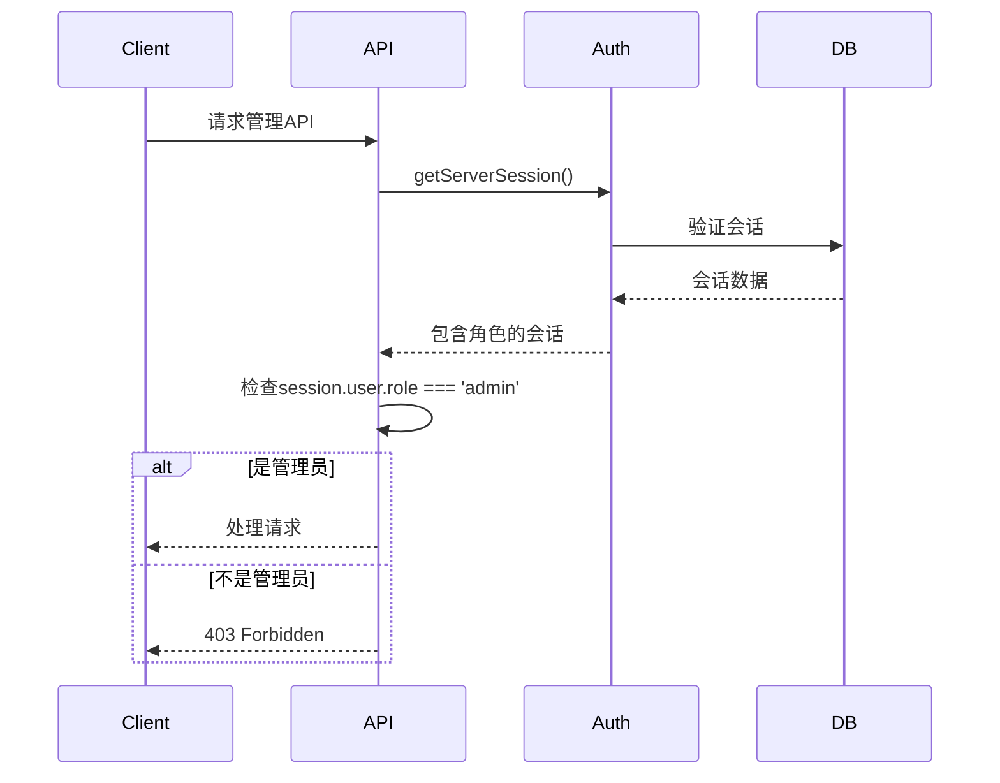
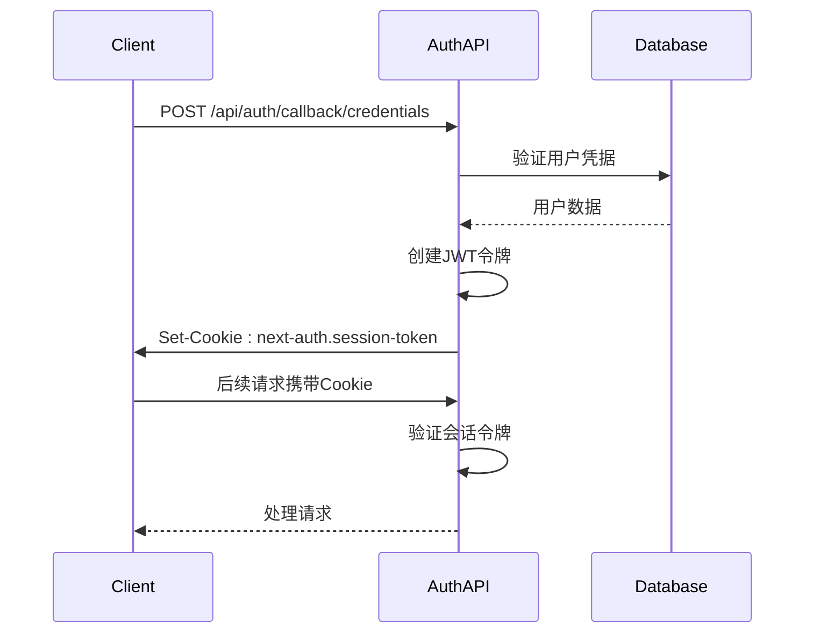
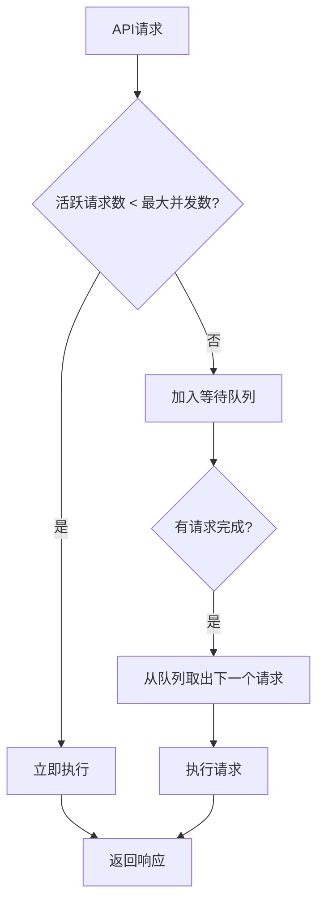
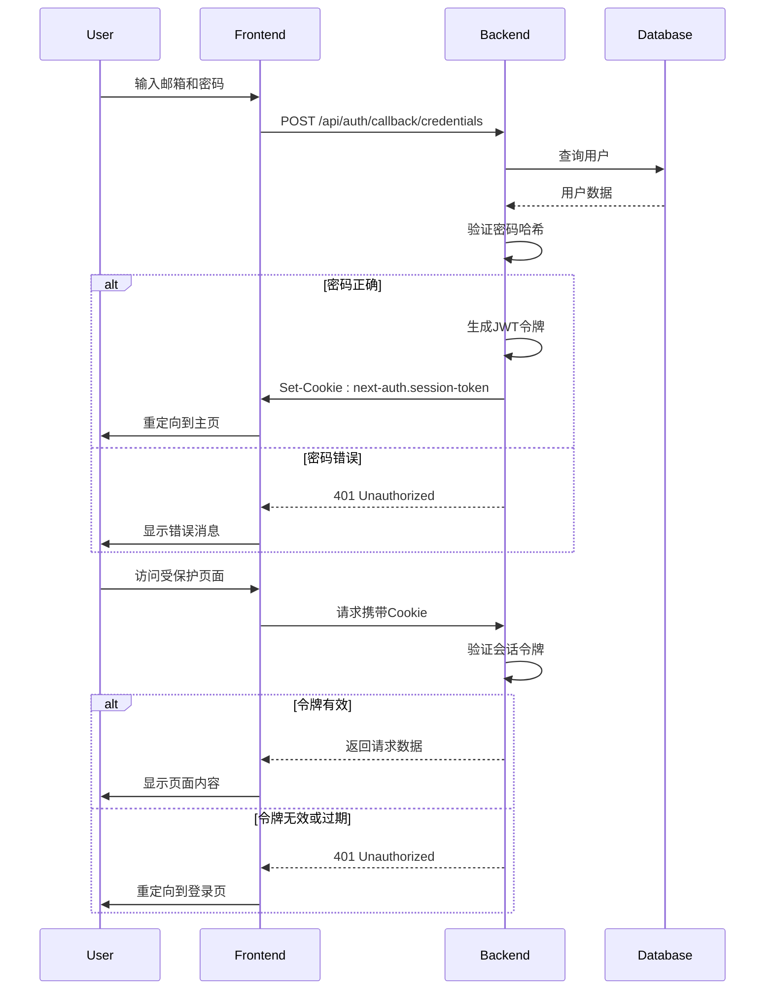

# API接口文档

<cite>
**本文档中引用的文件**  
- [articles/route.ts](file://app/api/articles/route.ts)
- [progress/route.ts](file://app/api/progress/route.ts)
- [progress/complete/route.ts](file://app/api/progress/complete/route.ts)
- [admin/articles/route.ts](file://app/api/admin/articles/route.ts)
- [admin/articles/[id]/route.ts](file://app/api/admin/articles/[id]/route.ts)
- [admin/users/route.ts](file://app/api/admin/users/route.ts)
- [admin/users/[id]/route.ts](file://app/api/admin/users/[id]/route.ts)
- [admin/users/[id]/role/route.ts](file://app/api/admin/users/[id]/role/route.ts)
- [auth/[...nextauth]/route.ts](file://app/api/auth/[...nextauth]/route.ts)
- [register/route.ts](file://app/api/register/route.ts)
- [cos/upload/route.ts](file://app/api/cos/upload/route.ts)
- [cos/credentials/route.ts](file://app/api/cos/credentials/route.ts)
- [health/route.ts](file://app/api/health/route.ts)
- [auth.ts](file://lib/auth.ts)
- [db-utils.ts](file://lib/db-utils.ts)
- [request-limiter.ts](file://lib/request-limiter.ts)
- [next-auth.d.ts](file://types/next-auth.d.ts)
- [constants.ts](file://constants.ts)
</cite>

## 目录
1. [简介](#简介)
2. [公共API端点](#公共api端点)
3. [用户进度API](#用户进度api)
4. [管理API](#管理api)
5. [认证API](#认证api)
6. [COS存储API](#cos存储api)
7. [健康检查API](#健康检查api)
8. [API版本控制与速率限制](#api版本控制与速率限制)
9. [错误代码表](#错误代码表)
10. [认证机制](#认证机制)

## 简介

本API文档详细描述了每日英语阅读器应用的所有API端点。系统采用Next.js App Router架构，API路由位于`app/api`目录下，使用基于Cookie的会话认证机制。所有API均返回JSON格式响应，管理端点需要管理员权限。

**本文档中引用的文件**  
- [articles/route.ts](file://app/api/articles/route.ts)
- [auth.ts](file://lib/auth.ts)

## 公共API端点

### GET /api/articles

获取文章列表端点，返回所有文章数据。

**请求信息**
- **HTTP方法**: GET
- **URL路径**: `/api/articles`
- **认证方式**: 无（公共端点）
- **请求头**: 无特殊要求

**成功响应 (200)**
```json
[
  {
    "id": "art-001",
    "title": {
      "en": "The Benefits of Morning Sunlight",
      "zh": "清晨阳光的益处"
    },
    "date": "2024-12-17",
    "summary": {
      "en": "Discover why getting sunlight early in the morning can improve your sleep and mood.",
      "zh": "探索为什么早晨晒太阳可以改善你的睡眠和情绪。"
    },
    "content": [
      {
        "en": "Exposure to sunlight in the morning is crucial...",
        "zh": "早晨接触阳光对于维持健康的昼夜节律至关重要..."
      }
    ],
    "difficulty": "Intermediate",
    "durationSeconds": 120,
    "audioUrl": "https://example.com/audio.mp3"
  }
]
```

**错误响应**
- **500 Internal Server Error**: 数据库连接失败时返回模拟数据

**curl示例**
```bash
curl -X GET http://localhost:3000/api/articles
```

**Section sources**
- [articles/route.ts](file://app/api/articles/route.ts#L5-L52)

## 用户进度API

### GET /api/progress

获取当前用户的学习进度信息。

**请求信息**
- **HTTP方法**: GET
- **URL路径**: `/api/progress`
- **认证方式**: 基于Cookie的会话
- **请求头**: 无特殊要求

**成功响应 (200)**
```json
{
  "completedArticleIds": ["art-001", "art-002"],
  "stats": {
    "totalDaysLearned": 5,
    "totalArticlesCompleted": 7,
    "currentStreak": 3,
    "longestStreak": 5,
    "articlesByDifficulty": {
      "Beginner": 2,
      "Intermediate": 4,
      "Advanced": 1
    },
    "lastCompletedDate": "2024-12-17",
    "activityLog": {
      "2024-12-17": 1,
      "2024-12-16": 1
    },
    "badges": ["badge-first-step", "badge-on-fire"]
  }
}
```

**错误响应**
- **401 Unauthorized**: 未登录用户
- **503 Service Unavailable**: 数据库连接池已满
- **500 Internal Server Error**: 获取进度失败

**curl示例**
```bash
curl -X GET http://localhost:3000/api/progress -H "Cookie: next-auth.session-token=your_session_token"
```

**Section sources**
- [progress/route.ts](file://app/api/progress/route.ts#L8-L78)

### POST /api/progress/complete

标记文章为已完成并更新用户进度。

**请求信息**
- **HTTP方法**: POST
- **URL路径**: `/api/progress/complete`
- **认证方式**: 基于Cookie的会话
- **请求头**: `Content-Type: application/json`

**请求体模式**
```json
{
  "articleId": "art-001",
  "difficulty": "Intermediate"
}
```

**成功响应 (200)**
```json
{
  "progress": {
    "completedArticleIds": ["art-001", "art-002", "art-003"],
    "stats": {
      "totalDaysLearned": 6,
      "totalArticlesCompleted": 8,
      "currentStreak": 4,
      "longestStreak": 5,
      "articlesByDifficulty": {
        "Beginner": 2,
        "Intermediate": 5,
        "Advanced": 1
      },
      "lastCompletedDate": "2024-12-18",
      "activityLog": {
        "2024-12-18": 1
      },
      "badges": ["badge-first-step", "badge-on-fire", "badge-scholar"]
    }
  },
  "newBadges": ["阅读大师"]
}
```

**错误响应**
- **401 Unauthorized**: 未登录用户
- **404 Not Found**: 进度记录未找到
- **500 Internal Server Error**: 更新进度失败

**curl示例**
```bash
curl -X POST http://localhost:3000/api/progress/complete \
  -H "Content-Type: application/json" \
  -H "Cookie: next-auth.session-token=your_session_token" \
  -d '{"articleId": "art-003", "difficulty": "Advanced"}'
```

**Section sources**
- [progress/complete/route.ts](file://app/api/progress/complete/route.ts#L8-L124)

## 管理API

管理API端点位于`/api/admin`命名空间下，所有端点都需要管理员身份验证。

### 权限验证机制

所有管理API使用`requireAdmin`函数进行权限验证，该函数检查用户会话中的角色信息。



**Diagram sources**
- [auth.ts](file://lib/auth.ts#L77-L101)
- [admin/articles/route.ts](file://app/api/admin/articles/route.ts#L12-L19)

### 文章管理API

#### GET /api/admin/articles

获取所有文章列表（管理员专用）。

**请求信息**
- **HTTP方法**: GET
- **URL路径**: `/api/admin/articles`
- **认证方式**: 基于Cookie的会话，需管理员权限
- **请求头**: 无特殊要求

**成功响应 (200)**
```json
[
  {
    "id": "art-001",
    "date": "2024-12-17",
    "titleEn": "The Benefits of Morning Sunlight",
    "titleZh": "清晨阳光的益处",
    "summaryEn": "Discover why getting sunlight...",
    "summaryZh": "探索为什么早晨晒太阳...",
    "content": [...],
    "difficulty": "Intermediate",
    "durationSeconds": 120,
    "audioUrl": "https://example.com/audio.mp3",
    "createdAt": "2024-12-17T00:00:00.000Z",
    "updatedAt": "2024-12-17T00:00:00.000Z"
  }
]
```

**错误响应**
- **401 Unauthorized**: 未登录
- **403 Forbidden**: 非管理员用户
- **500 Internal Server Error**: 获取文章列表失败

**curl示例**
```bash
curl -X GET http://localhost:3000/api/admin/articles -H "Cookie: next-auth.session-token=admin_session_token"
```

**Section sources**
- [admin/articles/route.ts](file://app/api/admin/articles/route.ts#L10-L37)

#### POST /api/admin/articles

创建新文章。

**请求信息**
- **HTTP方法**: POST
- **URL路径**: `/api/admin/articles`
- **认证方式**: 基于Cookie的会话，需管理员权限
- **请求头**: `Content-Type: application/json`

**请求体模式**
```json
{
  "id": "art-005",
  "date": "2024-12-18",
  "titleEn": "New Article Title",
  "titleZh": "新文章标题",
  "summaryEn": "Summary in English",
  "summaryZh": "中文摘要",
  "content": [
    {
      "en": "English content block",
      "zh": "中文内容块"
    }
  ],
  "difficulty": "Beginner",
  "durationSeconds": 150,
  "audioUrl": "https://example.com/new-audio.mp3"
}
```

**成功响应 (201)**
```json
{
  "id": "art-005",
  "date": "2024-12-18",
  "titleEn": "New Article Title",
  "titleZh": "新文章标题",
  "summaryEn": "Summary in English",
  "summaryZh": "中文摘要",
  "content": [...],
  "difficulty": "Beginner",
  "durationSeconds": 150,
  "audioUrl": "https://example.com/new-audio.mp3",
  "createdAt": "2024-12-18T00:00:00.000Z",
  "updatedAt": "2024-12-18T00:00:00.000Z"
}
```

**错误响应**
- **400 Bad Request**: 缺少必需字段或字段验证失败
- **401 Unauthorized**: 未登录
- **403 Forbidden**: 非管理员用户
- **500 Internal Server Error**: 创建文章失败

**curl示例**
```bash
curl -X POST http://localhost:3000/api/admin/articles \
  -H "Content-Type: application/json" \
  -H "Cookie: next-auth.session-token=admin_session_token" \
  -d '{
    "titleEn": "New Article",
    "titleZh": "新文章",
    "summaryEn": "Summary",
    "summaryZh": "摘要",
    "content": [{"en": "Content", "zh": "内容"}],
    "difficulty": "Beginner",
    "durationSeconds": 100
  }'
```

**Section sources**
- [admin/articles/route.ts](file://app/api/admin/articles/route.ts#L43-L137)

#### GET /api/admin/articles/[id]

获取单篇文章详情。

**请求信息**
- **HTTP方法**: GET
- **URL路径**: `/api/admin/articles/{id}`
- **认证方式**: 基于Cookie的会话，需管理员权限
- **请求头**: 无特殊要求

**成功响应 (200)**
```json
{
  "id": "art-001",
  "date": "2024-12-17",
  "titleEn": "The Benefits of Morning Sunlight",
  "titleZh": "清晨阳光的益处",
  "summaryEn": "Discover why getting sunlight...",
  "summaryZh": "探索为什么早晨晒太阳...",
  "content": [...],
  "difficulty": "Intermediate",
  "durationSeconds": 120,
  "audioUrl": "https://example.com/audio.mp3",
  "createdAt": "2024-12-17T00:00:00.000Z",
  "updatedAt": "2024-12-17T00:00:00.000Z"
}
```

**错误响应**
- **401 Unauthorized**: 未登录
- **403 Forbidden**: 非管理员用户
- **404 Not Found**: 文章不存在
- **500 Internal Server Error**: 获取文章详情失败

**curl示例**
```bash
curl -X GET http://localhost:3000/api/admin/articles/art-001 -H "Cookie: next-auth.session-token=admin_session_token"
```

**Section sources**
- [admin/articles/[id]/route.ts](file://app/api/admin/articles/[id]/route.ts#L10-L48)

#### PUT /api/admin/articles/[id]

更新文章信息。

**请求信息**
- **HTTP方法**: PUT
- **URL路径**: `/api/admin/articles/{id}`
- **认证方式**: 基于Cookie的会话，需管理员权限
- **请求头**: `Content-Type: application/json`

**请求体模式**
```json
{
  "titleEn": "Updated Title",
  "titleZh": "更新后的标题",
  "difficulty": "Advanced"
}
```

**成功响应 (200)**
```json
{
  "id": "art-001",
  "date": "2024-12-17",
  "titleEn": "Updated Title",
  "titleZh": "更新后的标题",
  "summaryEn": "Discover why getting sunlight...",
  "summaryZh": "探索为什么早晨晒太阳...",
  "content": [...],
  "difficulty": "Advanced",
  "durationSeconds": 120,
  "audioUrl": "https://example.com/audio.mp3",
  "createdAt": "2024-12-17T00:00:00.000Z",
  "updatedAt": "2024-12-18T00:00:00.000Z"
}
```

**错误响应**
- **400 Bad Request**: 字段验证失败
- **401 Unauthorized**: 未登录
- **403 Forbidden**: 非管理员用户
- **404 Not Found**: 文章不存在
- **500 Internal Server Error**: 更新文章失败

**curl示例**
```bash
curl -X PUT http://localhost:3000/api/admin/articles/art-001 \
  -H "Content-Type: application/json" \
  -H "Cookie: next-auth.session-token=admin_session_token" \
  -d '{"titleEn": "Updated Title", "difficulty": "Advanced"}'
```

**Section sources**
- [admin/articles/[id]/route.ts](file://app/api/admin/articles/[id]/route.ts#L54-L153)

#### DELETE /api/admin/articles/[id]

删除文章。

**请求信息**
- **HTTP方法**: DELETE
- **URL路径**: `/api/admin/articles/{id}`
- **认证方式**: 基于Cookie的会话，需管理员权限
- **请求头**: 无特殊要求

**成功响应 (200)**
```json
{
  "message": "文章删除成功",
  "id": "art-001"
}
```

**错误响应**
- **401 Unauthorized**: 未登录
- **403 Forbidden**: 非管理员用户
- **404 Not Found**: 文章不存在
- **500 Internal Server Error**: 删除文章失败

**curl示例**
```bash
curl -X DELETE http://localhost:3000/api/admin/articles/art-001 -H "Cookie: next-auth.session-token=admin_session_token"
```

**Section sources**
- [admin/articles/[id]/route.ts](file://app/api/admin/articles/[id]/route.ts#L159-L205)

### 用户管理API

#### GET /api/admin/users

获取所有用户列表。

**请求信息**
- **HTTP方法**: GET
- **URL路径**: `/api/admin/users`
- **认证方式**: 基于Cookie的会话，需管理员权限
- **请求头**: 无特殊要求

**成功响应 (200)**
```json
[
  {
    "id": "user-001",
    "email": "user1@example.com",
    "name": "User One",
    "role": "user",
    "createdAt": "2024-12-16T00:00:00.000Z",
    "updatedAt": "2024-12-16T00:00:00.000Z"
  },
  {
    "id": "admin-001",
    "email": "admin@example.com",
    "name": "Admin User",
    "role": "admin",
    "createdAt": "2024-12-15T00:00:00.000Z",
    "updatedAt": "2024-12-15T00:00:00.000Z"
  }
]
```

**错误响应**
- **401 Unauthorized**: 未登录
- **403 Forbidden**: 非管理员用户
- **500 Internal Server Error**: 获取用户列表失败

**curl示例**
```bash
curl -X GET http://localhost:3000/api/admin/users -H "Cookie: next-auth.session-token=admin_session_token"
```

**Section sources**
- [admin/users/route.ts](file://app/api/admin/users/route.ts#L9-L46)

#### GET /api/admin/users/[id]

获取用户详情。

**请求信息**
- **HTTP方法**: GET
- **URL路径**: `/api/admin/users/{id}`
- **认证方式**: 基于Cookie的会话，需管理员权限
- **请求头**: 无特殊要求

**成功响应 (200)**
```json
{
  "id": "user-001",
  "email": "user1@example.com",
  "name": "User One",
  "role": "user",
  "createdAt": "2024-12-16T00:00:00.000Z",
  "updatedAt": "2024-12-16T00:00:00.000Z",
  "progress": {
    "id": "progress-001",
    "userId": "user-001",
    "completedArticleIds": ["art-001"],
    "totalDaysLearned": 3,
    "totalArticlesCompleted": 5,
    "currentStreak": 2,
    "longestStreak": 3,
    "beginnerCount": 1,
    "intermediateCount": 3,
    "advancedCount": 1,
    "lastCompletedDate": "2024-12-17",
    "activityLog": {},
    "badges": ["badge-first-step"],
    "createdAt": "2024-12-16T00:00:00.000Z",
    "updatedAt": "2024-12-17T00:00:00.000Z"
  }
}
```

**错误响应**
- **401 Unauthorized**: 未登录
- **403 Forbidden**: 非管理员用户
- **404 Not Found**: 用户不存在
- **500 Internal Server Error**: 获取用户详情失败

**curl示例**
```bash
curl -X GET http://localhost:3000/api/admin/users/user-001 -H "Cookie: next-auth.session-token=admin_session_token"
```

**Section sources**
- [admin/users/[id]/route.ts](file://app/api/admin/users/[id]/route.ts#L9-L57)

#### PUT /api/admin/users/[id]/role

更新用户角色。

**请求信息**
- **HTTP方法**: PUT
- **URL路径**: `/api/admin/users/{id}/role`
- **认证方式**: 基于Cookie的会话，需管理员权限
- **请求头**: `Content-Type: application/json`

**请求体模式**
```json
{
  "role": "admin"
}
```

**成功响应 (200)**
```json
{
  "id": "user-001",
  "email": "user1@example.com",
  "name": "User One",
  "role": "admin",
  "createdAt": "2024-12-16T00:00:00.000Z",
  "updatedAt": "2024-12-18T00:00:00.000Z"
}
```

**错误响应**
- **400 Bad Request**: 角色值无效
- **401 Unauthorized**: 未登录
- **403 Forbidden**: 非管理员用户
- **404 Not Found**: 用户不存在
- **500 Internal Server Error**: 更新用户角色失败

**curl示例**
```bash
curl -X PUT http://localhost:3000/api/admin/users/user-001/role \
  -H "Content-Type: application/json" \
  -H "Cookie: next-auth.session-token=admin_session_token" \
  -d '{"role": "admin"}'
```

**Section sources**
- [admin/users/[id]/role/route.ts](file://app/api/admin/users/[id]/role/route.ts#L10-L73)

#### DELETE /api/admin/users/[id]

删除用户。

**请求信息**
- **HTTP方法**: DELETE
- **URL路径**: `/api/admin/users/{id}`
- **认证方式**: 基于Cookie的会话，需管理员权限
- **请求头**: 无特殊要求

**成功响应 (200)**
```json
{
  "message": "用户删除成功",
  "id": "user-001"
}
```

**错误响应**
- **401 Unauthorized**: 未登录
- **403 Forbidden**: 非管理员用户或尝试删除自己的账户
- **404 Not Found**: 用户不存在
- **500 Internal Server Error**: 删除用户失败

**curl示例**
```bash
curl -X DELETE http://localhost:3000/api/admin/users/user-001 -H "Cookie: next-auth.session-token=admin_session_token"
```

**Section sources**
- [admin/users/[id]/route.ts](file://app/api/admin/users/[id]/route.ts#L63-L117)

## 认证API

### POST /api/auth/[...nextauth]

处理用户认证请求，包括登录、登出和会话管理。

**请求信息**
- **HTTP方法**: POST, GET
- **URL路径**: `/api/auth/[...nextauth]`
- **认证方式**: 基于Cookie的会话
- **请求头**: `Content-Type: application/json`

**工作机制**
1. 使用NextAuth.js进行认证管理
2. 采用JWT会话策略
3. 在会话令牌中包含用户ID和角色信息
4. 通过Cookie存储会话令牌



**Diagram sources**
- [auth/[...nextauth]/route.ts](file://app/api/auth/[...nextauth]/route.ts#L1-L6)
- [auth.ts](file://lib/auth.ts#L7-L71)

**Section sources**
- [auth/[...nextauth]/route.ts](file://app/api/auth/[...nextauth]/route.ts#L1-L6)
- [auth.ts](file://lib/auth.ts#L7-L71)

## COS存储API

### GET /api/cos/credentials

获取腾讯云COS临时凭证。

**请求信息**
- **HTTP方法**: GET
- **URL路径**: `/api/cos/credentials`
- **认证方式**: 基于Cookie的会话，需管理员权限
- **请求头**: 无特殊要求

**成功响应 (200)**
```json
{
  "tmpSecretId": "your-secret-id",
  "tmpSecretKey": "your-secret-key",
  "sessionToken": "",
  "expiredTime": 1734400000000
}
```

**错误响应**
- **401 Unauthorized**: 未登录
- **403 Forbidden**: 非管理员用户
- **500 Internal Server Error**: 获取凭证失败

**curl示例**
```bash
curl -X GET http://localhost:3000/api/cos/credentials -H "Cookie: next-auth.session-token=admin_session_token"
```

**Section sources**
- [cos/credentials/route.ts](file://app/api/cos/credentials/route.ts#L8-L43)

### POST /api/cos/upload

上传文件到腾讯云COS。

**请求信息**
- **HTTP方法**: POST
- **URL路径**: `/api/cos/upload`
- **认证方式**: 基于Cookie的会话，需管理员权限
- **请求头**: `Content-Type: multipart/form-data`

**请求体模式**
- **file**: 要上传的音频文件

**成功响应 (200)**
```json
{
  "url": "https://your-bucket.cos.ap-beijing.myqcloud.com/audio/1234567890_random.mp3"
}
```

**错误响应**
- **400 Bad Request**: 未找到文件、不支持的文件类型或文件大小超过限制
- **401 Unauthorized**: 未登录
- **403 Forbidden**: 非管理员用户
- **500 Internal Server Error**: 上传失败

**curl示例**
```bash
curl -X POST http://localhost:3000/api/cos/upload \
  -H "Cookie: next-auth.session-token=admin_session_token" \
  -F "file=@/path/to/audio.mp3"
```

**Section sources**
- [cos/upload/route.ts](file://app/api/cos/upload/route.ts#L9-L105)

## 健康检查API

### GET /api/health

健康检查端点，用于监控系统状态。

**请求信息**
- **HTTP方法**: GET
- **URL路径**: `/api/health`
- **认证方式**: 无
- **请求头**: 无特殊要求

**成功响应 (200)**
```json
{
  "status": "healthy",
  "database": "connected",
  "responseTime": "15ms",
  "timestamp": "2024-12-18T00:00:00.000Z"
}
```

**错误响应**
- **503 Service Unavailable**: 数据库连接失败
- **500 Internal Server Error**: 健康检查过程中发生错误

**curl示例**
```bash
curl -X GET http://localhost:3000/api/health
```

**Section sources**
- [health/route.ts](file://app/api/health/route.ts#L8-L38)

## API版本控制与速率限制

### API版本控制策略

本系统目前使用单一版本API，所有端点位于根路径下。未来版本控制将通过以下方式实现：

1. **URL路径版本控制**: `/api/v1/articles`, `/api/v2/articles`
2. **请求头版本控制**: `Accept: application/vnd.api.v1+json`
3. **查询参数版本控制**: `/api/articles?version=1`

当前系统未实现显式版本控制，所有API调用均使用最新版本。

### 速率限制

系统实现了数据库请求限流机制，防止过多并发请求导致数据库连接池耗尽。



**Diagram sources**
- [request-limiter.ts](file://lib/request-limiter.ts#L4-L53)
- [db-utils.ts](file://lib/db-utils.ts#L10-L46)

**Section sources**
- [request-limiter.ts](file://lib/request-limiter.ts#L4-L53)
- [db-utils.ts](file://lib/db-utils.ts#L10-L46)

## 错误代码表

| HTTP状态码 | 错误代码 | 描述 | 建议操作 |
|-----------|---------|------|---------|
| 400 | Bad Request | 请求参数无效或缺少必需字段 | 检查请求体和参数 |
| 401 | Unauthorized | 未提供有效认证信息 | 用户需要登录 |
| 403 | Forbidden | 用户权限不足 | 确认用户具有所需权限 |
| 404 | Not Found | 请求的资源不存在 | 检查URL路径和资源ID |
| 500 | Internal Server Error | 服务器内部错误 | 联系管理员 |
| 503 | Service Unavailable | 服务暂时不可用 | 稍后重试 |

**特定错误代码**
- **P2024**: 数据库连接池已满，建议稍后重试
- **P1001**: 无法连接到数据库服务器，检查网络连接
- **P1017**: 服务器关闭连接，重试请求

**Section sources**
- [progress/route.ts](file://app/api/progress/route.ts#L62-L77)
- [db-utils.ts](file://lib/db-utils.ts#L26-L29)

## 认证机制

系统采用NextAuth.js实现基于Cookie的会话认证机制。

### 认证流程



**Diagram sources**
- [auth.ts](file://lib/auth.ts#L7-L71)
- [next-auth.d.ts](file://types/next-auth.d.ts#L1-L32)

**Section sources**
- [auth.ts](file://lib/auth.ts#L7-L71)
- [next-auth.d.ts](file://types/next-auth.d.ts#L1-L32)

### 会话数据结构

**JWT令牌负载**
```json
{
  "id": "user-001",
  "role": "user",
  "email": "user@example.com",
  "iat": 1734300000,
  "exp": 1734386400
}
```

**会话对象**
```json
{
  "user": {
    "id": "user-001",
    "email": "user@example.com",
    "name": "User Name",
    "role": "user"
  },
  "expires": "2024-12-18T00:00:00.000Z"
}
```

### 用户角色系统

系统定义了两种用户角色：
- **user**: 普通用户，可以访问公共API和用户进度API
- **admin**: 管理员用户，具有所有权限，可以访问管理API

角色信息存储在数据库的用户表中，并在认证过程中包含在会话令牌中。

**Section sources**
- [auth.ts](file://lib/auth.ts#L77-L101)
- [next-auth.d.ts](file://types/next-auth.d.ts#L1-L32)
- [admin/articles/route.ts](file://app/api/admin/articles/route.ts#L12-L19)