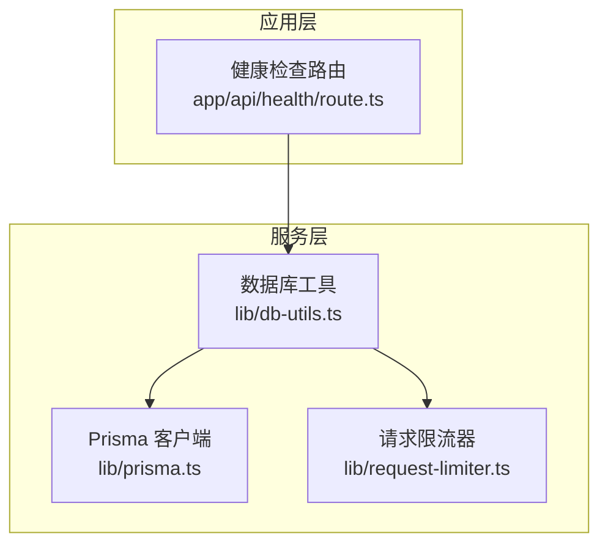
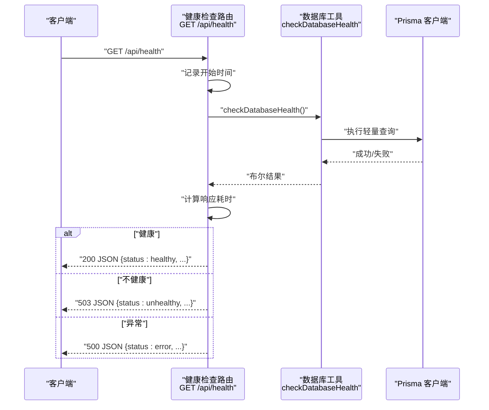
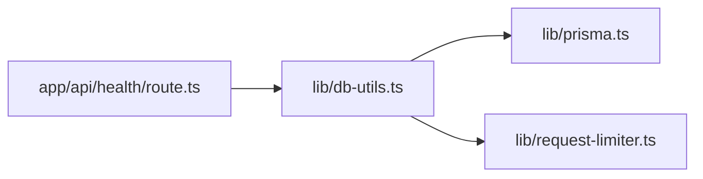

# 健康检查API

<cite>
**本文引用的文件**
- [app/api/health/route.ts](file://app/api/health/route.ts)
- [lib/db-utils.ts](file://lib/db-utils.ts)
- [lib/prisma.ts](file://lib/prisma.ts)
- [lib/request-limiter.ts](file://lib/request-limiter.ts)
- [README.md](file://README.md)
- [package.json](file://package.json)
</cite>

## 目录
1. [简介](#简介)
2. [项目结构](#项目结构)
3. [核心组件](#核心组件)
4. [架构总览](#架构总览)
5. [详细组件分析](#详细组件分析)
6. [依赖关系分析](#依赖关系分析)
7. [性能与可靠性特性](#性能与可靠性特性)
8. [排障指南](#排障指南)
9. [结论](#结论)
10. [附录](#附录)

## 简介
本文件面向GET /api/health健康检查端点，系统性说明其职责、实现细节、返回格式、错误处理策略以及在运维监控、部署健康检查与前端故障诊断中的实际用途。该端点通过检查数据库连接状态，记录响应耗时，并返回包含系统状态、数据库连接情况、响应耗时与时间戳的JSON响应，便于外部监控系统与CI/CD流水线进行自动化健康探测。

## 项目结构
- 健康检查端点位于Next.js App Router的API路由目录下，路径为app/api/health/route.ts。
- 数据库健康检查由lib/db-utils.ts中的checkDatabaseHealth函数实现，内部使用Prisma执行轻量查询以验证连接可用性。
- 数据库客户端与连接生命周期管理由lib/prisma.ts负责。
- 请求并发与限流由lib/request-limiter.ts提供，避免健康检查对生产流量造成干扰。
- 项目运行与构建脚本由package.json定义；README.md提供本地运行指引。

图表来源
- [app/api/health/route.ts](file://app/api/health/route.ts#L1-L38)
- [lib/db-utils.ts](file://lib/db-utils.ts#L1-L60)
- [lib/prisma.ts](file://lib/prisma.ts#L1-L30)
- [lib/request-limiter.ts](file://lib/request-limiter.ts#L1-L53)

章节来源
- [app/api/health/route.ts](file://app/api/health/route.ts#L1-L38)
- [lib/db-utils.ts](file://lib/db-utils.ts#L1-L60)
- [lib/prisma.ts](file://lib/prisma.ts#L1-L30)
- [lib/request-limiter.ts](file://lib/request-limiter.ts#L1-L53)
- [README.md](file://README.md#L1-L21)
- [package.json](file://package.json#L1-L41)

## 核心组件
- 健康检查路由：接收GET请求，测量响应耗时，调用数据库健康检查函数，根据结果返回不同状态与HTTP状态码。
- 数据库健康检查工具：使用Prisma执行一次轻量查询，捕获异常并返回布尔值表示连接是否健康。
- Prisma客户端：统一管理连接日志级别、优雅关闭与开发环境下的周期性健康检查。
- 请求限流器：限制并发数据库请求，确保健康检查不会过度占用资源。

章节来源
- [app/api/health/route.ts](file://app/api/health/route.ts#L1-L38)
- [lib/db-utils.ts](file://lib/db-utils.ts#L48-L60)
- [lib/prisma.ts](file://lib/prisma.ts#L1-L30)
- [lib/request-limiter.ts](file://lib/request-limiter.ts#L1-L53)

## 架构总览
健康检查端点的调用链路如下：
- 客户端请求到达app/api/health/route.ts的GET处理器。
- 处理器记录开始时间，调用checkDatabaseHealth。
- checkDatabaseHealth通过Prisma执行一次查询，返回布尔结果。
- 处理器计算响应耗时，依据结果返回不同JSON体与HTTP状态码。

图表来源
- [app/api/health/route.ts](file://app/api/health/route.ts#L8-L37)
- [lib/db-utils.ts](file://lib/db-utils.ts#L48-L60)
- [lib/prisma.ts](file://lib/prisma.ts#L1-L30)

## 详细组件分析

### 路由实现与响应规范
- 方法与路径：GET /api/health
- 成功场景（数据库健康）：返回200，JSON包含status、database、responseTime与timestamp字段。
- 不健康场景（数据库断开）：返回503，JSON包含status、database、responseTime与timestamp字段。
- 异常场景（其他错误）：返回500，JSON包含status、database、error与timestamp字段。
- 响应耗时：从请求进入至构造响应结束的时间差，单位为毫秒。
- 时间戳：ISO 8601字符串，用于定位事件发生时间。

章节来源
- [app/api/health/route.ts](file://app/api/health/route.ts#L8-L37)

### 数据库健康检查实现
- 实现方式：通过Prisma执行一次轻量查询，捕获异常并返回布尔值。
- 异常处理：任何异常均视为不健康，避免因个别错误导致误判。
- 开发环境辅助：Prisma在非生产环境下定时执行健康检查并输出日志，便于开发调试。

章节来源
- [lib/db-utils.ts](file://lib/db-utils.ts#L48-L60)
- [lib/prisma.ts](file://lib/prisma.ts#L1-L30)

### 并发控制与重试机制
- 并发控制：withRetry包装器使用dbRequestLimiter限制最大并发，避免健康检查与其他数据库操作互相影响。
- 重试策略：对特定连接类错误进行最多N次重试，采用指数退避延迟，Prisma自动处理重连。
- 注意：健康检查直接调用checkDatabaseHealth，未显式使用withRetry包装，因此不会触发重试逻辑。

章节来源
- [lib/db-utils.ts](file://lib/db-utils.ts#L1-L47)
- [lib/request-limiter.ts](file://lib/request-limiter.ts#L1-L53)

### 错误处理与HTTP状态码
- 200 OK：数据库连接健康，返回健康状态。
- 503 Service Unavailable：数据库连接不健康，返回不健康状态。
- 500 Internal Server Error：其他异常（如路由内部错误），返回错误状态。
- 错误信息：当出现异常时，返回体包含错误消息文本，便于快速定位问题。

章节来源
- [app/api/health/route.ts](file://app/api/health/route.ts#L29-L37)

### API调用示例与典型响应
- curl示例（请替换为实际部署地址）：
  - curl -i http://localhost:3000/api/health
- 典型响应（健康）：
  - HTTP/1.1 200 OK
  - Content-Type: application/json
  - 示例体：{"status":"healthy","database":"connected","responseTime":"<毫秒>ms","timestamp":"<ISO时间>"}
- 典型响应（不健康）：
  - HTTP/1.1 503 Service Unavailable
  - Content-Type: application/json
  - 示例体：{"status":"unhealthy","database":"disconnected","responseTime":"<毫秒>ms","timestamp":"<ISO时间>"}
- 典型响应（异常）：
  - HTTP/1.1 500 Internal Server Error
  - Content-Type: application/json
  - 示例体：{"status":"error","database":"error","error":"<错误消息>","timestamp":"<ISO时间>"}

章节来源
- [app/api/health/route.ts](file://app/api/health/route.ts#L14-L37)

### 在运维与监控中的用途
- 运维监控：外部监控系统可定期拉取该端点，结合响应耗时与状态判断服务健康度。
- 部署健康检查：容器编排平台可配置存活探针与就绪探针，基于该端点快速发现实例异常。
- 前端故障诊断：前端在启动阶段或关键流程前主动探测后端健康，提升用户体验与可观测性。
- CI/CD集成：流水线可在部署前后调用该端点，作为“部署后健康验证”的一部分，降低回滚风险。

章节来源
- [app/api/health/route.ts](file://app/api/health/route.ts#L8-L37)

## 依赖关系分析
- 健康检查路由依赖数据库工具函数。
- 数据库工具函数依赖Prisma客户端与请求限流器。
- Prisma客户端受环境变量影响，开发环境会输出周期性健康日志。

图表来源
- [app/api/health/route.ts](file://app/api/health/route.ts#L1-L38)
- [lib/db-utils.ts](file://lib/db-utils.ts#L1-L60)
- [lib/prisma.ts](file://lib/prisma.ts#L1-L30)
- [lib/request-limiter.ts](file://lib/request-limiter.ts#L1-L53)

章节来源
- [app/api/health/route.ts](file://app/api/health/route.ts#L1-L38)
- [lib/db-utils.ts](file://lib/db-utils.ts#L1-L60)
- [lib/prisma.ts](file://lib/prisma.ts#L1-L30)
- [lib/request-limiter.ts](file://lib/request-limiter.ts#L1-L53)

## 性能与可靠性特性
- 响应耗时：端点仅执行一次轻量查询，通常在毫秒级，适合高频探测。
- 并发安全：通过限流器控制并发，避免健康检查放大数据库压力。
- 重试策略：虽然健康检查未直接使用重试包装，但withRetry已针对连接类错误提供指数退避与自动重连能力，有助于提升整体数据库访问稳定性。
- 日志与优雅关闭：Prisma在开发环境输出健康日志，在进程退出前断开连接，减少资源泄漏风险。

章节来源
- [lib/db-utils.ts](file://lib/db-utils.ts#L1-L47)
- [lib/prisma.ts](file://lib/prisma.ts#L1-L30)
- [lib/request-limiter.ts](file://lib/request-limiter.ts#L1-L53)

## 排障指南
- 健康检查返回503：
  - 表示数据库连接不健康。检查数据库服务状态、网络连通性与连接参数。
  - 查看Prisma在非生产环境下的周期性健康日志，定位异常根因。
- 健康检查返回500：
  - 表示路由内部异常或不可预期错误。查看服务端错误日志，确认异常堆栈。
- 响应耗时异常偏高：
  - 结合限流器统计信息评估当前并发是否过高，必要时调整限流阈值或减少探测频率。
- 本地运行与部署：
  - 本地开发可参考README中的运行步骤；生产部署需确保数据库可达与环境变量正确。

章节来源
- [app/api/health/route.ts](file://app/api/health/route.ts#L29-L37)
- [lib/db-utils.ts](file://lib/db-utils.ts#L48-L60)
- [lib/prisma.ts](file://lib/prisma.ts#L1-L30)
- [README.md](file://README.md#L1-L21)

## 结论
GET /api/health端点以极简设计实现了可靠的数据库健康探测，具备明确的状态语义与HTTP状态码映射，适合集成到各类监控与CI/CD体系中。通过配合限流与Prisma的连接管理，能够在保证观测性的同时维持系统的稳定与高效。

## 附录
- 本地运行与构建脚本：参见package.json中的脚本定义。
- 本地运行指引：参见README.md中的说明。

章节来源
- [package.json](file://package.json#L1-L41)
- [README.md](file://README.md#L1-L21)