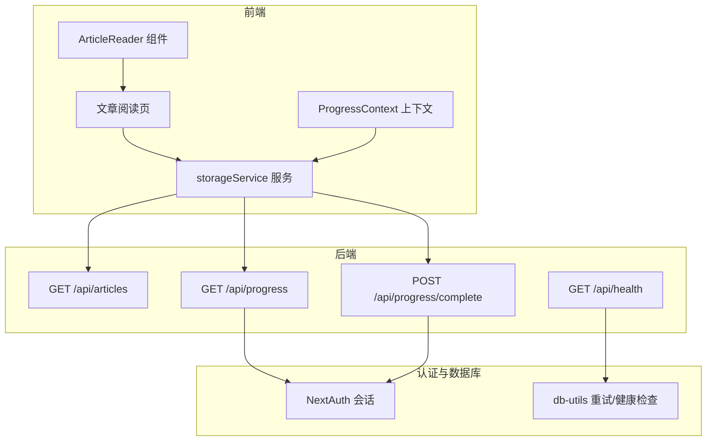
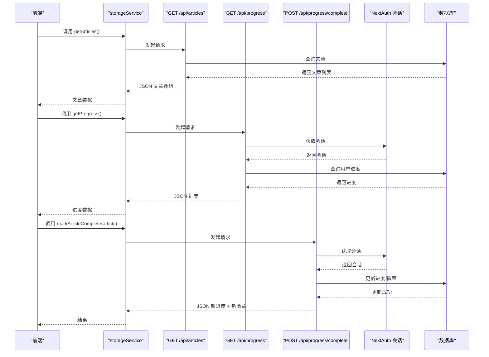
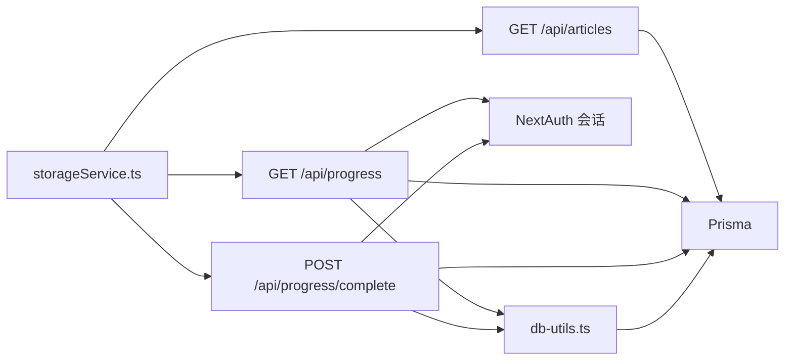

# 公共API

<cite>
**本文引用的文件**
- [app/api/articles/route.ts](file://app/api/articles/route.ts)
- [app/api/progress/route.ts](file://app/api/progress/route.ts)
- [app/api/progress/complete/route.ts](file://app/api/progress/complete/route.ts)
- [app/api/health/route.ts](file://app/api/health/route.ts)
- [services/storageService.ts](file://services/storageService.ts)
- [contexts/ProgressContext.tsx](file://contexts/ProgressContext.tsx)
- [components/ArticleReader.tsx](file://components/ArticleReader.tsx)
- [app/(user)/article/[id]/page.tsx](file://app/(user)/article/[id]/page.tsx)
- [lib/auth.ts](file://lib/auth.ts)
- [lib/db-utils.ts](file://lib/db-utils.ts)
- [types.ts](file://types.ts)
- [constants.ts](file://constants.ts)
</cite>

## 目录
1. [简介](#简介)
2. [项目结构](#项目结构)
3. [核心组件](#核心组件)
4. [架构总览](#架构总览)
5. [详细组件分析](#详细组件分析)
6. [依赖关系分析](#依赖关系分析)
7. [性能考量](#性能考量)
8. [故障排查指南](#故障排查指南)
9. [结论](#结论)
10. [附录](#附录)

## 简介
本文件面向前端与后端开发者，系统化梳理项目的公共API端点，重点覆盖以下四个端点：
- GET /api/articles：返回文章列表（包含排序与回退机制）
- GET /api/progress：返回当前用户的学情进度（需登录态）
- POST /api/progress/complete：标记某文章为已完成并返回徽章更新信息（需登录态）
- GET /api/health：系统健康检查（数据库连通性）

文档同时说明各端点的HTTP方法、认证方式（基于NextAuth会话）、请求/响应结构、错误码与典型curl示例，并解释这些API如何与前端组件（如ArticleReader与ProgressContext）协同工作，支撑用户的学习流程。

## 项目结构
公共API位于Next.js App Router的约定式路由目录中，对应文件如下：
- 文章列表：app/api/articles/route.ts
- 用户进度：app/api/progress/route.ts
- 完成文章并更新徽章：app/api/progress/complete/route.ts
- 健康检查：app/api/health/route.ts

前端通过服务层封装统一调用这些API：
- 文章与进度：services/storageService.ts
- 进度上下文：contexts/ProgressContext.tsx
- 文章阅读页：app/(user)/article/[id]/page.tsx
- 文章阅读器：components/ArticleReader.tsx
- 认证与会话：lib/auth.ts
- 数据库工具与重试：lib/db-utils.ts
- 类型定义与常量：types.ts、constants.ts

图表来源
- [services/storageService.ts](file://services/storageService.ts#L1-L50)
- [contexts/ProgressContext.tsx](file://contexts/ProgressContext.tsx#L1-L95)
- [components/ArticleReader.tsx](file://components/ArticleReader.tsx#L1-L394)
- [app/(user)/article/[id]/page.tsx](file://app/(user)/article/[id]/page.tsx#L1-L98)
- [app/api/articles/route.ts](file://app/api/articles/route.ts#L1-L52)
- [app/api/progress/route.ts](file://app/api/progress/route.ts#L1-L78)
- [app/api/progress/complete/route.ts](file://app/api/progress/complete/route.ts#L1-L124)
- [app/api/health/route.ts](file://app/api/health/route.ts#L1-L38)
- [lib/auth.ts](file://lib/auth.ts#L1-L101)
- [lib/db-utils.ts](file://lib/db-utils.ts#L1-L60)

章节来源
- [services/storageService.ts](file://services/storageService.ts#L1-L50)
- [contexts/ProgressContext.tsx](file://contexts/ProgressContext.tsx#L1-L95)
- [components/ArticleReader.tsx](file://components/ArticleReader.tsx#L1-L394)
- [app/(user)/article/[id]/page.tsx](file://app/(user)/article/[id]/page.tsx#L1-L98)
- [app/api/articles/route.ts](file://app/api/articles/route.ts#L1-L52)
- [app/api/progress/route.ts](file://app/api/progress/route.ts#L1-L78)
- [app/api/progress/complete/route.ts](file://app/api/progress/complete/route.ts#L1-L124)
- [app/api/health/route.ts](file://app/api/health/route.ts#L1-L38)
- [lib/auth.ts](file://lib/auth.ts#L1-L101)
- [lib/db-utils.ts](file://lib/db-utils.ts#L1-L60)

## 核心组件
- 文章列表API：返回按日期降序的文章数组，若数据库为空则回填Mock数据。
- 用户进度API：返回用户已完成文章ID集合与统计指标（总天数、连续天数、最长连续天数、按难度计数、活动日志、徽章等），缺失进度记录时自动初始化。
- 完成文章API：接收文章ID与难度，更新用户进度（天数、连续天数、活动日志、难度计数、徽章），并返回新的进度与新增徽章列表。
- 健康检查API：检测数据库连通性，返回健康状态、响应时间与时间戳。

章节来源
- [app/api/articles/route.ts](file://app/api/articles/route.ts#L1-L52)
- [app/api/progress/route.ts](file://app/api/progress/route.ts#L1-L78)
- [app/api/progress/complete/route.ts](file://app/api/progress/complete/route.ts#L1-L124)
- [app/api/health/route.ts](file://app/api/health/route.ts#L1-L38)

## 架构总览
公共API与前端的交互链路如下：
- 前端通过storageService封装fetch调用各API。
- GET /api/progress 与 POST /api/progress/complete 依赖NextAuth会话（服务端获取）以鉴权。
- GET /api/health 通过db-utils执行数据库健康检查。
- 文章阅读页在用户登录后拉取文章列表并渲染ArticleReader；完成后调用完成接口并刷新进度上下文。

图表来源
- [services/storageService.ts](file://services/storageService.ts#L1-L50)
- [app/api/articles/route.ts](file://app/api/articles/route.ts#L1-L52)
- [app/api/progress/route.ts](file://app/api/progress/route.ts#L1-L78)
- [app/api/progress/complete/route.ts](file://app/api/progress/complete/route.ts#L1-L124)
- [lib/auth.ts](file://lib/auth.ts#L1-L101)

## 详细组件分析

### GET /api/articles
- 方法与路径：GET /api/articles
- 功能概述：返回文章列表，按日期降序排列；若数据库为空则回填Mock数据。
- 认证方式：无需登录态
- 请求头：无特殊要求
- 成功响应：JSON数组，每条记录包含标题、摘要、内容、难度、时长、音频URL等字段（详见“响应结构”）
- 错误码：无显式错误码；数据库异常时回退到Mock数据
- curl示例：
  - curl -i https://your-domain/api/articles

- 响应结构要点（字段说明）
  - id：字符串，文章唯一标识
  - title：对象，包含 en 与 zh 字段
  - date：字符串，YYYY-MM-DD
  - summary：对象，包含 en 与 zh 字段
  - content：数组，每个元素为包含 en 与 zh 的段落对象
  - difficulty：枚举值，可能为 Beginner/Intermediate/Advanced
  - durationSeconds：整数，秒
  - audioUrl：可选字符串，音频地址

- 分页与过滤
  - 该端点不支持分页与过滤参数；返回全部文章并按日期降序排序。

- 与前端集成
  - 前端通过storageService.getArticles()调用此API；文章阅读页在登录后拉取列表并渲染ArticleReader。

章节来源
- [app/api/articles/route.ts](file://app/api/articles/route.ts#L1-L52)
- [services/storageService.ts](file://services/storageService.ts#L1-L50)
- [app/(user)/article/[id]/page.tsx](file://app/(user)/article/[id]/page.tsx#L1-L98)
- [components/ArticleReader.tsx](file://components/ArticleReader.tsx#L1-L394)
- [constants.ts](file://constants.ts#L1-L152)

### GET /api/progress
- 方法与路径：GET /api/progress
- 功能概述：返回当前用户的学情进度，包括已完成文章ID集合与统计指标（总天数、总文章数、连续天数、最长连续天数、按难度计数、活动日志、徽章等）。若进度记录不存在则自动初始化。
- 认证方式：需要登录态（服务端通过getServerSession获取）
- 请求头：无特殊要求
- 成功响应：JSON对象，包含 completedArticleIds 与 stats 子对象
- 错误码：
  - 401 未授权：未登录或会话无效
  - 503 数据库连接池满/无法连接：特定数据库错误码映射
  - 500 其他错误：通用错误
- curl示例：
  - curl -i -H "Cookie: session=..." https://your-domain/api/progress

- 响应结构要点（字段说明）
  - completedArticleIds：字符串数组，已完成文章ID列表
  - stats：对象
    - totalDaysLearned：整数
    - totalArticlesCompleted：整数
    - currentStreak：整数
    - longestStreak：整数
    - articlesByDifficulty：对象，键为难度枚举，值为对应数量
    - lastCompletedDate：字符串或null
    - activityLog：对象，键为日期YYYY-MM-DD，值为当日完成数
    - badges：字符串数组，徽章ID列表

- 与前端集成
  - 前端通过storageService.getProgress()调用此API；ProgressContext在用户登录后仅首次拉取并缓存；支持手动刷新。

章节来源
- [app/api/progress/route.ts](file://app/api/progress/route.ts#L1-L78)
- [services/storageService.ts](file://services/storageService.ts#L1-L50)
- [contexts/ProgressContext.tsx](file://contexts/ProgressContext.tsx#L1-L95)
- [lib/auth.ts](file://lib/auth.ts#L1-L101)
- [lib/db-utils.ts](file://lib/db-utils.ts#L1-L60)
- [types.ts](file://types.ts#L1-L70)

### POST /api/progress/complete
- 方法与路径：POST /api/progress/complete
- 功能概述：标记某文章为已完成，更新用户进度（天数、连续天数、活动日志、难度计数、徽章），并返回新的进度与新增徽章列表。
- 认证方式：需要登录态（服务端通过getServerSession获取）
- 请求头：Content-Type: application/json
- 请求体：JSON对象
  - articleId：字符串，文章ID
  - difficulty：枚举值，Beginner/Intermediate/Advanced
- 成功响应：JSON对象
  - progress：对象，包含 completedArticleIds 与 stats
  - newBadges：字符串数组，本次新增的徽章名称
- 错误码：
  - 401 未授权：未登录或会话无效
  - 404 未找到：用户进度记录不存在
  - 500 服务器错误：通用错误
- curl示例：
  - curl -X POST -H "Content-Type: application/json" -d '{"articleId":"art-001","difficulty":"Intermediate"}' -i -H "Cookie: session=..." https://your-domain/api/progress/complete

- 业务逻辑要点
  - 若文章已标记完成，则直接返回提示信息
  - 根据上次完成日期与当天日期计算连续天数与总天数
  - 活动日志按日期累加
  - 按难度计数累加
  - 遍历徽章条件，生成新增徽章列表
  - 批量更新数据库字段

- 与前端集成
  - 文章阅读页在用户点击“标记为已完成”后调用storageService.markArticleComplete()；完成后刷新进度上下文并展示激励语与徽章解锁提示。

章节来源
- [app/api/progress/complete/route.ts](file://app/api/progress/complete/route.ts#L1-L124)
- [services/storageService.ts](file://services/storageService.ts#L1-L50)
- [app/(user)/article/[id]/page.tsx](file://app/(user)/article/[id]/page.tsx#L1-L98)
- [contexts/ProgressContext.tsx](file://contexts/ProgressContext.tsx#L1-L95)
- [constants.ts](file://constants.ts#L116-L146)
- [types.ts](file://types.ts#L1-L70)

### GET /api/health
- 方法与路径：GET /api/health
- 功能概述：检查数据库连通性，返回健康状态、响应时间与时间戳；异常时返回相应HTTP状态码。
- 认证方式：无需登录态
- 请求头：无特殊要求
- 成功响应：JSON对象
  - status：字符串，healthy/unhealthy/error
  - database：字符串，connected/disconnected
  - responseTime：字符串，毫秒
  - timestamp：字符串，ISO时间戳
- 错误码：
  - 503 不可用：数据库断开或连接池满
  - 500 错误：其他异常
- curl示例：
  - curl -i https://your-domain/api/health

- 与前端集成
  - 作为运维与监控入口，可用于部署健康检查脚本或CI流水线。

章节来源
- [app/api/health/route.ts](file://app/api/health/route.ts#L1-L38)
- [lib/db-utils.ts](file://lib/db-utils.ts#L1-L60)

## 依赖关系分析
- 认证与会话
  - NextAuth提供会话管理，服务端通过getServerSession获取；前端通过next-auth/react使用会话状态。
- 数据库访问
  - 文章列表与进度查询使用Prisma；进度更新使用Prisma；健康检查使用原生查询。
- 重试与限流
  - 进度查询使用withRetry包装，自动处理连接类错误并指数退避重试；健康检查使用原生查询。
- 前后端协作
  - storageService统一封装fetch调用，ArticleReader与文章阅读页负责UI与交互；ProgressContext负责进度数据的获取与刷新。

图表来源
- [services/storageService.ts](file://services/storageService.ts#L1-L50)
- [app/api/articles/route.ts](file://app/api/articles/route.ts#L1-L52)
- [app/api/progress/route.ts](file://app/api/progress/route.ts#L1-L78)
- [app/api/progress/complete/route.ts](file://app/api/progress/complete/route.ts#L1-L124)
- [lib/auth.ts](file://lib/auth.ts#L1-L101)
- [lib/db-utils.ts](file://lib/db-utils.ts#L1-L60)

章节来源
- [services/storageService.ts](file://services/storageService.ts#L1-L50)
- [lib/auth.ts](file://lib/auth.ts#L1-L101)
- [lib/db-utils.ts](file://lib/db-utils.ts#L1-L60)
- [app/api/articles/route.ts](file://app/api/articles/route.ts#L1-L52)
- [app/api/progress/route.ts](file://app/api/progress/route.ts#L1-L78)
- [app/api/progress/complete/route.ts](file://app/api/progress/complete/route.ts#L1-L124)

## 性能考量
- 文章列表
  - 无分页与过滤，适合小规模数据；若文章量增长，建议引入分页与筛选参数。
- 进度查询
  - 使用withRetry与限流器，减少瞬时高并发导致的数据库压力；建议在前端做缓存与去抖。
- 完成文章
  - 单次写入，涉及多字段更新与徽章判定；建议在服务端批量更新并避免重复提交。
- 健康检查
  - 采用轻量查询，响应时间短；建议定期轮询并结合告警阈值。

[本节为通用指导，不直接分析具体文件]

## 故障排查指南
- 401 未授权
  - 确认已登录且会话有效；检查NextAuth配置与Cookie传递。
- 503 数据库不可用
  - 观察withRetry日志与重试间隔；检查数据库连接池配置与网络状况。
- 500 服务器错误
  - 查看后端错误日志与堆栈；确认Prisma连接与模型定义。
- 健康检查失败
  - 使用GET /api/health验证数据库连通性；关注响应时间与错误消息。

章节来源
- [app/api/progress/route.ts](file://app/api/progress/route.ts#L58-L78)
- [lib/db-utils.ts](file://lib/db-utils.ts#L1-L60)
- [app/api/health/route.ts](file://app/api/health/route.ts#L1-L38)

## 结论
本文档系统梳理了公共API端点的功能、认证方式、响应结构与错误码，并结合前端组件说明了它们在用户学习流程中的作用。GET /api/articles提供基础内容，GET /api/progress与POST /api/progress/complete构成学习闭环，GET /api/health保障系统可观测性。建议后续扩展分页与过滤能力，并优化前端缓存与并发控制策略。

[本节为总结性内容，不直接分析具体文件]

## 附录

### API一览表
- GET /api/articles
  - 认证：否
  - 请求头：无
  - 成功响应：文章数组
  - 错误码：无显式错误码（异常回退Mock）
  - curl示例：参见“GET /api/articles”

- GET /api/progress
  - 认证：是（服务端会话）
  - 请求头：无
  - 成功响应：进度对象
  - 错误码：401、503、500
  - curl示例：参见“GET /api/progress”

- POST /api/progress/complete
  - 认证：是（服务端会话）
  - 请求头：Content-Type: application/json
  - 请求体：articleId, difficulty
  - 成功响应：progress + newBadges
  - 错误码：401、404、500
  - curl示例：参见“POST /api/progress/complete”

- GET /api/health
  - 认证：否
  - 请求头：无
  - 成功响应：健康状态对象
  - 错误码：503、500
  - curl示例：参见“GET /api/health”

### 前端集成要点
- ArticleReader：展示文章内容与音频同步高亮，提供“标记为已完成”按钮。
- 文章阅读页：登录后拉取文章列表，定位目标文章并渲染ArticleReader；完成后刷新进度上下文。
- ProgressContext：在用户登录后首次拉取进度，支持手动刷新；错误时显示友好提示。

章节来源
- [components/ArticleReader.tsx](file://components/ArticleReader.tsx#L1-L394)
- [app/(user)/article/[id]/page.tsx](file://app/(user)/article/[id]/page.tsx#L1-L98)
- [contexts/ProgressContext.tsx](file://contexts/ProgressContext.tsx#L1-L95)