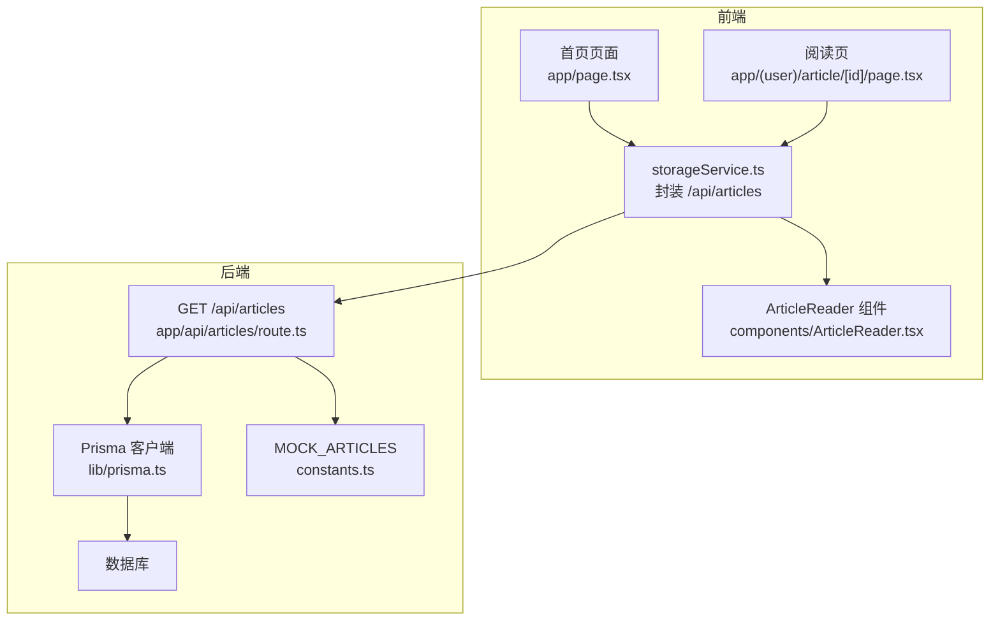
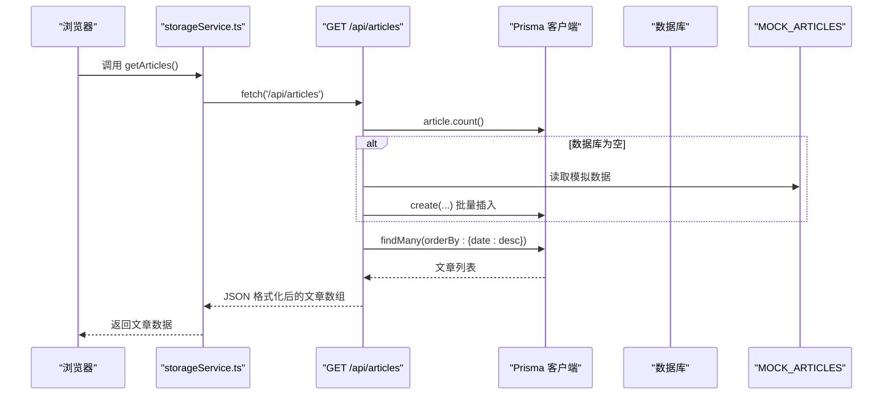
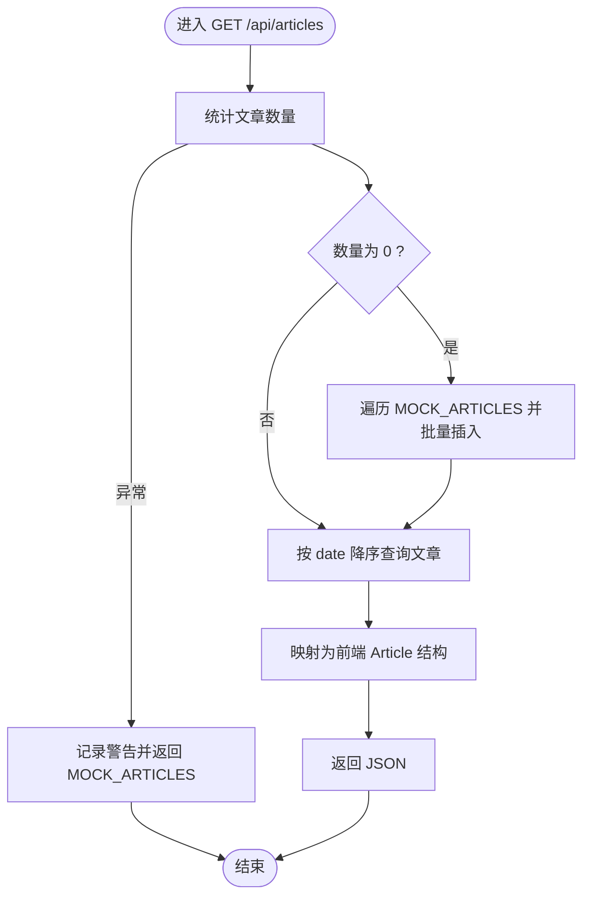
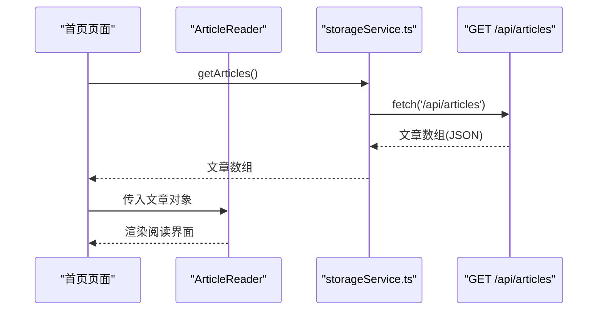
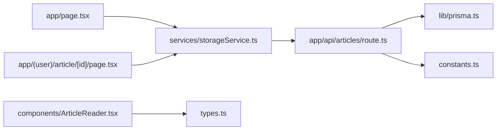

# 文章API

<cite>
**本文引用的文件**
- [app/api/articles/route.ts](file://app/api/articles/route.ts)
- [lib/prisma.ts](file://lib/prisma.ts)
- [lib/db-utils.ts](file://lib/db-utils.ts)
- [constants.ts](file://constants.ts)
- [services/storageService.ts](file://services/storageService.ts)
- [types.ts](file://types.ts)
- [app/page.tsx](file://app/page.tsx)
- [app/(user)/article/[id]/page.tsx](file://app/(user)/article/[id]/page.tsx)
- [components/ArticleReader.tsx](file://components/ArticleReader.tsx)
</cite>

## 目录
1. [简介](#简介)
2. [项目结构](#项目结构)
3. [核心组件](#核心组件)
4. [架构总览](#架构总览)
5. [详细组件分析](#详细组件分析)
6. [依赖关系分析](#依赖关系分析)
7. [性能考量](#性能考量)
8. [故障排查指南](#故障排查指南)
9. [结论](#结论)
10. [附录](#附录)

## 简介
本文件为 GET /api/articles 端点的完整API文档，涵盖以下要点：
- 返回文章列表的流程：自动数据库初始化（数据库为空时使用MOCK_ARTICLES进行种子填充）、按日期倒序排序、响应数据结构（id、双语标题与摘要、内容、难度等级、时长、音频URL等字段）。
- 容错机制：当数据库连接失败时自动降级返回本地模拟数据，仅记录警告但不中断服务。
- 请求与响应示例：提供 curl 请求示例、成功响应 JSON 示例。
- 前端集成：说明该API如何与前端 ArticleList 和 ArticleReader 组件集成，支持首页文章展示与阅读页面内容加载。
- 性能建议：合理使用缓存以减少重复请求。

## 项目结构
该API位于 Next.js App Router 的 app/api 下，采用服务端路由实现。前端通过自定义服务层封装 fetch 调用，统一从 /api/articles 获取数据，并在首页与阅读页中消费。

图表来源
- [app/api/articles/route.ts](file://app/api/articles/route.ts#L1-L52)
- [lib/prisma.ts](file://lib/prisma.ts#L1-L30)
- [constants.ts](file://constants.ts#L1-L115)
- [services/storageService.ts](file://services/storageService.ts#L1-L15)
- [app/page.tsx](file://app/page.tsx#L1-L70)
- [app/(user)/article/[id]/page.tsx](file://app/(user)/article/[id]/page.tsx#L1-L60)
- [components/ArticleReader.tsx](file://components/ArticleReader.tsx#L1-L60)

章节来源
- [app/api/articles/route.ts](file://app/api/articles/route.ts#L1-L52)
- [lib/prisma.ts](file://lib/prisma.ts#L1-L30)
- [constants.ts](file://constants.ts#L1-L115)
- [services/storageService.ts](file://services/storageService.ts#L1-L15)
- [app/page.tsx](file://app/page.tsx#L1-L70)
- [app/(user)/article/[id]/page.tsx](file://app/(user)/article/[id]/page.tsx#L1-L60)
- [components/ArticleReader.tsx](file://components/ArticleReader.tsx#L1-L60)

## 核心组件
- 服务端路由：负责数据库连接、自动初始化、查询与格式化返回。
- Prisma 客户端：提供数据库访问能力与连接生命周期管理。
- 模拟数据：在数据库为空或连接失败时作为降级数据源。
- 前端服务层：统一封装 /api/articles 的 fetch 调用，供页面组件使用。
- 前端组件：ArticleReader 在首页与阅读页中渲染文章内容。

章节来源
- [app/api/articles/route.ts](file://app/api/articles/route.ts#L1-L52)
- [lib/prisma.ts](file://lib/prisma.ts#L1-L30)
- [constants.ts](file://constants.ts#L1-L115)
- [services/storageService.ts](file://services/storageService.ts#L1-L15)
- [types.ts](file://types.ts#L1-L30)

## 架构总览
GET /api/articles 的调用链路如下：
- 前端通过 storageService.ts 发起 /api/articles 请求。
- 服务端路由 app/api/articles/route.ts 执行数据库连接与查询。
- 若数据库为空，则使用 constants.ts 中的 MOCK_ARTICLES 进行种子填充。
- 查询结果按日期降序返回；若数据库连接失败，则降级返回 MOCK_ARTICLES。
- 前端在首页与阅读页分别消费该数据，驱动 ArticleReader 渲染。

图表来源
- [services/storageService.ts](file://services/storageService.ts#L1-L15)
- [app/api/articles/route.ts](file://app/api/articles/route.ts#L1-L52)
- [lib/prisma.ts](file://lib/prisma.ts#L1-L30)
- [constants.ts](file://constants.ts#L1-L115)

## 详细组件分析

### 服务端路由：GET /api/articles
- 数据库连接与初始化
  - 首先尝试连接数据库并统计文章数量。
  - 若数量为 0，则遍历 MOCK_ARTICLES 并逐条写入数据库。
- 查询与排序
  - 使用 findMany 并按 date 字段降序排序。
- 响应格式化
  - 将数据库字段映射为前端期望的 Article 结构（id、title、date、summary、content、difficulty、durationSeconds、audioUrl）。
- 容错机制
  - 捕获异常后记录警告日志，并返回 MOCK_ARTICLES 作为降级数据，保证服务可用性。

图表来源
- [app/api/articles/route.ts](file://app/api/articles/route.ts#L1-L52)
- [constants.ts](file://constants.ts#L1-L115)

章节来源
- [app/api/articles/route.ts](file://app/api/articles/route.ts#L1-L52)

### Prisma 客户端与连接管理
- 初始化与日志级别：根据 NODE_ENV 设置日志级别，生产环境不记录日志，开发环境仅记录错误。
- 连接健康检查：定期执行 SELECT 1 检查连接健康状态，并在控制台输出状态。
- 优雅关闭：进程退出前断开数据库连接。

章节来源
- [lib/prisma.ts](file://lib/prisma.ts#L1-L30)

### 模拟数据与难度映射
- MOCK_ARTICLES：包含多篇示例文章，字段覆盖 id、title、date、summary、content、audioUrl、difficulty、durationSeconds。
- 难度枚举：Difficulty 包含 Beginner、Intermediate、Advanced 三种等级。

章节来源
- [constants.ts](file://constants.ts#L1-L115)
- [types.ts](file://types.ts#L1-L20)

### 前端服务层与组件集成
- storageService.ts
  - getArticles：封装 fetch('/api/articles')，对响应进行基本校验与错误处理（记录日志并返回空数组），供页面组件使用。
- 首页 app/page.tsx
  - 调用 getArticles 获取文章列表，选择当天或第一条文章作为默认展示，传递给 ArticleReader 渲染。
- 阅读页 app/(user)/article/[id]/page.tsx
  - 调用 getArticles 获取文章列表，根据 URL 参数匹配目标文章，传递给 ArticleReader 渲染。
- ArticleReader 组件
  - 支持英文、中文、中英对照三种视图模式，结合音频播放与段落高亮联动，完成阅读体验。

图表来源
- [services/storageService.ts](file://services/storageService.ts#L1-L15)
- [app/page.tsx](file://app/page.tsx#L1-L70)
- [app/(user)/article/[id]/page.tsx](file://app/(user)/article/[id]/page.tsx#L1-L60)
- [components/ArticleReader.tsx](file://components/ArticleReader.tsx#L1-L60)

章节来源
- [services/storageService.ts](file://services/storageService.ts#L1-L15)
- [app/page.tsx](file://app/page.tsx#L1-L70)
- [app/(user)/article/[id]/page.tsx](file://app/(user)/article/[id]/page.tsx#L1-L60)
- [components/ArticleReader.tsx](file://components/ArticleReader.tsx#L1-L60)

## 依赖关系分析
- 服务端路由依赖 Prisma 客户端与常量数据。
- 前端服务层依赖 Next.js App Router 的 fetch 机制与类型定义。
- ArticleReader 依赖 Article 类型与难度标签映射。

图表来源
- [app/api/articles/route.ts](file://app/api/articles/route.ts#L1-L52)
- [lib/prisma.ts](file://lib/prisma.ts#L1-L30)
- [constants.ts](file://constants.ts#L1-L115)
- [services/storageService.ts](file://services/storageService.ts#L1-L15)
- [app/page.tsx](file://app/page.tsx#L1-L70)
- [app/(user)/article/[id]/page.tsx](file://app/(user)/article/[id]/page.tsx#L1-L60)
- [components/ArticleReader.tsx](file://components/ArticleReader.tsx#L1-L60)
- [types.ts](file://types.ts#L1-L30)

章节来源
- [app/api/articles/route.ts](file://app/api/articles/route.ts#L1-L52)
- [lib/prisma.ts](file://lib/prisma.ts#L1-L30)
- [constants.ts](file://constants.ts#L1-L115)
- [services/storageService.ts](file://services/storageService.ts#L1-L15)
- [app/page.tsx](file://app/page.tsx#L1-L70)
- [app/(user)/article/[id]/page.tsx](file://app/(user)/article/[id]/page.tsx#L1-L60)
- [components/ArticleReader.tsx](file://components/ArticleReader.tsx#L1-L60)
- [types.ts](file://types.ts#L1-L30)

## 性能考量
- 数据库重试与限流：db-utils.ts 提供带重试与指数退避的数据库操作包装器，可对连接类错误进行重试，减少瞬时故障影响。
- 连接健康检查：lib/prisma.ts 定期执行健康检查，便于提前发现连接问题。
- 前端缓存策略建议：
  - 首次加载后缓存文章列表，避免重复请求。
  - 对于高频切换视图（英文/中文/中英对照）无需重新拉取数据。
  - 在网络异常时，可利用降级数据（MOCK_ARTICLES）维持基本功能。
- 合理使用分页：若文章数量增长，建议引入分页或懒加载，避免一次性传输过多数据。

章节来源
- [lib/db-utils.ts](file://lib/db-utils.ts#L1-L60)
- [lib/prisma.ts](file://lib/prisma.ts#L1-L30)

## 故障排查指南
- 数据库连接失败
  - 现象：服务端捕获异常并记录警告，随后返回 MOCK_ARTICLES。
  - 排查：检查数据库连接字符串、网络连通性、数据库实例状态。
  - 建议：启用重试机制与健康检查，定位瞬时故障。
- 响应为空或格式不符
  - 现象：前端 storageService.ts 捕获错误并返回空数组，页面显示加载或空状态。
  - 排查：确认 API 返回状态码与 JSON 结构是否符合 Article 接口定义。
- 首页未显示当日文章
  - 现象：首页按日期筛选当日文章，若当日无文章则回退到第一条。
  - 排查：确认 MOCK_ARTICLES 中的 date 字段与当前日期一致。

章节来源
- [app/api/articles/route.ts](file://app/api/articles/route.ts#L1-L52)
- [services/storageService.ts](file://services/storageService.ts#L1-L15)
- [app/page.tsx](file://app/page.tsx#L1-L70)

## 结论
GET /api/articles 端点通过自动数据库初始化与降级机制，确保在数据库异常或空库场景下仍能稳定返回文章数据。配合前端服务层与组件，实现了首页与阅读页的流畅体验。建议在生产环境中结合重试、健康检查与缓存策略，进一步提升稳定性与性能。

## 附录

### API 规范
- 方法与路径
  - GET /api/articles
- 成功响应
  - 状态码：200 OK
  - 响应体：文章数组（按日期降序）
- 错误处理
  - 当数据库连接失败时：返回 200 OK，响应体为 MOCK_ARTICLES；服务端记录警告日志。
- 响应数据结构
  - 字段说明：
    - id：字符串，唯一标识
    - title：对象，包含 en 与 zh 字段
    - date：字符串，YYYY-MM-DD
    - summary：对象，包含 en 与 zh 字段
    - content：数组，每个元素为包含 en 与 zh 的段落对象
    - difficulty：字符串，取值为 Beginner、Intermediate、Advanced
    - durationSeconds：整数，秒
    - audioUrl：字符串（可选）

章节来源
- [app/api/articles/route.ts](file://app/api/articles/route.ts#L1-L52)
- [types.ts](file://types.ts#L1-L30)
- [constants.ts](file://constants.ts#L1-L115)

### 请求示例（curl）
- curl -X GET http://localhost:3000/api/articles

章节来源
- [app/api/articles/route.ts](file://app/api/articles/route.ts#L1-L52)

### 成功响应示例（JSON）
- 说明：响应为文章数组，每条记录包含 id、title、date、summary、content、difficulty、durationSeconds、audioUrl 等字段。
- 注意：当数据库连接失败时，响应体为 MOCK_ARTICLES 数组。

章节来源
- [app/api/articles/route.ts](file://app/api/articles/route.ts#L1-L52)
- [constants.ts](file://constants.ts#L1-L115)

### 前端集成说明
- 首页
  - 页面通过 storageService.ts 获取文章列表，选择当日或第一条文章传入 ArticleReader。
- 阅读页
  - 页面通过 storageService.ts 获取文章列表，根据 URL 参数匹配目标文章传入 ArticleReader。
- ArticleReader
  - 支持三种视图模式（英文/中文/中英对照），结合音频播放与段落高亮联动。

章节来源
- [services/storageService.ts](file://services/storageService.ts#L1-L15)
- [app/page.tsx](file://app/page.tsx#L1-L70)
- [app/(user)/article/[id]/page.tsx](file://app/(user)/article/[id]/page.tsx#L1-L60)
- [components/ArticleReader.tsx](file://components/ArticleReader.tsx#L1-L60)