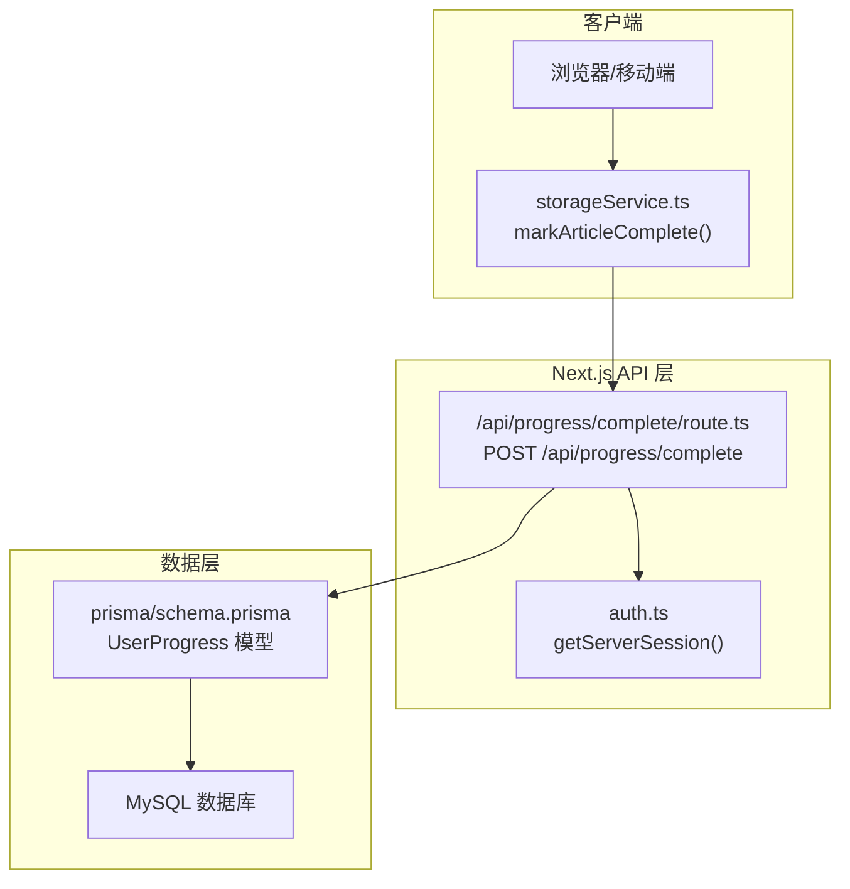
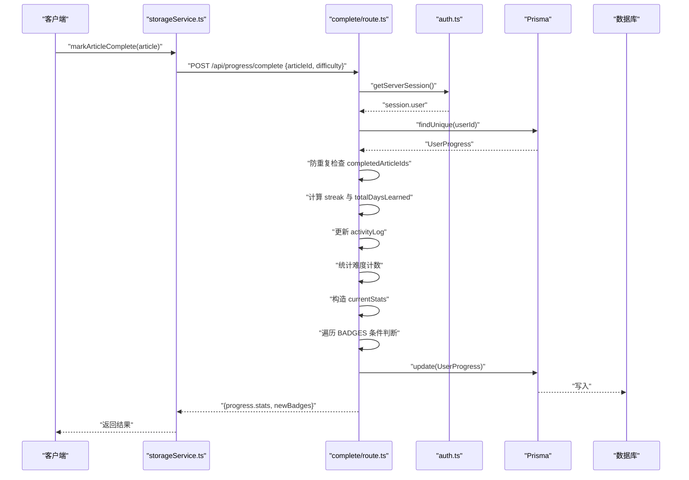
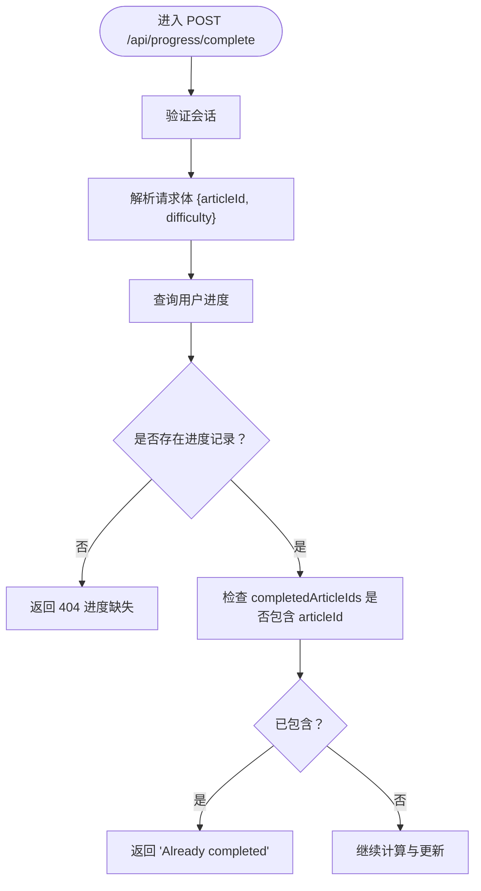
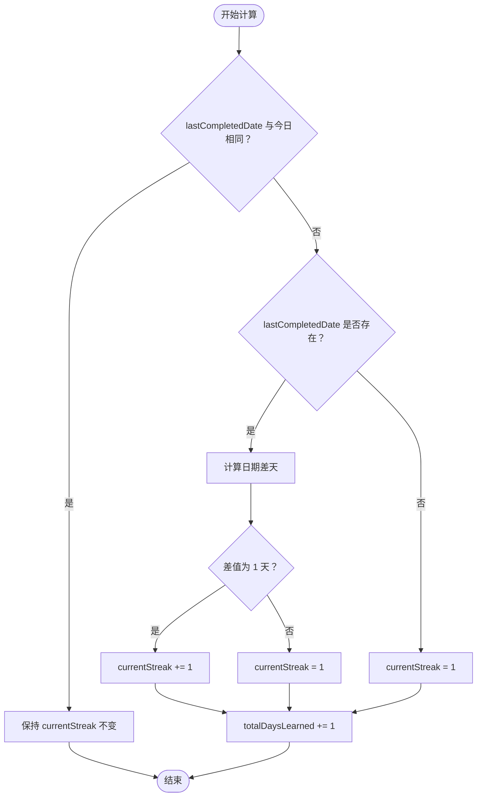
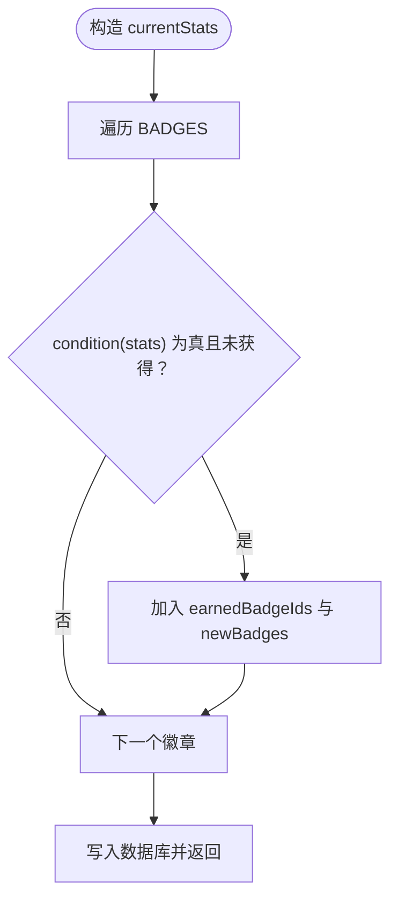
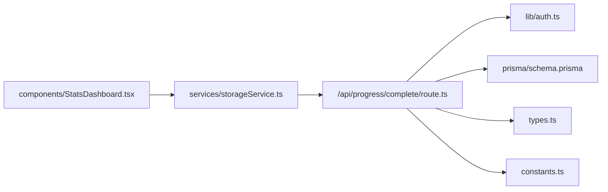

# 标记文章完成

<cite>
**本文引用的文件**
- [route.ts](file://app/api/progress/complete/route.ts)
- [constants.ts](file://constants.ts)
- [types.ts](file://types.ts)
- [schema.prisma](file://prisma/schema.prisma)
- [route.ts](file://app/api/progress/route.ts)
- [storageService.ts](file://services/storageService.ts)
- [StatsDashboard.tsx](file://components/StatsDashboard.tsx)
</cite>

## 目录
1. [简介](#简介)
2. [项目结构](#项目结构)
3. [核心组件](#核心组件)
4. [架构概览](#架构概览)
5. [详细组件分析](#详细组件分析)
6. [依赖分析](#依赖分析)
7. [性能考量](#性能考量)
8. [故障排查指南](#故障排查指南)
9. [结论](#结论)
10. [附录](#附录)

## 简介
本文件针对 POST /api/progress/complete 端点提供完整技术文档，覆盖请求流程、鉴权、请求体解析、防重复提交、学习天数与连续天数（streak）计算、活动日志（activityLog）记录、徽章系统触发机制，以及错误处理策略。同时给出请求体示例、成功响应结构（包含更新后的进度与新获得徽章列表）、常见错误码说明，帮助开发者快速集成与排障。

## 项目结构
该端点位于 Next.js App Router 的 API 路由中，采用服务端会话鉴权与 Prisma 数据库访问。前端通过统一的存储服务封装发起请求，后端在完成业务计算后返回增量更新结果。

图表来源
- [route.ts](file://app/api/progress/complete/route.ts#L1-L124)
- [storageService.ts](file://services/storageService.ts#L1-L50)
- [schema.prisma](file://prisma/schema.prisma#L1-L81)

章节来源
- [route.ts](file://app/api/progress/complete/route.ts#L1-L124)
- [storageService.ts](file://services/storageService.ts#L1-L50)
- [schema.prisma](file://prisma/schema.prisma#L1-L81)

## 核心组件
- 请求入口与业务逻辑：POST /api/progress/complete/route.ts
- 常量与徽章规则：constants.ts
- 类型定义：types.ts
- 数据模型：prisma/schema.prisma
- 前端调用封装：services/storageService.ts
- 前端展示组件：components/StatsDashboard.tsx

章节来源
- [route.ts](file://app/api/progress/complete/route.ts#L1-L124)
- [constants.ts](file://constants.ts#L1-L152)
- [types.ts](file://types.ts#L1-L70)
- [schema.prisma](file://prisma/schema.prisma#L1-L81)
- [storageService.ts](file://services/storageService.ts#L1-L50)
- [StatsDashboard.tsx](file://components/StatsDashboard.tsx#L1-L180)

## 架构概览
POST /api/progress/complete 的调用链路如下：
- 前端通过 storageService.markArticleComplete 发起请求，携带 articleId 与 difficulty
- 服务端使用 getServerSession 验证用户会话
- 读取用户进度记录，校验是否已存在
- 防重复提交：检查 completedArticleIds 是否包含当前 articleId
- 计算学习天数与连续天数（streak）
- 更新 activityLog 按日期累加
- 统计各难度计数
- 构造 currentStats，遍历 BADGES 数组，依据 condition 触发新徽章
- 写入数据库并返回更新后的 progress 与 newBadges

图表来源
- [route.ts](file://app/api/progress/complete/route.ts#L1-L124)
- [storageService.ts](file://services/storageService.ts#L1-L50)
- [auth.ts](file://lib/auth.ts#L1-L101)
- [schema.prisma](file://prisma/schema.prisma#L1-L81)

## 详细组件分析

### 请求流程与鉴权
- 会话验证：使用 getServerSession 获取当前会话，若无有效会话直接返回 401
- 用户标识：从 session.user.id 获取当前用户 ID
- 请求体解析：从请求体读取 articleId 与 difficulty 字段

章节来源
- [route.ts](file://app/api/progress/complete/route.ts#L8-L20)
- [auth.ts](file://lib/auth.ts#L1-L101)

### 请求体与响应格式
- 请求体字段
  - articleId: string（文章唯一标识）
  - difficulty: 枚举值，取自 Difficulty（Beginner/Intermediate/Advanced）
- 成功响应
  - progress: 对象
    - completedArticleIds: string[]（更新后的已完成文章ID列表）
    - stats: UserStats（更新后的统计信息）
  - newBadges: string[]（本次新增的徽章名称列表）

章节来源
- [route.ts](file://app/api/progress/complete/route.ts#L16-L20)
- [types.ts](file://types.ts#L28-L45)
- [storageService.ts](file://services/storageService.ts#L28-L45)

### 防重复提交机制
- 读取用户进度中的 completedArticleIds
- 若包含当前 articleId，则直接返回“已标记完成”的友好提示，避免重复计数

图表来源
- [route.ts](file://app/api/progress/complete/route.ts#L8-L31)

章节来源
- [route.ts](file://app/api/progress/complete/route.ts#L8-L31)

### 学习天数与连续天数（streak）计算逻辑
- 以今日日期（YYYY-MM-DD）作为基准
- lastCompletedDate 与今日比较：
  - 若不同且 lastDate 存在：计算日期差，若为 1 天则 streak+1，否则重置为 1
  - 若 lastDate 为空：streak 初始化为 1
- totalDaysLearned 每次“跨日”学习时 +1

图表来源
- [route.ts](file://app/api/progress/complete/route.ts#L33-L52)

章节来源
- [route.ts](file://app/api/progress/complete/route.ts#L33-L52)

### 活动日志（activityLog）记录
- 以日期字符串为键，记录当日完成次数
- 若当日不存在条目则初始化为 0，再 +1

章节来源
- [route.ts](file://app/api/progress/complete/route.ts#L54-L57)

### 难度计数统计
- 根据 difficulty 参数分别累加对应难度计数
- 用于后续徽章条件判断与前端展示

章节来源
- [route.ts](file://app/api/progress/complete/route.ts#L59-L66)

### 徽章系统触发机制
- 构造 currentStats，包含 totalDaysLearned、totalArticlesCompleted、currentStreak、longestStreak、articlesByDifficulty、lastCompletedDate、activityLog、badges
- 遍历 constants.ts 中的 BADGES 数组，对每个徽章调用 condition(currentStats)
- 若满足条件且未获得过该徽章，则将其加入 earnedBadgeIds，并将徽章名称加入 newBadges
- 最终一次性写入数据库

图表来源
- [route.ts](file://app/api/progress/complete/route.ts#L67-L92)
- [constants.ts](file://constants.ts#L116-L145)

章节来源
- [route.ts](file://app/api/progress/complete/route.ts#L67-L92)
- [constants.ts](file://constants.ts#L116-L145)

### 数据库写入与返回
- 使用 Prisma 更新 UserProgress：totalDaysLearned、totalArticlesCompleted、currentStreak、longestStreak、lastCompletedDate、activityLog、badges、completedArticleIds、各难度计数
- 返回包含 progress.stats 与 newBadges 的响应对象

章节来源
- [route.ts](file://app/api/progress/complete/route.ts#L94-L119)
- [schema.prisma](file://prisma/schema.prisma#L27-L62)

### 前端集成与展示
- 前端通过 storageService.markArticleComplete 发起请求
- StatsDashboard 组件消费返回的 progress.stats 与 newBadges，渲染徽章解锁动画与统计数据

章节来源
- [storageService.ts](file://services/storageService.ts#L28-L45)
- [StatsDashboard.tsx](file://components/StatsDashboard.tsx#L144-L173)

## 依赖分析
- 会话与鉴权：依赖 lib/auth.ts 的 getServerSession
- 数据访问：依赖 prisma/schema.prisma 的 UserProgress 模型
- 徽章规则：依赖 constants.ts 的 BADGES 数组与 condition 函数
- 类型约束：依赖 types.ts 的 Difficulty 与 UserStats 接口
- 前端调用：依赖 services/storageService.ts 的 markArticleComplete

图表来源
- [route.ts](file://app/api/progress/complete/route.ts#L1-L124)
- [auth.ts](file://lib/auth.ts#L1-L101)
- [schema.prisma](file://prisma/schema.prisma#L1-L81)
- [types.ts](file://types.ts#L1-L70)
- [constants.ts](file://constants.ts#L1-L152)
- [storageService.ts](file://services/storageService.ts#L1-L50)
- [StatsDashboard.tsx](file://components/StatsDashboard.tsx#L1-L180)

## 性能考量
- 数据库访问：使用 Prisma ORM，建议在生产环境启用连接池与索引优化
- 防重复检查：completedArticleIds 为 JSON 字段，查询时可利用数据库 JSON 索引或在应用层维护集合以减少查询成本
- 徽章遍历：BADGES 数量有限，遍历开销可忽略；若徽章数量增长，建议缓存已获得徽章集合以避免重复判断
- 并发更新：同一用户并发多次完成同一篇文章不会重复计数，但应避免在同一会话内并发请求导致的竞态，可在前端层面禁用按钮或在后端增加幂等键

## 故障排查指南
- 401 未授权
  - 现象：返回 Unauthorized
  - 排查：确认客户端已登录且会话有效；检查 NextAuth 配置与 Cookie 设置
- 404 进度缺失
  - 现象：返回 Progress record not found
  - 排查：确认用户注册流程已创建 UserProgress；或在 GET /api/progress 中自动创建默认记录
- 500 服务器错误
  - 现象：返回 Failed to update progress
  - 排查：查看后端日志；检查数据库连接、Prisma 查询与更新语句；确认 constants.ts 中徽章条件不抛异常
- 重复提交
  - 现象：返回 Already completed
  - 排查：确认前端在点击完成后禁用按钮；避免短时间内重复点击
- 徽章未触发
  - 现象：newBadges 为空
  - 排查：核对 currentStats 字段是否正确更新；检查 constants.ts 中 BADGES 的 condition 条件是否满足

章节来源
- [route.ts](file://app/api/progress/complete/route.ts#L12-L20)
- [route.ts](file://app/api/progress/complete/route.ts#L24-L31)
- [route.ts](file://app/api/progress/complete/route.ts#L120-L124)
- [route.ts](file://app/api/progress/complete/route.ts#L83-L92)

## 结论
POST /api/progress/complete 端点实现了完整的用户学习进度更新流程，包括会话鉴权、请求体解析、防重复提交、学习天数与连续天数计算、活动日志记录、难度统计与徽章系统触发。通过清晰的数据结构与稳定的 API 设计，前端可安全地集成并展示学习成果与激励反馈。

## 附录

### 请求体示例
- articleId: "art-001"
- difficulty: "Beginner" | "Intermediate" | "Advanced"

章节来源
- [route.ts](file://app/api/progress/complete/route.ts#L16-L20)

### 成功响应示例
- progress.completedArticleIds: string[]
- progress.stats.totalDaysLearned: number
- progress.stats.totalArticlesCompleted: number
- progress.stats.currentStreak: number
- progress.stats.longestStreak: number
- progress.stats.articlesByDifficulty: { Beginner: number, Intermediate: number, Advanced: number }
- progress.stats.lastCompletedDate: string | null
- progress.stats.activityLog: Record<string, number>
- progress.stats.badges: string[]
- newBadges: string[]

章节来源
- [route.ts](file://app/api/progress/complete/route.ts#L112-L119)
- [types.ts](file://types.ts#L28-L45)

### 错误处理一览
- 401 未授权：会话无效或未登录
- 404 进度缺失：用户存在但未找到进度记录
- 500 服务器错误：数据库写入失败或内部异常

章节来源
- [route.ts](file://app/api/progress/complete/route.ts#L12-L20)
- [route.ts](file://app/api/progress/complete/route.ts#L24-L31)
- [route.ts](file://app/api/progress/complete/route.ts#L120-L124)