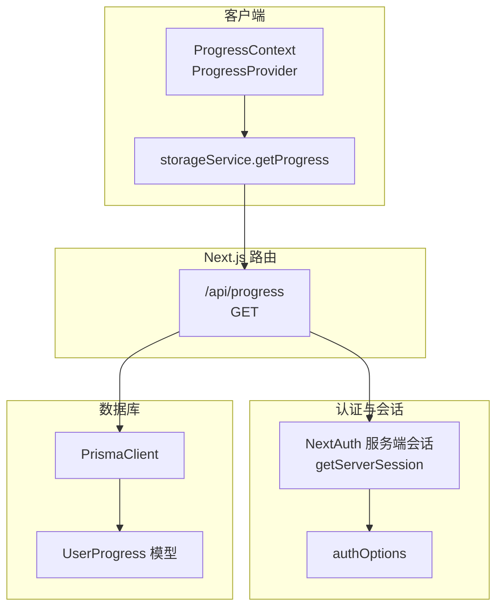
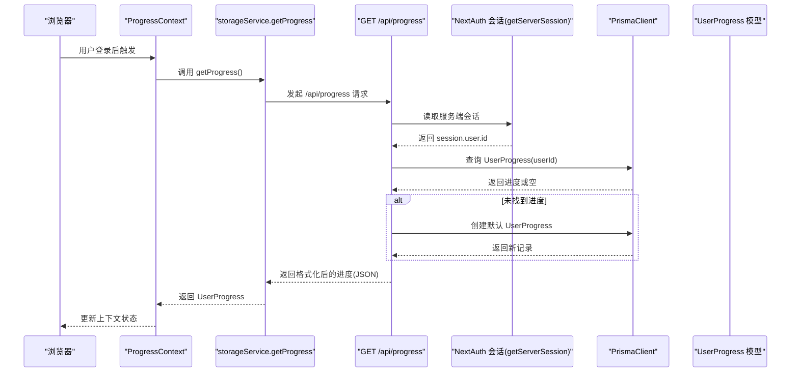
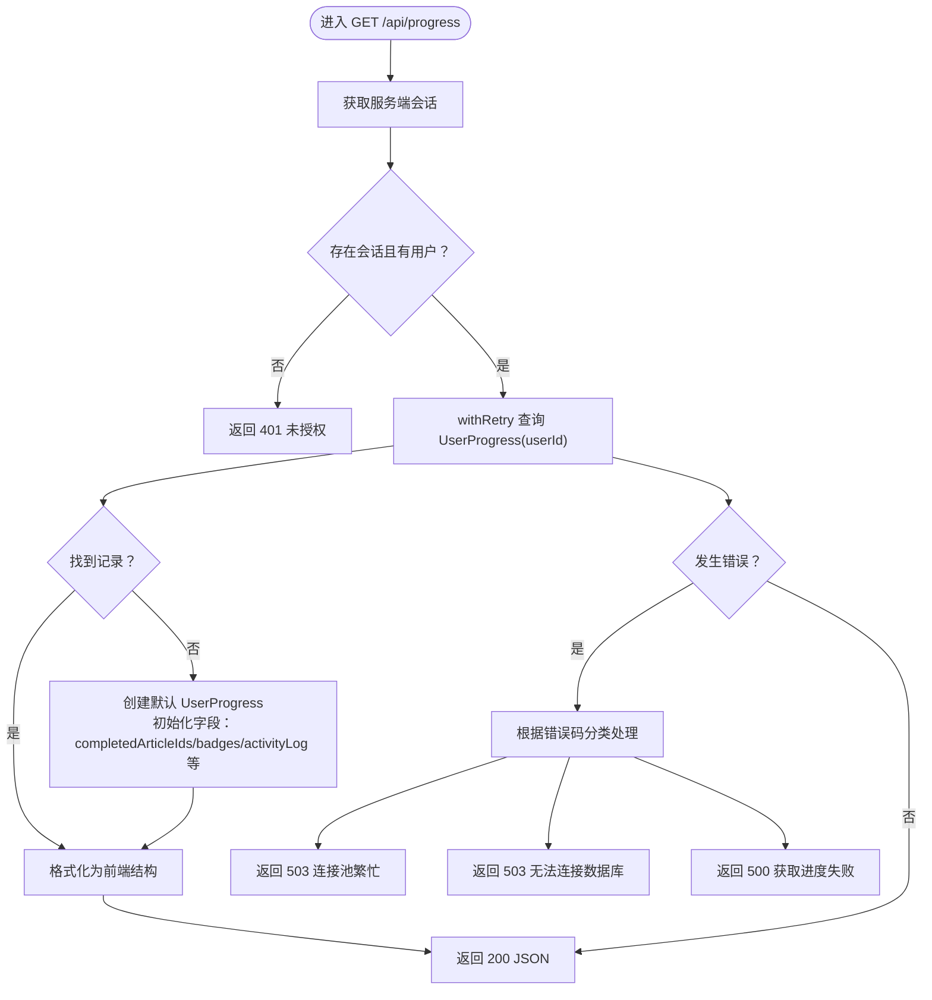
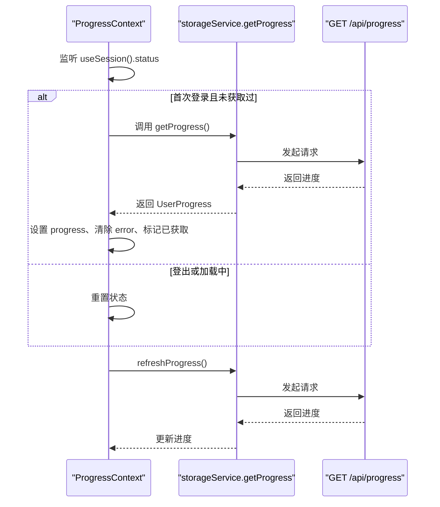
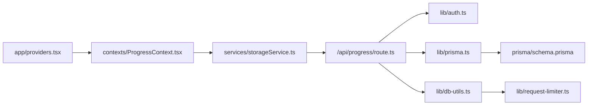

# 获取学习进度

<cite>
**本文引用的文件**
- [app/api/progress/route.ts](file://app/api/progress/route.ts)
- [contexts/ProgressContext.tsx](file://contexts/ProgressContext.tsx)
- [services/storageService.ts](file://services/storageService.ts)
- [lib/prisma.ts](file://lib/prisma.ts)
- [lib/auth.ts](file://lib/auth.ts)
- [lib/db-utils.ts](file://lib/db-utils.ts)
- [lib/request-limiter.ts](file://lib/request-limiter.ts)
- [types.ts](file://types.ts)
- [prisma/schema.prisma](file://prisma/schema.prisma)
- [app/providers.tsx](file://app/providers.tsx)
</cite>

## 目录
1. [简介](#简介)
2. [项目结构](#项目结构)
3. [核心组件](#核心组件)
4. [架构总览](#架构总览)
5. [详细组件分析](#详细组件分析)
6. [依赖关系分析](#依赖关系分析)
7. [性能考量](#性能考量)
8. [故障排查指南](#故障排查指南)
9. [结论](#结论)
10. [附录](#附录)

## 简介
本文件面向开发者与产品人员，系统性说明 GET /api/progress 端点的行为与集成方式。该端点通过 NextAuth 的服务端会话获取当前用户身份，未认证时返回 401；认证后从数据库读取或初始化用户学习进度记录，并以统一的数据结构返回给前端。前端通过 ProgressContext 中的 getProgress 服务在用户登录后自动拉取，形成稳定的前端状态同步基础。

## 项目结构
围绕该端点的关键文件分布如下：
- 路由层：app/api/progress/route.ts
- 前端上下文：contexts/ProgressContext.tsx
- 前端服务封装：services/storageService.ts
- 认证配置：lib/auth.ts
- 数据访问：lib/prisma.ts、lib/db-utils.ts、lib/request-limiter.ts
- 类型定义：types.ts
- 数据模型：prisma/schema.prisma
- 应用 Provider 注入：app/providers.tsx

图表来源
- [app/api/progress/route.ts](file://app/api/progress/route.ts#L1-L78)
- [contexts/ProgressContext.tsx](file://contexts/ProgressContext.tsx#L1-L95)
- [services/storageService.ts](file://services/storageService.ts#L1-L50)
- [lib/auth.ts](file://lib/auth.ts#L1-L101)
- [lib/prisma.ts](file://lib/prisma.ts#L1-L30)
- [prisma/schema.prisma](file://prisma/schema.prisma#L27-L62)

章节来源
- [app/api/progress/route.ts](file://app/api/progress/route.ts#L1-L78)
- [contexts/ProgressContext.tsx](file://contexts/ProgressContext.tsx#L1-L95)
- [services/storageService.ts](file://services/storageService.ts#L1-L50)
- [lib/auth.ts](file://lib/auth.ts#L1-L101)
- [lib/prisma.ts](file://lib/prisma.ts#L1-L30)
- [prisma/schema.prisma](file://prisma/schema.prisma#L27-L62)
- [app/providers.tsx](file://app/providers.tsx#L1-L14)

## 核心组件
- 路由处理器 GET /api/progress
  - 使用 NextAuth 的服务端会话校验身份，未认证返回 401
  - 通过 Prisma 查询用户进度，缺失时自动创建默认记录（初始化字段：completedArticleIds、badges、activityLog 等）
  - 将数据库字段映射为前端友好的响应结构（completedArticleIds、stats）
  - 对数据库连接类错误进行分类处理，返回 503/500
- 前端上下文 ProgressContext
  - 在用户登录状态变为 authenticated 时，仅一次性拉取进度
  - 提供手动刷新接口，支持错误捕获与加载状态管理
- 前端服务 storageService.getProgress
  - 封装 /api/progress 的调用，返回 Promise<UserProgress>

章节来源
- [app/api/progress/route.ts](file://app/api/progress/route.ts#L1-L78)
- [contexts/ProgressContext.tsx](file://contexts/ProgressContext.tsx#L1-L95)
- [services/storageService.ts](file://services/storageService.ts#L1-L50)
- [types.ts](file://types.ts#L36-L50)

## 架构总览
下图展示了从浏览器到数据库的完整链路，以及 NextAuth 会话在服务端的参与。

图表来源
- [contexts/ProgressContext.tsx](file://contexts/ProgressContext.tsx#L1-L95)
- [services/storageService.ts](file://services/storageService.ts#L1-L50)
- [app/api/progress/route.ts](file://app/api/progress/route.ts#L1-L78)
- [lib/auth.ts](file://lib/auth.ts#L1-L101)
- [lib/prisma.ts](file://lib/prisma.ts#L1-L30)
- [prisma/schema.prisma](file://prisma/schema.prisma#L27-L62)

## 详细组件分析

### 路由：GET /api/progress
- 身份验证
  - 使用服务端会话 getServerSession 获取当前用户
  - 若无会话或无用户信息，直接返回 401 Unauthorized
- 数据查询与初始化
  - 通过 withRetry 包装 Prisma 查询，自动处理连接类错误并进行指数退避重试
  - 若数据库中不存在对应 UserProgress 记录，则创建默认记录，字段包括：
    - completedArticleIds：空数组
    - badges：空数组
    - activityLog：空对象
  - 将数据库字段映射为前端 stats 结构，包含：
    - totalDaysLearned、totalArticlesCompleted、currentStreak、longestStreak
    - articlesByDifficulty：按难度分组的计数
    - lastCompletedDate：最近完成日期
    - activityLog：每日完成数量
    - badges：徽章 ID 列表
- 错误处理
  - P2024：数据库连接池繁忙 → 503
  - P1001：无法连接数据库服务器 → 503
  - 其他错误 → 500

图表来源
- [app/api/progress/route.ts](file://app/api/progress/route.ts#L1-L78)
- [lib/db-utils.ts](file://lib/db-utils.ts#L1-L60)
- [lib/prisma.ts](file://lib/prisma.ts#L1-L30)
- [prisma/schema.prisma](file://prisma/schema.prisma#L27-L62)

章节来源
- [app/api/progress/route.ts](file://app/api/progress/route.ts#L1-L78)
- [lib/db-utils.ts](file://lib/db-utils.ts#L1-L60)
- [lib/prisma.ts](file://lib/prisma.ts#L1-L30)
- [prisma/schema.prisma](file://prisma/schema.prisma#L27-L62)

### 前端上下文：ProgressContext
- 自动获取
  - 仅在 NextAuth 状态变为 authenticated 时触发一次 getProgress
  - 使用 isFetchingRef 与 hasFetchedRef 防止并发与重复请求
- 手动刷新
  - refreshProgress 支持在需要时重新拉取进度
- 错误与加载
  - 捕获错误并设置 error 字段
  - 控制 loading 状态，避免 UI 闪烁

图表来源
- [contexts/ProgressContext.tsx](file://contexts/ProgressContext.tsx#L1-L95)
- [services/storageService.ts](file://services/storageService.ts#L1-L50)
- [app/api/progress/route.ts](file://app/api/progress/route.ts#L1-L78)

章节来源
- [contexts/ProgressContext.tsx](file://contexts/ProgressContext.tsx#L1-L95)
- [services/storageService.ts](file://services/storageService.ts#L1-L50)

### 数据模型与字段映射
- UserProgress 模型字段（默认值）
  - completedArticleIds：Json，默认 []
  - badges：Json，默认 []
  - activityLog：Json，默认 {}
  - totalDaysLearned、totalArticlesCompleted、currentStreak、longestStreak：Int，默认 0
  - beginnerCount、intermediateCount、advancedCount：Int，默认 0
  - lastCompletedDate：String?
  - createdAt、updatedAt：DateTime
- 响应结构
  - completedArticleIds：字符串数组，用于前端判断文章完成状态
  - stats：包含多个统计指标与结构化数据
    - totalDaysLearned、totalArticlesCompleted、currentStreak、longestStreak
    - articlesByDifficulty：按难度分组的计数
    - lastCompletedDate：最近完成日期
    - activityLog：日期到完成数量的映射
    - badges：徽章 ID 列表

章节来源
- [prisma/schema.prisma](file://prisma/schema.prisma#L27-L62)
- [types.ts](file://types.ts#L36-L50)
- [app/api/progress/route.ts](file://app/api/progress/route.ts#L38-L55)

### 认证与会话
- NextAuth 配置
  - 使用 JWT 策略，回调中将用户角色与 id 注入 token，并透传到 session.user
- 服务端会话
  - 路由中通过 getServerSession 获取 session.user.id，作为查询 UserProgress.userId 的依据
- 未认证行为
  - 直接返回 401，阻止后续数据库访问

章节来源
- [lib/auth.ts](file://lib/auth.ts#L1-L101)
- [app/api/progress/route.ts](file://app/api/progress/route.ts#L1-L20)

## 依赖关系分析
- 路由依赖
  - NextAuth 服务端会话：用于身份校验
  - PrismaClient：数据库访问
  - withRetry：带重试与限流的数据库操作包装器
- 上下文依赖
  - NextAuth 客户端会话：驱动 ProgressContext 的生命周期
  - storageService：封装 API 调用
- 数据模型依赖
  - UserProgress 模型：提供字段与默认值
- Provider 注入
  - app/providers.tsx 将 SessionProvider 与 ProgressProvider 组合注入应用根节点

图表来源
- [app/api/progress/route.ts](file://app/api/progress/route.ts#L1-L78)
- [lib/auth.ts](file://lib/auth.ts#L1-L101)
- [lib/prisma.ts](file://lib/prisma.ts#L1-L30)
- [lib/db-utils.ts](file://lib/db-utils.ts#L1-L60)
- [lib/request-limiter.ts](file://lib/request-limiter.ts#L1-L52)
- [contexts/ProgressContext.tsx](file://contexts/ProgressContext.tsx#L1-L95)
- [services/storageService.ts](file://services/storageService.ts#L1-L50)
- [prisma/schema.prisma](file://prisma/schema.prisma#L27-L62)
- [app/providers.tsx](file://app/providers.tsx#L1-L14)

章节来源
- [app/api/progress/route.ts](file://app/api/progress/route.ts#L1-L78)
- [contexts/ProgressContext.tsx](file://contexts/ProgressContext.tsx#L1-L95)
- [services/storageService.ts](file://services/storageService.ts#L1-L50)
- [lib/auth.ts](file://lib/auth.ts#L1-L101)
- [lib/prisma.ts](file://lib/prisma.ts#L1-L30)
- [lib/db-utils.ts](file://lib/db-utils.ts#L1-L60)
- [lib/request-limiter.ts](file://lib/request-limiter.ts#L1-L52)
- [prisma/schema.prisma](file://prisma/schema.prisma#L27-L62)
- [app/providers.tsx](file://app/providers.tsx#L1-L14)

## 性能考量
- 数据库重试与限流
  - withRetry 对连接类错误进行最多 3 次指数退避重试，避免瞬时故障导致失败
  - dbRequestLimiter 限制并发请求数量，防止数据库过载
- 连接健康检查
  - Prisma 在非生产环境定期执行健康检查，便于快速发现连接问题
- 前端防抖
  - ProgressContext 使用 isFetchingRef 与 hasFetchedRef 避免重复请求与并发冲突

章节来源
- [lib/db-utils.ts](file://lib/db-utils.ts#L1-L60)
- [lib/request-limiter.ts](file://lib/request-limiter.ts#L1-L52)
- [lib/prisma.ts](file://lib/prisma.ts#L1-L30)
- [contexts/ProgressContext.tsx](file://contexts/ProgressContext.tsx#L1-L95)

## 故障排查指南
- 401 未授权
  - 现象：返回 401
  - 排查：确认 NextAuth 会话是否存在；检查客户端是否正确登录
- 503 数据库连接池繁忙/无法连接
  - 现象：返回 503
  - 排查：查看 withRetry 是否多次重试；检查数据库连接池配置与负载；等待后重试
- 500 获取进度失败
  - 现象：返回 500
  - 排查：查看路由日志与 withRetry 抛出的非连接类错误；检查 Prisma 配置与网络连通性
- 前端无进度数据
  - 现象：ProgressContext.progress 为空
  - 排查：确认 NextAuth 状态为 authenticated；检查 storageService.getProgress 是否抛错；确认路由返回 200

章节来源
- [app/api/progress/route.ts](file://app/api/progress/route.ts#L57-L78)
- [contexts/ProgressContext.tsx](file://contexts/ProgressContext.tsx#L1-L95)
- [services/storageService.ts](file://services/storageService.ts#L1-L50)
- [lib/db-utils.ts](file://lib/db-utils.ts#L1-L60)

## 结论
GET /api/progress 端点通过 NextAuth 服务端会话确保安全访问，结合 Prisma 与 withRetry 实现稳健的数据读取与初始化。其返回的统一数据结构为前端提供了完整的学习进度视图，配合 ProgressContext 的自动拉取与刷新能力，构建了可靠的前端状态同步机制。

## 附录

### API 规格与响应示例
- 方法与路径
  - GET /api/progress
- 认证
  - 需要登录态（NextAuth 服务端会话）
- 成功响应（200）
  - 结构要点
    - completedArticleIds：字符串数组
    - stats：包含 totalDaysLearned、totalArticlesCompleted、currentStreak、longestStreak、articlesByDifficulty、lastCompletedDate、activityLog、badges
- 未认证（401）
  - 返回错误信息
- 数据库连接类错误（503）
  - P2024：连接池繁忙
  - P1001：无法连接数据库
- 其他错误（500）
  - 返回通用错误信息

章节来源
- [app/api/progress/route.ts](file://app/api/progress/route.ts#L1-L78)
- [types.ts](file://types.ts#L36-L50)
- [prisma/schema.prisma](file://prisma/schema.prisma#L27-L62)