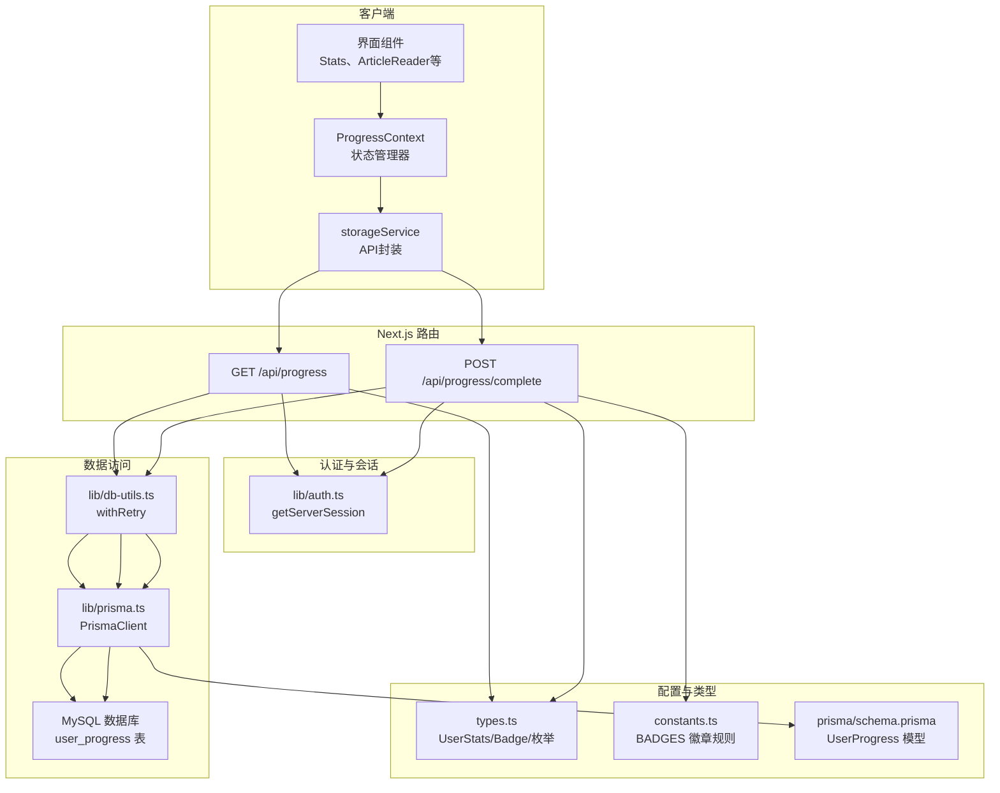
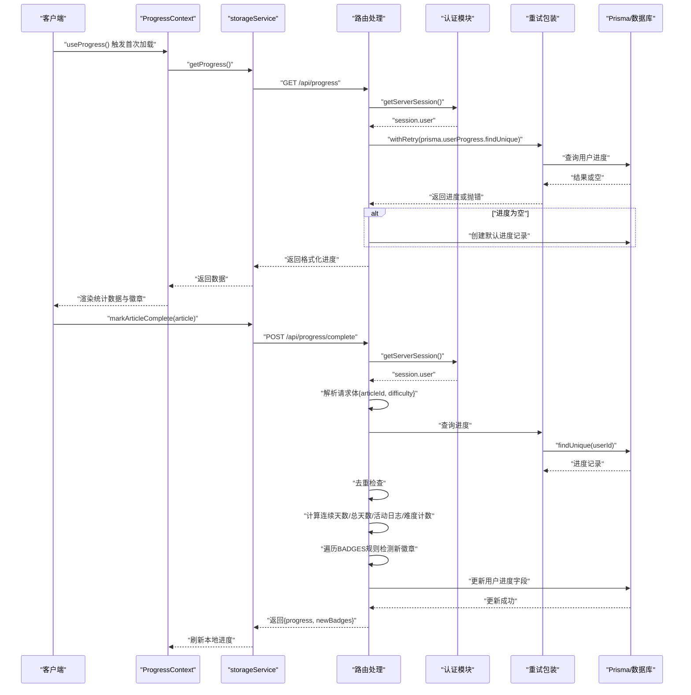
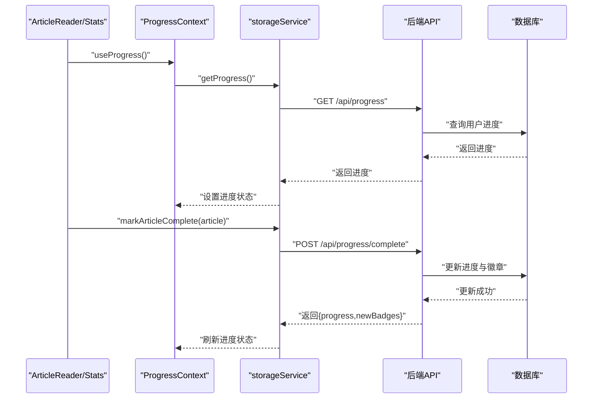
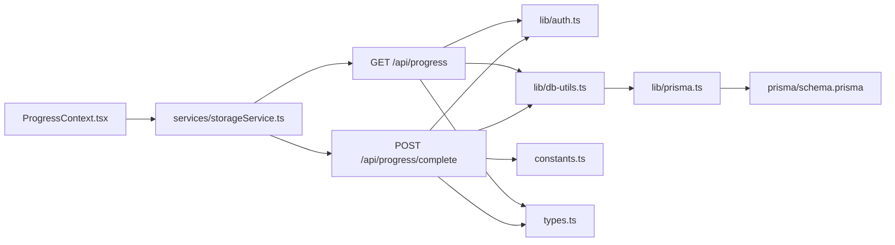
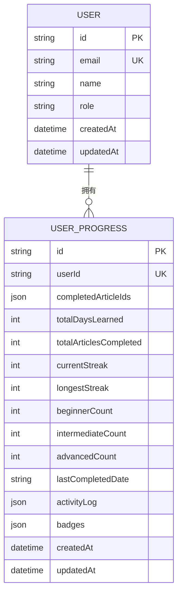

# 进度追踪API

<cite>
**本文引用的文件**
- [app/api/progress/route.ts](file://app/api/progress/route.ts)
- [app/api/progress/complete/route.ts](file://app/api/progress/complete/route.ts)
- [contexts/ProgressContext.tsx](file://contexts/ProgressContext.tsx)
- [services/storageService.ts](file://services/storageService.ts)
- [lib/db-utils.ts](file://lib/db-utils.ts)
- [lib/prisma.ts](file://lib/prisma.ts)
- [lib/auth.ts](file://lib/auth.ts)
- [types.ts](file://types.ts)
- [constants.ts](file://constants.ts)
- [prisma/schema.prisma](file://prisma/schema.prisma)
</cite>

## 目录
1. [简介](#简介)
2. [项目结构](#项目结构)
3. [核心组件](#核心组件)
4. [架构总览](#架构总览)
5. [详细组件分析](#详细组件分析)
6. [依赖分析](#依赖分析)
7. [性能考虑](#性能考虑)
8. [故障排查指南](#故障排查指南)
9. [结论](#结论)
10. [附录](#附录)

## 简介
本文件面向开发者与产品人员，系统化梳理“学习进度追踪”相关的后端API与前端上下文协作关系，重点覆盖以下两个端点：
- GET /api/progress：基于用户会话读取当前学习进度，包含已完成文章ID列表、统计数据（学习天数、完成数量、连续天数、最长连续天数、各难度文章完成数、最后完成日期、活动日志）与徽章信息；当用户无进度记录时自动创建默认记录。
- POST /api/progress/complete：标记某篇文章为已完成，执行身份校验、重复提交检查、连续学习天数与活动日志更新、按难度分类统计，并触发徽章系统检测与发放。

同时说明这些API与ProgressContext状态管理器的交互关系，以及在用户激励体系中的核心作用。

## 项目结构
围绕进度追踪API的关键文件组织如下：
- 路由层：app/api/progress/route.ts、app/api/progress/complete/route.ts
- 认证与会话：lib/auth.ts
- 数据访问与重试：lib/db-utils.ts、lib/prisma.ts
- 类型定义：types.ts
- 徽章配置：constants.ts
- 前端状态与调用：contexts/ProgressContext.tsx、services/storageService.ts
- 数据库模型：prisma/schema.prisma

图表来源
- [app/api/progress/route.ts](file://app/api/progress/route.ts#L1-L78)
- [app/api/progress/complete/route.ts](file://app/api/progress/complete/route.ts#L1-L124)
- [contexts/ProgressContext.tsx](file://contexts/ProgressContext.tsx#L1-L95)
- [services/storageService.ts](file://services/storageService.ts#L1-L50)
- [lib/auth.ts](file://lib/auth.ts#L1-L101)
- [lib/db-utils.ts](file://lib/db-utils.ts#L1-L60)
- [lib/prisma.ts](file://lib/prisma.ts#L1-L30)
- [types.ts](file://types.ts#L1-L70)
- [constants.ts](file://constants.ts#L1-L152)
- [prisma/schema.prisma](file://prisma/schema.prisma#L1-L81)

章节来源
- [app/api/progress/route.ts](file://app/api/progress/route.ts#L1-L78)
- [app/api/progress/complete/route.ts](file://app/api/progress/complete/route.ts#L1-L124)
- [contexts/ProgressContext.tsx](file://contexts/ProgressContext.tsx#L1-L95)
- [services/storageService.ts](file://services/storageService.ts#L1-L50)
- [lib/db-utils.ts](file://lib/db-utils.ts#L1-L60)
- [lib/prisma.ts](file://lib/prisma.ts#L1-L30)
- [lib/auth.ts](file://lib/auth.ts#L1-L101)
- [types.ts](file://types.ts#L1-L70)
- [constants.ts](file://constants.ts#L1-L152)
- [prisma/schema.prisma](file://prisma/schema.prisma#L1-L81)

## 核心组件
- GET /api/progress
  - 基于服务器端会话获取当前用户进度，若不存在则自动创建默认记录（空活动日志、空徽章、空完成列表），并返回格式化的统计数据与徽章列表。
  - 对数据库连接池满或连接异常等场景返回503服务不可用友好提示。
- POST /api/progress/complete
  - 校验会话身份，解析请求体中的文章ID与难度，检查是否重复完成，计算连续天数与总学习天数，更新活动日志与按难度计数，构造当前统计用于徽章检测，最终写入数据库并返回新增徽章名称列表。
- ProgressContext（前端）
  - 在用户登录后仅首次拉取进度，支持手动刷新；通过storageService封装的fetch调用与后端API交互。
- 徽章系统
  - constants.ts中定义BADGES数组，每个徽章包含id、name、icon与condition函数；后端在更新进度时遍历规则，满足条件即发放新徽章并持久化。

章节来源
- [app/api/progress/route.ts](file://app/api/progress/route.ts#L1-L78)
- [app/api/progress/complete/route.ts](file://app/api/progress/complete/route.ts#L1-L124)
- [contexts/ProgressContext.tsx](file://contexts/ProgressContext.tsx#L1-L95)
- [services/storageService.ts](file://services/storageService.ts#L1-L50)
- [constants.ts](file://constants.ts#L116-L145)

## 架构总览
下面的序列图展示从客户端到后端API再到数据库的整体调用链路，以及徽章检测与发放流程。

图表来源
- [contexts/ProgressContext.tsx](file://contexts/ProgressContext.tsx#L1-L95)
- [services/storageService.ts](file://services/storageService.ts#L1-L50)
- [app/api/progress/route.ts](file://app/api/progress/route.ts#L1-L78)
- [app/api/progress/complete/route.ts](file://app/api/progress/complete/route.ts#L1-L124)
- [lib/auth.ts](file://lib/auth.ts#L1-L101)
- [lib/db-utils.ts](file://lib/db-utils.ts#L1-L60)
- [lib/prisma.ts](file://lib/prisma.ts#L1-L30)
- [constants.ts](file://constants.ts#L116-L145)

## 详细组件分析

### GET /api/progress
- 请求方法与路径
  - 方法：GET
  - 路径：/api/progress
- 认证方式
  - 使用服务器端会话（Session Cookie）。通过getServerSession获取当前用户信息，若无会话则返回401未授权。
- 成功响应
  - 返回结构包含：
    - completedArticleIds：已完成文章ID数组
    - stats：
      - totalDaysLearned：累计学习天数
      - totalArticlesCompleted：累计完成文章数
      - currentStreak：当前连续天数
      - longestStreak：历史最长连续天数
      - articlesByDifficulty：按难度分类的完成数（初级、中级、高级）
      - lastCompletedDate：最后完成日期（YYYY-MM-DD）
      - activityLog：按日期统计的每日完成数量
      - badges：已获得徽章ID列表
- 自动创建默认记录
  - 若查询不到用户进度记录，则自动创建一条默认记录，字段初始化为：
    - completedArticleIds：[]
    - activityLog：{}
    - badges：[]
- 错误处理
  - 401：未授权（无有效会话）
  - 503：数据库连接池满或无法连接
  - 500：其他内部错误
- curl示例
  - curl -sS -H "Cookie: session=...; Path=/; HttpOnly; SameSite=Lax" http://localhost:3000/api/progress

章节来源
- [app/api/progress/route.ts](file://app/api/progress/route.ts#L1-L78)
- [lib/auth.ts](file://lib/auth.ts#L1-L101)
- [lib/db-utils.ts](file://lib/db-utils.ts#L1-L60)
- [lib/prisma.ts](file://lib/prisma.ts#L1-L30)
- [prisma/schema.prisma](file://prisma/schema.prisma#L27-L62)

### POST /api/progress/complete
- 请求方法与路径
  - 方法：POST
  - 路径：/api/progress/complete
- 请求头
  - Content-Type: application/json
  - 认证：Session Cookie（服务器端会话）
- 请求体
  - articleId：文章唯一标识
  - difficulty：难度枚举（Beginner/Intermediate/Advanced）
- 处理流程
  - 身份校验：通过getServerSession获取当前用户，无会话返回401。
  - 查询进度：按userId查找用户进度记录，不存在返回404。
  - 去重检查：若completedArticleIds中已包含该articleId，直接返回“已完成后”的消息。
  - 连续天数与学习天数：
    - 若lastCompletedDate与今天不同，且存在lastDate则计算间隔天数，间隔为1则currentStreak+1，否则currentStreak重置为1；无论是否连续，totalDaysLearned均+1。
  - 活动日志：activityLog按日期累加计数。
  - 按难度统计：根据difficulty分别增加对应计数。
  - 徽章检测：构造当前统计对象，遍历constants.ts中的BADGES规则，若满足条件且未获得过该徽章，则加入新徽章ID列表。
  - 更新数据库：原子性更新totalDaysLearned、totalArticlesCompleted、currentStreak、longestStreak、lastCompletedDate、activityLog、badges、completedArticleIds、各难度计数。
  - 返回：返回新的progress（包含updated stats与badges）与newBadges（本次新增徽章名称列表）。
- 错误处理
  - 401：未授权
  - 404：进度记录不存在
  - 500：更新失败
- curl示例
  - curl -sS -X POST http://localhost:3000/api/progress/complete -H "Content-Type: application/json" -b "session=..." -d '{"articleId":"<ARTICLE_ID>","difficulty":"Beginner"}'

章节来源
- [app/api/progress/complete/route.ts](file://app/api/progress/complete/route.ts#L1-L124)
- [lib/auth.ts](file://lib/auth.ts#L1-L101)
- [constants.ts](file://constants.ts#L116-L145)
- [types.ts](file://types.ts#L28-L45)
- [prisma/schema.prisma](file://prisma/schema.prisma#L27-L62)

### 前端状态管理器与API交互
- ProgressContext
  - 在用户会话状态变为authenticated时，仅首次拉取进度；提供refreshProgress手动刷新能力；内部使用防并发与已拉取标记避免重复请求。
- storageService
  - 封装GET /api/progress与POST /api/progress/complete，统一处理响应状态与错误。
- 交互关系
  - ArticleReader/Stats等组件通过useProgress消费状态；当用户完成文章后，调用markArticleComplete触发后端更新，随后刷新本地进度。

图表来源
- [contexts/ProgressContext.tsx](file://contexts/ProgressContext.tsx#L1-L95)
- [services/storageService.ts](file://services/storageService.ts#L1-L50)
- [app/api/progress/route.ts](file://app/api/progress/route.ts#L1-L78)
- [app/api/progress/complete/route.ts](file://app/api/progress/complete/route.ts#L1-L124)

章节来源
- [contexts/ProgressContext.tsx](file://contexts/ProgressContext.tsx#L1-L95)
- [services/storageService.ts](file://services/storageService.ts#L1-L50)

### 徽章系统触发机制
- 规则定义
  - constants.ts中BADGES数组包含多个徽章，每个徽章有id、name、icon与condition函数。
- 触发时机
  - POST /api/progress/complete在更新进度前构造当前统计对象，遍历BADGES规则，若满足条件且未获得过该徽章，则将徽章ID加入badges列表并记录新徽章名称。
- 典型条件示例
  - 初次启程：累计完成至少1篇
  - 状态火热：当前连续天数≥3
  - 博学者：累计完成≥10篇
  - 阅读大师：至少完成1篇高级难度文章
- 结果
  - 返回newBadges列表，前端可据此展示奖励反馈。

章节来源
- [constants.ts](file://constants.ts#L116-L145)
- [app/api/progress/complete/route.ts](file://app/api/progress/complete/route.ts#L83-L93)

## 依赖分析
- 组件耦合
  - 路由层依赖认证模块与数据库工具；数据库工具依赖Prisma与请求限流器；前端上下文依赖storageService与路由层返回的数据结构。
- 外部依赖
  - NextAuth会话、Prisma ORM、MySQL数据库。
- 潜在循环依赖
  - 未发现直接循环依赖；认证与路由解耦良好。

图表来源
- [app/api/progress/route.ts](file://app/api/progress/route.ts#L1-L78)
- [app/api/progress/complete/route.ts](file://app/api/progress/complete/route.ts#L1-L124)
- [lib/auth.ts](file://lib/auth.ts#L1-L101)
- [lib/db-utils.ts](file://lib/db-utils.ts#L1-L60)
- [lib/prisma.ts](file://lib/prisma.ts#L1-L30)
- [prisma/schema.prisma](file://prisma/schema.prisma#L1-L81)
- [contexts/ProgressContext.tsx](file://contexts/ProgressContext.tsx#L1-L95)
- [services/storageService.ts](file://services/storageService.ts#L1-L50)
- [types.ts](file://types.ts#L1-L70)
- [constants.ts](file://constants.ts#L1-L152)

章节来源
- [app/api/progress/route.ts](file://app/api/progress/route.ts#L1-L78)
- [app/api/progress/complete/route.ts](file://app/api/progress/complete/route.ts#L1-L124)
- [lib/db-utils.ts](file://lib/db-utils.ts#L1-L60)
- [lib/prisma.ts](file://lib/prisma.ts#L1-L30)
- [prisma/schema.prisma](file://prisma/schema.prisma#L1-L81)
- [contexts/ProgressContext.tsx](file://contexts/ProgressContext.tsx#L1-L95)
- [services/storageService.ts](file://services/storageService.ts#L1-L50)
- [types.ts](file://types.ts#L1-L70)
- [constants.ts](file://constants.ts#L1-L152)

## 性能考虑
- 数据库重试与限流
  - withRetry对连接类错误（如连接池满、服务器关闭连接）进行指数退避重试，减少瞬时故障影响。
- 并发控制
  - ProgressContext在状态管理中使用isFetchingRef与hasFetchedRef避免并发请求与重复拉取。
- 前端缓存策略
  - storageService采用fetch直连API，建议在上层引入SWR/React Query以实现缓存与去重，减少不必要的网络请求。
- 数据库健康检查
  - Prisma在开发环境定期检查连接健康，便于快速发现问题。

章节来源
- [lib/db-utils.ts](file://lib/db-utils.ts#L1-L60)
- [contexts/ProgressContext.tsx](file://contexts/ProgressContext.tsx#L1-L95)
- [lib/prisma.ts](file://lib/prisma.ts#L1-L30)

## 故障排查指南
- 401 未授权
  - 确认浏览器已正确携带Session Cookie；检查NextAuth会话配置与登录状态。
- 404 进度记录不存在
  - 首次登录用户可能尚未创建进度记录；GET /api/progress会在缺失时自动创建；若仍出现，检查userId映射与数据库一致性。
- 503 服务不可用
  - 数据库连接池满或服务器关闭连接；查看withRetry日志与Prisma健康检查输出。
- 500 内部错误
  - 查看后端错误日志与withRetry抛出的原始错误；确认Prisma连接与schema一致。
- 徽章未触发
  - 检查constants.ts中BADGES规则是否满足当前统计；确认POST /api/progress/complete返回的newBadges是否为空。

章节来源
- [app/api/progress/route.ts](file://app/api/progress/route.ts#L57-L77)
- [app/api/progress/complete/route.ts](file://app/api/progress/complete/route.ts#L118-L124)
- [lib/db-utils.ts](file://lib/db-utils.ts#L1-L60)
- [lib/prisma.ts](file://lib/prisma.ts#L1-L30)
- [constants.ts](file://constants.ts#L116-L145)

## 结论
- GET /api/progress提供了稳定的进度读取入口，并在缺失时自动创建默认记录，确保用户体验连续性。
- POST /api/progress/complete实现了完整的进度更新与徽章检测流程，具备幂等性（去重检查）与良好的错误处理。
- 前端ProgressContext与storageService将API调用与状态管理解耦，配合徽章系统形成闭环的用户激励体系。

## 附录

### 数据模型与字段说明
- UserProgress（用户进度）
  - 字段概览：userId、completedArticleIds、totalDaysLearned、totalArticlesCompleted、currentStreak、longestStreak、beginnerCount、intermediateCount、advancedCount、lastCompletedDate、activityLog、badges
  - 关系：与User为一对一关系，外键指向User.id
- UserStats（前端统计结构）
  - 字段概览：totalDaysLearned、totalArticlesCompleted、currentStreak、longestStreak、articlesByDifficulty、lastCompletedDate、activityLog、badges
- Badge（徽章）
  - 字段概览：id、name、description、icon、condition(stats)

图表来源
- [prisma/schema.prisma](file://prisma/schema.prisma#L1-L81)

### API定义与示例

- GET /api/progress
  - 请求头：Cookie: session=...
  - 成功响应示例（简化）：
    - {
        "completedArticleIds": ["art-001","art-002"],
        "stats": {
          "totalDaysLearned": 5,
          "totalArticlesCompleted": 7,
          "currentStreak": 2,
          "longestStreak": 3,
          "articlesByDifficulty": {"Beginner": 2,"Intermediate": 3,"Advanced": 2},
          "lastCompletedDate": "2025-04-05",
          "activityLog": {"2025-04-01": 1,"2025-04-05": 1},
          "badges": ["badge-first-step","badge-on-fire"]
        }
      }
  - 错误响应示例：
    - 401: {"error":"Unauthorized"}
    - 503: {"error":"数据库连接池已满，请稍后重试"}

- POST /api/progress/complete
  - 请求头：Content-Type: application/json, Cookie: session=...
  - 请求体示例：
    - {"articleId":"art-003","difficulty":"Advanced"}
  - 成功响应示例（简化）：
    - {
        "progress": {
          "completedArticleIds": ["art-001","art-002","art-003"],
          "stats": {
            "totalDaysLearned": 6,
            "totalArticlesCompleted": 8,
            "currentStreak": 3,
            "longestStreak": 3,
            "articlesByDifficulty": {"Beginner": 2,"Intermediate": 3,"Advanced": 3},
            "lastCompletedDate": "2025-04-06",
            "activityLog": {"2025-04-01": 1,"2025-04-06": 1},
            "badges": ["badge-first-step","badge-on-fire","badge-master"]
          }
        },
        "newBadges": ["badge-master"]
      }
  - 错误响应示例：
    - 401: {"error":"Unauthorized"}
    - 404: {"error":"Progress record not found"}
    - 500: {"error":"Failed to update progress"}

- curl示例
  - 获取进度：
    - curl -sS -H "Cookie: session=...; Path=/; HttpOnly; SameSite=Lax" http://localhost:3000/api/progress
  - 标记完成：
    - curl -sS -X POST http://localhost:3000/api/progress/complete -H "Content-Type: application/json" -b "session=..." -d '{"articleId":"<ARTICLE_ID>","difficulty":"Beginner"}'

章节来源
- [app/api/progress/route.ts](file://app/api/progress/route.ts#L1-L78)
- [app/api/progress/complete/route.ts](file://app/api/progress/complete/route.ts#L1-L124)
- [lib/auth.ts](file://lib/auth.ts#L1-L101)
- [constants.ts](file://constants.ts#L116-L145)
- [types.ts](file://types.ts#L28-L45)
- [prisma/schema.prisma](file://prisma/schema.prisma#L27-L62)