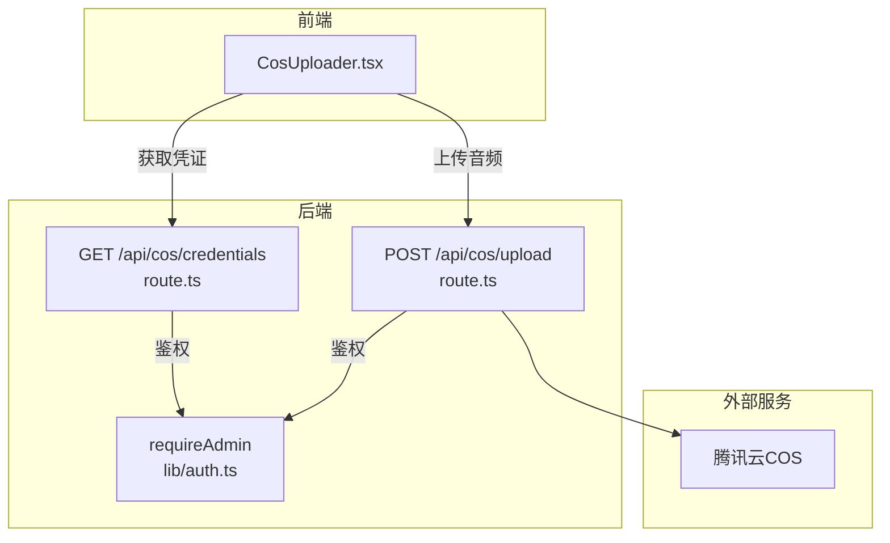
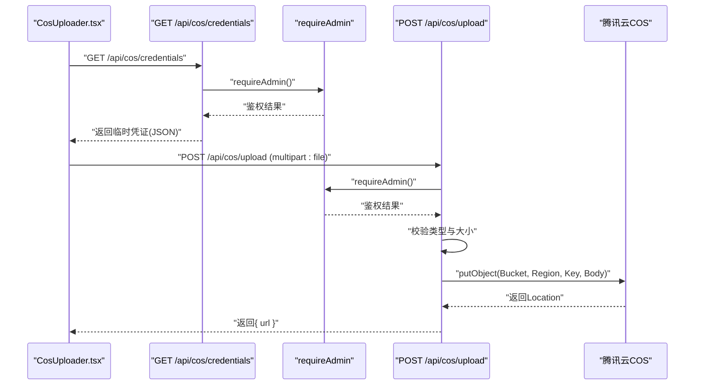
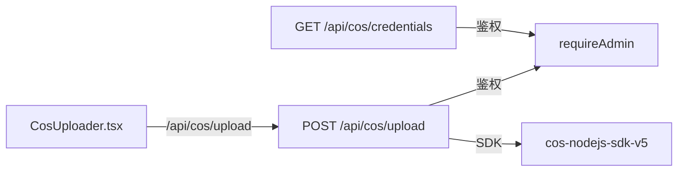

# 存储API

<cite>
**本文引用的文件**
- [app/api/cos/credentials/route.ts](file://app/api/cos/credentials/route.ts)
- [app/api/cos/upload/route.ts](file://app/api/cos/upload/route.ts)
- [components/CosUploader.tsx](file://components/CosUploader.tsx)
- [lib/auth.ts](file://lib/auth.ts)
- [package.json](file://package.json)
</cite>

## 目录
1. [简介](#简介)
2. [项目结构](#项目结构)
3. [核心组件](#核心组件)
4. [架构总览](#架构总览)
5. [详细组件分析](#详细组件分析)
6. [依赖关系分析](#依赖关系分析)
7. [性能考虑](#性能考虑)
8. [故障排查指南](#故障排查指南)
9. [结论](#结论)

## 简介
本文件面向“腾讯云COS集成的存储API”进行系统化文档化，重点覆盖以下目标：
- 说明 GET /api/cos/credentials 如何为客户端生成临时上传凭证（管理员专用），以及其与前端 CosUploader 的协作方式。
- 说明 POST /api/cos/upload 如何处理音频文件上传请求并返回可访问的存储URL，包括请求参数、响应格式、文件类型与大小限制、安全策略（如签名URL有效期）与错误处理。
- 解释这些API与前端 CosUploader 组件及服务层 storageService.ts 的协同关系。
- 提供上传流程时序图、性能优化建议（如分片上传）与故障排查指南。

## 项目结构
围绕存储API的关键文件组织如下：
- 后端路由
  - GET /api/cos/credentials：获取COS临时密钥（管理员专用）
  - POST /api/cos/upload：上传音频文件至COS（管理员专用）
- 前端组件
  - CosUploader：负责选择音频文件、计算时长、发起上传请求、展示进度与结果
- 认证与授权
  - requireAdmin：基于NextAuth会话判断管理员身份
- 依赖与运行时
  - package.json 中包含 cos-nodejs-sdk-v5 依赖

图表来源
- [app/api/cos/credentials/route.ts](file://app/api/cos/credentials/route.ts#L1-L43)
- [app/api/cos/upload/route.ts](file://app/api/cos/upload/route.ts#L1-L105)
- [components/CosUploader.tsx](file://components/CosUploader.tsx#L1-L189)
- [lib/auth.ts](file://lib/auth.ts#L73-L101)

章节来源
- [app/api/cos/credentials/route.ts](file://app/api/cos/credentials/route.ts#L1-L43)
- [app/api/cos/upload/route.ts](file://app/api/cos/upload/route.ts#L1-L105)
- [components/CosUploader.tsx](file://components/CosUploader.tsx#L1-L189)
- [lib/auth.ts](file://lib/auth.ts#L73-L101)
- [package.json](file://package.json#L1-L200)

## 核心组件
- GET /api/cos/credentials
  - 职责：为管理员生成临时上传凭证（当前实现返回环境变量中的密钥，注释提示应改为通过STS获取临时密钥）。
  - 安全性：仅管理员可调用；返回字段包含临时密钥标识、会话令牌与过期时间。
  - 响应：JSON对象，包含临时密钥相关信息。
- POST /api/cos/upload
  - 职责：接收音频文件，校验类型与大小，上传至COS并返回可访问URL。
  - 请求体：multipart/form-data，键名为 file。
  - 响应：JSON对象，包含 url 字段。
  - 限制：仅允许特定音频MIME类型；默认大小上限为50MB。
- CosUploader
  - 职责：选择音频文件、计算时长、构造FormData、通过XMLHttpRequest调用后端上传接口、显示进度与结果。
  - 交互：onChange回调接收返回的URL，onDurationChange回调接收音频时长。
- requireAdmin
  - 职责：基于NextAuth会话判断是否为管理员，非管理员或未登录返回相应错误码。

章节来源
- [app/api/cos/credentials/route.ts](file://app/api/cos/credentials/route.ts#L1-L43)
- [app/api/cos/upload/route.ts](file://app/api/cos/upload/route.ts#L1-L105)
- [components/CosUploader.tsx](file://components/CosUploader.tsx#L1-L189)
- [lib/auth.ts](file://lib/auth.ts#L73-L101)

## 架构总览
下图展示了从前端到后端再到COS的整体调用链路与鉴权控制点。

图表来源
- [app/api/cos/credentials/route.ts](file://app/api/cos/credentials/route.ts#L1-L43)
- [app/api/cos/upload/route.ts](file://app/api/cos/upload/route.ts#L1-L105)
- [components/CosUploader.tsx](file://components/CosUploader.tsx#L1-L189)
- [lib/auth.ts](file://lib/auth.ts#L73-L101)

## 详细组件分析

### GET /api/cos/credentials
- 功能要点
  - 仅管理员可调用，使用 requireAdmin 进行鉴权。
  - 返回临时凭证（当前实现返回环境变量中的密钥，注释提示应改为通过STS获取临时密钥）。
  - 返回JSON对象，包含临时密钥标识、会话令牌与过期时间。
- 错误处理
  - 鉴权失败：返回401或403，并附带错误信息。
  - 其他异常：捕获异常并返回500与错误信息。
- 安全建议
  - 生产环境应通过STS获取短期有效的临时密钥，避免在前端暴露长期密钥。
  - 临时密钥应限定权限范围（如仅允许PUT操作）与有效时间窗口。

章节来源
- [app/api/cos/credentials/route.ts](file://app/api/cos/credentials/route.ts#L1-L43)
- [lib/auth.ts](file://lib/auth.ts#L73-L101)

### POST /api/cos/upload
- 功能要点
  - 仅管理员可调用，使用 requireAdmin 进行鉴权。
  - 接收 multipart/form-data，键名为 file。
  - 文件类型限制：仅允许特定音频MIME类型。
  - 文件大小限制：默认不超过50MB。
  - 上传至COS：初始化cos-nodejs-sdk-v5客户端，构造Key（audio/{timestamp}_{随机串}.{扩展名}），上传Body为Buffer。
  - 返回JSON：包含 url 字段，为COS返回的完整可访问URL。
- 请求与响应
  - 请求：multipart/form-data，键 file。
  - 响应：{ url: string }。
- 错误处理
  - 缺少文件：返回400与错误信息。
  - 不支持的类型：返回400与错误信息。
  - 超出大小限制：返回400与错误信息。
  - 上传异常：捕获错误并返回500与错误信息。
- 限制与配置
  - 后端配置了bodyParser大小限制为50MB，确保大文件上传不会被拒绝于框架层。

章节来源
- [app/api/cos/upload/route.ts](file://app/api/cos/upload/route.ts#L1-L105)
- [lib/auth.ts](file://lib/auth.ts#L73-L101)

### CosUploader 组件
- 功能要点
  - 选择音频文件：支持常见音频格式（MP3、WAV、OGG、AAC、M4A）。
  - 计算音频时长：通过创建audio元素加载Blob URL，监听loadedmetadata事件获取时长。
  - 上传流程：构造FormData，使用XMLHttpRequest发送POST请求至 /api/cos/upload，监听progress事件更新进度，成功回调触发onChange(value)，失败回调弹窗提示。
  - 展示结果：显示当前音频URL与预览控件。
- 与后端API的协作
  - 通过 /api/cos/upload 上传文件并接收URL。
  - 通过 props.onChange 接收返回的URL，以便父组件保存或继续使用。
- 与storageService.ts的关系
  - storageService.ts 提供通用的API服务封装（文章、进度等），与COS上传无直接耦合；若需持久化音频URL，可在业务层调用storageService.ts相关接口。

章节来源
- [components/CosUploader.tsx](file://components/CosUploader.tsx#L1-L189)

### requireAdmin 鉴权
- 功能要点
  - 基于NextAuth会话获取用户角色，要求角色为admin。
  - 未登录或非管理员返回相应错误码与消息。
- 与上传API的协作
  - 两个后端路由均在入口处调用 requireAdmin，确保只有管理员可执行敏感操作。

章节来源
- [lib/auth.ts](file://lib/auth.ts#L73-L101)

## 依赖关系分析
- 外部依赖
  - cos-nodejs-sdk-v5：用于Node端上传至COS。
- 内部依赖
  - requireAdmin：统一鉴权入口。
  - NextResponse/NextRequest：Next.js服务器端路由的响应与请求对象。
- 前后端耦合
  - 前端通过XMLHttpRequest调用后端路由，后端负责鉴权与上传逻辑。
  - 前端组件与后端API通过约定的请求体与响应格式进行解耦。

图表来源
- [components/CosUploader.tsx](file://components/CosUploader.tsx#L1-L189)
- [app/api/cos/upload/route.ts](file://app/api/cos/upload/route.ts#L1-L105)
- [app/api/cos/credentials/route.ts](file://app/api/cos/credentials/route.ts#L1-L43)
- [lib/auth.ts](file://lib/auth.ts#L73-L101)
- [package.json](file://package.json#L1-L200)

章节来源
- [package.json](file://package.json#L1-L200)

## 性能考虑
- 分片上传
  - 对于大音频文件（接近50MB上限），建议采用分片上传以提升稳定性与速度。可参考 cos-nodejs-sdk-v5 的分片上传能力，按块并发上传并合并。
- 断点续传
  - 在分片基础上增加断点续传，避免网络抖动导致的重复传输。
- 并发与超时
  - 控制并发数，设置合理的请求超时与重试策略，避免阻塞主线程。
- CDN与URL
  - COS返回的URL可结合CDN加速，减少首播延迟。
- 前端进度
  - 已通过XMLHttpRequest的progress事件实现上传进度反馈，建议在大文件场景下进一步细化分片粒度与进度统计。

## 故障排查指南
- 401/403 鉴权失败
  - 确认已登录且角色为admin；检查NextAuth会话是否正确传递。
  - 参考路径：[鉴权实现](file://lib/auth.ts#L73-L101)
- 400 未找到文件
  - 确认请求体包含键名为 file 的multipart字段。
  - 参考路径：[上传路由](file://app/api/cos/upload/route.ts#L20-L30)
- 400 不支持的文件类型
  - 仅允许特定音频MIME类型；请确认文件扩展名与MIME类型匹配。
  - 参考路径：[类型校验](file://app/api/cos/upload/route.ts#L31-L40)
- 400 文件过大
  - 默认上限为50MB；如需更大文件，请调整后端配置与前端选择器限制。
  - 参考路径：[大小限制与配置](file://app/api/cos/upload/route.ts#L40-L46)
- 500 上传失败
  - 查看后端日志与COS返回错误；检查COS密钥、Bucket与Region配置。
  - 参考路径：[上传异常处理](file://app/api/cos/upload/route.ts#L88-L95)
- 前端上传失败
  - 检查XMLHttpRequest的error与load事件回调；确认网络连通性与跨域设置。
  - 参考路径：[前端上传逻辑](file://components/CosUploader.tsx#L77-L118)

章节来源
- [app/api/cos/upload/route.ts](file://app/api/cos/upload/route.ts#L20-L95)
- [components/CosUploader.tsx](file://components/CosUploader.tsx#L77-L118)
- [lib/auth.ts](file://lib/auth.ts#L73-L101)

## 结论
- GET /api/cos/credentials 与 POST /api/cos/upload 通过 requireAdmin 实现管理员级鉴权，保障上传操作的安全性。
- 前端 CosUploader 与后端API通过明确的请求体与响应格式协作，实现了音频文件的上传与URL回传。
- 当前凭证获取逻辑为开发测试用途，生产环境应改用STS获取短期临时密钥。
- 建议引入分片上传与断点续传机制，以提升大文件上传的稳定性与用户体验。