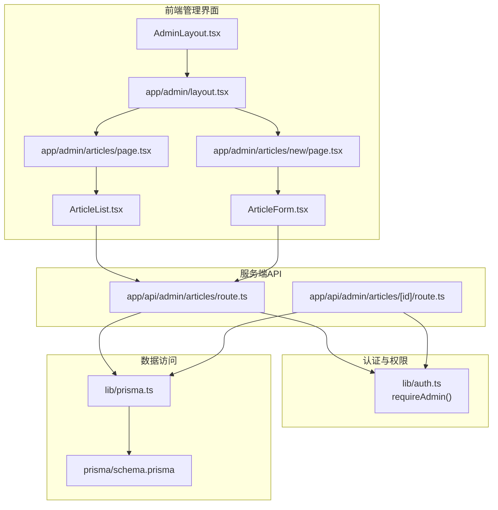
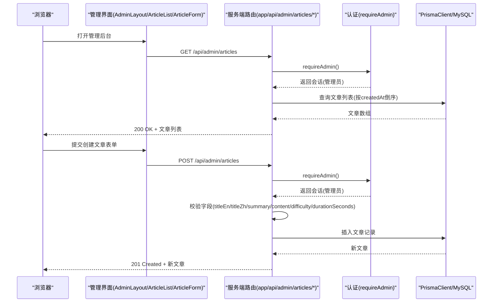
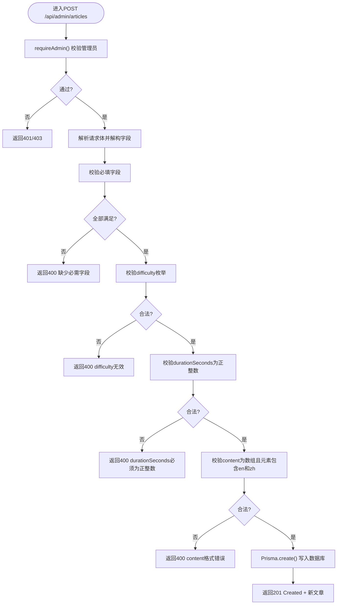
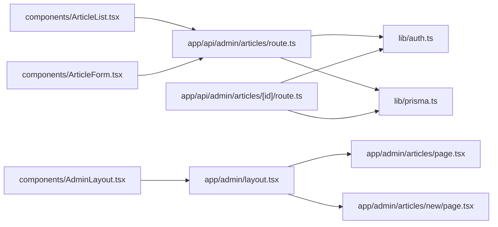

# 文章管理API

<cite>
**本文引用的文件**
- [app/api/admin/articles/route.ts](file://app/api/admin/articles/route.ts)
- [app/api/admin/articles/[id]/route.ts](file://app/api/admin/articles/[id]/route.ts)
- [lib/auth.ts](file://lib/auth.ts)
- [lib/prisma.ts](file://lib/prisma.ts)
- [types.ts](file://types.ts)
- [prisma/schema.prisma](file://prisma/schema.prisma)
- [components/AdminLayout.tsx](file://components/AdminLayout.tsx)
- [components/ArticleForm.tsx](file://components/ArticleForm.tsx)
- [components/ArticleList.tsx](file://components/ArticleList.tsx)
- [app/admin/layout.tsx](file://app/admin/layout.tsx)
- [app/admin/articles/page.tsx](file://app/admin/articles/page.tsx)
- [app/admin/articles/new/page.tsx](file://app/admin/articles/new/page.tsx)
</cite>

## 目录
1. [简介](#简介)
2. [项目结构](#项目结构)
3. [核心组件](#核心组件)
4. [架构总览](#架构总览)
5. [详细组件分析](#详细组件分析)
6. [依赖分析](#依赖分析)
7. [性能考虑](#性能考虑)
8. [故障排查指南](#故障排查指南)
9. [结论](#结论)
10. [附录](#附录)

## 简介
本文件面向管理员端文章管理API，重点覆盖以下两个端点：
- GET /api/admin/articles：获取所有文章列表（管理员专用）
- POST /api/admin/articles：创建新文章（管理员专用）

文档将详细说明：
- HTTP方法、请求/响应格式
- 认证与权限要求（仅管理员）
- 错误处理机制
- POST请求中对titleEn、titleZh、content数组结构等字段的验证逻辑
- Prisma数据库操作细节
- 实际调用示例
- 与前端AdminLayout及文章管理页面的集成方式

## 项目结构
该功能由服务端路由、认证与权限校验、Prisma数据访问层、以及前端管理界面共同组成。下图展示了与“文章管理API”直接相关的模块关系。

图表来源
- [app/api/admin/articles/route.ts](file://app/api/admin/articles/route.ts#L1-L137)
- [app/api/admin/articles/[id]/route.ts](file://app/api/admin/articles/[id]/route.ts#L1-L205)
- [lib/auth.ts](file://lib/auth.ts#L73-L101)
- [lib/prisma.ts](file://lib/prisma.ts#L1-L30)
- [prisma/schema.prisma](file://prisma/schema.prisma#L64-L81)
- [components/AdminLayout.tsx](file://components/AdminLayout.tsx#L1-L105)
- [components/ArticleList.tsx](file://components/ArticleList.tsx#L1-L186)
- [components/ArticleForm.tsx](file://components/ArticleForm.tsx#L1-L432)
- [app/admin/layout.tsx](file://app/admin/layout.tsx#L1-L10)
- [app/admin/articles/page.tsx](file://app/admin/articles/page.tsx#L1-L6)
- [app/admin/articles/new/page.tsx](file://app/admin/articles/new/page.tsx#L1-L6)

章节来源
- [app/api/admin/articles/route.ts](file://app/api/admin/articles/route.ts#L1-L137)
- [app/api/admin/articles/[id]/route.ts](file://app/api/admin/articles/[id]/route.ts#L1-L205)
- [lib/auth.ts](file://lib/auth.ts#L73-L101)
- [lib/prisma.ts](file://lib/prisma.ts#L1-L30)
- [prisma/schema.prisma](file://prisma/schema.prisma#L64-L81)
- [components/AdminLayout.tsx](file://components/AdminLayout.tsx#L1-L105)
- [components/ArticleList.tsx](file://components/ArticleList.tsx#L1-L186)
- [components/ArticleForm.tsx](file://components/ArticleForm.tsx#L1-L432)
- [app/admin/layout.tsx](file://app/admin/layout.tsx#L1-L10)
- [app/admin/articles/page.tsx](file://app/admin/articles/page.tsx#L1-L6)
- [app/admin/articles/new/page.tsx](file://app/admin/articles/new/page.tsx#L1-L6)

## 核心组件
- 服务端路由
  - GET /api/admin/articles：查询所有文章，按创建时间倒序返回
  - POST /api/admin/articles：创建新文章，包含字段校验与Prisma写入
  - GET/PUT/DELETE /api/admin/articles/[id]：获取、更新、删除指定文章（扩展能力）
- 认证与权限
  - requireAdmin：通过NextAuth会话判断是否为管理员，非管理员返回401/403
- 数据访问
  - PrismaClient：统一的数据访问客户端，开发环境带日志与连接健康检查
  - Prisma Schema：Article模型定义，包含titleEn/titleZh/summaryEn/summaryZh/content/difficulty/durationSeconds/audioUrl等字段
- 前端集成
  - AdminLayout：管理后台布局，负责管理员鉴权与导航
  - ArticleList：文章列表页，调用GET /api/admin/articles
  - ArticleForm：文章表单页，调用POST /api/admin/articles（创建）与PUT /api/admin/articles/[id]（编辑）

章节来源
- [app/api/admin/articles/route.ts](file://app/api/admin/articles/route.ts#L1-L137)
- [app/api/admin/articles/[id]/route.ts](file://app/api/admin/articles/[id]/route.ts#L1-L205)
- [lib/auth.ts](file://lib/auth.ts#L73-L101)
- [lib/prisma.ts](file://lib/prisma.ts#L1-L30)
- [prisma/schema.prisma](file://prisma/schema.prisma#L64-L81)
- [components/AdminLayout.tsx](file://components/AdminLayout.tsx#L1-L105)
- [components/ArticleList.tsx](file://components/ArticleList.tsx#L1-L186)
- [components/ArticleForm.tsx](file://components/ArticleForm.tsx#L1-L432)

## 架构总览
下图展示从浏览器到服务端API再到数据库的整体流程。

图表来源
- [app/api/admin/articles/route.ts](file://app/api/admin/articles/route.ts#L1-L137)
- [lib/auth.ts](file://lib/auth.ts#L73-L101)
- [lib/prisma.ts](file://lib/prisma.ts#L1-L30)
- [prisma/schema.prisma](file://prisma/schema.prisma#L64-L81)
- [components/AdminLayout.tsx](file://components/AdminLayout.tsx#L1-L105)
- [components/ArticleList.tsx](file://components/ArticleList.tsx#L1-L186)
- [components/ArticleForm.tsx](file://components/ArticleForm.tsx#L1-L432)

## 详细组件分析

### GET /api/admin/articles
- 方法与路径
  - GET /api/admin/articles
- 权限要求
  - 仅管理员可访问；内部通过requireAdmin进行校验
- 请求/响应
  - 请求：无请求体
  - 成功响应：200 OK，返回文章数组（按createdAt倒序）
  - 失败响应：500 Internal Server Error，返回错误对象
- 数据库操作
  - 使用Prisma查询Article模型，orderBy按createdAt降序
- 错误处理
  - requireAdmin返回401/403时，直接以对应状态码返回错误
  - 其他异常捕获后返回500

章节来源
- [app/api/admin/articles/route.ts](file://app/api/admin/articles/route.ts#L1-L37)
- [lib/auth.ts](file://lib/auth.ts#L73-L101)
- [lib/prisma.ts](file://lib/prisma.ts#L1-L30)
- [prisma/schema.prisma](file://prisma/schema.prisma#L64-L81)

### POST /api/admin/articles
- 方法与路径
  - POST /api/admin/articles
- 权限要求
  - 仅管理员可访问；内部通过requireAdmin进行校验
- 请求体字段
  - id：可选，字符串；若提供则使用该值作为主键
  - date：可选，字符串(YYYY-MM-DD)；若未提供则默认当前日期
  - titleEn：必填，字符串
  - titleZh：必填，字符串
  - summaryEn：必填，字符串
  - summaryZh：必填，字符串
  - content：必填，数组；数组元素需包含en与zh字段
  - difficulty：必填，枚举值，取值范围为Beginner、Intermediate、Advanced
  - durationSeconds：必填，正整数（秒）
  - audioUrl：可选，字符串
- 字段校验逻辑
  - 必填字段缺失：返回400，提示缺少必需字段
  - difficulty不在允许集合：返回400，提示值无效
  - durationSeconds非正整数：返回400，提示必须为正整数
  - content非数组：返回400，提示必须是数组
  - content元素缺少en或zh：返回400，提示必须包含en和zh字段
- 数据库操作
  - 使用Prisma创建Article记录，字段映射与请求体一致
  - createdAt/updatedAt由Prisma自动维护
- 响应
  - 成功：201 Created，返回新建文章对象
  - 失败：500 Internal Server Error，返回错误对象
- 前端集成
  - ArticleForm在创建模式下提交至该端点
  - ArticleList调用GET /api/admin/articles刷新列表

图表来源
- [app/api/admin/articles/route.ts](file://app/api/admin/articles/route.ts#L43-L136)
- [lib/auth.ts](file://lib/auth.ts#L73-L101)
- [lib/prisma.ts](file://lib/prisma.ts#L1-L30)
- [prisma/schema.prisma](file://prisma/schema.prisma#L64-L81)

章节来源
- [app/api/admin/articles/route.ts](file://app/api/admin/articles/route.ts#L43-L136)
- [lib/auth.ts](file://lib/auth.ts#L73-L101)
- [lib/prisma.ts](file://lib/prisma.ts#L1-L30)
- [prisma/schema.prisma](file://prisma/schema.prisma#L64-L81)
- [components/ArticleForm.tsx](file://components/ArticleForm.tsx#L160-L206)

### GET/PUT/DELETE /api/admin/articles/[id]（扩展能力）
- GET /api/admin/articles/[id]
  - 校验管理员权限
  - 查询Article是否存在，不存在返回404
  - 存在返回文章详情
- PUT /api/admin/articles/[id]
  - 校验管理员权限
  - 校验文章存在性
  - 支持部分字段更新，包含difficulty/durationSeconds/content等字段的条件校验
  - Prisma.update()更新
- DELETE /api/admin/articles/[id]
  - 校验管理员权限
  - 校验文章存在性
  - Prisma.delete()删除

章节来源
- [app/api/admin/articles/[id]/route.ts](file://app/api/admin/articles/[id]/route.ts#L1-L205)

## 依赖分析
- 组件耦合
  - 路由层依赖认证模块与Prisma客户端
  - 前端组件依赖路由接口，ArticleList依赖GET，ArticleForm依赖POST/PUT
- 外部依赖
  - NextAuth：提供会话与管理员角色判定
  - Prisma：ORM与MySQL数据库交互
  - Next.js App Router：路由组织与静态类型

图表来源
- [app/api/admin/articles/route.ts](file://app/api/admin/articles/route.ts#L1-L137)
- [app/api/admin/articles/[id]/route.ts](file://app/api/admin/articles/[id]/route.ts#L1-L205)
- [lib/auth.ts](file://lib/auth.ts#L73-L101)
- [lib/prisma.ts](file://lib/prisma.ts#L1-L30)
- [components/AdminLayout.tsx](file://components/AdminLayout.tsx#L1-L105)
- [components/ArticleList.tsx](file://components/ArticleList.tsx#L1-L186)
- [components/ArticleForm.tsx](file://components/ArticleForm.tsx#L1-L432)
- [app/admin/layout.tsx](file://app/admin/layout.tsx#L1-L10)
- [app/admin/articles/page.tsx](file://app/admin/articles/page.tsx#L1-L6)
- [app/admin/articles/new/page.tsx](file://app/admin/articles/new/page.tsx#L1-L6)

## 性能考虑
- 数据库查询
  - GET /api/admin/articles按createdAt倒序，避免全量扫描；建议在数据库层面建立索引以优化排序与分页
- 连接管理
  - Prisma在开发环境定期检查连接健康，生产环境关闭日志以降低开销
- 前端渲染
  - ArticleList一次性拉取列表，建议在数据量增大时引入分页或虚拟滚动
- 并发控制
  - 表单提交时前端已做基本校验，服务端仍进行严格校验，避免重复写入

章节来源
- [app/api/admin/articles/route.ts](file://app/api/admin/articles/route.ts#L1-L37)
- [lib/prisma.ts](file://lib/prisma.ts#L1-L30)
- [components/ArticleList.tsx](file://components/ArticleList.tsx#L1-L186)

## 故障排查指南
- 401 Unauthorized
  - 现象：未登录或会话失效
  - 排查：确认NextAuth会话存在且包含用户信息
  - 参考
    - [lib/auth.ts](file://lib/auth.ts#L73-L101)
- 403 Forbidden
  - 现象：非管理员访问
  - 排查：确认用户角色为admin
  - 参考
    - [lib/auth.ts](file://lib/auth.ts#L73-L101)
- 400 Bad Request
  - 现象：请求体字段缺失或格式不正确
  - 排查：检查titleEn/titleZh/summaryEn/summaryZh/content/difficulty/durationSeconds是否满足要求
  - 参考
    - [app/api/admin/articles/route.ts](file://app/api/admin/articles/route.ts#L69-L111)
- 500 Internal Server Error
  - 现象：数据库异常或服务端异常
  - 排查：查看服务端日志；确认Prisma连接正常
  - 参考
    - [app/api/admin/articles/route.ts](file://app/api/admin/articles/route.ts#L21-L36)
    - [lib/prisma.ts](file://lib/prisma.ts#L1-L30)

章节来源
- [lib/auth.ts](file://lib/auth.ts#L73-L101)
- [app/api/admin/articles/route.ts](file://app/api/admin/articles/route.ts#L21-L36)
- [lib/prisma.ts](file://lib/prisma.ts#L1-L30)

## 结论
文章管理API围绕管理员权限与严格的字段校验构建，结合Prisma实现可靠的数据持久化。前端通过AdminLayout与ArticleList/ArticleForm实现完整的增删改查体验。建议后续引入分页、索引优化与更细粒度的错误提示，以提升可维护性与用户体验。

## 附录

### API规范与示例

- GET /api/admin/articles
  - 请求
    - 方法：GET
    - 认证：管理员会话
  - 响应
    - 200 OK：文章数组（按createdAt倒序）
    - 500 服务器错误：错误对象
  - 示例
    - curl -H "Cookie: next-auth.session-token=..." https://your-domain/api/admin/articles

- POST /api/admin/articles
  - 请求
    - 方法：POST
    - 认证：管理员会话
    - Content-Type: application/json
    - 请求体字段：见“POST /api/admin/articles”小节
  - 响应
    - 201 Created：新建文章对象
    - 400 Bad Request：字段校验失败
    - 401/403：未授权/禁止访问
    - 500 服务器错误：数据库或服务端异常
  - 示例
    - curl -X POST https://your-domain/api/admin/articles \
      -H "Content-Type: application/json" \
      -H "Cookie: next-auth.session-token=..." \
      -d '{"titleEn":"...","titleZh":"...","summaryEn":"...","summaryZh":"...","content":[{"en":"...","zh":"..."}],"difficulty":"Beginner","durationSeconds":120,"audioUrl":"https://..."}'

- 前端集成要点
  - AdminLayout负责管理员鉴权与导航
  - ArticleList负责拉取与展示文章列表
  - ArticleForm负责创建与编辑文章，并调用相应API
  - 参考
    - [components/AdminLayout.tsx](file://components/AdminLayout.tsx#L1-L105)
    - [components/ArticleList.tsx](file://components/ArticleList.tsx#L1-L186)
    - [components/ArticleForm.tsx](file://components/ArticleForm.tsx#L160-L206)
    - [app/admin/layout.tsx](file://app/admin/layout.tsx#L1-L10)
    - [app/admin/articles/page.tsx](file://app/admin/articles/page.tsx#L1-L6)
    - [app/admin/articles/new/page.tsx](file://app/admin/articles/new/page.tsx#L1-L6)

章节来源
- [app/api/admin/articles/route.ts](file://app/api/admin/articles/route.ts#L1-L137)
- [components/AdminLayout.tsx](file://components/AdminLayout.tsx#L1-L105)
- [components/ArticleList.tsx](file://components/ArticleList.tsx#L1-L186)
- [components/ArticleForm.tsx](file://components/ArticleForm.tsx#L160-L206)
- [app/admin/layout.tsx](file://app/admin/layout.tsx#L1-L10)
- [app/admin/articles/page.tsx](file://app/admin/articles/page.tsx#L1-L6)
- [app/admin/articles/new/page.tsx](file://app/admin/articles/new/page.tsx#L1-L6)