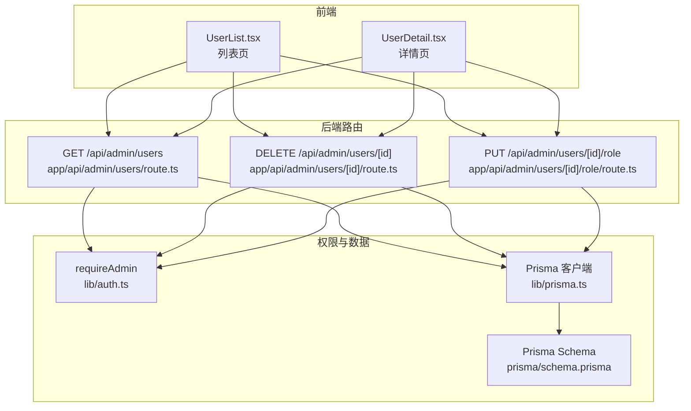
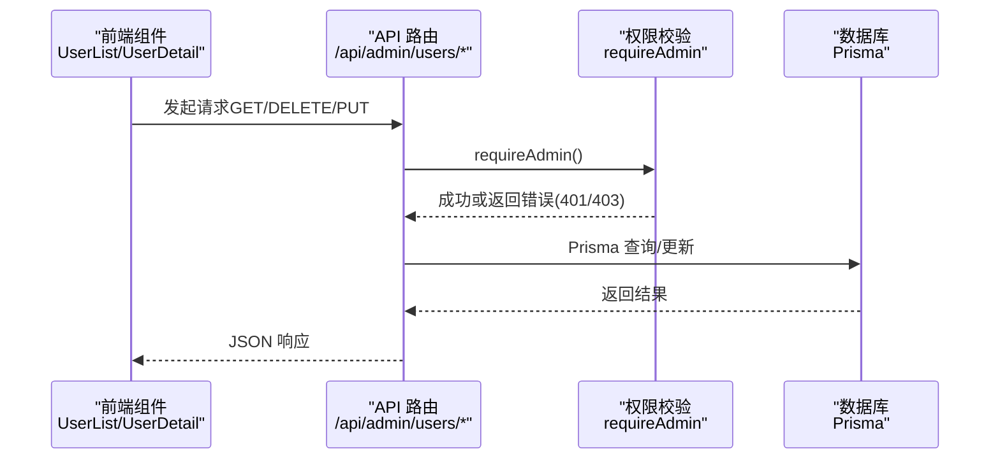
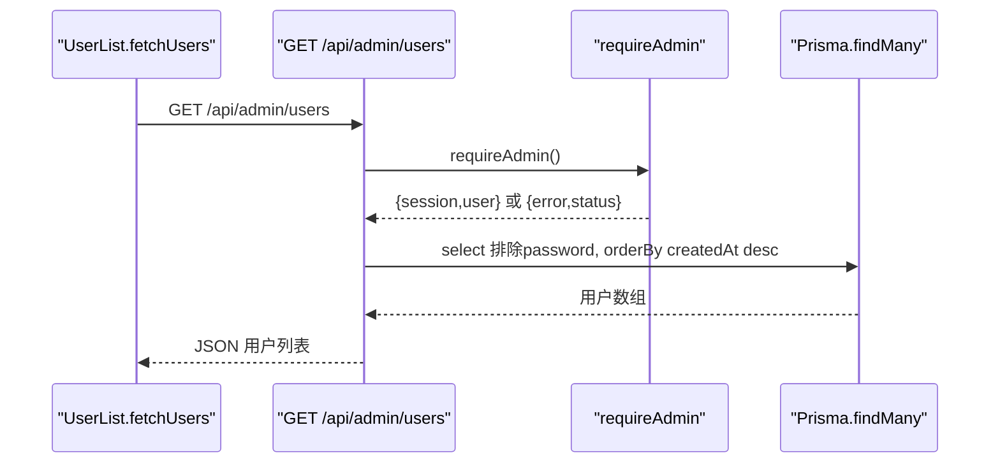
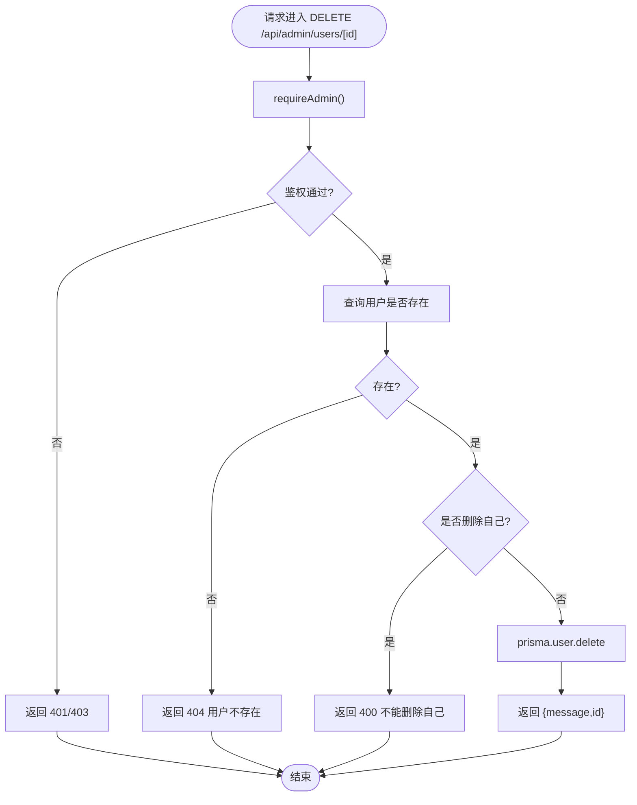
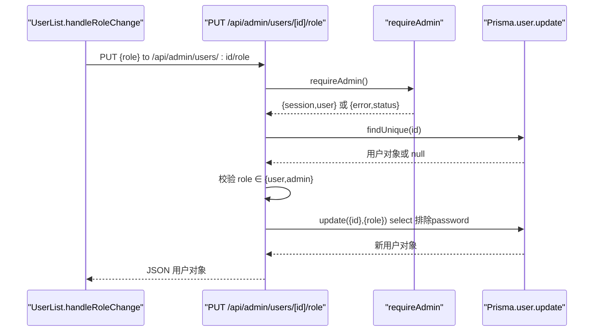
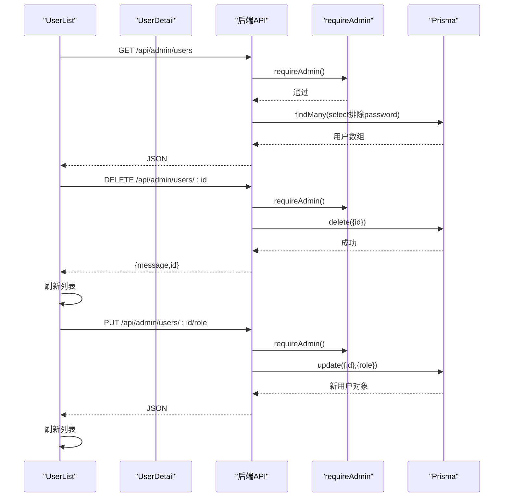
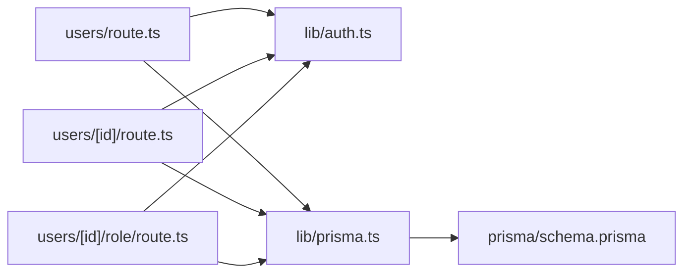

# 用户管理API

<cite>
**本文引用的文件**
- [app/api/admin/users/route.ts](file://app/api/admin/users/route.ts)
- [app/api/admin/users/[id]/route.ts](file://app/api/admin/users/[id]/route.ts)
- [app/api/admin/users/[id]/role/route.ts](file://app/api/admin/users/[id]/role/route.ts)
- [lib/auth.ts](file://lib/auth.ts)
- [lib/prisma.ts](file://lib/prisma.ts)
- [types.ts](file://types.ts)
- [prisma/schema.prisma](file://prisma/schema.prisma)
- [components/UserList.tsx](file://components/UserList.tsx)
- [components/UserDetail.tsx](file://components/UserDetail.tsx)
</cite>

## 目录
1. [简介](#简介)
2. [项目结构](#项目结构)
3. [核心组件](#核心组件)
4. [架构总览](#架构总览)
5. [详细组件分析](#详细组件分析)
6. [依赖分析](#依赖分析)
7. [性能考虑](#性能考虑)
8. [故障排查指南](#故障排查指南)
9. [结论](#结论)

## 简介
本文件为“用户管理API”的完整技术文档，覆盖以下三个后端端点：
- GET /api/admin/users：获取用户列表（管理员专用）
- DELETE /api/admin/users/[id]：删除用户（管理员专用）
- PUT /api/admin/users/[id]/role：修改用户角色（管理员专用）

同时，文档明确各接口的权限控制（requireAdmin）、数据过滤策略（如排除password字段）、Prisma查询实现，并重点阐述角色更新接口的业务逻辑与安全考虑。最后结合前端组件 UserList 与 UserDetail 中的 fetchUsers、handleDelete、handleRoleChange 等方法，展示前后端交互流程，提供错误处理与边界情况说明。

## 项目结构
该功能由三层组成：
- 路由层：Next.js App Router 的 API 路由，分别处理 GET/DELETE/PUT 请求
- 权限层：基于 NextAuth 的 requireAdmin 辅助函数，校验管理员身份
- 数据层：Prisma ORM 访问 MySQL 数据库，使用 schema.prisma 定义的 User 与 UserProgress 模型

图表来源
- [app/api/admin/users/route.ts](file://app/api/admin/users/route.ts#L1-L46)
- [app/api/admin/users/[id]/route.ts](file://app/api/admin/users/[id]/route.ts#L1-L117)
- [app/api/admin/users/[id]/role/route.ts](file://app/api/admin/users/[id]/role/route.ts#L1-L73)
- [lib/auth.ts](file://lib/auth.ts#L73-L101)
- [lib/prisma.ts](file://lib/prisma.ts#L1-L30)
- [prisma/schema.prisma](file://prisma/schema.prisma#L1-L81)

章节来源
- [app/api/admin/users/route.ts](file://app/api/admin/users/route.ts#L1-L46)
- [app/api/admin/users/[id]/route.ts](file://app/api/admin/users/[id]/route.ts#L1-L117)
- [app/api/admin/users/[id]/role/route.ts](file://app/api/admin/users/[id]/role/route.ts#L1-L73)
- [lib/auth.ts](file://lib/auth.ts#L73-L101)
- [lib/prisma.ts](file://lib/prisma.ts#L1-L30)
- [prisma/schema.prisma](file://prisma/schema.prisma#L1-L81)

## 核心组件
- 权限控制 requireAdmin：从 NextAuth 会话中读取用户角色，仅允许 role 为 admin 的用户访问管理员端点；否则返回 401/403
- 数据访问 Prisma：统一通过 lib/prisma.ts 导出的 prisma 实例进行数据库操作，避免重复初始化
- 类型定义 UserRole：枚举 user/admin，用于角色校验与返回字段约束
- 模型定义 User/UserProgress：User 模型包含 id/email/password/name/role/createdAt/updatedAt，UserProgress 与 User 一对一，onDelete: Cascade

章节来源
- [lib/auth.ts](file://lib/auth.ts#L73-L101)
- [lib/prisma.ts](file://lib/prisma.ts#L1-L30)
- [types.ts](file://types.ts#L7-L10)
- [prisma/schema.prisma](file://prisma/schema.prisma#L12-L25)
- [prisma/schema.prisma](file://prisma/schema.prisma#L27-L62)

## 架构总览
下图展示了管理员用户管理的端到端调用链路，从前端发起请求到后端鉴权、数据库查询与响应返回。

图表来源
- [components/UserList.tsx](file://components/UserList.tsx#L25-L87)
- [components/UserDetail.tsx](file://components/UserDetail.tsx#L42-L100)
- [app/api/admin/users/route.ts](file://app/api/admin/users/route.ts#L9-L45)
- [app/api/admin/users/[id]/route.ts](file://app/api/admin/users/[id]/route.ts#L9-L116)
- [app/api/admin/users/[id]/role/route.ts](file://app/api/admin/users/[id]/role/route.ts#L10-L72)
- [lib/auth.ts](file://lib/auth.ts#L73-L101)
- [lib/prisma.ts](file://lib/prisma.ts#L1-L30)

## 详细组件分析

### GET /api/admin/users（获取用户列表）
- 权限控制：requireAdmin 校验失败时直接返回错误与状态码
- 查询实现：使用 prisma.user.findMany，按 createdAt 降序排序，select 显式排除 password 字段
- 错误处理：捕获异常并返回 500

图表来源
- [components/UserList.tsx](file://components/UserList.tsx#L25-L40)
- [app/api/admin/users/route.ts](file://app/api/admin/users/route.ts#L9-L45)
- [lib/auth.ts](file://lib/auth.ts#L73-L101)
- [lib/prisma.ts](file://lib/prisma.ts#L1-L30)

章节来源
- [app/api/admin/users/route.ts](file://app/api/admin/users/route.ts#L9-L45)
- [lib/auth.ts](file://lib/auth.ts#L73-L101)
- [lib/prisma.ts](file://lib/prisma.ts#L1-L30)

### DELETE /api/admin/users/[id]（删除用户）
- 权限控制：requireAdmin 校验
- 业务逻辑：
  - 先查询用户是否存在，不存在返回 404
  - 若尝试删除自己的账户，返回 400
  - 使用 prisma.user.delete 删除用户；由于 UserProgress 与 User 为一对一且 onDelete: Cascade，用户删除时会级联删除其 UserProgress
- 错误处理：捕获异常返回 500

图表来源
- [app/api/admin/users/[id]/route.ts](file://app/api/admin/users/[id]/route.ts#L63-L116)
- [lib/auth.ts](file://lib/auth.ts#L73-L101)
- [prisma/schema.prisma](file://prisma/schema.prisma#L27-L62)

章节来源
- [app/api/admin/users/[id]/route.ts](file://app/api/admin/users/[id]/route.ts#L63-L116)
- [lib/auth.ts](file://lib/auth.ts#L73-L101)
- [prisma/schema.prisma](file://prisma/schema.prisma#L27-L62)

### PUT /api/admin/users/[id]/role（修改用户角色）
- 权限控制：requireAdmin 校验
- 业务逻辑：
  - 先查询用户是否存在，不存在返回 404
  - 校验请求体中的 role 是否为 user 或 admin，否则返回 400
  - 使用 prisma.user.update 更新角色，select 排除 password 字段
- 安全考虑：
  - 严格限制可接受的角色值，防止注入非法角色
  - 不暴露密码字段
  - 仅管理员可调用
- 错误处理：捕获异常返回 500

图表来源
- [components/UserList.tsx](file://components/UserList.tsx#L67-L87)
- [app/api/admin/users/[id]/role/route.ts](file://app/api/admin/users/[id]/role/route.ts#L10-L72)
- [lib/auth.ts](file://lib/auth.ts#L73-L101)
- [lib/prisma.ts](file://lib/prisma.ts#L1-L30)
- [types.ts](file://types.ts#L7-L10)

章节来源
- [app/api/admin/users/[id]/role/route.ts](file://app/api/admin/users/[id]/role/route.ts#L10-L72)
- [lib/auth.ts](file://lib/auth.ts#L73-L101)
- [types.ts](file://types.ts#L7-L10)

### 前后端交互流程（UserList 与 UserDetail）
- 列表页 UserList：
  - 初始化时调用 fetchUsers 获取用户列表
  - handleDelete 发起 DELETE 请求，确认后刷新列表
  - handleRoleChange 发起 PUT 请求更新角色，成功后刷新列表
- 详情页 UserDetail：
  - 加载用户详情（包含 progress），支持在详情页内更新角色与删除用户

图表来源
- [components/UserList.tsx](file://components/UserList.tsx#L25-L87)
- [components/UserDetail.tsx](file://components/UserDetail.tsx#L42-L100)
- [app/api/admin/users/route.ts](file://app/api/admin/users/route.ts#L9-L45)
- [app/api/admin/users/[id]/route.ts](file://app/api/admin/users/[id]/route.ts#L63-L116)
- [app/api/admin/users/[id]/role/route.ts](file://app/api/admin/users/[id]/role/route.ts#L10-L72)
- [lib/auth.ts](file://lib/auth.ts#L73-L101)
- [lib/prisma.ts](file://lib/prisma.ts#L1-L30)

章节来源
- [components/UserList.tsx](file://components/UserList.tsx#L25-L87)
- [components/UserDetail.tsx](file://components/UserDetail.tsx#L42-L100)

## 依赖分析
- 组件耦合与职责
  - 路由层仅负责参数解析、权限校验与调用 Prisma，职责单一
  - 权限层集中于 requireAdmin，便于复用与测试
  - 数据层通过 lib/prisma.ts 单例导出，避免重复初始化
- 外部依赖
  - NextAuth 提供会话与 JWT，requireAdmin 依赖会话中的 role 字段
  - Prisma Client 访问 MySQL，UserProgress 与 User 通过 onDelete: Cascade 级联删除
- 潜在循环依赖
  - 无直接循环依赖；权限与数据层通过工具函数解耦

图表来源
- [app/api/admin/users/route.ts](file://app/api/admin/users/route.ts#L1-L46)
- [app/api/admin/users/[id]/route.ts](file://app/api/admin/users/[id]/route.ts#L1-L117)
- [app/api/admin/users/[id]/role/route.ts](file://app/api/admin/users/[id]/role/route.ts#L1-L73)
- [lib/auth.ts](file://lib/auth.ts#L73-L101)
- [lib/prisma.ts](file://lib/prisma.ts#L1-L30)
- [prisma/schema.prisma](file://prisma/schema.prisma#L1-L81)

章节来源
- [app/api/admin/users/route.ts](file://app/api/admin/users/route.ts#L1-L46)
- [app/api/admin/users/[id]/route.ts](file://app/api/admin/users/[id]/route.ts#L1-L117)
- [app/api/admin/users/[id]/role/route.ts](file://app/api/admin/users/[id]/role/route.ts#L1-L73)
- [lib/auth.ts](file://lib/auth.ts#L73-L101)
- [lib/prisma.ts](file://lib/prisma.ts#L1-L30)
- [prisma/schema.prisma](file://prisma/schema.prisma#L1-L81)

## 性能考虑
- 查询优化
  - 列表查询使用 select 精确字段，避免传输敏感字段与冗余数据
  - 排序使用 createdAt，索引建议在数据库层面确保高效
- 连接管理
  - Prisma 在非生产环境开启日志与健康检查，有助于定位连接问题
- 并发与重试
  - 对于高并发场景，可考虑对数据库访问增加重试与限流策略（当前进度相关路由已有 withRetry 示例思路）
- 前端渲染
  - 列表页与详情页均采用本地状态管理，减少不必要的网络往返

[本节为通用指导，无需列出具体文件来源]

## 故障排查指南
- 常见错误与处理
  - 401 Unauthorized：未登录或会话无效，需先登录
  - 403 Forbidden：当前用户非管理员，需使用管理员账号
  - 404 用户不存在：请求的用户 ID 不存在
  - 400 不能删除自己的账户：禁止自删
  - 500 服务器内部错误：数据库异常或路由内部错误
- 前端提示
  - UserList/UserDetail 在请求失败时弹窗提示错误信息，支持用户重试
- 数据一致性
  - 删除用户会级联删除 UserProgress，确保数据完整性
- 日志与监控
  - 后端路由捕获异常并打印日志，便于定位问题
  - Prisma 在非生产环境定期健康检查，生产环境关闭日志以降低开销

章节来源
- [app/api/admin/users/route.ts](file://app/api/admin/users/route.ts#L37-L45)
- [app/api/admin/users/[id]/route.ts](file://app/api/admin/users/[id]/route.ts#L41-L57)
- [app/api/admin/users/[id]/route.ts](file://app/api/admin/users/[id]/route.ts#L85-L116)
- [app/api/admin/users/[id]/role/route.ts](file://app/api/admin/users/[id]/role/route.ts#L34-L47)
- [lib/prisma.ts](file://lib/prisma.ts#L1-L30)
- [components/UserList.tsx](file://components/UserList.tsx#L42-L87)
- [components/UserDetail.tsx](file://components/UserDetail.tsx#L59-L100)

## 结论
本用户管理API通过严格的管理员权限控制、明确的数据过滤策略与清晰的Prisma查询实现，提供了安全可靠的用户列表查询、删除与角色更新能力。配合前端 UserList 与 UserDetail 的交互方法，实现了完整的管理员后台体验。建议在生产环境中进一步完善限流、审计日志与数据库索引优化，以提升整体稳定性与性能。