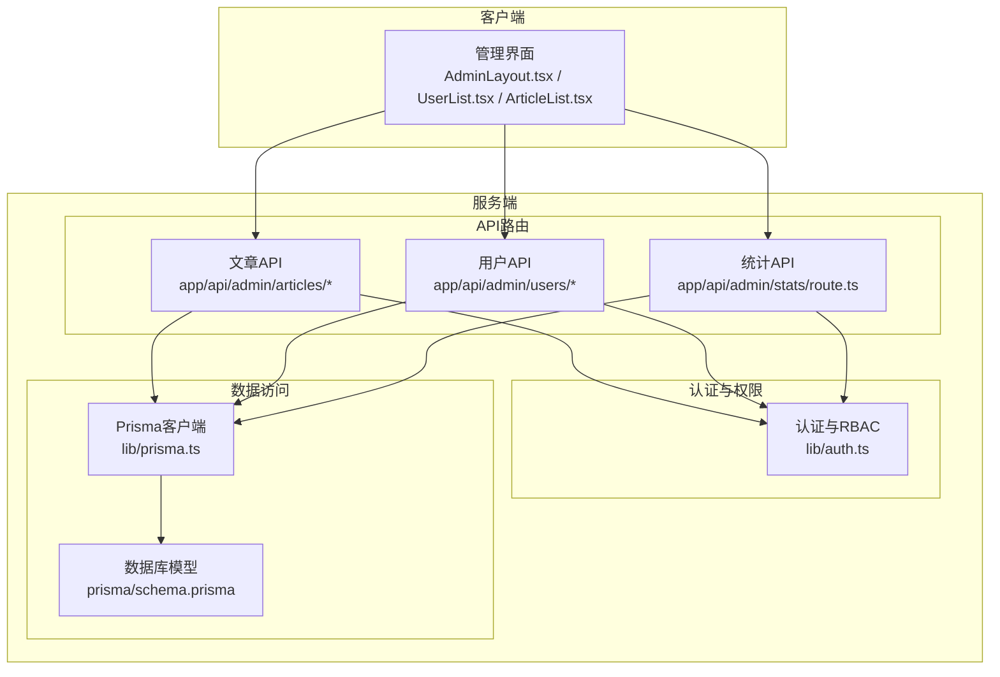
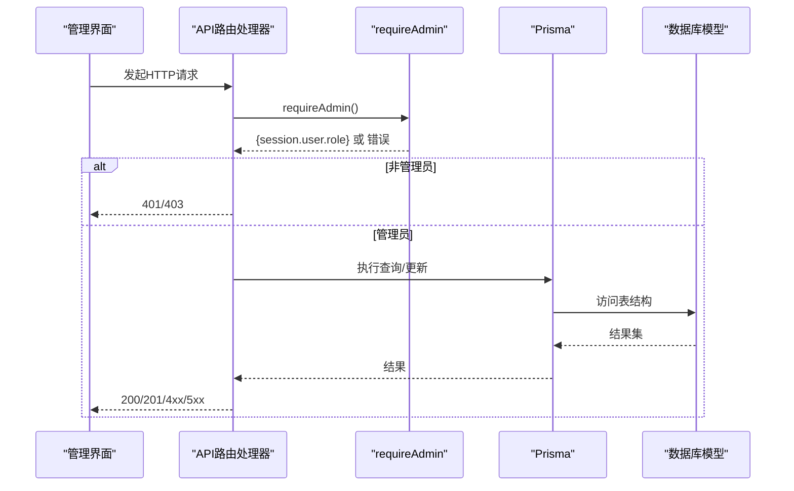
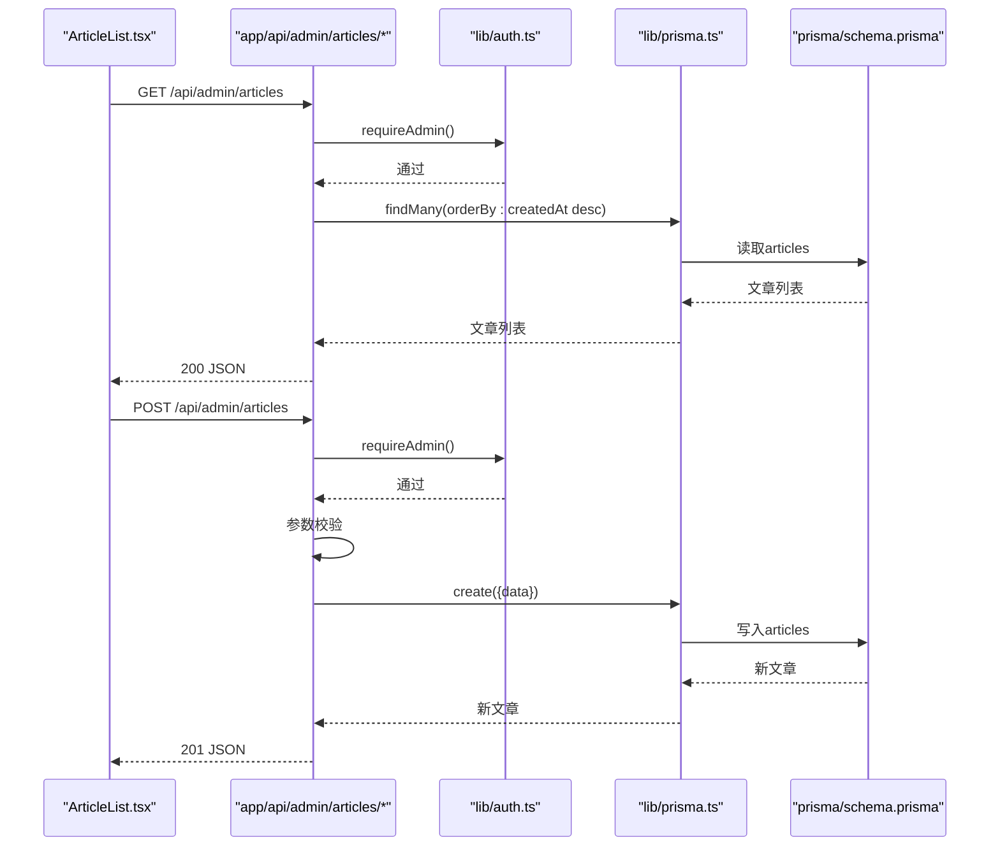
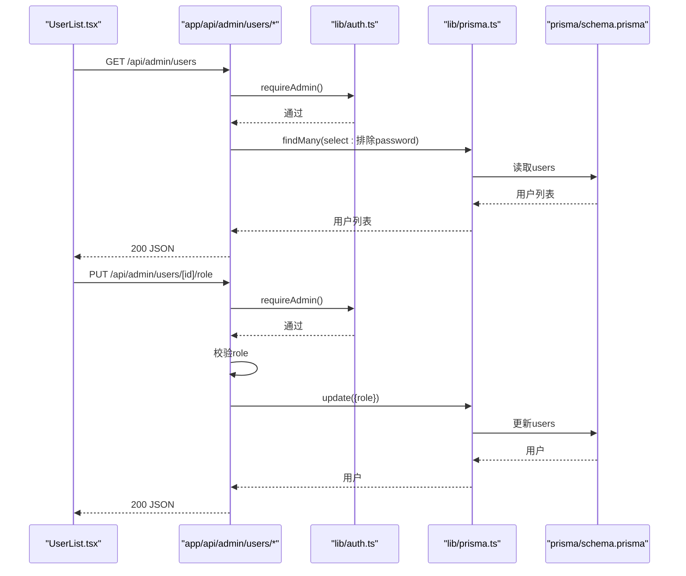
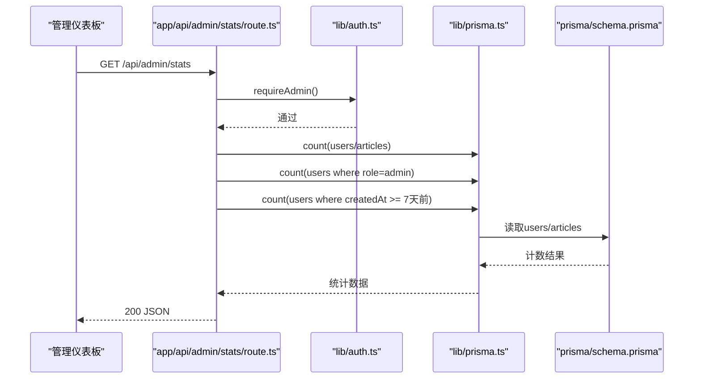
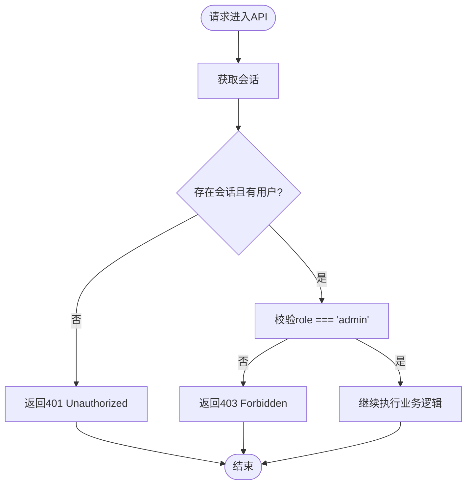
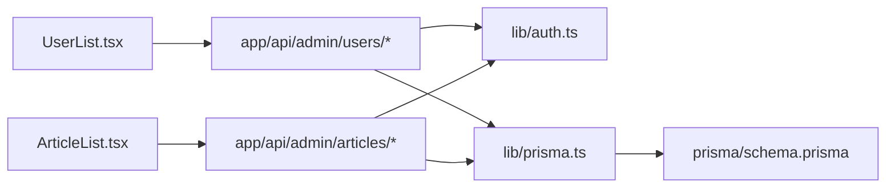

# 管理API

<cite>
**本文引用的文件**
- [app/api/admin/articles/route.ts](file://app/api/admin/articles/route.ts)
- [app/api/admin/articles/[id]/route.ts](file://app/api/admin/articles/[id]/route.ts)
- [app/api/admin/users/route.ts](file://app/api/admin/users/route.ts)
- [app/api/admin/users/[id]/route.ts](file://app/api/admin/users/[id]/route.ts)
- [app/api/admin/users/[id]/role/route.ts](file://app/api/admin/users/[id]/role/route.ts)
- [app/api/admin/stats/route.ts](file://app/api/admin/stats/route.ts)
- [lib/auth.ts](file://lib/auth.ts)
- [lib/prisma.ts](file://lib/prisma.ts)
- [types.ts](file://types.ts)
- [components/AdminLayout.tsx](file://components/AdminLayout.tsx)
- [components/UserList.tsx](file://components/UserList.tsx)
- [components/ArticleList.tsx](file://components/ArticleList.tsx)
- [app/admin/layout.tsx](file://app/admin/layout.tsx)
- [prisma/schema.prisma](file://prisma/schema.prisma)
</cite>

## 目录
1. [简介](#简介)
2. [项目结构](#项目结构)
3. [核心组件](#核心组件)
4. [架构总览](#架构总览)
5. [详细组件分析](#详细组件分析)
6. [依赖分析](#依赖分析)
7. [性能考虑](#性能考虑)
8. [故障排查指南](#故障排查指南)
9. [结论](#结论)
10. [附录](#附录)

## 简介
本文件面向管理后台API，系统性梳理管理员专用端点：文章管理（GET/POST /api/admin/articles；GET/PUT/DELETE /api/admin/articles/[id]）；用户管理（GET /api/admin/users；GET/PUT/DELETE /api/admin/users/[id]；PUT /api/admin/users/[id]/role）；系统统计（GET /api/admin/stats）。文档明确权限要求（仅管理员）、认证机制（会话Cookie + RBAC校验）、请求/响应模式、错误处理与安全策略，并给出与管理界面（AdminLayout、UserList、ArticleList等）的集成方式与调用示例路径。

## 项目结构
管理API位于Next.js App Router约定式路由目录下，采用“按功能分层”的组织方式：
- 路由处理器：app/api/admin/*/route.ts
- 认证与RBAC：lib/auth.ts
- 数据访问：lib/prisma.ts
- 类型定义：types.ts
- 管理界面：components/AdminLayout.tsx、components/UserList.tsx、components/ArticleList.tsx
- 管理布局包装：app/admin/layout.tsx
- 数据模型：prisma/schema.prisma

图表来源
- [lib/auth.ts](file://lib/auth.ts#L73-L101)
- [app/api/admin/articles/route.ts](file://app/api/admin/articles/route.ts#L1-L137)
- [app/api/admin/articles/[id]/route.ts](file://app/api/admin/articles/[id]/route.ts#L1-L205)
- [app/api/admin/users/route.ts](file://app/api/admin/users/route.ts#L1-L46)
- [app/api/admin/users/[id]/route.ts](file://app/api/admin/users/[id]/route.ts#L1-L117)
- [app/api/admin/users/[id]/role/route.ts](file://app/api/admin/users/[id]/role/route.ts#L1-L73)
- [app/api/admin/stats/route.ts](file://app/api/admin/stats/route.ts#L1-L59)
- [lib/prisma.ts](file://lib/prisma.ts#L1-L30)
- [prisma/schema.prisma](file://prisma/schema.prisma#L1-L81)

章节来源
- [app/api/admin/articles/route.ts](file://app/api/admin/articles/route.ts#L1-L137)
- [app/api/admin/articles/[id]/route.ts](file://app/api/admin/articles/[id]/route.ts#L1-L205)
- [app/api/admin/users/route.ts](file://app/api/admin/users/route.ts#L1-L46)
- [app/api/admin/users/[id]/route.ts](file://app/api/admin/users/[id]/route.ts#L1-L117)
- [app/api/admin/users/[id]/role/route.ts](file://app/api/admin/users/[id]/role/route.ts#L1-L73)
- [app/api/admin/stats/route.ts](file://app/api/admin/stats/route.ts#L1-L59)
- [lib/auth.ts](file://lib/auth.ts#L73-L101)
- [lib/prisma.ts](file://lib/prisma.ts#L1-L30)
- [prisma/schema.prisma](file://prisma/schema.prisma#L1-L81)

## 核心组件
- 认证与RBAC
  - 使用NextAuth.js进行会话管理，基于JWT令牌携带用户角色信息。
  - requireAdmin函数在服务器端验证会话存在且用户角色为admin，否则返回401/403。
- 数据访问
  - Prisma客户端封装数据库连接与健康检查，按需查询/更新用户与文章。
- 类型系统
  - Difficulty、UserRole、ContentBlock、Article、UserWithProgress、AdminStats等类型统一约束请求/响应结构。
- 管理界面
  - AdminLayout负责前端路由守卫（非管理员重定向首页），UserList与ArticleList通过fetch调用管理API实现CRUD。

章节来源
- [lib/auth.ts](file://lib/auth.ts#L73-L101)
- [lib/prisma.ts](file://lib/prisma.ts#L1-L30)
- [types.ts](file://types.ts#L1-L70)
- [components/AdminLayout.tsx](file://components/AdminLayout.tsx#L1-L105)
- [components/UserList.tsx](file://components/UserList.tsx#L1-L192)
- [components/ArticleList.tsx](file://components/ArticleList.tsx#L1-L186)

## 架构总览
管理API遵循“路由处理器 -> 权限校验 -> 数据访问 -> 响应”的标准流水线。所有管理端点均通过requireAdmin进行RBAC校验，确保仅管理员可访问。

图表来源
- [lib/auth.ts](file://lib/auth.ts#L73-L101)
- [app/api/admin/articles/route.ts](file://app/api/admin/articles/route.ts#L1-L137)
- [app/api/admin/articles/[id]/route.ts](file://app/api/admin/articles/[id]/route.ts#L1-L205)
- [app/api/admin/users/route.ts](file://app/api/admin/users/route.ts#L1-L46)
- [app/api/admin/users/[id]/route.ts](file://app/api/admin/users/[id]/route.ts#L1-L117)
- [app/api/admin/users/[id]/role/route.ts](file://app/api/admin/users/[id]/role/route.ts#L1-L73)
- [app/api/admin/stats/route.ts](file://app/api/admin/stats/route.ts#L1-L59)
- [lib/prisma.ts](file://lib/prisma.ts#L1-L30)
- [prisma/schema.prisma](file://prisma/schema.prisma#L1-L81)

## 详细组件分析

### 文章管理API
- 端点
  - GET /api/admin/articles：获取文章列表（按创建时间倒序）
  - POST /api/admin/articles：创建新文章
  - GET /api/admin/articles/[id]：获取单篇文章详情
  - PUT /api/admin/articles/[id]：更新文章（支持部分字段更新）
  - DELETE /api/admin/articles/[id]：删除文章
- 权限
  - 仅管理员可访问
- 请求/响应模式
  - GET /api/admin/articles
    - 成功：200，返回文章数组（按createdAt倒序）
    - 失败：500，返回错误对象
  - POST /api/admin/articles
    - 请求体字段：titleEn、titleZh、summaryEn、summaryZh、content（数组，元素含en、zh）、difficulty（Beginner/Intermediate/Advanced）、durationSeconds（正整数）、audioUrl（可选）、date（可选，默认当天）、id（可选）
    - 成功：201，返回新建文章对象
    - 校验失败：400，返回错误对象
    - 其他错误：500，返回错误对象
  - GET /api/admin/articles/[id]
    - 成功：200，返回文章对象
    - 文章不存在：404，返回错误对象
    - 其他错误：500，返回错误对象
  - PUT /api/admin/articles/[id]
    - 支持更新字段：titleEn、titleZh、summaryEn、summaryZh、date、audioUrl、difficulty（校验）、durationSeconds（校验）、content（校验）
    - 成功：200，返回更新后的文章对象
    - 校验失败：400，返回错误对象
    - 文章不存在：404，返回错误对象
    - 其他错误：500，返回错误对象
  - DELETE /api/admin/articles/[id]
    - 成功：200，返回成功消息与id
    - 文章不存在：404，返回错误对象
    - 其他错误：500，返回错误对象
- 安全与错误处理
  - requireAdmin统一校验，非管理员返回401/403
  - 业务参数校验失败返回400
  - 数据库异常统一返回500
- 与界面集成
  - ArticleList通过GET/DELETE调用列表与删除；新增/编辑页面通过POST/PUT调用创建与更新

图表来源
- [components/ArticleList.tsx](file://components/ArticleList.tsx#L1-L186)
- [app/api/admin/articles/route.ts](file://app/api/admin/articles/route.ts#L1-L137)
- [lib/auth.ts](file://lib/auth.ts#L73-L101)
- [lib/prisma.ts](file://lib/prisma.ts#L1-L30)
- [prisma/schema.prisma](file://prisma/schema.prisma#L65-L80)

章节来源
- [app/api/admin/articles/route.ts](file://app/api/admin/articles/route.ts#L1-L137)
- [app/api/admin/articles/[id]/route.ts](file://app/api/admin/articles/[id]/route.ts#L1-L205)
- [components/ArticleList.tsx](file://components/ArticleList.tsx#L1-L186)

### 用户管理API
- 端点
  - GET /api/admin/users：获取用户列表（排除password）
  - GET /api/admin/users/[id]：获取用户详情（含progress，排除password）
  - PUT /api/admin/users/[id]/role：更新用户角色（仅user/admin）
  - DELETE /api/admin/users/[id]：删除用户（禁止删除自己）
- 权限
  - 仅管理员可访问
- 请求/响应模式
  - GET /api/admin/users
    - 成功：200，返回用户数组（id、email、name、role、createdAt、updatedAt）
    - 失败：500，返回错误对象
  - GET /api/admin/users/[id]
    - 成功：200，返回用户对象（含progress）
    - 用户不存在：404，返回错误对象
    - 失败：500，返回错误对象
  - PUT /api/admin/users/[id]/role
    - 请求体：{ role: "user"|"admin" }
    - 成功：200，返回更新后的用户对象（排除password）
    - 角色非法：400，返回错误对象
    - 用户不存在：404，返回错误对象
    - 失败：500，返回错误对象
  - DELETE /api/admin/users/[id]
    - 成功：200，返回成功消息与id
    - 自己删除自己：400，返回错误对象
    - 用户不存在：404，返回错误对象
    - 失败：500，返回错误对象
- 安全与错误处理
  - requireAdmin统一校验
  - 业务参数校验失败返回400
  - 自身保护：禁止删除当前登录用户
  - 数据库异常统一返回500

图表来源
- [components/UserList.tsx](file://components/UserList.tsx#L1-L192)
- [app/api/admin/users/route.ts](file://app/api/admin/users/route.ts#L1-L46)
- [app/api/admin/users/[id]/route.ts](file://app/api/admin/users/[id]/route.ts#L1-L117)
- [app/api/admin/users/[id]/role/route.ts](file://app/api/admin/users/[id]/role/route.ts#L1-L73)
- [lib/auth.ts](file://lib/auth.ts#L73-L101)
- [lib/prisma.ts](file://lib/prisma.ts#L1-L30)
- [prisma/schema.prisma](file://prisma/schema.prisma#L12-L25)

章节来源
- [app/api/admin/users/route.ts](file://app/api/admin/users/route.ts#L1-L46)
- [app/api/admin/users/[id]/route.ts](file://app/api/admin/users/[id]/route.ts#L1-L117)
- [app/api/admin/users/[id]/role/route.ts](file://app/api/admin/users/[id]/role/route.ts#L1-L73)
- [components/UserList.tsx](file://components/UserList.tsx#L1-L192)

### 系统统计API
- 端点
  - GET /api/admin/stats：返回总用户数、总文章数、管理员数、最近7天注册用户数
- 权限
  - 仅管理员可访问
- 请求/响应模式
  - 成功：200，返回 { totalUsers, totalArticles, totalAdmins, recentUsers }
  - 失败：500，返回错误对象

图表来源
- [app/api/admin/stats/route.ts](file://app/api/admin/stats/route.ts#L1-L59)
- [lib/auth.ts](file://lib/auth.ts#L73-L101)
- [lib/prisma.ts](file://lib/prisma.ts#L1-L30)
- [prisma/schema.prisma](file://prisma/schema.prisma#L12-L25)

章节来源
- [app/api/admin/stats/route.ts](file://app/api/admin/stats/route.ts#L1-L59)

### 认证与权限校验流程
- 会话与RBAC
  - NextAuth.js提供会话管理，JWT令牌中包含用户id与role。
  - requireAdmin在服务器端获取会话，若role不为admin则返回403。
- 前端守卫
  - AdminLayout在客户端检测session.user.role，非admin则重定向首页。

图表来源
- [lib/auth.ts](file://lib/auth.ts#L73-L101)
- [components/AdminLayout.tsx](file://components/AdminLayout.tsx#L1-L105)

章节来源
- [lib/auth.ts](file://lib/auth.ts#L73-L101)
- [components/AdminLayout.tsx](file://components/AdminLayout.tsx#L1-L105)

## 依赖分析
- 组件耦合
  - API路由依赖requireAdmin与Prisma客户端
  - 管理界面依赖API路由，实现用户与文章的增删改查
- 外部依赖
  - NextAuth.js（会话与JWT）
  - Prisma（数据库访问）
  - Next.js App Router（路由约定）

图表来源
- [components/UserList.tsx](file://components/UserList.tsx#L1-L192)
- [components/ArticleList.tsx](file://components/ArticleList.tsx#L1-L186)
- [app/api/admin/users/route.ts](file://app/api/admin/users/route.ts#L1-L46)
- [app/api/admin/users/[id]/route.ts](file://app/api/admin/users/[id]/route.ts#L1-L117)
- [app/api/admin/users/[id]/role/route.ts](file://app/api/admin/users/[id]/role/route.ts#L1-L73)
- [app/api/admin/articles/route.ts](file://app/api/admin/articles/route.ts#L1-L137)
- [app/api/admin/articles/[id]/route.ts](file://app/api/admin/articles/[id]/route.ts#L1-L205)
- [lib/auth.ts](file://lib/auth.ts#L73-L101)
- [lib/prisma.ts](file://lib/prisma.ts#L1-L30)
- [prisma/schema.prisma](file://prisma/schema.prisma#L1-L81)

章节来源
- [components/UserList.tsx](file://components/UserList.tsx#L1-L192)
- [components/ArticleList.tsx](file://components/ArticleList.tsx#L1-L186)
- [lib/auth.ts](file://lib/auth.ts#L73-L101)
- [lib/prisma.ts](file://lib/prisma.ts#L1-L30)
- [prisma/schema.prisma](file://prisma/schema.prisma#L1-L81)

## 性能考虑
- 数据库查询
  - 文章列表按createdAt倒序，建议在articles表上建立索引以优化排序与分页。
  - 用户列表与详情查询已使用select排除敏感字段，避免不必要的网络传输。
- 连接管理
  - Prisma在开发环境定期检查连接健康，生产环境关闭日志以降低开销。
- 前端缓存
  - 管理界面可对列表数据进行本地缓存，减少重复请求。
- 并发控制
  - 对高并发写入场景（如批量删除/更新），建议引入幂等与重试策略。

## 故障排查指南
- 401 Unauthorized
  - 可能原因：未登录或会话丢失
  - 处理：重新登录，确认Cookie有效
- 403 Forbidden
  - 可能原因：当前用户非管理员
  - 处理：使用管理员账号登录
- 400 Bad Request
  - 可能原因：请求体字段缺失或格式不合法（如difficulty、durationSeconds、content结构）
  - 处理：根据错误提示补齐字段并修正格式
- 404 Not Found
  - 可能原因：文章/用户不存在
  - 处理：确认id正确
- 500 Internal Server Error
  - 可能原因：数据库异常或服务端异常
  - 处理：查看服务端日志，重试或稍后重试

章节来源
- [lib/auth.ts](file://lib/auth.ts#L73-L101)
- [app/api/admin/articles/route.ts](file://app/api/admin/articles/route.ts#L1-L137)
- [app/api/admin/articles/[id]/route.ts](file://app/api/admin/articles/[id]/route.ts#L1-L205)
- [app/api/admin/users/route.ts](file://app/api/admin/users/route.ts#L1-L46)
- [app/api/admin/users/[id]/route.ts](file://app/api/admin/users/[id]/route.ts#L1-L117)
- [app/api/admin/users/[id]/role/route.ts](file://app/api/admin/users/[id]/role/route.ts#L1-L73)
- [app/api/admin/stats/route.ts](file://app/api/admin/stats/route.ts#L1-L59)

## 结论
管理API通过严格的RBAC与参数校验保障安全性，结合Prisma的数据访问层实现高效稳定的管理能力。前端管理界面通过约定的REST风格端点完成文章与用户的全生命周期管理，并提供直观的统计视图。建议在生产环境中进一步完善索引、监控与告警，确保系统稳定运行。

## 附录
- 管理界面集成要点
  - AdminLayout负责前端路由守卫，确保只有管理员可见管理区域
  - UserList与ArticleList通过fetch调用管理API，实现列表展示、删除与角色变更
  - 管理布局包装app/admin/layout.tsx统一注入AdminLayout

章节来源
- [components/AdminLayout.tsx](file://components/AdminLayout.tsx#L1-L105)
- [components/UserList.tsx](file://components/UserList.tsx#L1-L192)
- [components/ArticleList.tsx](file://components/ArticleList.tsx#L1-L186)
- [app/admin/layout.tsx](file://app/admin/layout.tsx#L1-L10)