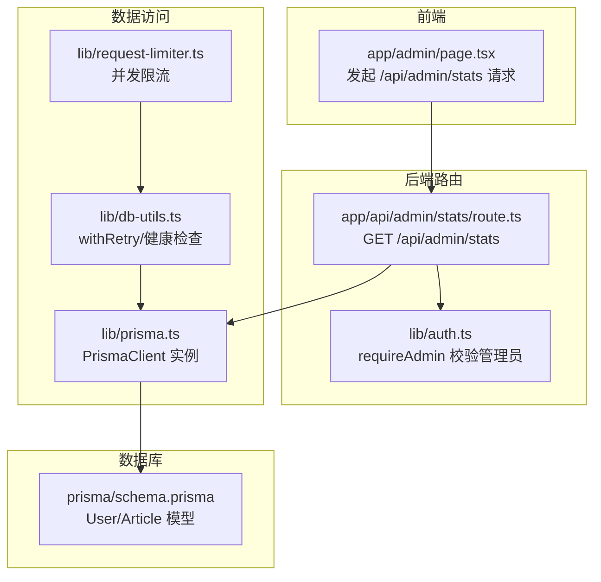
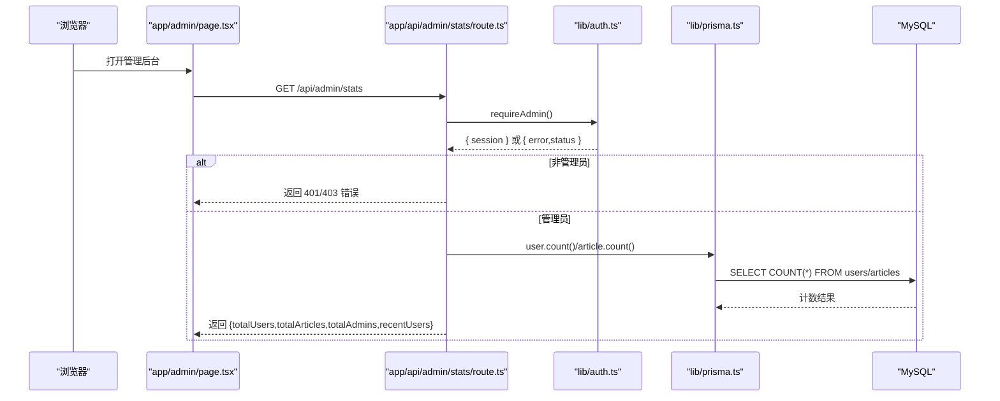
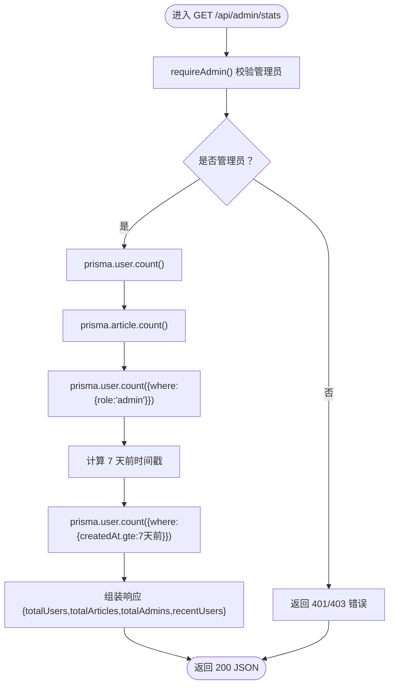
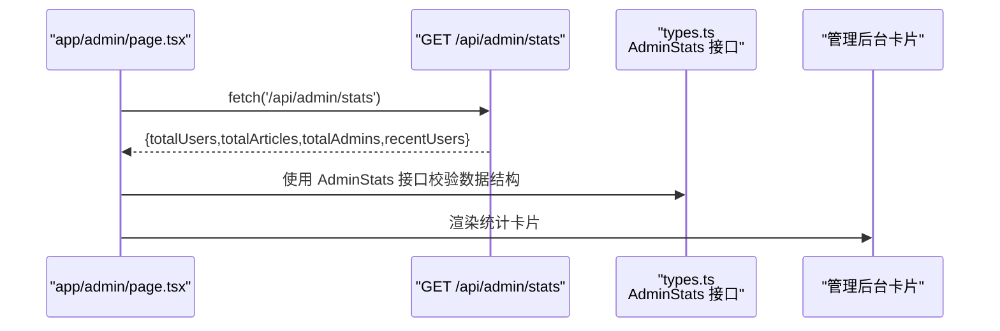
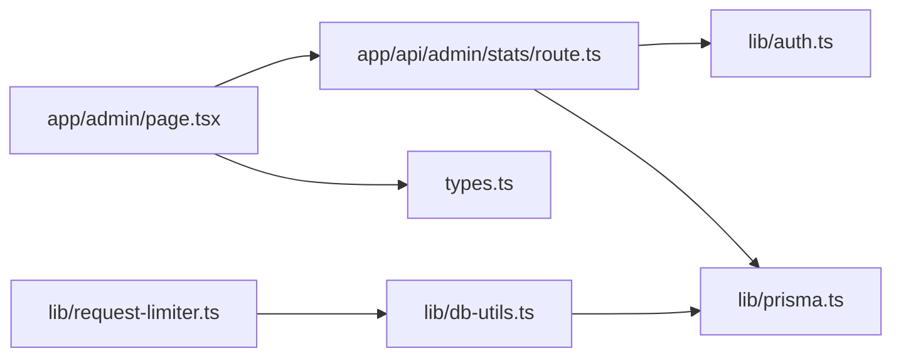

# 统计管理API

<cite>
**本文引用的文件**
- [app/api/admin/stats/route.ts](file://app/api/admin/stats/route.ts)
- [lib/auth.ts](file://lib/auth.ts)
- [lib/prisma.ts](file://lib/prisma.ts)
- [lib/db-utils.ts](file://lib/db-utils.ts)
- [lib/request-limiter.ts](file://lib/request-limiter.ts)
- [app/admin/page.tsx](file://app/admin/page.tsx)
- [types.ts](file://types.ts)
- [prisma/schema.prisma](file://prisma/schema.prisma)
- [app/api/health/route.ts](file://app/api/health/route.ts)
</cite>

## 目录
1. [简介](#简介)
2. [项目结构](#项目结构)
3. [核心组件](#核心组件)
4. [架构总览](#架构总览)
5. [详细组件分析](#详细组件分析)
6. [依赖分析](#依赖分析)
7. [性能考量](#性能考量)
8. [故障排查指南](#故障排查指南)
9. [结论](#结论)
10. [附录](#附录)

## 简介
本专项文档聚焦于管理后台统计API端点 GET /api/admin/stats 的实现与使用，详细说明其返回的四个核心指标：
- totalUsers：总用户数
- totalArticles：总文章数
- totalAdmins：管理员数量
- recentUsers：最近7天注册的用户数

文档将解释如何通过 Prisma count 操作结合时间范围过滤实现数据聚合，并阐述该接口在管理后台仪表板中的使用场景、与 AdminDashboard 组件的数据绑定关系，以及性能优化建议（如避免 N+1 查询）。同时提供响应示例与异常处理策略。

## 项目结构
围绕统计管理API的关键文件组织如下：
- 路由层：app/api/admin/stats/route.ts 提供 /api/admin/stats 接口
- 权限校验：lib/auth.ts 中 requireAdmin 校验管理员身份
- 数据访问：lib/prisma.ts 提供 PrismaClient 实例；lib/db-utils.ts 提供带重试与限流的数据库包装器
- 类型定义：types.ts 定义 AdminStats 接口；prisma/schema.prisma 描述 User/Article 模型
- 前端使用：app/admin/page.tsx 发起 /api/admin/stats 请求并在页面中渲染统计卡片

图表来源
- [app/admin/page.tsx](file://app/admin/page.tsx#L1-L155)
- [app/api/admin/stats/route.ts](file://app/api/admin/stats/route.ts#L1-L59)
- [lib/auth.ts](file://lib/auth.ts#L74-L101)
- [lib/prisma.ts](file://lib/prisma.ts#L1-L30)
- [lib/db-utils.ts](file://lib/db-utils.ts#L1-L60)
- [lib/request-limiter.ts](file://lib/request-limiter.ts#L1-L52)
- [prisma/schema.prisma](file://prisma/schema.prisma#L1-L81)

章节来源
- [app/admin/page.tsx](file://app/admin/page.tsx#L1-L155)
- [app/api/admin/stats/route.ts](file://app/api/admin/stats/route.ts#L1-L59)
- [lib/auth.ts](file://lib/auth.ts#L74-L101)
- [lib/prisma.ts](file://lib/prisma.ts#L1-L30)
- [lib/db-utils.ts](file://lib/db-utils.ts#L1-L60)
- [lib/request-limiter.ts](file://lib/request-limiter.ts#L1-L52)
- [prisma/schema.prisma](file://prisma/schema.prisma#L1-L81)

## 核心组件
- 管理员统计接口：负责鉴权、聚合统计与响应
- 权限校验：基于 JWT 的管理员角色校验
- 数据访问层：PrismaClient 实例化与健康检查
- 并发与重试：请求限流与数据库重试策略
- 前端仪表板：AdminDashboard 组件消费接口数据并展示

章节来源
- [app/api/admin/stats/route.ts](file://app/api/admin/stats/route.ts#L1-L59)
- [lib/auth.ts](file://lib/auth.ts#L74-L101)
- [lib/prisma.ts](file://lib/prisma.ts#L1-L30)
- [lib/db-utils.ts](file://lib/db-utils.ts#L1-L60)
- [lib/request-limiter.ts](file://lib/request-limiter.ts#L1-L52)
- [app/admin/page.tsx](file://app/admin/page.tsx#L1-L155)
- [types.ts](file://types.ts#L65-L70)
- [prisma/schema.prisma](file://prisma/schema.prisma#L1-L81)

## 架构总览
下图展示了从浏览器到数据库的完整调用链路，包括鉴权、统计聚合与响应返回。

图表来源
- [app/admin/page.tsx](file://app/admin/page.tsx#L1-L155)
- [app/api/admin/stats/route.ts](file://app/api/admin/stats/route.ts#L1-L59)
- [lib/auth.ts](file://lib/auth.ts#L74-L101)
- [lib/prisma.ts](file://lib/prisma.ts#L1-L30)

## 详细组件分析

### 管理员统计接口（GET /api/admin/stats）
- 功能概述
  - 鉴权：仅管理员可访问
  - 聚合统计：返回 totalUsers、totalArticles、totalAdmins、recentUsers
  - 时间范围：recentUsers 基于 createdAt >= 7天前
- 关键实现要点
  - 使用 Prisma 的 count 操作分别统计用户总数、文章总数与管理员数量
  - 使用 where 条件过滤管理员（role 字段）
  - 使用 createdAt 的 gte 条件过滤最近7天注册用户
  - 异常捕获：统一返回 500 与错误消息
- 性能与可靠性
  - 采用独立的 PrismaClient 实例，避免全局污染
  - 可选地引入 withRetry 与 RequestLimiter 以增强稳定性（见“性能考量”）

图表来源
- [app/api/admin/stats/route.ts](file://app/api/admin/stats/route.ts#L1-L59)
- [lib/auth.ts](file://lib/auth.ts#L74-L101)

章节来源
- [app/api/admin/stats/route.ts](file://app/api/admin/stats/route.ts#L1-L59)

### 权限校验（requireAdmin）
- 校验流程
  - 通过 getServerSession 获取当前会话
  - 校验是否存在 session.user 且 role 为 admin
  - 返回 { session,error,status } 结构
- 与接口集成
  - 在 /api/admin/stats 中先调用 requireAdmin，再执行统计逻辑

章节来源
- [lib/auth.ts](file://lib/auth.ts#L74-L101)

### 数据访问层（PrismaClient 与健康检查）
- PrismaClient 初始化
  - 开发环境仅记录错误日志，生产环境关闭日志
  - 进程退出前优雅断开连接
- 健康检查
  - 通过 $queryRaw`SELECT 1` 检测连接可用性
  - /api/health 提供统一健康检查端点

章节来源
- [lib/prisma.ts](file://lib/prisma.ts#L1-L30)
- [app/api/health/route.ts](file://app/api/health/route.ts#L1-L37)

### 并发与重试（withRetry 与 RequestLimiter）
- RequestLimiter
  - 控制最大并发请求数，避免数据库过载
  - 提供 acquire/release 与 execute 方法
- withRetry
  - 对连接类错误（如 P2024/P1001/P1017）进行指数退避重试
  - 与限流器组合使用，提升稳定性

章节来源
- [lib/request-limiter.ts](file://lib/request-limiter.ts#L1-L52)
- [lib/db-utils.ts](file://lib/db-utils.ts#L1-L60)

### 前端仪表板（AdminDashboard）与数据绑定
- 数据来源
  - AdminDashboard 在客户端发起 /api/admin/stats 请求
  - 将返回的 AdminStats 数据绑定到页面卡片组件
- 展示字段
  - 总用户数、总文章数、管理员数量、最近7天新用户
- 错误处理
  - 请求失败时显示错误提示，加载完成后渲染内容

图表来源
- [app/admin/page.tsx](file://app/admin/page.tsx#L1-L155)
- [types.ts](file://types.ts#L65-L70)

章节来源
- [app/admin/page.tsx](file://app/admin/page.tsx#L1-L155)
- [types.ts](file://types.ts#L65-L70)

### 数据模型与字段映射
- User 模型
  - id、email、role、createdAt、updatedAt
- Article 模型
  - id、date、titleEn/titleZh、summaryEn/summaryZh、content、difficulty、durationSeconds、audioUrl、createdAt、updatedAt
- AdminStats 接口
  - totalUsers、totalArticles、totalAdmins、recentUsers

章节来源
- [prisma/schema.prisma](file://prisma/schema.prisma#L1-L81)
- [types.ts](file://types.ts#L65-L70)

## 依赖分析
- 组件耦合
  - /api/admin/stats 依赖 requireAdmin 与 PrismaClient
  - AdminDashboard 依赖 AdminStats 接口与 /api/admin/stats
  - db-utils 与 request-limiter 为数据访问层提供稳定支撑
- 外部依赖
  - Prisma Client、NextAuth、React、Recharts（用于用户侧统计图表，非本接口直接依赖）

图表来源
- [app/api/admin/stats/route.ts](file://app/api/admin/stats/route.ts#L1-L59)
- [lib/auth.ts](file://lib/auth.ts#L74-L101)
- [lib/prisma.ts](file://lib/prisma.ts#L1-L30)
- [app/admin/page.tsx](file://app/admin/page.tsx#L1-L155)
- [types.ts](file://types.ts#L65-L70)
- [lib/db-utils.ts](file://lib/db-utils.ts#L1-L60)
- [lib/request-limiter.ts](file://lib/request-limiter.ts#L1-L52)

章节来源
- [app/api/admin/stats/route.ts](file://app/api/admin/stats/route.ts#L1-L59)
- [lib/auth.ts](file://lib/auth.ts#L74-L101)
- [lib/prisma.ts](file://lib/prisma.ts#L1-L30)
- [app/admin/page.tsx](file://app/admin/page.tsx#L1-L155)
- [types.ts](file://types.ts#L65-L70)
- [lib/db-utils.ts](file://lib/db-utils.ts#L1-L60)
- [lib/request-limiter.ts](file://lib/request-limiter.ts#L1-L52)

## 性能考量
- 避免 N+1 查询
  - 当前接口仅使用 count 操作，不存在 N+1 问题
  - 若后续扩展为聚合详情（如按难度/日期分组），应使用 Prisma 的 select/include/groupBy 等避免 N+1
- 并发控制
  - 使用 RequestLimiter 控制最大并发，降低数据库压力
  - withRetry 对连接类错误进行指数退避重试，提高成功率
- 数据库连接
  - 开发环境仅记录错误日志，减少 IO 开销
  - 进程退出前优雅断开连接，避免资源泄漏
- 健康检查
  - /api/health 可用于监控数据库可用性，便于快速定位问题

章节来源
- [lib/request-limiter.ts](file://lib/request-limiter.ts#L1-L52)
- [lib/db-utils.ts](file://lib/db-utils.ts#L1-L60)
- [lib/prisma.ts](file://lib/prisma.ts#L1-L30)
- [app/api/health/route.ts](file://app/api/health/route.ts#L1-L37)

## 故障排查指南
- 401/403 未授权
  - 检查会话是否有效、用户角色是否为 admin
  - 确认 NextAuth 配置与 JWT 回调正常
- 500 服务器错误
  - 查看服务端日志中的错误堆栈
  - 使用 /api/health 检查数据库连接状态
- 数据库连接问题
  - 观察 withRetry 是否触发重试
  - 检查 RequestLimiter 是否达到上限导致排队
- 响应格式不符
  - 确认 AdminStats 接口字段与前端绑定一致

章节来源
- [app/api/admin/stats/route.ts](file://app/api/admin/stats/route.ts#L1-L59)
- [lib/auth.ts](file://lib/auth.ts#L74-L101)
- [app/api/health/route.ts](file://app/api/health/route.ts#L1-L37)
- [lib/db-utils.ts](file://lib/db-utils.ts#L1-L60)
- [lib/request-limiter.ts](file://lib/request-limiter.ts#L1-L52)

## 结论
GET /api/admin/stats 通过 Prisma 的 count 操作与时间范围过滤，高效聚合了管理员仪表板所需的四项核心指标。配合 requireAdmin 鉴权、Prisma 连接管理与健康检查，以及可选的 withRetry 和 RequestLimiter，整体具备良好的稳定性与可维护性。前端 AdminDashboard 组件通过简单数据绑定即可完成展示，满足管理后台的实时监控需求。

## 附录

### 响应示例
- 成功响应（200 OK）
  - 结构：{ totalUsers: number, totalArticles: number, totalAdmins: number, recentUsers: number }
  - 示例值：{ totalUsers: 1234, totalArticles: 567, totalAdmins: 3, recentUsers: 12 }

章节来源
- [app/api/admin/stats/route.ts](file://app/api/admin/stats/route.ts#L1-L59)
- [types.ts](file://types.ts#L65-L70)

### 异常处理策略
- 未登录或非管理员：返回 401/403，并携带错误信息
- 数据库错误：捕获异常并返回 500，前端显示错误提示
- 健康检查：通过 /api/health 快速判断数据库可用性

章节来源
- [app/api/admin/stats/route.ts](file://app/api/admin/stats/route.ts#L1-L59)
- [lib/auth.ts](file://lib/auth.ts#L74-L101)
- [app/api/health/route.ts](file://app/api/health/route.ts#L1-L37)