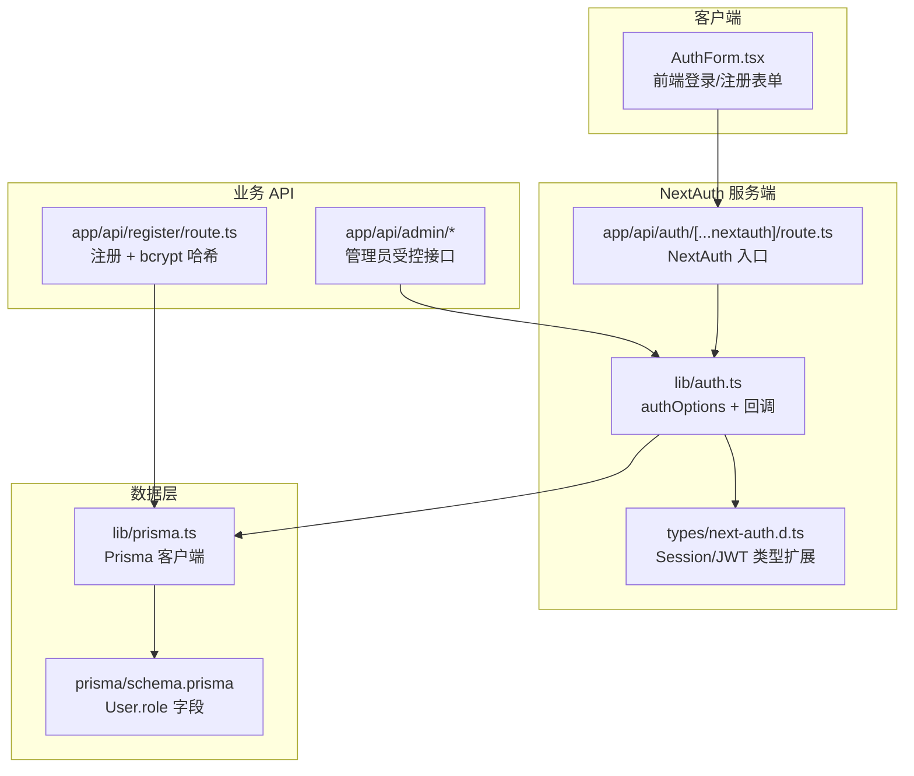
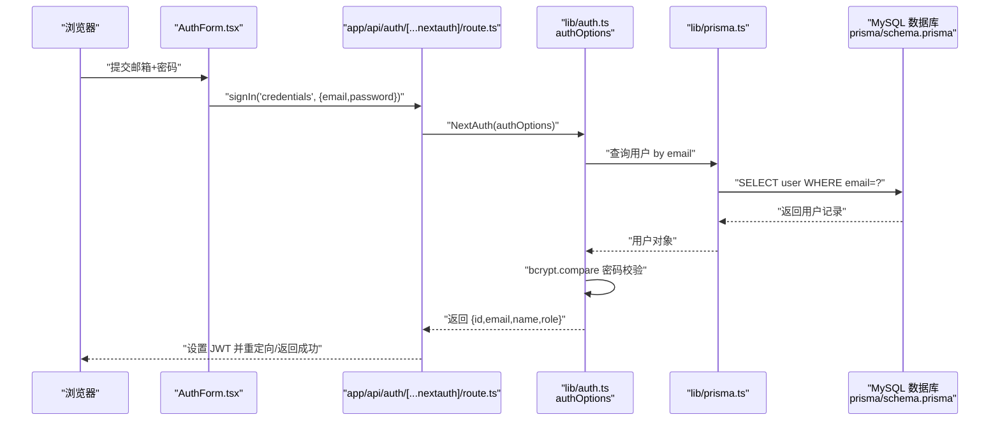
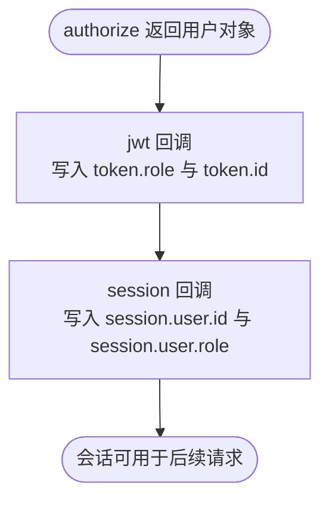
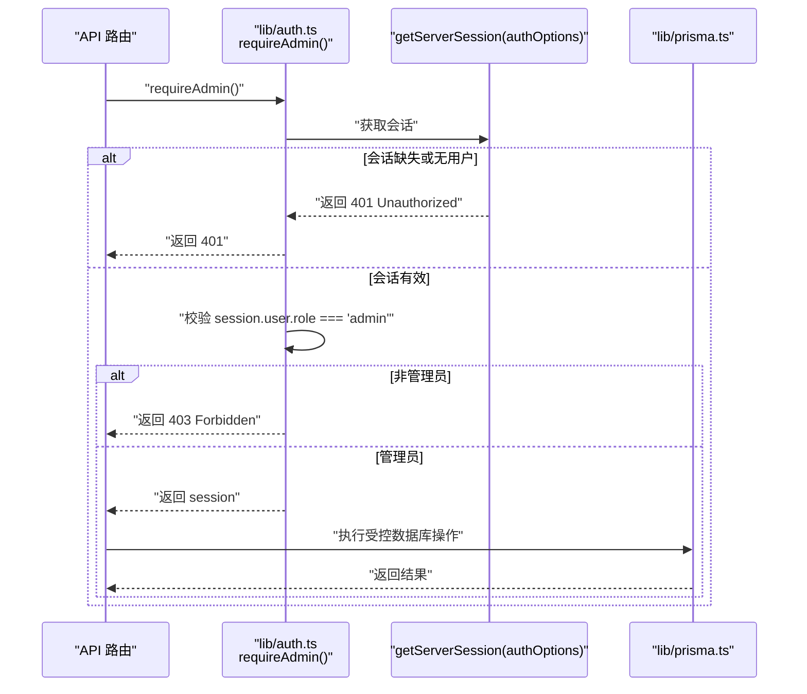
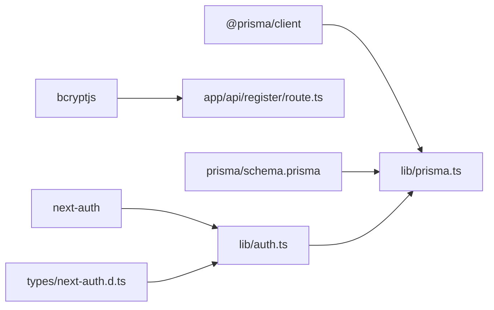

# 核心认证机制

<cite>
**本文引用的文件**
- [app/api/auth/[...nextauth]/route.ts](file://app/api/auth/[...nextauth]/route.ts)
- [lib/auth.ts](file://lib/auth.ts)
- [types/next-auth.d.ts](file://types/next-auth.d.ts)
- [components/AuthForm.tsx](file://components/AuthForm.tsx)
- [lib/prisma.ts](file://lib/prisma.ts)
- [prisma/schema.prisma](file://prisma/schema.prisma)
- [app/api/register/route.ts](file://app/api/register/route.ts)
- [app/api/admin/articles/route.ts](file://app/api/admin/articles/route.ts)
- [app/api/admin/users/route.ts](file://app/api/admin/users/route.ts)
- [app/api/admin/users/[id]/role/route.ts](file://app/api/admin/users/[id]/role/route.ts)
- [package.json](file://package.json)
</cite>

## 目录
1. [引言](#引言)
2. [项目结构](#项目结构)
3. [核心组件](#核心组件)
4. [架构总览](#架构总览)
5. [详细组件分析](#详细组件分析)
6. [依赖分析](#依赖分析)
7. [性能考虑](#性能考虑)
8. [故障排查指南](#故障排查指南)
9. [结论](#结论)
10. [附录](#附录)

## 引言
本文件系统性地文档化本项目的认证与授权机制，重点覆盖：
- NextAuth.js 在 app/api/auth/[...nextauth]/route.ts 中的集成方式
- 通过 lib/auth.ts 使用 CredentialsProvider 实现“邮箱+密码”的登录流程
- JWT 会话策略的工作原理，以及用户角色（role）如何通过 jwt 与 session 回调注入到会话中，实现跨请求的身份保持
- 服务端 getServerSession 的使用方法，并给出在 API 路由与服务端组件中的典型用法路径
- 登录流程的时序图
- 常见问题（会话失效、凭证错误等）的排查方法
- 密码哈希（bcrypt）与敏感信息保护的安全最佳实践

## 项目结构
认证相关的关键文件分布如下：
- NextAuth 入口路由：app/api/auth/[...nextauth]/route.ts
- 认证配置与回调：lib/auth.ts
- 类型扩展（Session/JWT）：types/next-auth.d.ts
- 前端登录表单：components/AuthForm.tsx
- 数据访问层：lib/prisma.ts
- 用户模型与角色字段：prisma/schema.prisma
- 注册流程（密码哈希）：app/api/register/route.ts
- 管理员受控 API 示例：app/api/admin/* 路由

图表来源
- [app/api/auth/[...nextauth]/route.ts](file://app/api/auth/[...nextauth]/route.ts#L1-L6)
- [lib/auth.ts](file://lib/auth.ts#L1-L101)
- [types/next-auth.d.ts](file://types/next-auth.d.ts#L1-L32)
- [lib/prisma.ts](file://lib/prisma.ts#L1-L30)
- [prisma/schema.prisma](file://prisma/schema.prisma#L1-L81)
- [app/api/register/route.ts](file://app/api/register/route.ts#L1-L57)
- [app/api/admin/articles/route.ts](file://app/api/admin/articles/route.ts#L1-L137)
- [app/api/admin/users/route.ts](file://app/api/admin/users/route.ts#L1-L46)
- [app/api/admin/users/[id]/role/route.ts](file://app/api/admin/users/[id]/role/route.ts#L1-L72)

章节来源
- [app/api/auth/[...nextauth]/route.ts](file://app/api/auth/[...nextauth]/route.ts#L1-L6)
- [lib/auth.ts](file://lib/auth.ts#L1-L101)
- [types/next-auth.d.ts](file://types/next-auth.d.ts#L1-L32)
- [lib/prisma.ts](file://lib/prisma.ts#L1-L30)
- [prisma/schema.prisma](file://prisma/schema.prisma#L1-L81)
- [app/api/register/route.ts](file://app/api/register/route.ts#L1-L57)
- [app/api/admin/articles/route.ts](file://app/api/admin/articles/route.ts#L1-L137)
- [app/api/admin/users/route.ts](file://app/api/admin/users/route.ts#L1-L46)
- [app/api/admin/users/[id]/role/route.ts](file://app/api/admin/users/[id]/role/route.ts#L1-L72)

## 核心组件
- NextAuth 入口路由：将请求交由 NextAuth 处理，统一暴露 GET/POST
- 认证配置与回调：定义 CredentialsProvider、JWT 会话策略、登录页、以及 jwt/session 回调，用于将用户角色注入到会话
- 类型扩展：为 Session 与 JWT 扩展 id 与 role 字段，确保类型安全
- 前端登录表单：使用 next-auth/react 的 signIn 发起“邮箱+密码”登录
- 数据访问层：Prisma 客户端封装，提供数据库连接与健康检查
- 用户模型：User 表包含 email、password、name、role 等字段
- 注册流程：使用 bcrypt 对密码进行哈希存储
- 管理员受控 API：通过 requireAdmin 辅助函数校验管理员权限

章节来源
- [app/api/auth/[...nextauth]/route.ts](file://app/api/auth/[...nextauth]/route.ts#L1-L6)
- [lib/auth.ts](file://lib/auth.ts#L1-L101)
- [types/next-auth.d.ts](file://types/next-auth.d.ts#L1-L32)
- [components/AuthForm.tsx](file://components/AuthForm.tsx#L1-L150)
- [lib/prisma.ts](file://lib/prisma.ts#L1-L30)
- [prisma/schema.prisma](file://prisma/schema.prisma#L1-L81)
- [app/api/register/route.ts](file://app/api/register/route.ts#L1-L57)

## 架构总览
下图展示了从浏览器发起登录请求到服务端完成认证、注入角色并返回会话的完整链路。

图表来源
- [components/AuthForm.tsx](file://components/AuthForm.tsx#L1-L150)
- [app/api/auth/[...nextauth]/route.ts](file://app/api/auth/[...nextauth]/route.ts#L1-L6)
- [lib/auth.ts](file://lib/auth.ts#L1-L101)
- [lib/prisma.ts](file://lib/prisma.ts#L1-L30)
- [prisma/schema.prisma](file://prisma/schema.prisma#L1-L81)

## 详细组件分析

### NextAuth.js 集成与入口路由
- 入口路由仅导出 NextAuth(authOptions)，并将 handler 同时作为 GET/POST 暴露，便于 NextAuth 内部处理 OAuth/CredentialsProvider 请求
- 该路由不直接处理业务逻辑，职责清晰，耦合度低

章节来源
- [app/api/auth/[...nextauth]/route.ts](file://app/api/auth/[...nextauth]/route.ts#L1-L6)

### CredentialsProvider 与登录流程
- 提供者名称与凭据字段：定义 email 与 password 字段
- 授权流程：
  - 校验凭据非空
  - 通过 Prisma 查询用户
  - 若用户存在，使用 bcrypt.compare 进行密码校验
  - 成功时返回包含 id、email、name、role 的用户对象
- 该流程确保只有正确的邮箱+密码组合才能获得会话主体

章节来源
- [lib/auth.ts](file://lib/auth.ts#L1-L101)
- [lib/prisma.ts](file://lib/prisma.ts#L1-L30)
- [prisma/schema.prisma](file://prisma/schema.prisma#L1-L81)

### JWT 会话策略与角色注入
- 会话策略：strategy 为 jwt
- jwt 回调：当 user 存在（首次登录）时，将 user.role 与 user.id 写入 token
- session 回调：将 token 中的 id 与 role 注入到 session.user，使前端与服务端均可读取
- 类型扩展：通过 types/next-auth.d.ts 为 Session 与 JWT 扩展 id 与 role 字段，避免类型错误

图表来源
- [lib/auth.ts](file://lib/auth.ts#L1-L101)
- [types/next-auth.d.ts](file://types/next-auth.d.ts#L1-L32)

章节来源
- [lib/auth.ts](file://lib/auth.ts#L1-L101)
- [types/next-auth.d.ts](file://types/next-auth.d.ts#L1-L32)

### 前端登录表单与交互
- 使用 next-auth/react 的 signIn('credentials', ...) 触发登录
- 登录失败时前端显示“邮箱或密码错误”
- 登录成功后页面会因会话变化而刷新/重定向

章节来源
- [components/AuthForm.tsx](file://components/AuthForm.tsx#L1-L150)

### 服务端 getServerSession 使用
- 在服务端组件或 API 路由中，可通过 getServerSession(authOptions) 获取当前会话
- 结合 requireAdmin 辅助函数可快速校验管理员权限
- 管理员受控 API 示例：
  - app/api/admin/articles/route.ts：GET/POST/PUT/DELETE 文章管理
  - app/api/admin/users/route.ts：获取用户列表
  - app/api/admin/users/[id]/role/route.ts：更新用户角色

图表来源
- [lib/auth.ts](file://lib/auth.ts#L73-L101)
- [app/api/admin/articles/route.ts](file://app/api/admin/articles/route.ts#L1-L137)
- [app/api/admin/users/route.ts](file://app/api/admin/users/route.ts#L1-L46)
- [app/api/admin/users/[id]/role/route.ts](file://app/api/admin/users/[id]/role/route.ts#L1-L72)

章节来源
- [lib/auth.ts](file://lib/auth.ts#L73-L101)
- [app/api/admin/articles/route.ts](file://app/api/admin/articles/route.ts#L1-L137)
- [app/api/admin/users/route.ts](file://app/api/admin/users/route.ts#L1-L46)
- [app/api/admin/users/[id]/role/route.ts](file://app/api/admin/users/[id]/role/route.ts#L1-L72)

### 密码哈希与敏感信息保护
- 注册流程使用 bcrypt 对明文密码进行哈希存储
- 数据库 schema 中 User.password 保存为哈希值，避免明文泄露
- 前端仅传输邮箱与密码，服务端负责哈希与校验

章节来源
- [app/api/register/route.ts](file://app/api/register/route.ts#L1-L57)
- [prisma/schema.prisma](file://prisma/schema.prisma#L1-L81)
- [package.json](file://package.json#L1-L41)

## 依赖分析
- NextAuth 依赖：next-auth@^4.24.6
- bcrypt 依赖：bcryptjs@^2.4.3
- Prisma 依赖：@prisma/client 与 prisma 工具链
- 类型扩展：通过 types/next-auth.d.ts 为 Session/JWT 增加 id 与 role 字段

图表来源
- [package.json](file://package.json#L1-L41)
- [lib/auth.ts](file://lib/auth.ts#L1-L101)
- [app/api/register/route.ts](file://app/api/register/route.ts#L1-L57)
- [lib/prisma.ts](file://lib/prisma.ts#L1-L30)
- [prisma/schema.prisma](file://prisma/schema.prisma#L1-L81)
- [types/next-auth.d.ts](file://types/next-auth.d.ts#L1-L32)

章节来源
- [package.json](file://package.json#L1-L41)
- [lib/auth.ts](file://lib/auth.ts#L1-L101)
- [app/api/register/route.ts](file://app/api/register/route.ts#L1-L57)
- [lib/prisma.ts](file://lib/prisma.ts#L1-L30)
- [prisma/schema.prisma](file://prisma/schema.prisma#L1-L81)
- [types/next-auth.d.ts](file://types/next-auth.d.ts#L1-L32)

## 性能考虑
- JWT 会话策略减少每次请求对数据库的依赖，提升性能
- bcrypt 密码校验在服务端进行，建议合理设置哈希成本参数以平衡安全性与性能
- Prisma 连接在开发环境定期健康检查，生产环境关闭日志，降低开销
- 管理员受控 API 在进入业务逻辑前先做权限校验，避免无效数据库访问

[本节为通用指导，无需列出具体文件来源]

## 故障排查指南
- 会话失效
  - 现象：页面刷新后未登录
  - 排查：确认浏览器 Cookie 是否被清除；检查 NextAuth 的 JWT 是否过期；确认服务端 getServerSession 能否正确读取会话
  - 参考路径：[lib/auth.ts](file://lib/auth.ts#L46-L71)、[app/api/auth/[...nextauth]/route.ts](file://app/api/auth/[...nextauth]/route.ts#L1-L6)
- 凭证错误（邮箱或密码错误）
  - 现象：前端提示“邮箱或密码错误”
  - 排查：确认 CredentialsProvider 的 authorize 流程是否返回 null；检查 bcrypt.compare 是否失败；核对数据库中用户是否存在且密码哈希正确
  - 参考路径：[components/AuthForm.tsx](file://components/AuthForm.tsx#L1-L150)、[lib/auth.ts](file://lib/auth.ts#L1-L101)、[app/api/register/route.ts](file://app/api/register/route.ts#L1-L57)
- 管理员权限拒绝
  - 现象：访问 /api/admin/* 返回 403
  - 排查：确认 getServerSession 返回的 session.user.role 是否为 admin；检查 requireAdmin 的校验逻辑
  - 参考路径：[lib/auth.ts](file://lib/auth.ts#L73-L101)、[app/api/admin/* 路由](file://app/api/admin/articles/route.ts#L1-L137)
- 数据库连接问题
  - 现象：健康检查失败或 API 报错
  - 排查：查看 Prisma 连接日志与健康检查输出；确认 DATABASE_URL 配置正确
  - 参考路径：[lib/prisma.ts](file://lib/prisma.ts#L1-L30)

章节来源
- [lib/auth.ts](file://lib/auth.ts#L1-L101)
- [app/api/auth/[...nextauth]/route.ts](file://app/api/auth/[...nextauth]/route.ts#L1-L6)
- [components/AuthForm.tsx](file://components/AuthForm.tsx#L1-L150)
- [app/api/register/route.ts](file://app/api/register/route.ts#L1-L57)
- [app/api/admin/articles/route.ts](file://app/api/admin/articles/route.ts#L1-L137)
- [lib/prisma.ts](file://lib/prisma.ts#L1-L30)

## 结论
本项目采用 NextAuth.js + JWT 会话策略，结合 CredentialsProvider 实现“邮箱+密码”的登录流程，并通过 jwt/session 回调将用户角色注入到会话中，从而在服务端与前端均能稳定识别用户身份与权限。配合 getServerSession 与 requireAdmin 辅助函数，实现了管理员受控 API 的统一鉴权入口。注册流程使用 bcrypt 对密码进行安全存储，整体认证体系具备良好的安全性与可维护性。

[本节为总结，无需列出具体文件来源]

## 附录
- 服务端组件中使用 getServerSession 的参考路径：
  - [lib/auth.ts](file://lib/auth.ts#L73-L101)
- API 路由中使用 requireAdmin 的参考路径：
  - [app/api/admin/articles/route.ts](file://app/api/admin/articles/route.ts#L1-L137)
  - [app/api/admin/users/route.ts](file://app/api/admin/users/route.ts#L1-L46)
  - [app/api/admin/users/[id]/role/route.ts](file://app/api/admin/users/[id]/role/route.ts#L1-L72)

[本节为补充说明，无需列出具体文件来源]