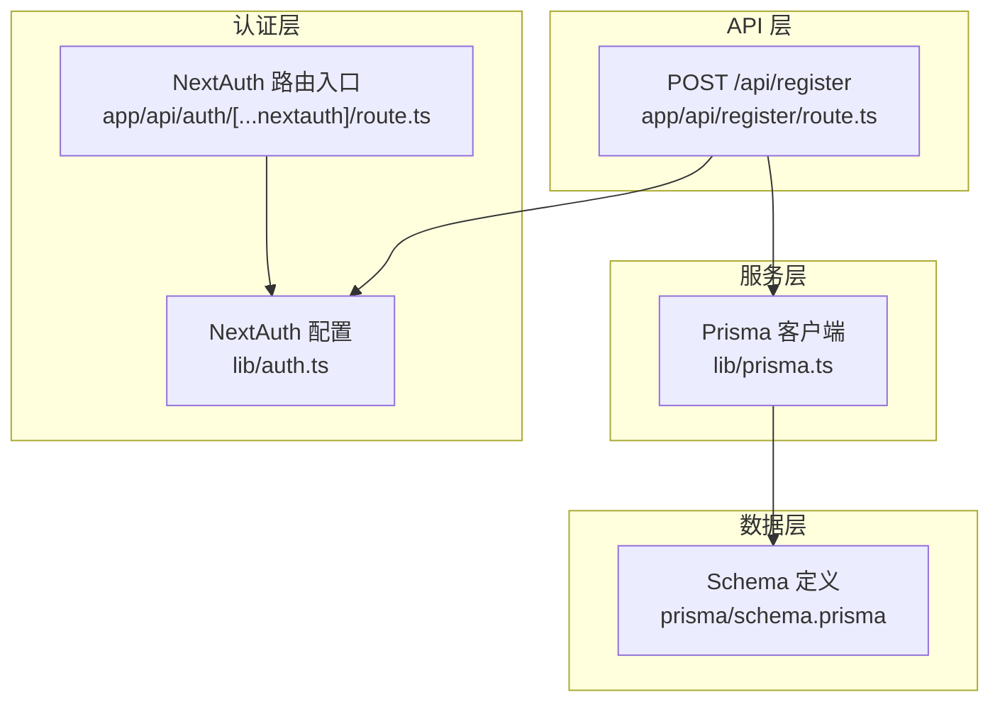
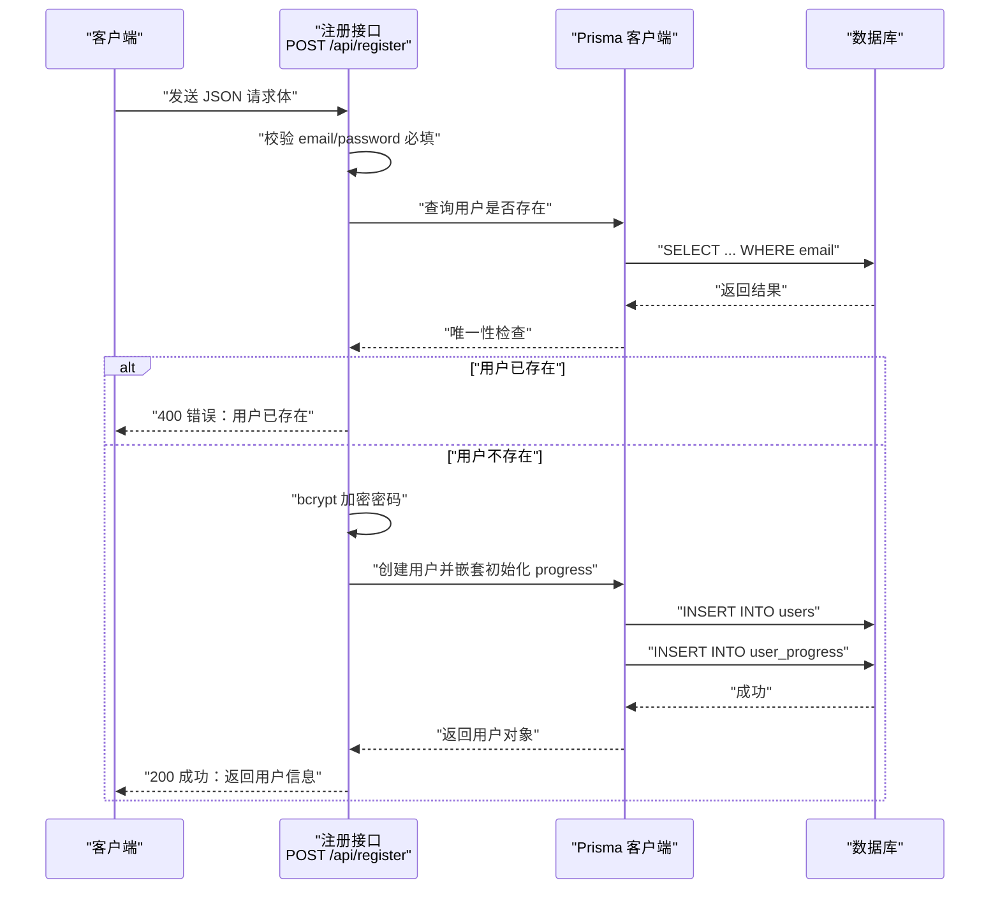
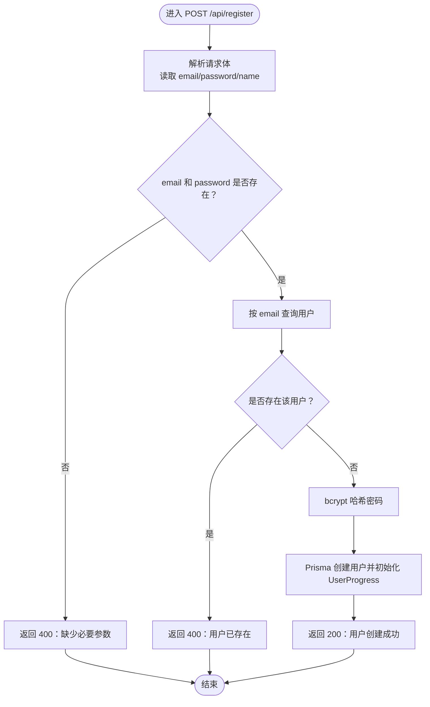
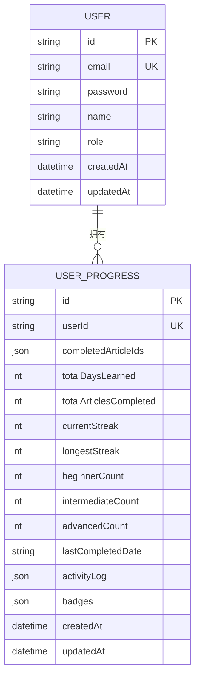
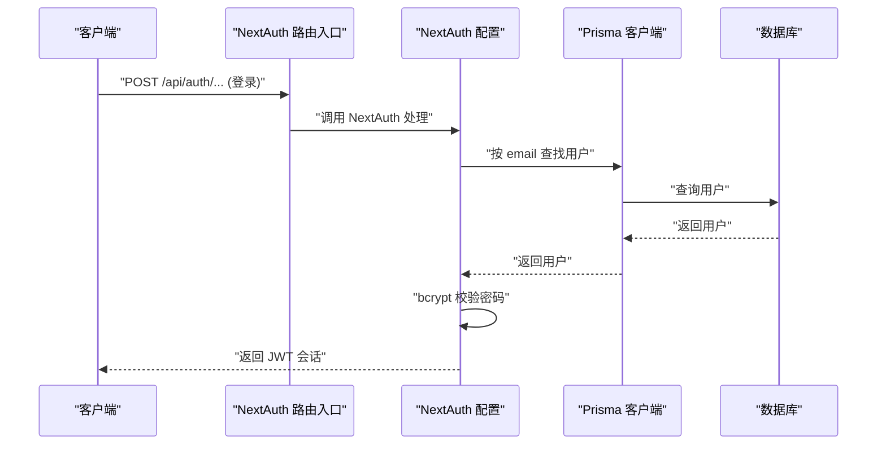
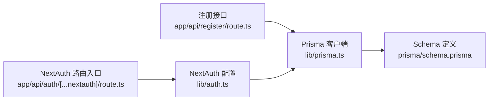

# 用户注册流程

<cite>
**本文引用的文件**
- [app/api/register/route.ts](file://app/api/register/route.ts)
- [lib/prisma.ts](file://lib/prisma.ts)
- [prisma/schema.prisma](file://prisma/schema.prisma)
- [lib/auth.ts](file://lib/auth.ts)
- [app/api/auth/[...nextauth]/route.ts](file://app/api/auth/[...nextauth]/route.ts)
</cite>

## 目录
1. [简介](#简介)
2. [项目结构](#项目结构)
3. [核心组件](#核心组件)
4. [架构总览](#架构总览)
5. [详细组件分析](#详细组件分析)
6. [依赖分析](#依赖分析)
7. [性能考虑](#性能考虑)
8. [故障排查指南](#故障排查指南)
9. [结论](#结论)
10. [附录](#附录)

## 简介
本文件系统化梳理“用户注册”功能的实现细节，聚焦于 POST /api/register 接口的请求处理流程：输入校验（邮箱与密码必填）、用户唯一性检查、bcrypt 密码加密、通过 Prisma 创建用户并初始化学习进度（UserProgress）的事务性操作。文档还说明新用户默认字段生成规则（如用户名取邮箱前缀），并展示 prisma.create 调用中嵌套的 progress 初始化结构。最后给出请求/响应示例、常见错误码及触发条件，并对注册后不自动登录的设计决策进行说明，同时提出未来可扩展方向（邮箱验证、第三方登录）。

## 项目结构
围绕注册流程的关键文件组织如下：
- 注册接口：app/api/register/route.ts
- 数据库客户端：lib/prisma.ts
- 数据模型定义：prisma/schema.prisma
- 登录认证（NextAuth）：lib/auth.ts、app/api/auth/[...nextauth]/route.ts

图表来源
- [app/api/register/route.ts](file://app/api/register/route.ts#L1-L57)
- [lib/prisma.ts](file://lib/prisma.ts#L1-L30)
- [prisma/schema.prisma](file://prisma/schema.prisma#L1-L81)
- [lib/auth.ts](file://lib/auth.ts#L1-L101)
- [app/api/auth/[...nextauth]/route.ts](file://app/api/auth/[...nextauth]/route.ts#L1-L6)

章节来源
- [app/api/register/route.ts](file://app/api/register/route.ts#L1-L57)
- [lib/prisma.ts](file://lib/prisma.ts#L1-L30)
- [prisma/schema.prisma](file://prisma/schema.prisma#L1-L81)
- [lib/auth.ts](file://lib/auth.ts#L1-L101)
- [app/api/auth/[...nextauth]/route.ts](file://app/api/auth/[...nextauth]/route.ts#L1-L6)

## 核心组件
- 注册接口处理器：负责解析请求体、执行输入校验、唯一性检查、密码加密与用户创建、初始化 UserProgress。
- Prisma 客户端：统一管理数据库连接、日志策略与健康检查。
- 数据模型：User 与 UserProgress 的一对一关系，以及默认字段与 JSON 字段约定。
- 认证体系：NextAuth 提供基于 JWT 的会话机制，支持后续登录流程。

章节来源
- [app/api/register/route.ts](file://app/api/register/route.ts#L1-L57)
- [lib/prisma.ts](file://lib/prisma.ts#L1-L30)
- [prisma/schema.prisma](file://prisma/schema.prisma#L1-L81)
- [lib/auth.ts](file://lib/auth.ts#L1-L101)

## 架构总览
下图展示了从客户端发起注册请求到数据库写入与初始化 UserProgress 的完整链路。

图表来源
- [app/api/register/route.ts](file://app/api/register/route.ts#L1-L57)
- [lib/prisma.ts](file://lib/prisma.ts#L1-L30)
- [prisma/schema.prisma](file://prisma/schema.prisma#L1-L81)

## 详细组件分析

### 注册接口 POST /api/register
- 输入校验
  - 必填字段：email、password；缺失任一均返回 400。
- 唯一性检查
  - 使用 email 查询用户，若存在则返回 400。
- 密码加密
  - 使用 bcrypt 对明文密码进行哈希（轮数为 10）。
- 用户创建与进度初始化
  - 通过 Prisma 的 create 写入 User；
  - 在同一事务中嵌套 create UserProgress，初始化空数组与空对象等字段。
  - 默认字段规则：
    - name：若请求未提供 name，则使用 email 前缀作为默认值。
    - role：默认为 "user"。
    - progress：初始化字段包括 completedArticleIds、activityLog、badges 等。
- 响应
  - 成功返回包含 id 与 email 的用户信息。
  - 异常返回 500。

图表来源
- [app/api/register/route.ts](file://app/api/register/route.ts#L1-L57)
- [prisma/schema.prisma](file://prisma/schema.prisma#L1-L81)

章节来源
- [app/api/register/route.ts](file://app/api/register/route.ts#L1-L57)

### Prisma 客户端与模型
- Prisma 客户端
  - 单例模式，开发环境仅记录错误日志，生产环境关闭日志；
  - 进程退出前优雅断开连接；
  - 开发环境下定时检查连接健康。
- 数据模型
  - User：主键 id（cuid）、唯一 email、password、可选 name、默认 role="user"、时间戳；
  - UserProgress：一对一关联 User，包含 completedArticleIds、activityLog、badges 等 JSON 字段，默认值为“空数组/空对象”，以及学习统计字段（天数、文章数、当前/最长连击、难度计数、最后完成日期、活动日志、徽章）。

图表来源
- [prisma/schema.prisma](file://prisma/schema.prisma#L1-L81)

章节来源
- [lib/prisma.ts](file://lib/prisma.ts#L1-L30)
- [prisma/schema.prisma](file://prisma/schema.prisma#L1-L81)

### 认证与会话（NextAuth）
- NextAuth 使用 Credentials Provider，基于 email/password 进行校验；
- bcrypt.compare 验证密码；
- 会话策略为 JWT，回调中注入用户角色与 id；
- 登录路由入口统一暴露 GET/POST。

图表来源
- [lib/auth.ts](file://lib/auth.ts#L1-L101)
- [app/api/auth/[...nextauth]/route.ts](file://app/api/auth/[...nextauth]/route.ts#L1-L6)
- [lib/prisma.ts](file://lib/prisma.ts#L1-L30)

章节来源
- [lib/auth.ts](file://lib/auth.ts#L1-L101)
- [app/api/auth/[...nextauth]/route.ts](file://app/api/auth/[...nextauth]/route.ts#L1-L6)
- [lib/prisma.ts](file://lib/prisma.ts#L1-L30)

## 依赖分析
- 注册接口依赖 Prisma 客户端进行数据库访问；
- Prisma 客户端依赖数据库驱动与连接配置；
- 认证模块依赖 Prisma 客户端与 bcrypt；
- 注册接口与认证模块之间无直接耦合，遵循职责分离。

图表来源
- [app/api/register/route.ts](file://app/api/register/route.ts#L1-L57)
- [lib/prisma.ts](file://lib/prisma.ts#L1-L30)
- [prisma/schema.prisma](file://prisma/schema.prisma#L1-L81)
- [lib/auth.ts](file://lib/auth.ts#L1-L101)
- [app/api/auth/[...nextauth]/route.ts](file://app/api/auth/[...nextauth]/route.ts#L1-L6)

章节来源
- [app/api/register/route.ts](file://app/api/register/route.ts#L1-L57)
- [lib/prisma.ts](file://lib/prisma.ts#L1-L30)
- [prisma/schema.prisma](file://prisma/schema.prisma#L1-L81)
- [lib/auth.ts](file://lib/auth.ts#L1-L101)
- [app/api/auth/[...nextauth]/route.ts](file://app/api/auth/[...nextauth]/route.ts#L1-L6)

## 性能考虑
- bcrypt 加密成本较高，建议在高并发场景下：
  - 合理设置轮数（当前为 10），避免过高的 CPU 开销；
  - 使用连接池与限流策略，防止瞬时峰值导致延迟上升；
  - 将注册与登录分离，避免相互影响。
- Prisma 客户端在开发环境有连接健康检查，生产环境关闭日志以降低开销；
- 唯一性检查使用 email 唯一索引，查询复杂度 O(log N)，建议保持索引有效。

[本节为通用指导，无需引用具体文件]

## 故障排查指南
- 常见错误码与触发条件
  - 400 缺少必要参数：请求体未包含 email 或 password。
  - 400 用户已存在：email 已被占用。
  - 500 服务器内部错误：数据库写入异常、网络波动、Prisma 客户端异常等。
- 建议排查步骤
  - 检查请求体 JSON 结构与字段命名；
  - 确认数据库连接可用且 Prisma 客户端未断开；
  - 查看服务端日志中的错误堆栈；
  - 验证 bcrypt 加密是否正常执行；
  - 若出现数据库异常，优先确认唯一约束与外键关系。

章节来源
- [app/api/register/route.ts](file://app/api/register/route.ts#L1-L57)
- [lib/prisma.ts](file://lib/prisma.ts#L1-L30)

## 结论
POST /api/register 实现了完整的用户注册闭环：严格的输入校验、唯一性检查、安全的密码加密、以及与 UserProgress 的一体化初始化。默认字段生成规则清晰，便于快速上线。注册后不自动登录符合安全最佳实践，后续可通过 NextAuth 的登录流程实现无缝会话衔接。建议在未来增加邮箱验证与第三方登录能力，进一步提升安全性与用户体验。

[本节为总结性内容，无需引用具体文件]

## 附录

### 请求/响应示例
- 请求示例（JSON）
  - POST /api/register
  - Content-Type: application/json
  - 示例：
    - {
        "email": "user@example.com",
        "password": "yourSecurePassword",
        "name": "Alice"
      }
    - 或省略 name，系统将以邮箱前缀作为默认名称
- 成功响应示例（JSON）
  - 200 OK
  - 示例：
    - {
        "message": "用户创建成功",
        "user": {
          "id": "CUID",
          "email": "user@example.com"
        }
      }
- 错误响应示例（JSON）
  - 400 Bad Request（缺少参数）
    - {
        "error": "缺少 email 或 password"
      }
  - 400 Bad Request（用户已存在）
    - {
        "error": "用户已存在"
      }
  - 500 Internal Server Error（服务器异常）
    - {
        "error": "内部服务器错误"
      }

章节来源
- [app/api/register/route.ts](file://app/api/register/route.ts#L1-L57)

### 设计决策说明
- 注册后不自动登录
  - 优点：降低会话泄露风险，避免一次性凭据滥用；
  - 后续：通过 NextAuth 登录接口完成会话建立，确保安全可控。
- 默认字段生成
  - name 为空时采用 email 前缀，简化首登体验；
  - role 默认为 "user"，保证最小权限原则。

章节来源
- [app/api/register/route.ts](file://app/api/register/route.ts#L1-L57)
- [prisma/schema.prisma](file://prisma/schema.prisma#L1-L81)

### 可扩展建议
- 邮箱验证
  - 发送验证邮件，设置过期时间与重发机制；
  - 验证通过后再开放登录权限。
- 第三方登录
  - 基于 NextAuth 扩展 OAuth 提供商，复用现有会话体系；
  - 支持手机号/邮箱多账号绑定与解绑。

[本节为概念性建议，无需引用具体文件]