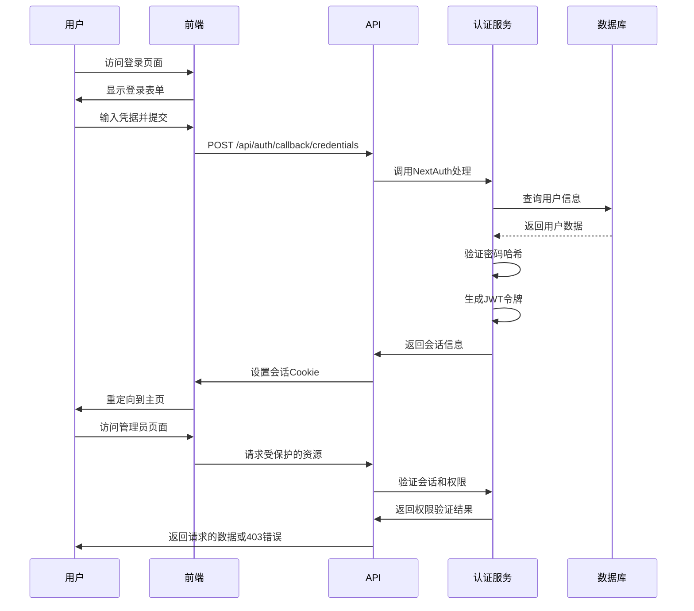
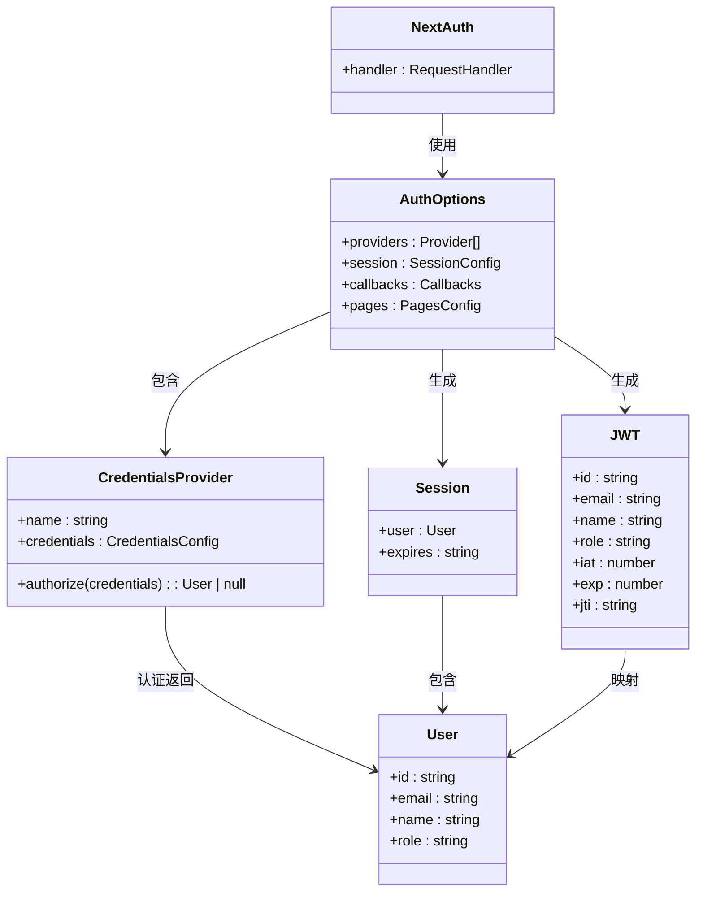
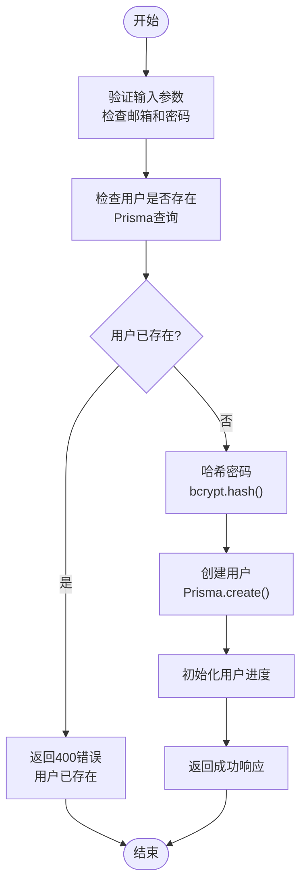
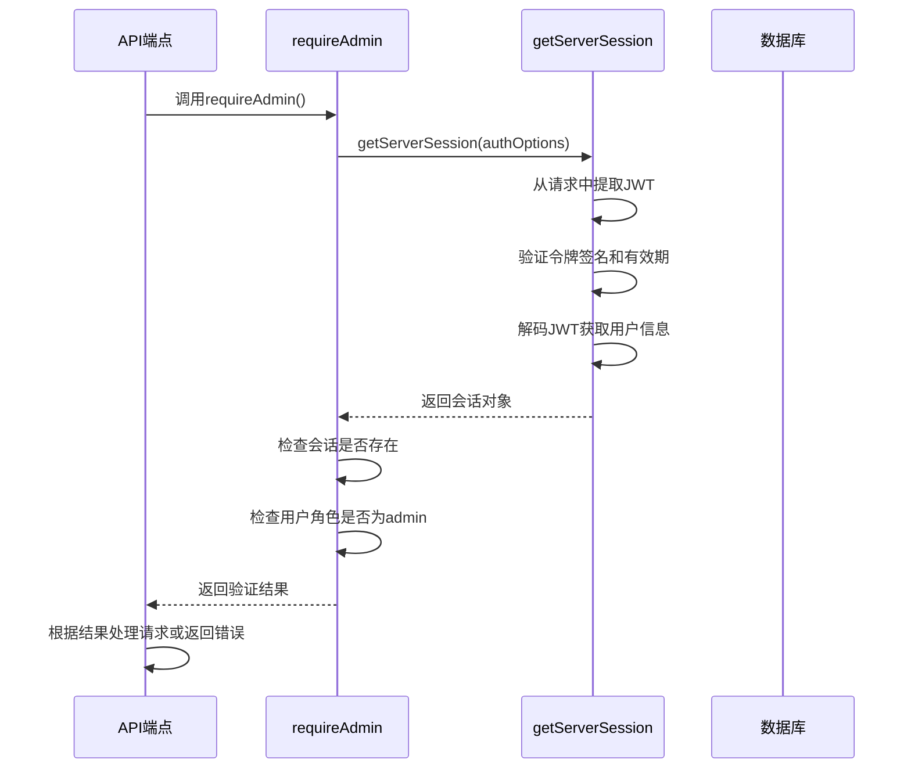

# 认证API

<cite>
**本文档中引用的文件**  
- [app/api/auth/[...nextauth]/route.ts](file://app/api/auth/[...nextauth]/route.ts)
- [app/api/register/route.ts](file://app/api/register/route.ts)
- [lib/auth.ts](file://lib/auth.ts)
- [types/next-auth.d.ts](file://types/next-auth.d.ts)
- [components/AuthForm.tsx](file://components/AuthForm.tsx)
- [app/providers.tsx](file://app/providers.tsx)
- [lib/prisma.ts](file://lib/prisma.ts)
- [app/api/admin/articles/route.ts](file://app/api/admin/articles/route.ts)
- [app/api/admin/stats/route.ts](file://app/api/admin/stats/route.ts)
- [app/api/cos/credentials/route.ts](file://app/api/cos/credentials/route.ts)
- [components/AdminLayout.tsx](file://components/AdminLayout.tsx)
- [app/admin/layout.tsx](file://app/admin/layout.tsx)
- [app/admin/page.tsx](file://app/admin/page.tsx)
</cite>

## 目录
1. [简介](#简介)
2. [项目结构](#项目结构)
3. [核心组件](#核心组件)
4. [架构概述](#架构概述)
5. [详细组件分析](#详细组件分析)
6. [依赖分析](#依赖分析)
7. [性能考虑](#性能考虑)
8. [故障排除指南](#故障排除指南)
9. [结论](#结论)

## 简介
本项目是一个基于Next.js的英语阅读学习平台，提供用户认证、文章管理、进度追踪等功能。系统采用NextAuth.js实现完整的认证机制，支持本地凭据登录、会话管理、JWT令牌和管理员权限控制。用户可以通过邮箱和密码注册并登录，管理员拥有特殊访问权限来管理文章、用户和查看统计数据。认证状态通过服务端会话传递，并在关键API端点进行权限校验。

## 项目结构

```mermaid
graph TD
subgraph "API Routes"
Auth[app/api/auth/[...nextauth]/route.ts<br/>认证处理]
Register[app/api/register/route.ts<br/>用户注册]
AdminAPI[app/api/admin/**<br/>管理员专用API]
COS[app/api/cos/**<br/>云存储凭证]
end
subgraph "Authentication"
LibAuth[lib/auth.ts<br/>认证配置与权限校验]
Types[types/next-auth.d.ts<br/>类型扩展]
end
subgraph "Components"
AuthForm[components/AuthForm.tsx<br/>登录/注册表单]
AdminLayout[components/AdminLayout.tsx<br/>管理员布局]
end
subgraph "Libraries"
Prisma[lib/prisma.ts<br/>数据库连接]
end
Auth --> LibAuth
Register --> LibAuth
AdminAPI --> LibAuth
AdminLayout --> LibAuth
AuthForm --> LibAuth
LibAuth --> Prisma
Types --> LibAuth
```

**图示来源**
- [app/api/auth/[...nextauth]/route.ts](file://app/api/auth/[...nextauth]/route.ts)
- [app/api/register/route.ts](file://app/api/register/route.ts)
- [lib/auth.ts](file://lib/auth.ts)
- [types/next-auth.d.ts](file://types/next-auth.d.ts)
- [components/AuthForm.tsx](file://components/AuthForm.tsx)
- [components/AdminLayout.tsx](file://components/AdminLayout.tsx)
- [lib/prisma.ts](file://lib/prisma.ts)

**章节来源**
- [app/api/auth/[...nextauth]/route.ts](file://app/api/auth/[...nextauth]/route.ts)
- [app/api/register/route.ts](file://app/api/register/route.ts)
- [lib/auth.ts](file://lib/auth.ts)
- [types/next-auth.d.ts](file://types/next-auth.d.ts)
- [components/AuthForm.tsx](file://components/AuthForm.tsx)
- [components/AdminLayout.tsx](file://components/AdminLayout.tsx)
- [lib/prisma.ts](file://lib/prisma.ts)

## 核心组件

系统的核心认证组件包括：基于NextAuth.js的认证路由处理、用户注册API、认证配置与权限校验逻辑、会话状态管理以及管理员权限控制。这些组件协同工作，确保系统的安全性和用户体验。

**章节来源**
- [app/api/auth/[...nextauth]/route.ts](file://app/api/auth/[...nextauth]/route.ts)
- [app/api/register/route.ts](file://app/api/register/route.ts)
- [lib/auth.ts](file://lib/auth.ts)
- [types/next-auth.d.ts](file://types/next-auth.d.ts)

## 架构概述



**图示来源**
- [app/api/auth/[...nextauth]/route.ts](file://app/api/auth/[...nextauth]/route.ts)
- [lib/auth.ts](file://lib/auth.ts)
- [app/api/admin/articles/route.ts](file://app/api/admin/articles/route.ts)

## 详细组件分析

### NextAuth认证集成分析

系统通过NextAuth.js实现了完整的认证机制，使用JWT会话策略和凭据提供者进行本地认证。



**图示来源**
- [app/api/auth/[...nextauth]/route.ts](file://app/api/auth/[...nextauth]/route.ts)
- [lib/auth.ts](file://lib/auth.ts)
- [types/next-auth.d.ts](file://types/next-auth.d.ts)

**章节来源**
- [app/api/auth/[...nextauth]/route.ts](file://app/api/auth/[...nextauth]/route.ts)
- [lib/auth.ts](file://lib/auth.ts)
- [types/next-auth.d.ts](file://types/next-auth.d.ts)

### 用户注册流程分析

系统提供了独立的用户注册API端点，处理新用户的创建流程。



**图示来源**
- [app/api/register/route.ts](file://app/api/register/route.ts)
- [lib/prisma.ts](file://lib/prisma.ts)

**章节来源**
- [app/api/register/route.ts](file://app/api/register/route.ts)

### 权限校验机制分析

系统实现了基于角色的访问控制（RBAC），特别是管理员权限的校验机制。



**图示来源**
- [lib/auth.ts](file://lib/auth.ts)
- [app/api/admin/articles/route.ts](file://app/api/admin/articles/route.ts)
- [app/api/admin/stats/route.ts](file://app/api/admin/stats/route.ts)

**章节来源**
- [lib/auth.ts](file://lib/auth.ts)
- [app/api/admin/articles/route.ts](file://app/api/admin/articles/route.ts)
- [app/api/admin/stats/route.ts](file://app/api/admin/stats/route.ts)

## 依赖分析

```mermaid
graph LR
AuthForm[components/AuthForm.tsx] --> NextAuth[signIn]
RegisterAPI[app/api/register/route.ts] --> Prisma[prisma.user]
AuthRoute[app/api/auth/[...nextauth]/route.ts] --> AuthOptions[authOptions]
AuthOptions --> CredentialsProvider
AuthOptions --> JWTCallbacks
AuthOptions --> SessionCallbacks
AuthOptions --> Prisma
AdminAPI[app/api/admin/**] --> RequireAdmin
RequireAdmin --> GetServerSession
GetServerSession --> AuthOptions
Providers[app/providers.tsx] --> SessionProvider
AdminLayout[components/AdminLayout.tsx] --> useSession
AdminLayout --> RequireAdmin
```

**图示来源**
- [app/api/auth/[...nextauth]/route.ts](file://app/api/auth/[...nextauth]/route.ts)
- [lib/auth.ts](file://lib/auth.ts)
- [app/api/register/route.ts](file://app/api/register/route.ts)
- [components/AuthForm.tsx](file://components/AuthForm.tsx)
- [app/providers.tsx](file://app/providers.tsx)
- [components/AdminLayout.tsx](file://components/AdminLayout.tsx)
- [lib/prisma.ts](file://lib/prisma.ts)

**章节来源**
- [app/api/auth/[...nextauth]/route.ts](file://app/api/auth/[...nextauth]/route.ts)
- [lib/auth.ts](file://lib/auth.ts)
- [app/api/register/route.ts](file://app/api/register/route.ts)
- [components/AuthForm.tsx](file://components/AuthForm.tsx)
- [app/providers.tsx](file://app/providers.tsx)
- [components/AdminLayout.tsx](file://components/AdminLayout.tsx)
- [lib/prisma.ts](file://lib/prisma.ts)

## 性能考虑

认证系统的性能主要受数据库查询、密码哈希计算和JWT验证的影响。系统通过Prisma客户端的单例模式减少了数据库连接开销，并在开发环境中设置了适当的日志级别。密码哈希使用bcrypt算法，成本因子设置为10，平衡了安全性与性能。JWT令牌存储在HTTP-only Cookie中，减少了客户端存储的风险，同时服务端会话验证避免了频繁的数据库查询。

## 故障排除指南

### 常见证书无效错误

当用户遇到"邮箱或密码错误"时，可能的原因包括：
- 输入的邮箱或密码不正确
- 用户账户不存在
- 数据库连接问题导致无法查询用户
- 密码哈希验证失败

解决方案：
1. 确认输入的凭据正确无误
2. 检查数据库中是否存在该用户
3. 验证数据库连接是否正常
4. 确保密码哈希算法一致

### 管理员访问被拒绝

当管理员用户无法访问受保护的资源时，可能的原因包括：
- 会话已过期
- JWT令牌中缺少角色信息
- 用户角色不是"admin"
- 权限校验函数实现错误

解决方案：
1. 重新登录以刷新会话
2. 检查JWT回调函数是否正确添加角色信息
3. 验证数据库中用户的角色字段
4. 确认requireAdmin函数的逻辑正确

**章节来源**
- [lib/auth.ts](file://lib/auth.ts)
- [components/AuthForm.tsx](file://components/AuthForm.tsx)
- [app/api/admin/articles/route.ts](file://app/api/admin/articles/route.ts)

## 结论

本系统的认证机制设计完整且安全，基于NextAuth.js实现了现代化的认证流程。通过JWT会话策略，系统能够在无状态的服务端环境中有效管理用户会话。密码使用bcrypt进行安全哈希存储，防止明文密码泄露。系统实现了基于角色的访问控制，特别是通过requireAdmin函数对管理员权限进行严格校验。前端通过SessionProvider提供会话状态，确保UI能够根据认证状态正确渲染。整体架构清晰，组件职责分明，为应用的安全性提供了坚实的基础。