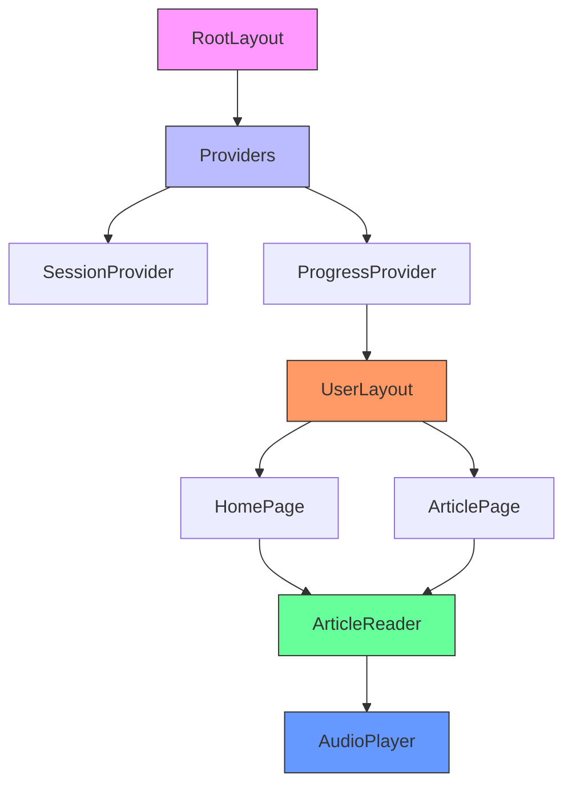
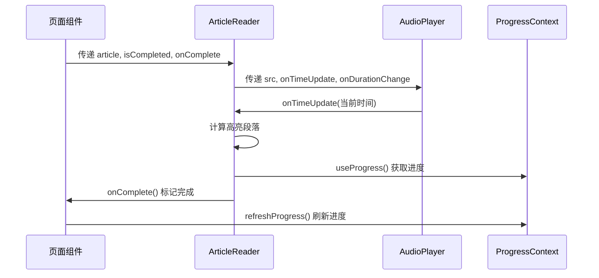
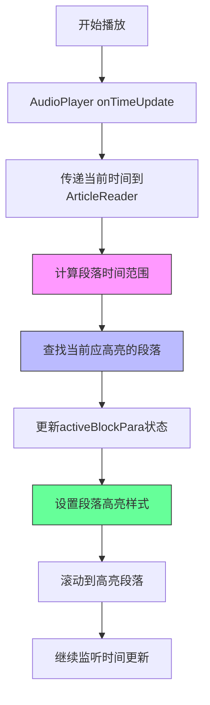
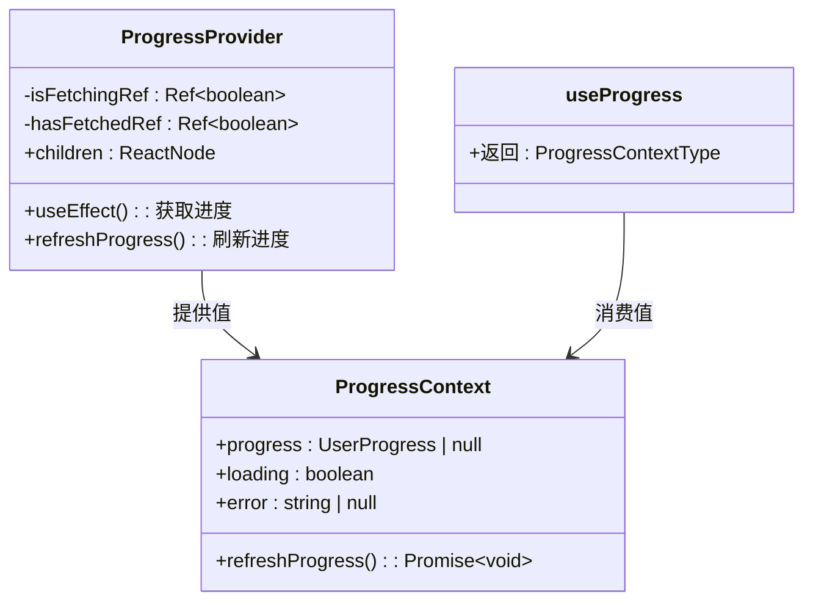

# 前端架构

<cite>
**本文档中引用的文件**  
- [layout.tsx](file://app/layout.tsx)
- [providers.tsx](file://app/providers.tsx)
- [ArticleReader.tsx](file://components/ArticleReader.tsx)
- [AudioPlayer.tsx](file://components/AudioPlayer.tsx)
- [ProgressContext.tsx](file://contexts/ProgressContext.tsx)
- [page.tsx](file://app/page.tsx)
- [article/[id]/page.tsx](file://app/(user)/article/[id]/page.tsx)
- [UserLayout.tsx](file://app/(user)/layout.tsx)
- [AdminLayout.tsx](file://components/AdminLayout.tsx)
- [storageService.ts](file://services/storageService.ts)
- [types.ts](file://types.ts)
- [constants.ts](file://constants.ts)
</cite>

## 目录
1. [简介](#简介)
2. [项目结构](#项目结构)
3. [核心组件](#核心组件)
4. [架构概览](#架构概览)
5. [详细组件分析](#详细组件分析)
6. [依赖分析](#依赖分析)
7. [性能考虑](#性能考虑)
8. [故障排除指南](#故障排除指南)
9. [结论](#结论)

## 简介
本项目是一个基于Next.js的每日英语阅读应用，采用现代化的React架构设计。系统通过Next.js App Router实现服务端渲染和客户端路由，结合React Context API进行全局状态管理。前端架构围绕三大核心：组件树、状态管理和路由系统构建，支持用户学习进度跟踪、音频同步高亮、多语言对照阅读等功能。应用采用响应式设计，适配移动端和桌面端，并通过Provider模式封装认证和进度上下文，确保状态在组件间高效共享。

## 项目结构
项目采用Next.js App Router的约定式路由结构，通过文件系统组织页面和布局。核心功能模块按领域划分，包括用户界面、管理后台和API路由。组件被集中存放在`components/`目录，上下文管理器位于`contexts/`目录，类型定义统一在`types.ts`中。这种分层结构实现了关注点分离，便于维护和扩展。

```mermaid
graph TB
subgraph "app/"
A[app/layout.tsx]
B[app/providers.tsx]
C[app/page.tsx]
D[app/(user)/layout.tsx]
E[app/(user)/article/[id]/page.tsx]
F[app/admin/layout.tsx]
end
subgraph "components/"
G[ArticleReader.tsx]
H[AudioPlayer.tsx]
I[AdminLayout.tsx]
end
subgraph "contexts/"
J[ProgressContext.tsx]
end
A --> B
B --> C
C --> G
G --> H
D --> C
E --> G
F --> I
J --> G
G --> J
```

**图示来源**  
- [app/layout.tsx](file://app/layout.tsx#L1-L30)
- [app/providers.tsx](file://app/providers.tsx#L1-L14)
- [components/ArticleReader.tsx](file://components/ArticleReader.tsx#L1-L394)
- [components/AudioPlayer.tsx](file://components/AudioPlayer.tsx#L1-L143)
- [contexts/ProgressContext.tsx](file://contexts/ProgressContext.tsx#L1-L95)

**本节来源**  
- [app/layout.tsx](file://app/layout.tsx#L1-L30)
- [app/page.tsx](file://app/page.tsx#L1-L203)

## 核心组件
系统的核心功能由`ArticleReader`组件驱动，该组件集成音频播放、文本高亮和进度管理。`ProgressContext`提供全局用户学习状态，通过React Context在组件间共享。`AudioPlayer`组件封装音频播放逻辑，支持播放控制和时间更新。这些组件通过props和回调函数实现通信，形成清晰的数据流。页面组件如`page.tsx`负责数据获取和状态传递，将业务逻辑与UI表现分离。

**本节来源**  
- [components/ArticleReader.tsx](file://components/ArticleReader.tsx#L1-L394)
- [contexts/ProgressContext.tsx](file://contexts/ProgressContext.tsx#L1-L95)
- [components/AudioPlayer.tsx](file://components/AudioPlayer.tsx#L1-L143)

## 架构概览
系统采用分层架构，从根组件到页面组件形成清晰的层次结构。`RootLayout`作为最外层容器，引入全局样式和Providers。`Providers`组件嵌套`SessionProvider`和`ProgressProvider`，为整个应用提供认证和进度上下文。用户路由下的`UserLayout`提供导航框架，而具体页面如文章阅读页则渲染`ArticleReader`等业务组件。这种设计实现了UI框架与业务逻辑的解耦，同时确保状态在需要的组件间高效传递。



**图示来源**  
- [app/layout.tsx](file://app/layout.tsx#L16-L30)
- [app/providers.tsx](file://app/providers.tsx#L6-L13)
- [app/(user)/layout.tsx](file://app/(user)/layout.tsx#L7-L152)
- [app/page.tsx](file://app/page.tsx#L15-L203)
- [app/(user)/article/[id]/page.tsx](file://app/(user)/article/[id]/page.tsx#L13-L99)

## 详细组件分析
### ArticleReader 组件分析
`ArticleReader`是应用的核心UI组件，负责渲染文章内容、管理阅读状态和集成音频播放。组件支持三种视图模式：纯英文、纯中文和中英对照，通过状态`viewMode`控制显示逻辑。文章内容按段落分割，每个段落可独立高亮。组件通过`onComplete`回调通知父组件完成状态，实现徽章解锁和激励语展示。

#### 组件通信模式


**图示来源**  
- [components/ArticleReader.tsx](file://components/ArticleReader.tsx#L19-L394)
- [components/AudioPlayer.tsx](file://components/AudioPlayer.tsx#L10-L143)
- [contexts/ProgressContext.tsx](file://contexts/ProgressContext.tsx#L88-L95)

#### 音频同步高亮实现


**图示来源**  
- [components/ArticleReader.tsx](file://components/ArticleReader.tsx#L22-L218)
- [components/AudioPlayer.tsx](file://components/AudioPlayer.tsx#L47-L56)

**本节来源**  
- [components/ArticleReader.tsx](file://components/ArticleReader.tsx#L1-L394)
- [components/AudioPlayer.tsx](file://components/AudioPlayer.tsx#L1-L143)

### ProgressContext 分析
`ProgressContext`使用React Context API管理用户的学习进度状态，包括已完成文章ID列表和用户统计数据。`ProgressProvider`在用户认证后自动获取进度数据，并提供`refreshProgress`方法供手动刷新。子组件通过`useProgress` Hook安全地访问上下文值，确保类型安全和运行时检查。



**图示来源**  
- [contexts/ProgressContext.tsx](file://contexts/ProgressContext.tsx#L8-L95)
- [types.ts](file://types.ts#L47-L50)

**本节来源**  
- [contexts/ProgressContext.tsx](file://contexts/ProgressContext.tsx#L1-L95)
- [types.ts](file://types.ts#L47-L50)

### Next.js App Router 路由系统
应用采用Next.js App Router实现基于文件系统的路由。动态路由`[id]`用于文章详情页，通过`useParams()`获取路由参数。布局组件`layout.tsx`支持嵌套，用户路由和管理后台各有独立布局。`page.tsx`作为页面入口，处理数据获取和重定向逻辑。

```mermaid
graph TB
app --> layout[app/layout.tsx]
app --> providers[app/providers.tsx]
app --> page[app/page.tsx]
app --> user[(user)]
app --> admin[(admin)]
user --> userLayout[layout.tsx]
user --> article[(article)]
article --> id[(\[id\])]
id --> idPage[page.tsx]
admin --> adminLayout[layout.tsx]
admin --> articles[(articles)]
admin --> users[(users)]
layout --> providers
providers --> page
providers --> userLayout
userLayout --> idPage
providers --> adminLayout
style user fill:#f96,stroke:#333
style admin fill:#f96,stroke:#333
style id fill:#69f,stroke:#333
```

**图示来源**  
- [app/page.tsx](file://app/page.tsx#L15-L203)
- [app/(user)/article/[id]/page.tsx](file://app/(user)/article/[id]/page.tsx#L13-L99)
- [app/(user)/layout.tsx](file://app/(user)/layout.tsx#L7-L152)
- [app/admin/layout.tsx](file://app/admin/layout.tsx#L3-L10)

**本节来源**  
- [app/page.tsx](file://app/page.tsx#L1-L203)
- [app/(user)/article/[id]/page.tsx](file://app/(user)/article/[id]/page.tsx#L1-L99)
- [app/(user)/layout.tsx](file://app/(user)/layout.tsx#L1-L152)

## 依赖分析
项目依赖关系清晰，遵循单向数据流原则。UI组件依赖于状态上下文和数据服务，而不直接访问API。`ArticleReader`依赖`AudioPlayer`和`ProgressContext`，但两者之间无直接依赖。数据服务`storageService`封装API调用，为组件提供统一的数据访问接口。这种设计降低了组件耦合度，提高了可测试性和可维护性。

```mermaid
graph LR
A[page.tsx] --> B[ArticleReader]
C[article/[id]/page.tsx] --> B
B --> D[AudioPlayer]
B --> E[ProgressContext]
A --> E
C --> E
E --> F[storageService]
B --> F
A --> F
C --> F
style A fill:#f9f,stroke:#333
style B fill:#6f9,stroke:#333
style D fill:#69f,stroke:#333
style E fill:#bbf,stroke:#333
style F fill:#f96,stroke:#333
```

**图示来源**  
- [app/page.tsx](file://app/page.tsx#L7-L11)
- [app/(user)/article/[id]/page.tsx](file://app/(user)/article/[id]/page.tsx#L6-L9)
- [components/ArticleReader.tsx](file://components/ArticleReader.tsx#L3-L5)
- [contexts/ProgressContext.tsx](file://contexts/ProgressContext.tsx#L5)
- [services/storageService.ts](file://services/storageService.ts#L1-L50)

**本节来源**  
- [services/storageService.ts](file://services/storageService.ts#L1-L50)
- [app/page.tsx](file://app/page.tsx#L1-L203)

## 性能考虑
应用在性能方面做了多项优化。`ArticleReader`使用`React.useMemo`缓存段落时间计算结果，避免重复计算。`ProgressContext`使用ref防止并发请求，确保状态一致性。Next.js的服务器组件在服务端获取数据，减少客户端加载时间。音频播放器在src变化时重置状态，防止内存泄漏。响应式设计确保在不同设备上都有良好性能表现。

## 故障排除指南
常见问题包括进度不更新、音频无法播放和路由跳转失败。进度问题通常源于`ProgressContext`未正确刷新，可通过调用`refreshProgress`解决。音频问题可能由无效URL或浏览器策略引起，组件已内置错误处理。路由问题多因认证状态变化导致，应检查`useSession`的返回值。开发时可通过控制台日志监控`ProgressContext`和`AudioPlayer`的调试信息。

**本节来源**  
- [contexts/ProgressContext.tsx](file://contexts/ProgressContext.tsx#L33-L58)
- [components/AudioPlayer.tsx](file://components/AudioPlayer.tsx#L84-L91)

## 结论
本前端架构展示了Next.js和React的最佳实践，通过清晰的组件分层、有效的状态管理和合理的路由设计，构建了一个可维护、可扩展的英语阅读应用。`ArticleReader`组件的音频同步高亮功能提供了沉浸式学习体验，`ProgressContext`确保了用户状态的一致性。系统架构平衡了功能需求和性能要求，为未来功能扩展奠定了坚实基础。