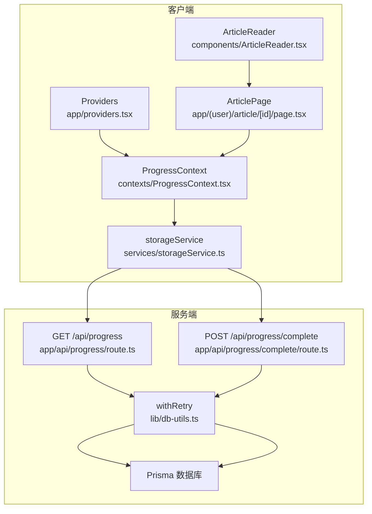
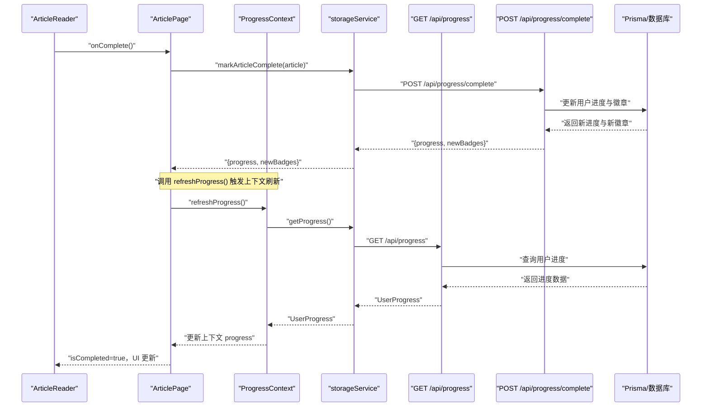
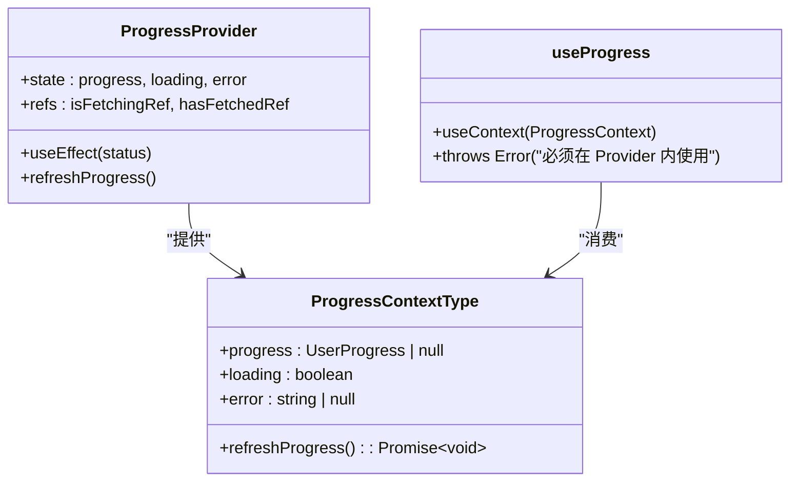
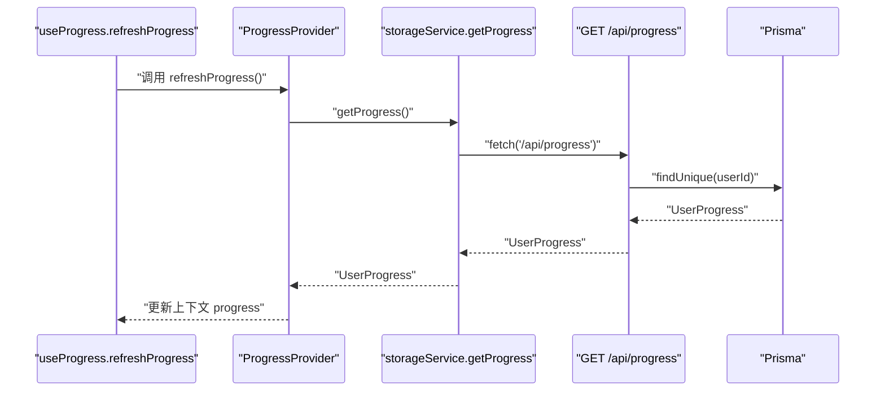
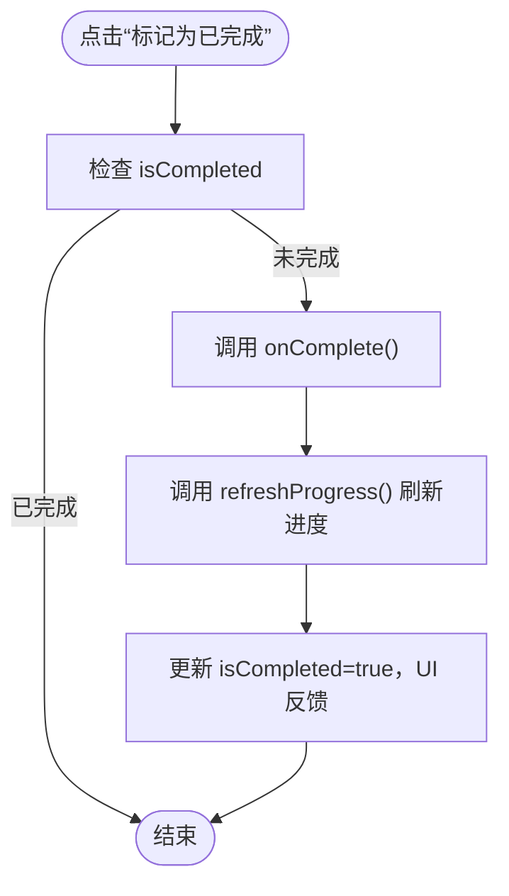
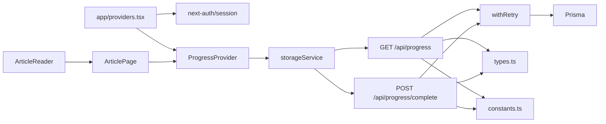

# 状态管理

<cite>
**本文引用的文件**
- [contexts/ProgressContext.tsx](file://contexts/ProgressContext.tsx)
- [services/storageService.ts](file://services/storageService.ts)
- [app/api/progress/route.ts](file://app/api/progress/route.ts)
- [app/api/progress/complete/route.ts](file://app/api/progress/complete/route.ts)
- [app/providers.tsx](file://app/providers.tsx)
- [components/ArticleReader.tsx](file://components/ArticleReader.tsx)
- [app/(user)/article/[id]/page.tsx](file://app/(user)/article/[id]/page.tsx)
- [lib/auth.ts](file://lib/auth.ts)
- [lib/db-utils.ts](file://lib/db-utils.ts)
- [types.ts](file://types.ts)
- [constants.ts](file://constants.ts)
</cite>

## 目录
1. [简介](#简介)
2. [项目结构](#项目结构)
3. [核心组件](#核心组件)
4. [架构总览](#架构总览)
5. [详细组件分析](#详细组件分析)
6. [依赖关系分析](#依赖关系分析)
7. [性能考量](#性能考量)
8. [故障排查指南](#故障排查指南)
9. [结论](#结论)
10. [附录](#附录)

## 简介
本文件围绕状态管理模块，系统阐述 ProgressContext 的实现机制与使用方式，重点覆盖以下方面：
- 如何通过 React createContext 和 useContext 实现跨组件的状态共享
- ProgressContextType 接口的字段设计与职责划分（progress、loading、error、refreshProgress）
- useProgress Hook 如何封装 API 调用（GET /api/progress），并提供进度刷新能力
- ArticleReader 组件如何消费 ProgressContext，判断文章完成状态并触发 onComplete 回调
- 状态持久化策略（服务端持久化）、错误处理机制与认证模块的交互
- 提供状态流图示与常见问题解决方案

## 项目结构
状态管理相关的核心文件分布如下：
- 上下文与提供者：contexts/ProgressContext.tsx
- 应用提供者组合：app/providers.tsx
- API 层（进度查询与完成标记）：app/api/progress/route.ts、app/api/progress/complete/route.ts
- 客户端服务封装：services/storageService.ts
- 类型定义：types.ts
- 认证与会话：lib/auth.ts
- 数据库重试与限流：lib/db-utils.ts
- 文章阅读页与消费上下文：components/ArticleReader.tsx、app/(user)/article/[id]/page.tsx
- 常量与徽章规则：constants.ts

图表来源
- [app/providers.tsx](file://app/providers.tsx#L1-L14)
- [contexts/ProgressContext.tsx](file://contexts/ProgressContext.tsx#L1-L95)
- [services/storageService.ts](file://services/storageService.ts#L1-L50)
- [app/api/progress/route.ts](file://app/api/progress/route.ts#L1-L78)
- [app/api/progress/complete/route.ts](file://app/api/progress/complete/route.ts#L1-L124)
- [lib/db-utils.ts](file://lib/db-utils.ts#L1-L60)

章节来源
- [app/providers.tsx](file://app/providers.tsx#L1-L14)
- [contexts/ProgressContext.tsx](file://contexts/ProgressContext.tsx#L1-L95)
- [services/storageService.ts](file://services/storageService.ts#L1-L50)
- [app/api/progress/route.ts](file://app/api/progress/route.ts#L1-L78)
- [app/api/progress/complete/route.ts](file://app/api/progress/complete/route.ts#L1-L124)
- [lib/db-utils.ts](file://lib/db-utils.ts#L1-L60)

## 核心组件
- ProgressContextType 接口
  - 字段：progress（用户进度对象或空）、loading（加载状态）、error（错误信息或空）、refreshProgress（异步刷新进度）
  - 作用：统一暴露进度状态与刷新能力，供组件消费
- ProgressProvider
  - 依赖 next-auth 的 useSession 状态，仅在 authenticated 时拉取一次进度，并通过 getProgress 从服务端获取
  - 内部使用 isFetchingRef 与 hasFetchedRef 防止并发与重复请求
  - 提供 refreshProgress 方法，支持手动刷新
- useProgress Hook
  - 封装 useContext，若未包裹在 Provider 内抛出错误，保证使用安全
- storageService
  - getProgress：封装 GET /api/progress
  - markArticleComplete：封装 POST /api/progress/complete
- ArticleReader
  - 作为消费者，接收 isCompleted 与 onComplete，当用户点击“标记为已完成”且未完成时触发 onComplete
  - 完成后由上层页面刷新进度并显示徽章提示

章节来源
- [contexts/ProgressContext.tsx](file://contexts/ProgressContext.tsx#L8-L13)
- [contexts/ProgressContext.tsx](file://contexts/ProgressContext.tsx#L17-L94)
- [services/storageService.ts](file://services/storageService.ts#L17-L45)
- [components/ArticleReader.tsx](file://components/ArticleReader.tsx#L1-L394)
- [app/(user)/article/[id]/page.tsx](file://app/(user)/article/[id]/page.tsx#L1-L99)

## 架构总览
下面的序列图展示了“文章完成”流程中，客户端与服务端的交互路径，以及上下文状态如何被驱动更新。

图表来源
- [components/ArticleReader.tsx](file://components/ArticleReader.tsx#L235-L241)
- [app/(user)/article/[id]/page.tsx](file://app/(user)/article/[id]/page.tsx#L53-L72)
- [contexts/ProgressContext.tsx](file://contexts/ProgressContext.tsx#L63-L79)
- [services/storageService.ts](file://services/storageService.ts#L17-L45)
- [app/api/progress/route.ts](file://app/api/progress/route.ts#L1-L78)
- [app/api/progress/complete/route.ts](file://app/api/progress/complete/route.ts#L1-L124)

## 详细组件分析

### ProgressContext 实现机制
- 设计要点
  - 使用 React createContext 创建上下文，useContext 封装 useProgress Hook，避免直接访问上下文导致的错误使用
  - 通过 useSession.status 控制生命周期：仅在 authenticated 时拉取一次进度，避免重复请求
  - 使用 isFetchingRef 与 hasFetchedRef 防止并发与重复请求
  - 提供 refreshProgress，仅在 authenticated 时执行，支持手动刷新
- 状态字段
  - progress：UserProgress | null
  - loading：boolean
  - error：string | null
  - refreshProgress：() => Promise<void>
- 错误处理
  - 捕获 getProgress 的异常并设置 error
  - 在 finally 中恢复 loading 状态
- 与认证的交互
  - 依赖 next-auth 的 useSession，未登录时重置状态，登录后仅拉取一次

图表来源
- [contexts/ProgressContext.tsx](file://contexts/ProgressContext.tsx#L8-L13)
- [contexts/ProgressContext.tsx](file://contexts/ProgressContext.tsx#L17-L94)

章节来源
- [contexts/ProgressContext.tsx](file://contexts/ProgressContext.tsx#L1-L95)

### useProgress Hook 的封装与 API 调用
- 封装逻辑
  - 通过 storageService.getProgress 发起 GET /api/progress 请求
  - 在 ProgressProvider 内部统一处理 loading/error 状态
  - refreshProgress 仅在 authenticated 时可用
- API 路由行为
  - GET /api/progress：校验会话，读取用户进度，缺失则创建默认记录，格式化返回
  - POST /api/progress/complete：校验会话，检查是否已完成，更新统计、徽章、完成列表等

图表来源
- [contexts/ProgressContext.tsx](file://contexts/ProgressContext.tsx#L63-L79)
- [services/storageService.ts](file://services/storageService.ts#L17-L26)
- [app/api/progress/route.ts](file://app/api/progress/route.ts#L1-L78)

章节来源
- [contexts/ProgressContext.tsx](file://contexts/ProgressContext.tsx#L63-L79)
- [services/storageService.ts](file://services/storageService.ts#L17-L26)
- [app/api/progress/route.ts](file://app/api/progress/route.ts#L1-L78)

### ArticleReader 组件消费 ProgressContext
- 消费方式
  - 通过 props.isCompleted 判断文章是否已完成
  - 点击“标记为已完成”按钮时，若未完成则触发 onComplete
- 完成后的反馈
  - 页面层调用 refreshProgress 刷新上下文
  - 若解锁新徽章，显示 toast 提示

图表来源
- [components/ArticleReader.tsx](file://components/ArticleReader.tsx#L235-L241)
- [app/(user)/article/[id]/page.tsx](file://app/(user)/article/[id]/page.tsx#L53-L72)

章节来源
- [components/ArticleReader.tsx](file://components/ArticleReader.tsx#L1-L394)
- [app/(user)/article/[id]/page.tsx](file://app/(user)/article/[id]/page.tsx#L1-L99)

### 状态持久化策略与错误处理
- 状态持久化
  - 客户端不使用本地存储，所有进度均来自服务端
  - GET /api/progress：查询用户进度；若缺失则创建默认记录
  - POST /api/progress/complete：更新完成列表、统计、徽章等
- 错误处理
  - 客户端：storageService 对 fetch 失败进行捕获并返回空/空数组，避免中断 UI
  - 服务端：针对数据库连接池满、无法连接等特定错误码返回友好提示
  - withRetry：对连接类错误进行指数退避重试，提升稳定性
- 与认证的交互
  - 依赖 next-auth 的会话状态，未登录时重置进度状态，登录后仅拉取一次
  - 服务端路由通过 getServerSession 校验授权

章节来源
- [services/storageService.ts](file://services/storageService.ts#L1-L50)
- [app/api/progress/route.ts](file://app/api/progress/route.ts#L1-L78)
- [app/api/progress/complete/route.ts](file://app/api/progress/complete/route.ts#L1-L124)
- [lib/db-utils.ts](file://lib/db-utils.ts#L1-L60)
- [lib/auth.ts](file://lib/auth.ts#L1-L101)

## 依赖关系分析
- Provider 组合
  - app/providers.tsx 将 SessionProvider 与 ProgressProvider 组合，确保 useSession 与 useProgress 可用
- 组件依赖
  - ArticlePage 依赖 useProgress 获取 progress 与 refreshProgress
  - ArticleReader 依赖 isCompleted 与 onComplete
- 服务端依赖
  - GET /api/progress 与 POST /api/progress/complete 依赖 Prisma 与 withRetry
  - 徽章规则与难度标签来源于 constants.ts

图表来源
- [app/providers.tsx](file://app/providers.tsx#L1-L14)
- [contexts/ProgressContext.tsx](file://contexts/ProgressContext.tsx#L1-L95)
- [services/storageService.ts](file://services/storageService.ts#L1-L50)
- [app/api/progress/route.ts](file://app/api/progress/route.ts#L1-L78)
- [app/api/progress/complete/route.ts](file://app/api/progress/complete/route.ts#L1-L124)
- [lib/db-utils.ts](file://lib/db-utils.ts#L1-L60)
- [types.ts](file://types.ts#L1-L70)
- [constants.ts](file://constants.ts#L1-L152)

章节来源
- [app/providers.tsx](file://app/providers.tsx#L1-L14)
- [types.ts](file://types.ts#L1-L70)
- [constants.ts](file://constants.ts#L1-L152)

## 性能考量
- 防并发与重复请求
  - 使用 isFetchingRef 与 hasFetchedRef 控制首次获取与并发请求，避免重复网络开销
- 加载与错误状态
  - loading 与 error 字段用于 UI 占位与降级展示，减少不必要的重渲染
- 重试与限流
  - withRetry 对连接类错误进行指数退避重试，结合限流器降低数据库压力
- 服务端查询优化
  - 仅在 authenticated 时查询，避免无效请求
  - 缺失进度时创建默认记录，减少后续分支判断

章节来源
- [contexts/ProgressContext.tsx](file://contexts/ProgressContext.tsx#L17-L61)
- [lib/db-utils.ts](file://lib/db-utils.ts#L1-L60)

## 故障排查指南
- 症状：页面空白或长时间加载
  - 可能原因：未登录或会话失效
  - 处理：确认 next-auth 会话状态，重新登录
- 症状：进度不更新
  - 可能原因：未调用 refreshProgress 或服务端异常
  - 处理：在完成文章后调用 refreshProgress；检查 /api/progress 与 /api/progress/complete 的响应
- 症状：徽章未解锁
  - 可能原因：徽章条件未满足或服务端未返回新徽章
  - 处理：核对 constants.ts 中徽章条件与服务端统计逻辑
- 症状：数据库错误
  - 可能原因：连接池满或服务器关闭连接
  - 处理：withRetry 自动重试；关注服务端日志与数据库健康检查

章节来源
- [app/(user)/article/[id]/page.tsx](file://app/(user)/article/[id]/page.tsx#L53-L72)
- [app/api/progress/route.ts](file://app/api/progress/route.ts#L59-L78)
- [app/api/progress/complete/route.ts](file://app/api/progress/complete/route.ts#L120-L124)
- [lib/db-utils.ts](file://lib/db-utils.ts#L1-L60)

## 结论
ProgressContext 通过 React 上下文与自定义 Hook，实现了跨组件的进度状态共享与刷新能力。其设计强调：
- 仅在认证状态下拉取与刷新进度，避免无意义请求
- 使用防并发与一次性获取策略，保障性能与一致性
- 客户端不使用本地存储，所有进度由服务端持久化，配合 withRetry 提升稳定性
- 与认证模块紧密耦合，确保数据安全与权限控制

该模式可扩展至其他用户状态（如徽章、统计数据）的跨组件共享，形成统一的状态管理基座。

## 附录
- 关键接口与类型
  - UserProgress：completedArticleIds 与 stats
  - UserStats：总天数、总完成数、当前/最长连击、按难度统计、活动日志、徽章列表
- 常用常量
  - BADGES：徽章集合与解锁条件
  - DIFFICULTY_LABELS：难度标签映射

章节来源
- [types.ts](file://types.ts#L1-L70)
- [constants.ts](file://constants.ts#L1-L152)