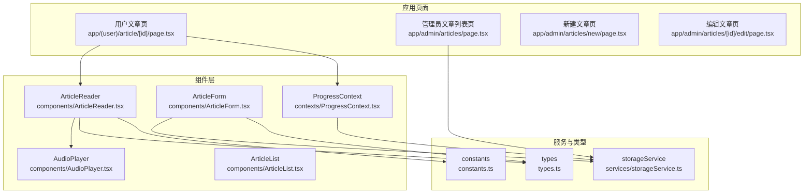
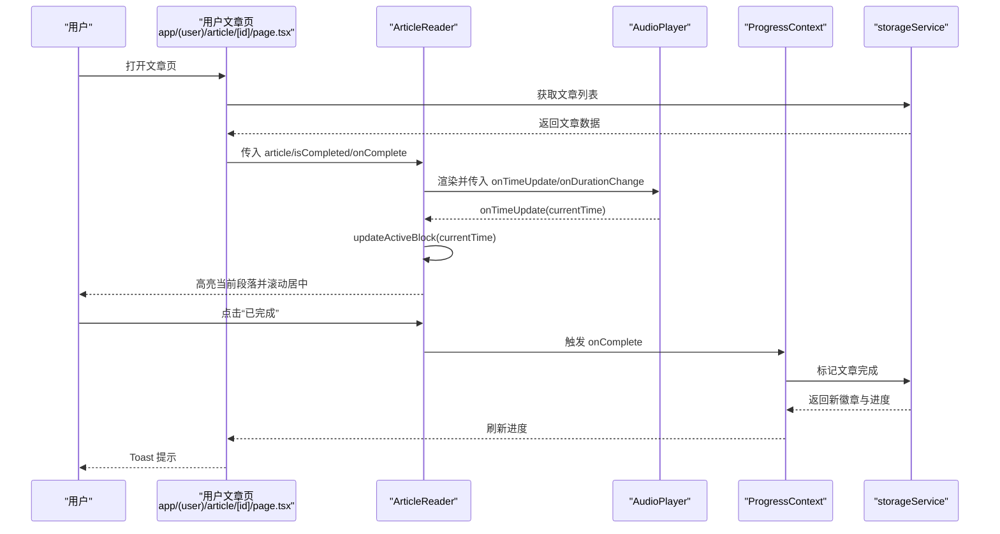
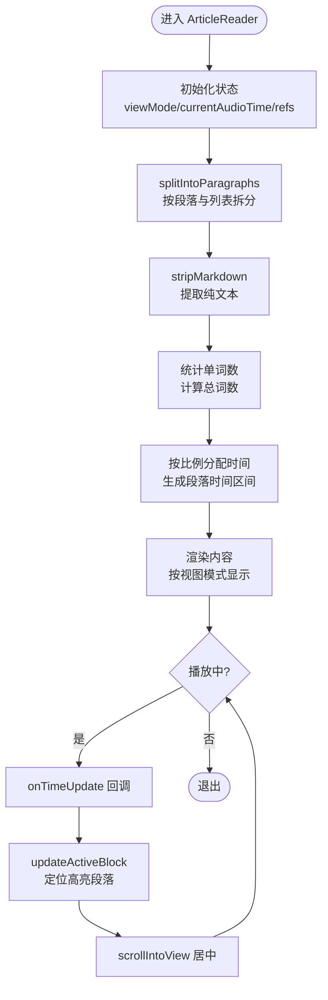
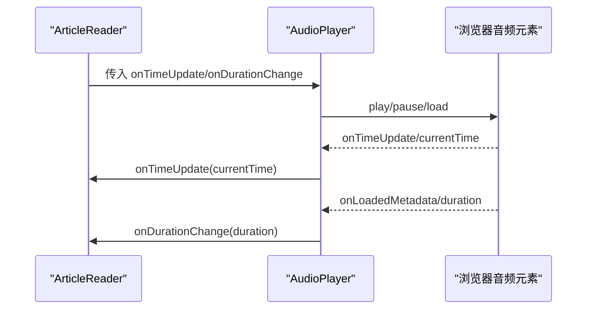
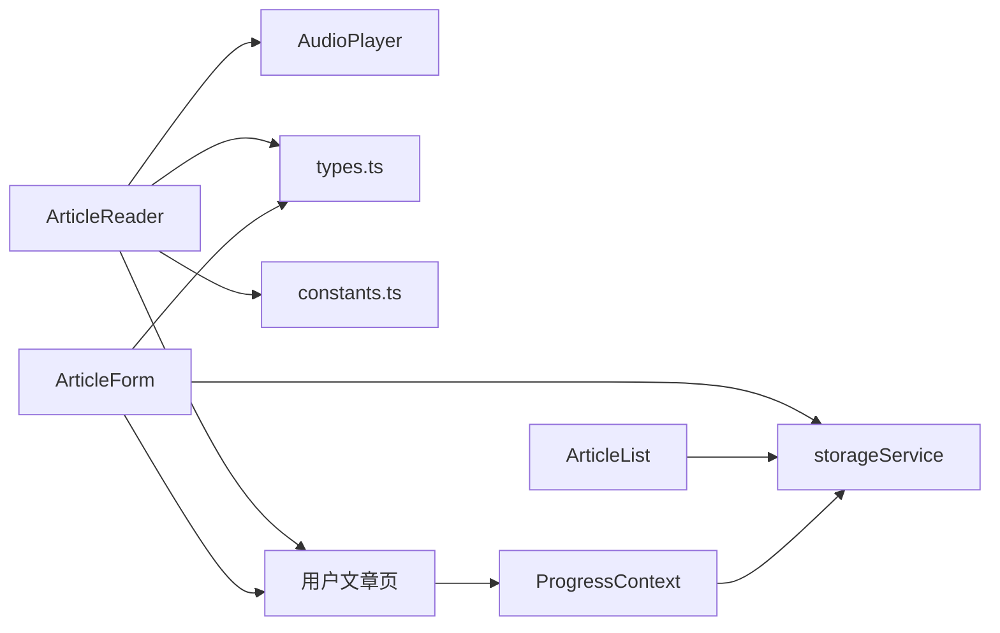

# 组件体系

<cite>
**本文引用的文件**
- [components/ArticleReader.tsx](file://components/ArticleReader.tsx)
- [components/AudioPlayer.tsx](file://components/AudioPlayer.tsx)
- [components/ArticleForm.tsx](file://components/ArticleForm.tsx)
- [components/ArticleList.tsx](file://components/ArticleList.tsx)
- [contexts/ProgressContext.tsx](file://contexts/ProgressContext.tsx)
- [services/storageService.ts](file://services/storageService.ts)
- [types.ts](file://types.ts)
- [constants.ts](file://constants.ts)
- [app/(user)/article/[id]/page.tsx](file://app/(user)/article/[id]/page.tsx)
- [app/admin/articles/[id]/edit/page.tsx](file://app/admin/articles/[id]/edit/page.tsx)
- [app/admin/articles/new/page.tsx](file://app/admin/articles/new/page.tsx)
</cite>

## 目录
1. [引言](#引言)
2. [项目结构](#项目结构)
3. [核心组件](#核心组件)
4. [架构总览](#架构总览)
5. [详细组件分析](#详细组件分析)
6. [依赖关系分析](#依赖关系分析)
7. [性能考量](#性能考量)
8. [故障排查指南](#故障排查指南)
9. [结论](#结论)
10. [附录](#附录)

## 引言
本文件围绕组件体系进行系统化文档化，重点剖析 ArticleReader 组件的设计与实现，涵盖其通过 splitIntoParagraphs 函数对 Markdown 段落进行智能分割、基于音频播放时间的段落高亮同步机制，以及 AudioPlayer 组件如何通过 onTimeUpdate 回调驱动 UI 更新。同时，本文解释视图模式切换（英文/中文/双语）的实现逻辑，给出 props 传递与状态管理的说明，并介绍 ArticleList、ArticleForm 等 UI 组件的用途与集成方式。最后讨论组件复用性、可访问性设计与响应式布局策略。

## 项目结构
该项目采用 Next.js 应用结构，前端组件集中在 components 目录，业务页面位于 app 目录，类型定义与常量位于根目录，服务层封装在 services 目录，上下文用于跨组件状态共享。

图表来源
- [app/(user)/article/[id]/page.tsx](file://app/(user)/article/[id]/page.tsx#L1-L99)
- [components/ArticleReader.tsx](file://components/ArticleReader.tsx#L1-L394)
- [components/AudioPlayer.tsx](file://components/AudioPlayer.tsx#L1-L143)
- [components/ArticleForm.tsx](file://components/ArticleForm.tsx#L1-L432)
- [components/ArticleList.tsx](file://components/ArticleList.tsx#L1-L186)
- [contexts/ProgressContext.tsx](file://contexts/ProgressContext.tsx#L1-L95)
- [services/storageService.ts](file://services/storageService.ts#L1-L50)
- [types.ts](file://types.ts#L1-L70)
- [constants.ts](file://constants.ts#L1-L152)

章节来源
- [app/(user)/article/[id]/page.tsx](file://app/(user)/article/[id]/page.tsx#L1-L99)
- [components/ArticleReader.tsx](file://components/ArticleReader.tsx#L1-L394)
- [components/AudioPlayer.tsx](file://components/AudioPlayer.tsx#L1-L143)
- [components/ArticleForm.tsx](file://components/ArticleForm.tsx#L1-L432)
- [components/ArticleList.tsx](file://components/ArticleList.tsx#L1-L186)
- [contexts/ProgressContext.tsx](file://contexts/ProgressContext.tsx#L1-L95)
- [services/storageService.ts](file://services/storageService.ts#L1-L50)
- [types.ts](file://types.ts#L1-L70)
- [constants.ts](file://constants.ts#L1-L152)

## 核心组件
- ArticleReader：负责渲染文章内容、控制音频播放与高亮同步、提供视图模式切换（英文/中文/双语），并处理“已完成”交互反馈。
- AudioPlayer：封装音频播放器 UI 与行为，向上游组件暴露 onTimeUpdate 与 onDurationChange 回调。
- ArticleForm：提供文章创建/编辑的表单界面，内置 Markdown 编辑器、难度选择、时长计算与上传集成。
- ArticleList：展示文章列表，支持删除与跳转编辑。
- ProgressContext：提供用户学习进度的全局状态与刷新能力，配合服务层 API 使用。

章节来源
- [components/ArticleReader.tsx](file://components/ArticleReader.tsx#L1-L394)
- [components/AudioPlayer.tsx](file://components/AudioPlayer.tsx#L1-L143)
- [components/ArticleForm.tsx](file://components/ArticleForm.tsx#L1-L432)
- [components/ArticleList.tsx](file://components/ArticleList.tsx#L1-L186)
- [contexts/ProgressContext.tsx](file://contexts/ProgressContext.tsx#L1-L95)

## 架构总览
用户在用户文章页加载文章数据，将 ArticleReader 作为核心阅读器渲染。ArticleReader 内部组合 AudioPlayer 控制音频播放，并通过 onTimeUpdate 回调驱动段落高亮与滚动。进度状态由 ProgressContext 提供，页面通过服务层 API 更新完成状态并刷新徽章提示。

图表来源
- [app/(user)/article/[id]/page.tsx](file://app/(user)/article/[id]/page.tsx#L1-L99)
- [components/ArticleReader.tsx](file://components/ArticleReader.tsx#L1-L394)
- [components/AudioPlayer.tsx](file://components/AudioPlayer.tsx#L1-L143)
- [contexts/ProgressContext.tsx](file://contexts/ProgressContext.tsx#L1-L95)
- [services/storageService.ts](file://services/storageService.ts#L1-L50)

## 详细组件分析

### ArticleReader 组件
- 功能概览
  - 视图模式切换：英文(en)、中文(zh)、双语(bilingual)，通过按钮组控制。
  - Markdown 渲染：使用 bytemd Viewer 插件渲染英文/中文段落。
  - 音频播放同步：根据音频时长与英文段落单词数分配时间区间，实时高亮当前段落并平滑滚动。
  - 完成态反馈：点击“已完成”触发 onComplete，显示庆祝动画与 Toast 提示。
- 关键实现点
  - splitIntoParagraphs：按空行与列表规则智能分割 Markdown 段落，保证列表与段落边界正确。
  - stripMarkdown：移除 Markdown 符号，仅保留纯文本，用于统计单词数。
  - allParagraphsData：基于单词数比例分配每个段落的起止时间，最后一段精确对齐音频结束时间。
  - updateActiveBlock：根据当前播放时间查找应高亮段落，更新 activeBlockPara 并滚动到可视区域。
  - shouldHighlight：判断某段落是否处于当前播放时间区间。
  - 视图模式渲染：根据 viewMode 条件渲染英文/中文或双语内容块。
  - props 与状态：
    - 输入：article、isCompleted、onComplete
    - 状态：viewMode、currentAudioTime、actualAudioDuration、activeBlockPara、paragraphRefs
- 与 AudioPlayer 的协作
  - 通过 onTimeUpdate 接收播放时间，调用 updateActiveBlock 实现高亮与滚动。
  - 通过 onDurationChange 接收音频时长，用于修正 allParagraphsData 的时间分配。
- 与 ProgressContext 的协作
  - 用户点击“已完成”时，调用 onComplete，页面侧刷新进度并展示徽章解锁提示。

图表来源
- [components/ArticleReader.tsx](file://components/ArticleReader.tsx#L1-L394)

章节来源
- [components/ArticleReader.tsx](file://components/ArticleReader.tsx#L1-L394)

### AudioPlayer 组件
- 功能概览
  - 播放/暂停、拖拽进度、重播、时长显示、错误提示。
  - 对外暴露 onTimeUpdate 与 onDurationChange 回调，供父组件更新高亮与时间分配。
- 关键实现点
  - 播放控制：play/pause，捕获异常并设置错误状态。
  - 时间更新：onTimeUpdate 读取 currentTime 并回调父组件。
  - 元数据加载：onLoadedMetadata 读取 duration 并回调父组件。
  - 进度条：受控输入框，支持拖拽跳转。
  - 错误处理：当音频加载失败时显示错误提示。
- 可访问性
  - 按钮提供 aria-label，便于屏幕阅读器识别。
- 响应式布局
  - 在移动端采用粘性布局，桌面端改为内联布局，适配不同设备。

图表来源
- [components/AudioPlayer.tsx](file://components/AudioPlayer.tsx#L1-L143)
- [components/ArticleReader.tsx](file://components/ArticleReader.tsx#L1-L394)

章节来源
- [components/AudioPlayer.tsx](file://components/AudioPlayer.tsx#L1-L143)

### ArticleForm 组件
- 功能概览
  - 文章创建/编辑表单，支持多内容块，中文/英文内容块成对维护。
  - Markdown 编辑器（bytemd），难度选择，日期选择。
  - 自动计算阅读时长（基于英文内容，50 词/分钟），或由音频上传覆盖。
  - 上传集成：通过 CosUploader 上传音频并回填 URL 与时长。
- 关键实现点
  - stripMarkdown：用于去除 Markdown 符号，计算纯文本单词数。
  - calculateDuration：统计英文标题、摘要与内容的单词数，换算为秒。
  - 自动时长：当未上传音频时，监听内容变化自动更新 durationSeconds。
  - 编辑模式：根据 articleId 从 API 拉取文章数据填充表单。
  - 提交流程：客户端校验必填字段与内容块完整性，调用 API 完成创建/更新。
- 与服务层集成
  - 通过 storageService 的 API 接口提交数据，返回错误信息或重定向。

章节来源
- [components/ArticleForm.tsx](file://components/ArticleForm.tsx#L1-L432)
- [services/storageService.ts](file://services/storageService.ts#L1-L50)
- [types.ts](file://types.ts#L1-L70)

### ArticleList 组件
- 功能概览
  - 展示文章列表，包含标题、日期、难度徽章与操作列（编辑/删除）。
  - 支持删除确认与加载状态。
- 集成方式
  - 通过 API 获取文章列表，渲染表格并提供跳转至编辑页的链接。
  - 删除成功后重新拉取列表，保持数据一致性。

章节来源
- [components/ArticleList.tsx](file://components/ArticleList.tsx#L1-L186)
- [services/storageService.ts](file://services/storageService.ts#L1-L50)

### ProgressContext 与页面集成
- 功能概览
  - 在登录状态为 authenticated 时首次获取用户进度，避免重复请求。
  - 提供 refreshProgress 主动刷新能力，统一错误处理与加载状态。
- 页面集成
  - 用户文章页在完成文章后调用 refreshProgress，确保徽章与统计数据即时更新。
  - storageService 的 markArticleComplete 返回新徽章 ID 列表，页面据此展示 Toast 提示。

章节来源
- [contexts/ProgressContext.tsx](file://contexts/ProgressContext.tsx#L1-L95)
- [app/(user)/article/[id]/page.tsx](file://app/(user)/article/[id]/page.tsx#L1-L99)
- [services/storageService.ts](file://services/storageService.ts#L1-L50)

## 依赖关系分析
- 组件间依赖
  - ArticleReader 依赖 AudioPlayer、bytemd Viewer、Difficulty 常量与 Article 类型。
  - ArticleForm 依赖 bytemd Editor、CosUploader、Difficulty 类型与 storageService。
  - ArticleList 依赖 storageService 与 Article 类型。
  - 用户文章页依赖 ProgressContext、storageService、MOTIVATIONAL_QUOTES 常量。
- 外部依赖
  - bytemd 生态（Viewer/Editor 插件）、lucide-react 图标库、Next.js 导航与路由。
- 数据流
  - 文章数据由 API 提供，进度数据由 ProgressContext 管理，音频时长与播放事件通过回调在组件间传递。

图表来源
- [components/ArticleReader.tsx](file://components/ArticleReader.tsx#L1-L394)
- [components/AudioPlayer.tsx](file://components/AudioPlayer.tsx#L1-L143)
- [components/ArticleForm.tsx](file://components/ArticleForm.tsx#L1-L432)
- [components/ArticleList.tsx](file://components/ArticleList.tsx#L1-L186)
- [contexts/ProgressContext.tsx](file://contexts/ProgressContext.tsx#L1-L95)
- [services/storageService.ts](file://services/storageService.ts#L1-L50)
- [types.ts](file://types.ts#L1-L70)
- [constants.ts](file://constants.ts#L1-L152)
- [app/(user)/article/[id]/page.tsx](file://app/(user)/article/[id]/page.tsx#L1-L99)

## 性能考量
- 段落时间分配
  - 使用 useMemo 缓存 allParagraphsData，依赖 article.content 与 audioDuration，避免每次渲染都重新计算。
  - splitIntoParagraphs 与 stripMarkdown 为 O(n) 级别，n 为 Markdown 行数，适合中等长度内容。
- 高亮与滚动
  - updateActiveBlock 仅在时间变化时查找当前段落，滚动采用 scrollIntoView，建议在长文档中注意滚动性能。
- 音频时长
  - 优先使用实际加载的音频时长，减少因预估误差导致的高亮偏差。
- 渲染优化
  - 按视图模式条件渲染，减少不必要的 DOM 节点数量。
  - 使用 refs 存储段落元素，避免重复查询 DOM。

## 故障排查指南
- 音频无法播放
  - 检查 AudioPlayer 是否显示错误提示，确认音频 URL 可访问且格式受支持。
  - 确认 onDurationChange 回调已触发，以便修正 allParagraphsData 的时间分配。
- 高亮不同步
  - 确认 splitIntoParagraphs 正确识别列表与段落边界，避免列表项被错误合并。
  - 检查 stripMarkdown 是否正确移除 Markdown 符号，确保单词数统计准确。
  - 若音频时长与内容不匹配，优先使用实际音频时长而非预估值。
- 完成状态未更新
  - 确认页面侧调用了 refreshProgress，确保进度上下文刷新。
  - 检查 storageService 的 markArticleComplete 返回值，确认新徽章列表是否为空。
- 表单提交失败
  - 检查必填字段与内容块完整性，确认 API 返回的错误信息。
  - 若使用音频上传，请确认 CosUploader 已正确回填 URL 与时长。

章节来源
- [components/AudioPlayer.tsx](file://components/AudioPlayer.tsx#L1-L143)
- [components/ArticleReader.tsx](file://components/ArticleReader.tsx#L1-L394)
- [contexts/ProgressContext.tsx](file://contexts/ProgressContext.tsx#L1-L95)
- [services/storageService.ts](file://services/storageService.ts#L1-L50)
- [components/ArticleForm.tsx](file://components/ArticleForm.tsx#L1-L432)

## 结论
本组件体系围绕 ArticleReader 构建，通过 AudioPlayer 实现音频播放与高亮同步，借助 ProgressContext 管理用户进度，配合 ArticleForm 与 ArticleList 提供完整的创作与管理闭环。组件间职责清晰、耦合度低，具备良好的可扩展性与可维护性。通过合理的状态管理与回调机制，实现了流畅的用户体验与稳定的性能表现。

## 附录
- Props 与状态管理要点
  - ArticleReader
    - 输入：article、isCompleted、onComplete
    - 状态：viewMode、currentAudioTime、actualAudioDuration、activeBlockPara、paragraphRefs
  - AudioPlayer
    - 输入：src、onTimeUpdate、onDurationChange
    - 状态：isPlaying、progress、duration、error
  - ArticleForm
    - 输入：mode、articleId
    - 状态：loading、error、formData（含 content 数组）
  - ArticleList
    - 输入：无
    - 状态：articles、loading、error、deleteId
- 可访问性与响应式建议
  - 可访问性：为交互元素提供 aria-label；使用语义化标签；确保键盘可达。
  - 响应式：移动端采用粘性播放器，桌面端内联布局；合理使用断点与弹性布局。