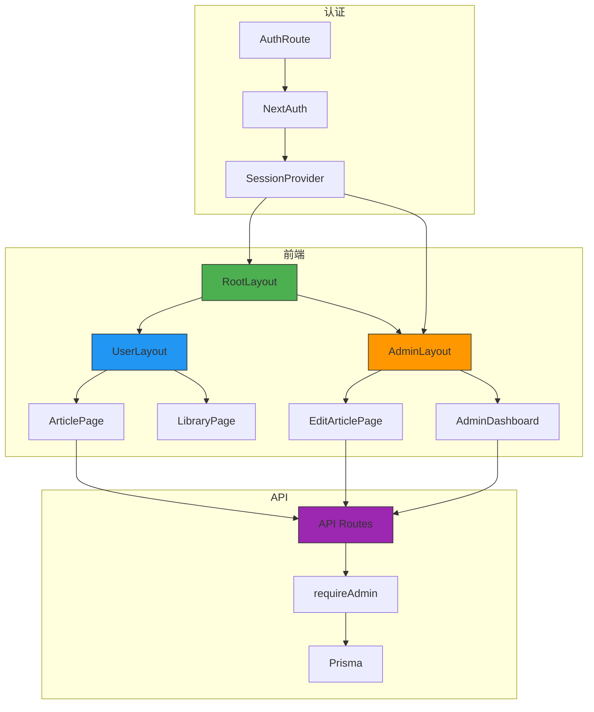
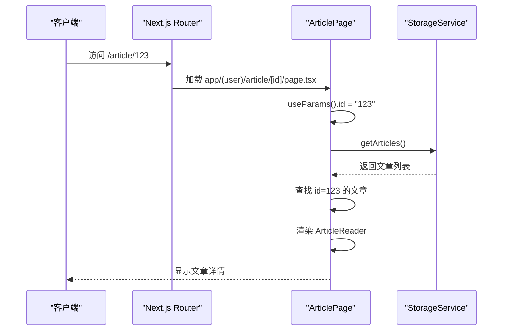
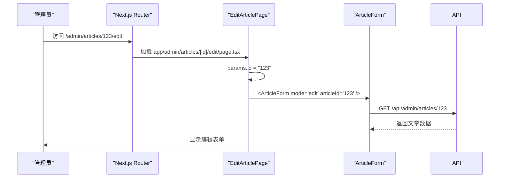
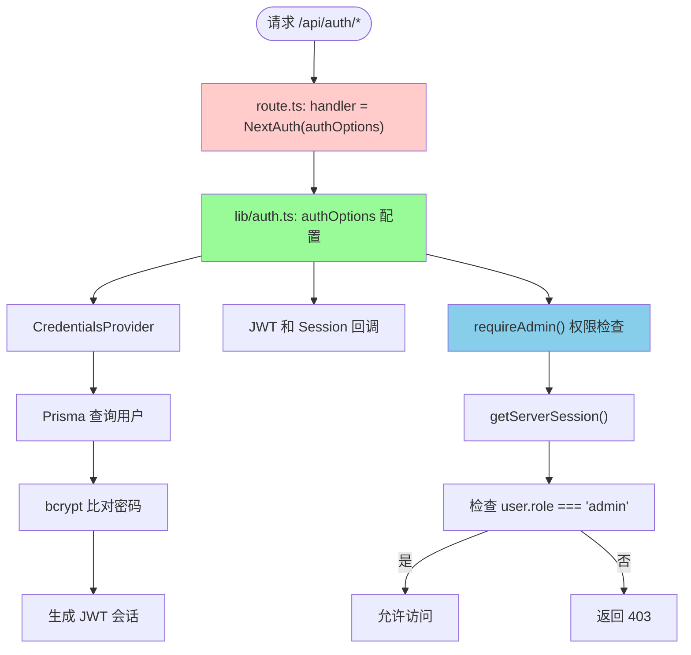
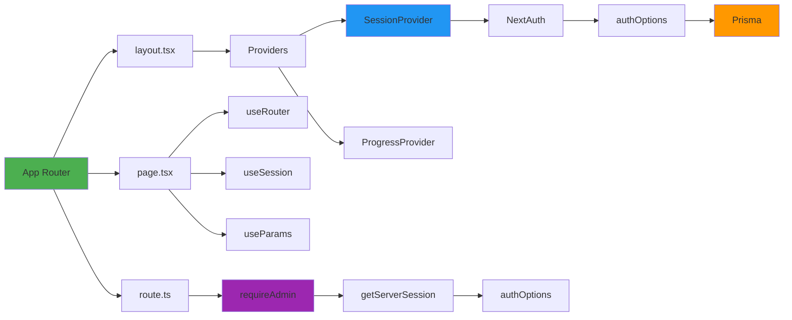

# 路由与导航

<cite>
**本文档中引用的文件**   
- [layout.tsx](file://app/layout.tsx)
- [app/(user)/layout.tsx](file://app/(user)/layout.tsx)
- [app/admin/layout.tsx](file://app/admin/layout.tsx)
- [page.tsx](file://app/page.tsx)
- [app/admin/page.tsx](file://app/admin/page.tsx)
- [app/api/admin/articles/[id]/route.ts](file://app/api/admin/articles/[id]/route.ts)
- [app/api/auth/[...nextauth]/route.ts](file://app/api/auth/[...nextauth]/route.ts)
- [components/AdminLayout.tsx](file://components/AdminLayout.tsx)
- [app/(user)/article/[id]/page.tsx](file://app/(user)/article/[id]/page.tsx)
- [app/admin/articles/[id]/edit/page.tsx](file://app/admin/articles/[id]/edit/page.tsx)
- [lib/auth.ts](file://lib/auth.ts)
- [components/ArticleReader.tsx](file://components/ArticleReader.tsx)
- [app/providers.tsx](file://app/providers.tsx)
- [app/admin/articles/new/page.tsx](file://app/admin/articles/new/page.tsx)
- [app/admin/users/[id]/page.tsx](file://app/admin/users/[id]/page.tsx)
- [app/admin/users/page.tsx](file://app/admin/users/page.tsx)
- [app/api/admin/stats/route.ts](file://app/api/admin/stats/route.ts)
</cite>

## 目录
1. [简介](#简介)
2. [项目结构](#项目结构)
3. [核心组件](#核心组件)
4. [架构概述](#架构概述)
5. [详细组件分析](#详细组件分析)
6. [依赖分析](#依赖分析)
7. [性能考虑](#性能考虑)
8. [故障排除指南](#故障排除指南)
9. [结论](#结论)

## 简介
本文档深入解析基于 Next.js App Router 的路由与导航系统架构设计。重点阐述 `app` 目录下布局文件（`layout.tsx`）如何通过嵌套实现 UI 继承与共享，描述根布局、用户布局与管理后台布局的层级关系。详细说明动态路由 `[id]` 在文章详情页和管理员编辑页中的应用方式，以及页面文件（`page.tsx`）与 API 路由的对应关系。同时，分析认证路由 `[...nextauth]` 的特殊处理机制及其与全局布局的集成，并提供路由守卫、权限控制跳转和 SEO 优化的最佳实践。

## 项目结构

Next.js 应用采用 `app` 目录结构，实现基于文件系统的路由机制。项目通过嵌套文件夹组织不同功能模块，如用户功能区 `(user)` 和管理后台 `admin`，并通过 `layout.tsx` 实现布局继承与共享。API 路由位于 `app/api` 目录下，与页面路由分离，便于管理后端接口。

```mermaid
graph TD
A[app/] --> B[layout.tsx]
A --> C[(user)/]
A --> D[admin/]
A --> E[api/]
A --> F[page.tsx]
A --> G[providers.tsx]
C --> H[layout.tsx]
C --> I[article/[id]/]
C --> J[library/]
C --> K[stats/]
D --> L[layout.tsx]
D --> M[articles/]
D --> N[users/]
D --> O[page.tsx]
E --> P[admin/]
E --> Q[auth/[...nextauth]/]
E --> R[articles/]
E --> S[health/]
M --> T[[id]/edit/]
M --> U[new/]
P --> V[articles/[id]/]
P --> W[stats/]
P --> X[users/[id]/]
B --> |根布局| H
H --> |用户布局| I
H --> |用户布局| J
H --> |用户布局| K
B --> |根布局| L
L --> |管理布局| M
L --> |管理布局| N
L --> |管理布局| O
style B fill:#f9f,stroke:#333
style H fill:#bbf,stroke:#333
style L fill:#f96,stroke:#333
```

**图示来源**
- [app/layout.tsx](file://app/layout.tsx#L1-L30)
- [app/(user)/layout.tsx](file://app/(user)/layout.tsx#L1-L152)
- [app/admin/layout.tsx](file://app/admin/layout.tsx#L1-L10)

**本节来源**
- [app/layout.tsx](file://app/layout.tsx#L1-L30)
- [app/(user)/layout.tsx](file://app/(user)/layout.tsx#L1-L152)
- [app/admin/layout.tsx](file://app/admin/layout.tsx#L1-L10)

## 核心组件

应用的核心路由组件包括根布局、用户区域布局和管理后台布局，分别控制不同层级的 UI 共享与导航逻辑。页面文件通过 `page.tsx` 定义路由入口，动态路由参数 `[id]` 支持内容动态加载。API 路由与页面路由一一对应，实现前后端分离架构。认证系统通过 `[...nextauth]` 处理会话管理，并结合 `SessionProvider` 实现全局状态共享。

**本节来源**
- [app/layout.tsx](file://app/layout.tsx#L1-L30)
- [app/(user)/layout.tsx](file://app/(user)/layout.tsx#L1-L152)
- [app/admin/layout.tsx](file://app/admin/layout.tsx#L1-L10)
- [page.tsx](file://app/page.tsx#L1-L203)
- [app/admin/page.tsx](file://app/admin/page.tsx#L1-L155)

## 架构概述

系统采用分层架构，前端路由由 Next.js App Router 驱动，通过嵌套布局实现 UI 继承。用户认证由 NextAuth.js 管理，权限控制通过中间件和路由守卫实现。数据流通过 React Context（如 `ProgressContext`）和 Server Actions/API Routes 进行管理。整体架构清晰分离关注点，支持可扩展性和维护性。



**图示来源**
- [app/layout.tsx](file://app/layout.tsx#L1-L30)
- [app/(user)/layout.tsx](file://app/(user)/layout.tsx#L1-L152)
- [app/admin/layout.tsx](file://app/admin/layout.tsx#L1-L10)
- [app/api/auth/[...nextauth]/route.ts](file://app/api/auth/[...nextauth]/route.ts#L1-L6)
- [lib/auth.ts](file://lib/auth.ts#L1-L101)

## 详细组件分析

### 布局系统分析

Next.js 的布局系统通过 `layout.tsx` 文件实现组件嵌套与共享。根布局 `app/layout.tsx` 定义全局 HTML 结构和字体加载，所有子路由继承该布局。用户区域 `(user)` 和管理后台 `admin` 各自定义独立布局，分别提供用户导航和管理员侧边栏。

#### 用户布局实现
```mermaid
classDiagram
class UserLayout {
+useSession()
+usePathname()
+useRouter()
+isActive(path) boolean
-renderDesktopNav()
-renderMobileNav()
-renderMainContent()
}
UserLayout --> "uses" next-auth/react : Session
UserLayout --> "uses" next/navigation : Navigation
UserLayout --> "renders" ArticleReader : Content
```

**图示来源**
- [app/(user)/layout.tsx](file://app/(user)/layout.tsx#L1-L152)
- [components/ArticleReader.tsx](file://components/ArticleReader.tsx#L1-L394)

#### 管理后台布局实现
```mermaid
classDiagram
class AdminLayout {
+useSession()
+useRouter()
+useEffect() redirect if not admin
+handleLogout()
-renderSidebar()
-renderMain()
}
AdminLayout --> "uses" next-auth/react : Session
AdminLayout --> "uses" next/navigation : Navigation
AdminLayout --> "protects" AdminDashboard
AdminLayout --> "protects" EditArticlePage
```

**图示来源**
- [components/AdminLayout.tsx](file://components/AdminLayout.tsx#L1-L105)
- [app/admin/layout.tsx](file://app/admin/layout.tsx#L1-L10)

**本节来源**
- [app/(user)/layout.tsx](file://app/(user)/layout.tsx#L1-L152)
- [components/AdminLayout.tsx](file://components/AdminLayout.tsx#L1-L105)
- [app/admin/layout.tsx](file://app/admin/layout.tsx#L1-L10)

### 动态路由分析

动态路由通过方括号语法 `[id]` 实现，支持参数化页面加载。文章详情页和管理员编辑页均使用此机制，通过 `useParams()` 获取路由参数。

#### 文章详情页路由流程


**图示来源**
- [app/(user)/article/[id]/page.tsx](file://app/(user)/article/[id]/page.tsx#L1-L99)
- [services/storageService.ts](file://services/storageService.ts)

#### 管理员编辑页路由流程


**图示来源**
- [app/admin/articles/[id]/edit/page.tsx](file://app/admin/articles/[id]/edit/page.tsx#L1-L6)
- [app/api/admin/articles/[id]/route.ts](file://app/api/admin/articles/[id]/route.ts#L1-L205)

**本节来源**
- [app/(user)/article/[id]/page.tsx](file://app/(user)/article/[id]/page.tsx#L1-L99)
- [app/admin/articles/[id]/edit/page.tsx](file://app/admin/articles/[id]/edit/page.tsx#L1-L6)
- [app/api/admin/articles/[id]/route.ts](file://app/api/admin/articles/[id]/route.ts#L1-L205)

### 认证路由分析

认证路由 `[...nextauth]` 是 NextAuth.js 的特殊路由，处理所有认证相关请求。该路由通过 `NextAuth` 处理器统一管理登录、登出和会话验证。

#### 认证路由处理流程


**图示来源**
- [app/api/auth/[...nextauth]/route.ts](file://app/api/auth/[...nextauth]/route.ts#L1-L6)
- [lib/auth.ts](file://lib/auth.ts#L1-L101)

**本节来源**
- [app/api/auth/[...nextauth]/route.ts](file://app/api/auth/[...nextauth]/route.ts#L1-L6)
- [lib/auth.ts](file://lib/auth.ts#L1-L101)

## 依赖分析

应用的路由系统依赖多个核心模块，包括 Next.js 路由、NextAuth.js 认证、Prisma 数据库访问和 React Context 状态管理。各组件通过清晰的依赖关系实现功能解耦。



**图示来源**
- [app/layout.tsx](file://app/layout.tsx#L1-L30)
- [app/providers.tsx](file://app/providers.tsx#L1-L14)
- [lib/auth.ts](file://lib/auth.ts#L1-L101)
- [app/api/admin/articles/[id]/route.ts](file://app/api/admin/articles/[id]/route.ts#L1-L205)

**本节来源**
- [app/layout.tsx](file://app/layout.tsx#L1-L30)
- [app/providers.tsx](file://app/providers.tsx#L1-L14)
- [lib/auth.ts](file://lib/auth.ts#L1-L101)
- [app/api/admin/articles/[id]/route.ts](file://app/api/admin/articles/[id]/route.ts#L1-L205)

## 性能考虑

路由系统的性能优化主要体现在以下几个方面：
- 布局组件的静态部分在服务端渲染，减少客户端计算
- 动态路由参数通过 `useParams` 高效获取
- API 路由采用按需加载，避免不必要的数据查询
- 认证检查 `requireAdmin` 在服务端执行，提高安全性
- 图片和音频资源通过 CDN 优化加载速度

## 故障排除指南

### 路由跳转问题
- 检查 `Link` 组件或 `router.push` 的路径是否正确
- 确认动态路由参数 `[id]` 在文件夹命名和 `useParams` 中一致
- 验证布局文件的嵌套关系是否符合预期

### 认证权限问题
- 检查 `session.user.role` 是否正确设置
- 确认 `requireAdmin` 函数在 API 路由中正确调用
- 验证 JWT 回调中角色信息是否正确注入

### 布局继承问题
- 确认 `layout.tsx` 文件位于正确的目录层级
- 检查布局组件的 `children` 是否正确传递
- 验证全局样式和字体加载是否冲突

**本节来源**
- [lib/auth.ts](file://lib/auth.ts#L77-L101)
- [components/AdminLayout.tsx](file://components/AdminLayout.tsx#L18-L32)
- [app/(user)/layout.tsx](file://app/(user)/layout.tsx#L12-L14)

## 结论

本系统通过 Next.js App Router 实现了清晰、可扩展的路由与导航架构。嵌套布局机制有效实现了 UI 继承与共享，动态路由支持灵活的内容展示，认证系统与权限控制保障了安全性。通过合理的组件划分和依赖管理，系统具备良好的可维护性和性能表现，为用户提供流畅的阅读和管理体验。