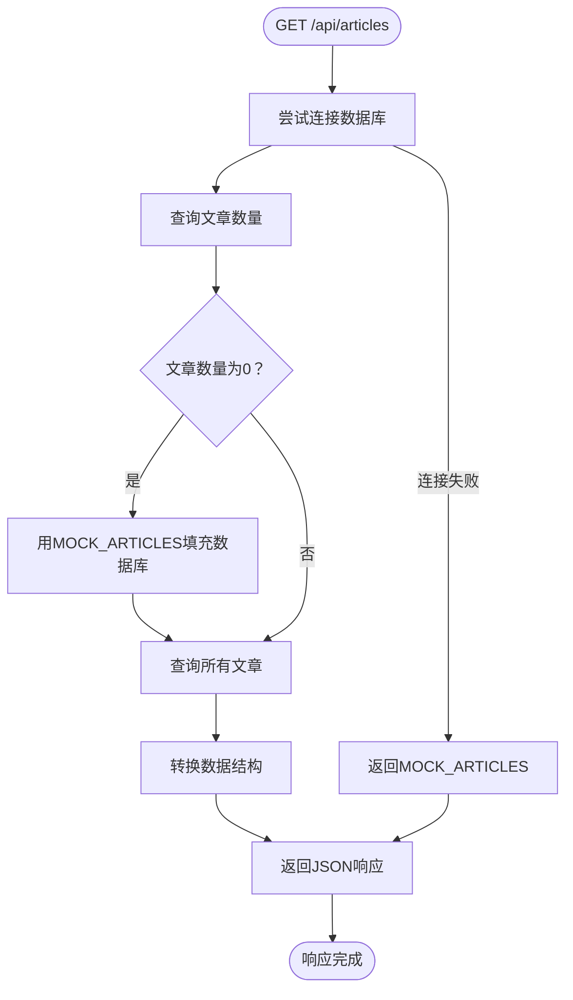
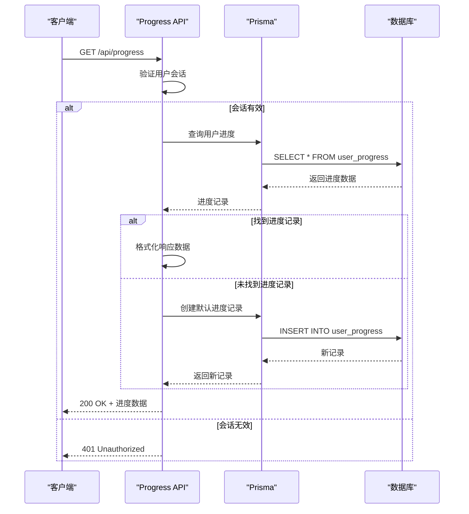
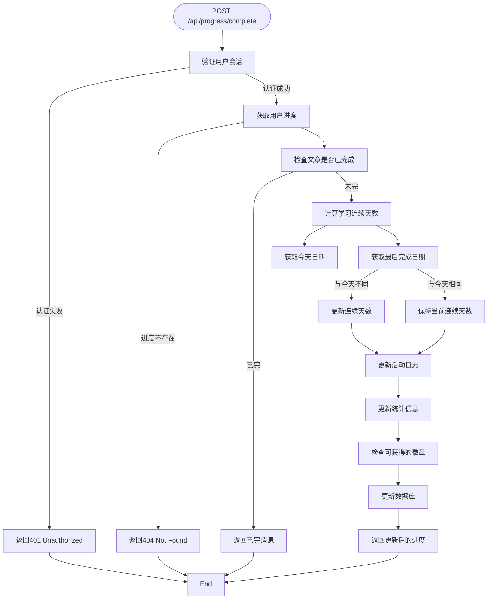
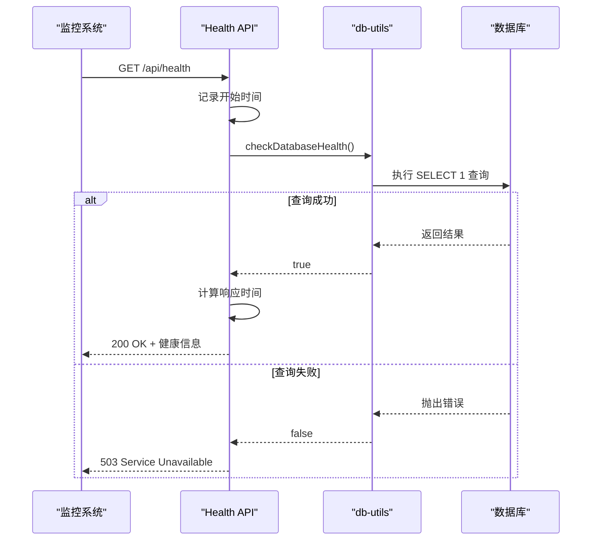
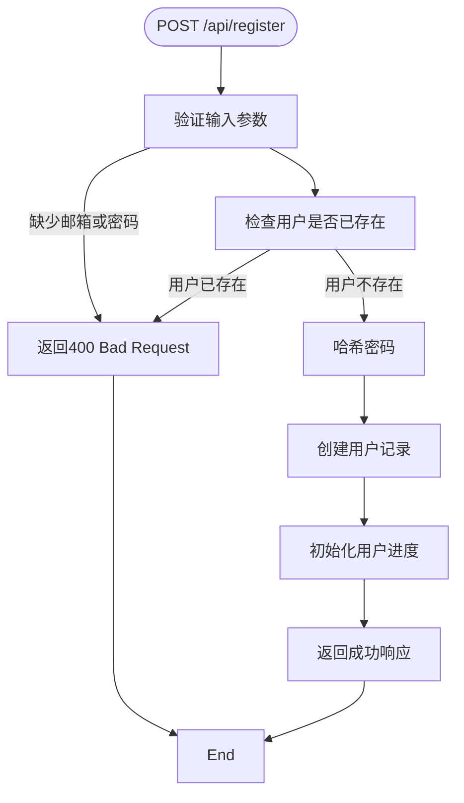
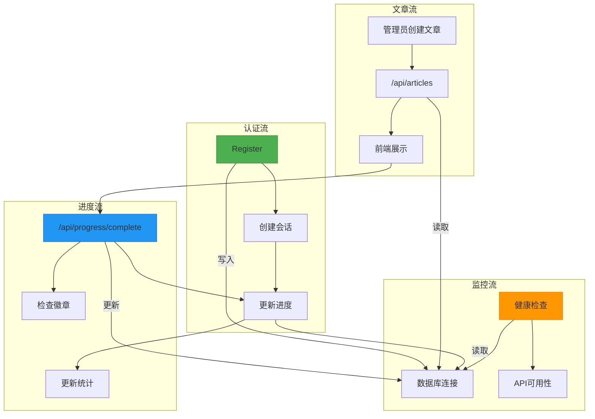
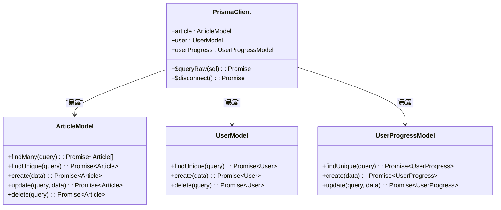

# API端点

<cite>
**本文档中引用的文件**   
- [articles/route.ts](file://app/api/articles/route.ts)
- [progress/route.ts](file://app/api/progress/route.ts)
- [progress/complete/route.ts](file://app/api/progress/complete/route.ts)
- [health/route.ts](file://app/api/health/route.ts)
- [register/route.ts](file://app/api/register/route.ts)
- [admin/articles/route.ts](file://app/api/admin/articles/route.ts)
- [admin/users/route.ts](file://app/api/admin/users/route.ts)
- [admin/articles/[id]/route.ts](file://app/api/admin/articles/[id]/route.ts)
- [admin/users/[id]/route.ts](file://app/api/admin/users/[id]/route.ts)
- [prisma.ts](file://lib/prisma.ts)
- [db-utils.ts](file://lib/db-utils.ts)
- [auth.ts](file://lib/auth.ts)
- [schema.prisma](file://prisma/schema.prisma)
- [types.ts](file://types.ts)
- [constants.ts](file://constants.ts)
</cite>

## 目录
1. [简介](#简介)
2. [核心API端点](#核心api端点)
3. [/articles端点](#articles端点)
4. [/progress端点](#progress端点)
5. [/progress/complete端点](#progresscomplete端点)
6. [/health端点](#health端点)
7. [/register端点](#register端点)
8. [管理员专用端点](#管理员专用端点)
9. [数据流与调用关系](#数据流与调用关系)
10. [错误处理与状态码](#错误处理与状态码)
11. [数据库交互机制](#数据库交互机制)

## 简介
本项目提供了一套完整的RESTful API接口，用于支持每日英语阅读应用的核心功能。API设计遵循清晰的职责分离原则，分为公共端点和管理员专用端点两大类。公共端点包括文章获取、用户进度管理、健康检查和用户注册等功能，而管理员端点则提供了对文章和用户的完整CRUD操作能力。

系统采用Next.js App Router架构，所有API端点位于`app/api`目录下，通过Prisma ORM与MySQL数据库进行交互。认证系统基于NextAuth.js实现，支持JWT会话管理，并通过角色权限控制（user/admin）确保接口安全。

**本文档将详细说明各API端点的功能、请求响应格式、数据验证逻辑以及与数据库的交互方式。**

## 核心API端点
项目实现了多个RESTful API端点，主要分为以下几类：

- **公共读取端点**：`/api/articles` 用于获取文章列表
- **用户进度端点**：`/api/progress` 和 `/api/progress/complete` 用于获取和更新学习进度
- **健康检查端点**：`/api/health` 用于系统健康状态检测
- **用户管理端点**：`/api/register` 用于新用户注册
- **管理员专用端点**：位于`/api/admin`下的文章和用户管理接口

这些端点共同构成了应用的数据交互核心，支持前端页面的动态内容加载和用户状态管理。

```mermaid
graph TB
subgraph "前端界面"
Library[文章库]
Stats[学习统计]
Admin[管理后台]
end
subgraph "API端点"
Articles[/api/articles]
Progress[/api/progress]
Complete[/api/progress/complete]
Health[/api/health]
Register[/api/register]
AdminAPI[/api/admin/*]
end
subgraph "数据层"
Prisma[Prisma ORM]
DB[(MySQL数据库)]
end
Library --> Articles
Stats --> Progress
Stats --> Complete
Admin --> AdminAPI
Register --> Register
Articles --> Prisma
Progress --> Prisma
Complete --> Prisma
Register --> Prisma
AdminAPI --> Prisma
Prisma --> DB
Health -.-> Prisma
```

**Diagram sources**
- [articles/route.ts](file://app/api/articles/route.ts)
- [progress/route.ts](file://app/api/progress/route.ts)
- [progress/complete/route.ts](file://app/api/progress/complete/route.ts)
- [health/route.ts](file://app/api/health/route.ts)
- [register/route.ts](file://app/api/register/route.ts)
- [prisma.ts](file://lib/prisma.ts)

## /articles端点
`/api/articles`端点提供文章列表的获取功能，是应用的核心数据源之一。该端点采用GET方法，返回所有可用文章的列表，按发布日期降序排列。

### 请求与响应
- **HTTP方法**：GET
- **请求路径**：`/api/articles`
- **认证要求**：无（公开访问）
- **响应格式**：JSON数组，包含文章对象

### 数据处理流程
当首次访问该端点时，系统会尝试连接数据库并检查文章表是否为空。如果为空，系统会使用`MOCK_ARTICLES`常量中的模拟数据进行数据库初始化（种子数据填充），确保即使在数据库为空的情况下也能提供内容。



**Diagram sources**
- [articles/route.ts](file://app/api/articles/route.ts#L5-L52)
- [constants.ts](file://constants.ts#L10-L114)

### 响应体结构
成功响应返回文章对象数组，每个对象包含以下字段：

| 字段 | 类型 | 描述 |
|------|------|------|
| id | string | 文章唯一标识符 |
| title | object | 包含en和zh属性的双语标题对象 |
| date | string | 文章发布日期（YYYY-MM-DD格式） |
| summary | object | 包含en和zh属性的双语摘要对象 |
| content | array | 内容块数组，每个块包含en和zh字段 |
| difficulty | string | 难度等级（Beginner/Intermediate/Advanced） |
| durationSeconds | number | 预计阅读时长（秒） |
| audioUrl | string | 音频资源URL（可选） |

### curl示例
```bash
curl -X GET "http://localhost:3000/api/articles" \
     -H "Content-Type: application/json"
```

**Section sources**
- [articles/route.ts](file://app/api/articles/route.ts#L5-L52)
- [constants.ts](file://constants.ts#L10-L114)

## /progress端点
`/api/progress`端点用于获取当前用户的完整学习进度信息，包括已完成文章、统计数据和徽章等。该端点采用GET方法，需要用户认证。

### 请求与响应
- **HTTP方法**：GET
- **请求路径**：`/api/progress`
- **认证要求**：是（需要有效会话）
- **响应格式**：包含进度和统计信息的JSON对象

### 认证与授权
端点首先通过`getServerSession(authOptions)`验证用户会话。如果用户未登录或会话无效，则返回401 Unauthorized错误。



**Diagram sources**
- [progress/route.ts](file://app/api/progress/route.ts#L8-L78)
- [lib/auth.ts](file://lib/auth.ts)

### 数据结构与格式化
从数据库获取的原始进度数据会被重新格式化为前端友好的结构。特别是统计信息中的难度计数会被映射到`Difficulty`枚举值。

响应体结构：
```json
{
  "completedArticleIds": ["art-001", "art-002"],
  "stats": {
    "totalDaysLearned": 5,
    "totalArticlesCompleted": 8,
    "currentStreak": 3,
    "longestStreak": 5,
    "articlesByDifficulty": {
      "Beginner": 2,
      "Intermediate": 5,
      "Advanced": 1
    },
    "lastCompletedDate": "2024-01-15",
    "activityLog": {
      "2024-01-15": 1,
      "2024-01-14": 1
    },
    "badges": ["badge-first-step", "badge-on-fire"]
  }
}
```

### 错误处理
端点实现了详细的错误处理机制，针对不同的数据库错误代码返回相应的用户友好消息：

- **P2024**：数据库连接池已满，返回503 Service Unavailable
- **P1001**：无法连接到数据库服务器，返回503 Service Unavailable
- 其他错误：返回500 Internal Server Error

**Section sources**
- [progress/route.ts](file://app/api/progress/route.ts#L8-L78)
- [types.ts](file://types.ts#L36-L45)

## /progress/complete端点
`/api/progress/complete`端点用于更新用户的学习进度，当用户完成一篇文章时调用。该端点采用POST方法，需要用户认证。

### 请求与响应
- **HTTP方法**：POST
- **请求路径**：`/api/progress/complete`
- **认证要求**：是（需要有效会话）
- **请求体**：JSON对象，包含`articleId`和`difficulty`
- **响应格式**：更新后的进度信息和可能获得的新徽章

### 处理流程
端点执行一系列业务逻辑来更新用户进度，包括连续学习天数计算、徽章授予等。



**Diagram sources**
- [progress/complete/route.ts](file://app/api/progress/complete/route.ts#L8-L124)
- [constants.ts](file://constants.ts#L116-L145)

### 业务逻辑细节
1. **连续天数计算**：系统检查用户上次完成文章的日期，如果与今天连续，则增加连续天数；否则重置为1。
2. **活动日志更新**：在用户的活动日志中为今天增加一次完成记录。
3. **难度统计**：根据文章难度更新相应的计数器。
4. **徽章系统**：基于更新后的统计信息检查所有徽章条件，授予符合条件的新徽章。

### curl示例
```bash
curl -X POST "http://localhost:3000/api/progress/complete" \
     -H "Content-Type: application/json" \
     -d '{
           "articleId": "art-001",
           "difficulty": "Intermediate"
         }'
```

**Section sources**
- [progress/complete/route.ts](file://app/api/progress/complete/route.ts#L8-L124)
- [constants.ts](file://constants.ts#L116-L145)

## /health端点
`/api/health`端点提供系统健康检查功能，用于监控应用和数据库的运行状态。

### 请求与响应
- **HTTP方法**：GET
- **请求路径**：`/api/health`
- **认证要求**：无
- **响应格式**：包含健康状态信息的JSON对象

### 健康检查机制
端点通过执行一个简单的数据库查询（`SELECT 1`）来验证数据库连接是否正常。



**Diagram sources**
- [health/route.ts](file://app/api/health/route.ts#L8-L38)
- [lib/db-utils.ts](file://lib/db-utils.ts#L51-L58)

### 响应体结构
成功响应（200 OK）：
```json
{
  "status": "healthy",
  "database": "connected",
  "responseTime": "15ms",
  "timestamp": "2024-01-15T10:30:00.000Z"
}
```

失败响应（503 Service Unavailable）：
```json
{
  "status": "unhealthy",
  "database": "disconnected",
  "responseTime": "500ms",
  "timestamp": "2024-01-15T10:30:00.000Z"
}
```

此端点通常用于Kubernetes等容器编排系统的存活探针和就绪探针。

**Section sources**
- [health/route.ts](file://app/api/health/route.ts#L8-L38)
- [lib/db-utils.ts](file://lib/db-utils.ts#L51-L58)

## /register端点
`/api/register`端点处理新用户注册请求，创建用户账户并初始化其学习进度。

### 请求与响应
- **HTTP方法**：POST
- **请求路径**：`/api/register`
- **认证要求**：无
- **请求体**：JSON对象，包含`email`、`password`和可选的`name`
- **响应格式**：注册结果信息

### 注册流程


**Diagram sources**
- [register/route.ts](file://app/api/register/route.ts#L5-L57)
- [prisma/schema.prisma](file://prisma/schema.prisma#L12-L25)

### 数据验证与安全
1. **必填字段验证**：确保`email`和`password`字段存在
2. **唯一性检查**：通过`prisma.user.findUnique`检查邮箱是否已被注册
3. **密码安全**：使用bcryptjs对密码进行哈希处理，盐值为10轮
4. **默认值处理**：如果未提供姓名，则使用邮箱前缀作为默认名称

### 用户与进度关联
在创建用户时，通过Prisma的关系字段`progress`一次性创建关联的用户进度记录，确保数据一致性。

```prisma
progress: {
    create: {
        completedArticleIds: [],
        activityLog: {},
        badges: [],
    }
}
```

**Section sources**
- [register/route.ts](file://app/api/register/route.ts#L5-L57)
- [prisma/schema.prisma](file://prisma/schema.prisma#L12-L25)

## 管理员专用端点
系统提供了一系列管理员专用端点，位于`/api/admin`路径下，用于管理文章和用户。

### 权限验证机制
所有管理员端点都使用`requireAdmin()`函数进行权限验证，该函数检查用户会话中的角色信息。

```typescript
const authResult = await requireAdmin();
if (authResult.error) {
  return NextResponse.json(
    { error: authResult.error },
    { status: authResult.status }
  );
}
```

### 文章管理端点
`/api/admin/articles`提供对文章的完整CRUD操作：

| 方法 | 路径 | 功能 | 认证要求 |
|------|------|------|----------|
| GET | /api/admin/articles | 获取所有文章列表 | 管理员 |
| POST | /api/admin/articles | 创建新文章 | 管理员 |
| GET | /api/admin/articles/[id] | 获取单篇文章 | 管理员 |
| PUT | /api/admin/articles/[id] | 更新文章 | 管理员 |
| DELETE | /api/admin/articles/[id] | 删除文章 | 管理员 |

### 用户管理端点
`/api/admin/users`提供对用户的管理功能：

| 方法 | 路径 | 功能 | 认证要求 |
|------|------|------|----------|
| GET | /api/admin/users | 获取所有用户列表 | 管理员 |
| GET | /api/admin/users/[id] | 获取用户详情 | 管理员 |
| DELETE | /api/admin/users/[id] | 删除用户 | 管理员 |

### 数据验证
管理员端点实施了严格的数据验证，包括：
- 必需字段检查
- 枚举值验证（如difficulty）
- 数值范围验证（如durationSeconds）
- 数据结构验证（如content必须是数组）

**Section sources**
- [admin/articles/route.ts](file://app/api/admin/articles/route.ts)
- [admin/users/route.ts](file://app/api/admin/users/route.ts)
- [admin/articles/[id]/route.ts](file://app/api/admin/articles/[id]/route.ts)
- [admin/users/[id]/route.ts](file://app/api/admin/users/[id]/route.ts)
- [lib/auth.ts](file://lib/auth.ts#L77-L101)

## 数据流与调用关系
各API端点之间存在明确的数据流和调用关系，形成了完整的应用数据生态。



**Diagram sources**
- [register/route.ts](file://app/api/register/route.ts)
- [progress/complete/route.ts](file://app/api/progress/complete/route.ts)
- [health/route.ts](file://app/api/health/route.ts)
- [articles/route.ts](file://app/api/articles/route.ts)

## 错误处理与状态码
系统实现了统一的错误处理策略，为不同类型的错误返回适当的HTTP状态码和用户友好消息。

### 状态码使用规范
| 状态码 | 使用场景 |
|--------|----------|
| 200 OK | 请求成功，返回数据 |
| 201 Created | 资源创建成功 |
| 400 Bad Request | 请求参数无效或缺失 |
| 401 Unauthorized | 用户未认证 |
| 403 Forbidden | 用户无权限访问资源 |
| 404 Not Found | 请求的资源不存在 |
| 500 Internal Server Error | 服务器内部错误 |
| 503 Service Unavailable | 服务暂时不可用 |

### 错误响应结构
大多数错误响应遵循统一的JSON格式：
```json
{
  "error": "错误描述信息"
}
```

对于特定的数据库错误，系统会返回更具体的错误信息，如连接池满或无法连接数据库等。

**Section sources**
- [progress/route.ts](file://app/api/progress/route.ts#L58-L77)
- [register/route.ts](file://app/api/register/route.ts#L10-L13)
- [admin/articles/route.ts](file://app/api/admin/articles/route.ts#L71-L74)

## 数据库交互机制
系统通过Prisma ORM与MySQL数据库进行交互，实现了高效、安全的数据访问。

### Prisma客户端配置
`lib/prisma.ts`文件中配置了Prisma客户端，包含连接池管理和健康检查机制。



**Diagram sources**
- [lib/prisma.ts](file://lib/prisma.ts)
- [prisma/schema.prisma](file://prisma/schema.prisma)

### 数据库操作最佳实践
1. **连接管理**：在开发环境中定期检查连接健康状态，在进程退出时优雅关闭连接
2. **日志控制**：生产环境不记录日志，开发环境只记录错误日志
3. **重试机制**：`withRetry`函数为数据库操作提供重试能力，针对连接相关错误进行指数退避重试
4. **限流控制**：通过`dbRequestLimiter`控制并发数据库请求，防止资源耗尽

### 数据模型关系
数据库包含三个主要模型，通过外键关系相互关联：

- **User** ↔ **UserProgress**：一对一关系，用户拥有一个进度记录
- **User** 和 **Article**：独立实体，通过`completedArticleIds`数组关联

这种设计确保了数据的规范化和查询效率。

**Section sources**
- [lib/prisma.ts](file://lib/prisma.ts)
- [lib/db-utils.ts](file://lib/db-utils.ts)
- [prisma/schema.prisma](file://prisma/schema.prisma)