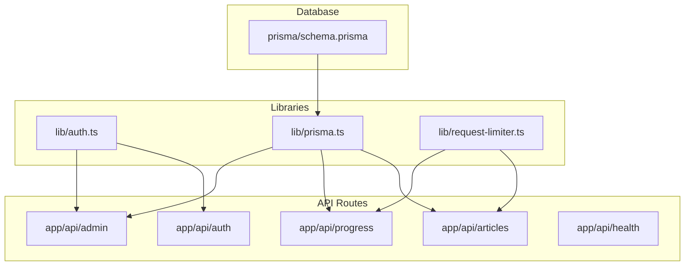
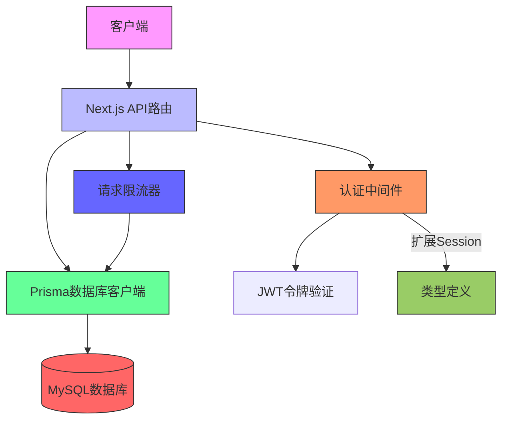
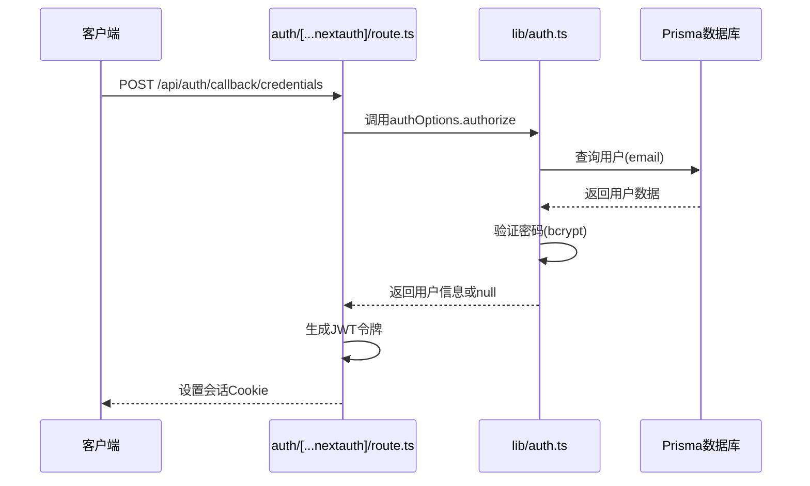
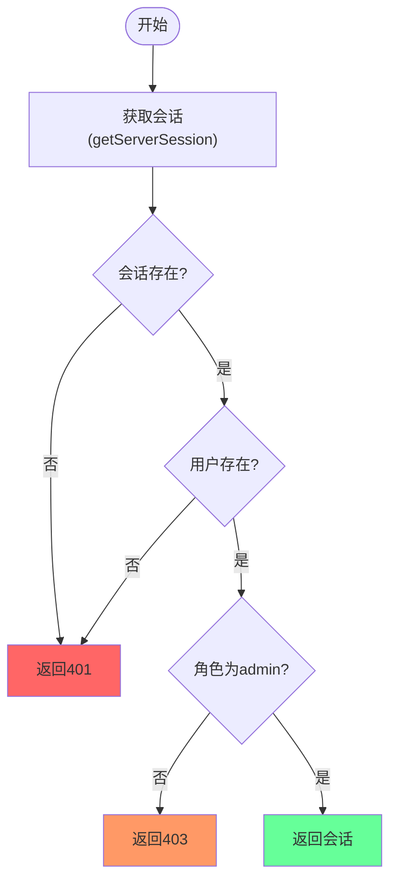
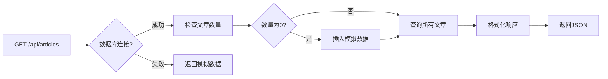
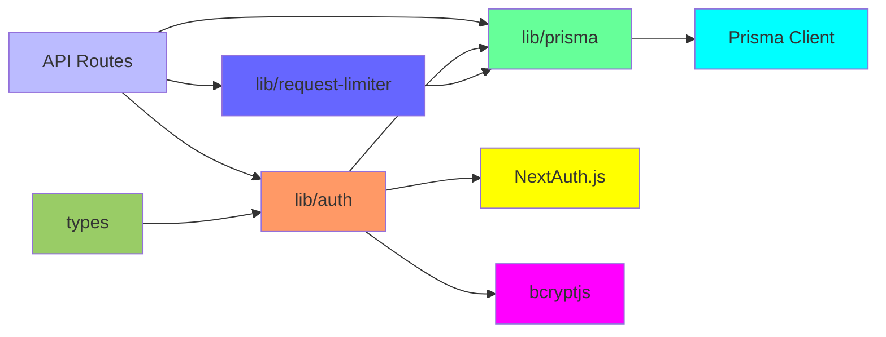

# 后端架构

<cite>
**本文档中引用的文件**  
- [app/api/articles/route.ts](file://app/api/articles/route.ts)
- [app/api/progress/route.ts](file://app/api/progress/route.ts)
- [app/api/admin/articles/[id]/route.ts](file://app/api/admin/articles/[id]/route.ts)
- [app/api/admin/users/[id]/route.ts](file://app/api/admin/users/[id]/route.ts)
- [app/api/auth/[...nextauth]/route.ts](file://app/api/auth/[...nextauth]/route.ts)
- [app/api/register/route.ts](file://app/api/register/route.ts)
- [app/api/health/route.ts](file://app/api/health/route.ts)
- [app/api/progress/complete/route.ts](file://app/api/progress/complete/route.ts)
- [lib/auth.ts](file://lib/auth.ts)
- [lib/prisma.ts](file://lib/prisma.ts)
- [lib/request-limiter.ts](file://lib/request-limiter.ts)
- [types/next-auth.d.ts](file://types/next-auth.d.ts)
- [prisma/schema.prisma](file://prisma/schema.prisma)
</cite>

## 目录
1. [简介](#简介)
2. [项目结构](#项目结构)
3. [核心组件](#核心组件)
4. [架构概览](#架构概览)
5. [详细组件分析](#详细组件分析)
6. [依赖分析](#依赖分析)
7. [性能考虑](#性能考虑)
8. [故障排除指南](#故障排除指南)
9. [结论](#结论)

## 简介
本项目是一个基于Next.js的英语学习阅读应用，提供用户学习进度追踪、文章管理与管理员控制功能。后端架构围绕Next.js API路由构建，采用Prisma作为数据库ORM，结合NextAuth.js实现认证机制，并通过JWT进行会话管理。系统支持RESTful API设计，具备完整的权限控制、数据验证和错误处理机制。

## 项目结构

**图示来源**  
- [app/api](file://app/api)
- [lib](file://lib)
- [prisma](file://prisma)

**章节来源**  
- [app/api](file://app/api)
- [lib](file://lib)
- [prisma](file://prisma)

## 核心组件

后端核心组件包括：API路由处理、认证系统、数据库访问层、请求限流器和类型扩展。这些组件协同工作，确保系统的安全性、可维护性和可扩展性。

**章节来源**  
- [lib/auth.ts](file://lib/auth.ts)
- [lib/prisma.ts](file://lib/prisma.ts)
- [lib/request-limiter.ts](file://lib/request-limiter.ts)
- [types/next-auth.d.ts](file://types/next-auth.d.ts)

## 架构概览

**图示来源**  
- [app/api](file://app/api)
- [lib/auth.ts](file://lib/auth.ts)
- [lib/prisma.ts](file://lib/prisma.ts)
- [lib/request-limiter.ts](file://lib/request-limiter.ts)
- [types/next-auth.d.ts](file://types/next-auth.d.ts)

## 详细组件分析

### API路由组织

Next.js的App Router模式将所有API端点组织在`app/api/`目录下，每个`.ts`文件对应一个RESTful端点。动态路由使用`[param]`语法，如`app/api/articles/[id]/route.ts`处理特定文章的CRUD操作。管理员API位于`app/api/admin/`子目录，通过中间件进行权限隔离。

**章节来源**  
- [app/api](file://app/api)

### 认证机制分析

**图示来源**  
- [app/api/auth/[...nextauth]/route.ts](file://app/api/auth/[...nextauth]/route.ts)
- [lib/auth.ts](file://lib/auth.ts)
- [prisma/schema.prisma](file://prisma/schema.prisma)

**章节来源**  
- [lib/auth.ts](file://lib/auth.ts)
- [app/api/auth/[...nextauth]/route.ts](file://app/api/auth/[...nextauth]/route.ts)
- [types/next-auth.d.ts](file://types/next-auth.d.ts)

#### JWT令牌生成与验证

认证流程使用JWT策略（`session.strategy = "jwt"`），在登录时通过`jwt`回调将用户角色（role）和ID注入令牌。会话建立后，`session`回调将令牌中的信息同步到前端可访问的session对象中，实现跨请求的身份持久化。

**章节来源**  
- [lib/auth.ts](file://lib/auth.ts#L46-L69)

#### 管理员权限校验

`requireAdmin`中间件封装了管理员权限检查逻辑。它首先通过`getServerSession`获取当前会话，验证用户是否存在，然后检查其角色是否为`admin`。若权限不足，返回相应的HTTP状态码（401未授权或403禁止访问）。

**图示来源**  
- [lib/auth.ts](file://lib/auth.ts#L77-L99)

**章节来源**  
- [lib/auth.ts](file://lib/auth.ts#L77-L99)

### 关键API端点分析

#### /articles端点

该端点提供文章列表的读取功能。首次访问时若数据库为空，则使用`MOCK_ARTICLES`进行种子数据填充。响应数据经过格式化以匹配前端结构，并在数据库连接失败时自动降级返回模拟数据，确保系统可用性。

**图示来源**  
- [app/api/articles/route.ts](file://app/api/articles/route.ts)

**章节来源**  
- [app/api/articles/route.ts](file://app/api/articles/route.ts)
- [constants.ts](file://constants.ts)

#### /progress端点

此端点获取用户学习进度，需用户认证。通过会话获取用户ID后查询`UserProgress`记录，若不存在则自动创建。错误处理针对Prisma特定错误码（如P2024连接池满、P1001连接失败）提供友好提示。

**章节来源**  
- [app/api/progress/route.ts](file://app/api/progress/route.ts)

#### /progress/complete端点

处理文章完成状态更新。包含完整的业务逻辑：更新完成列表、计算连续学习天数、统计各难度文章数量、检查徽章解锁条件等。所有数据库操作通过事务保证一致性。

**章节来源**  
- [app/api/progress/complete/route.ts](file://app/api/progress/complete/route.ts)

#### 管理员API端点

管理员API（如`/admin/articles/[id]`和`/admin/users/[id]`）均集成`requireAdmin`权限校验。支持对文章和用户的完整CRUD操作，包含详细的数据验证逻辑（如难度值校验、内容结构验证）和错误处理。

**章节来源**  
- [app/api/admin/articles/[id]/route.ts](file://app/api/admin/articles/[id]/route.ts)
- [app/api/admin/users/[id]/route.ts](file://app/api/admin/users/[id]/route.ts)

### 数据库集成

Prisma客户端通过单例模式导出，避免开发环境中的内存泄漏。配置了生产环境无日志、开发环境仅记录错误的策略。实现了优雅关闭（进程退出时断开连接）和连接健康检查（每5分钟）。

**章节来源**  
- [lib/prisma.ts](file://lib/prisma.ts)

## 依赖分析

**图示来源**  
- [package.json](file://package.json)
- [lib](file://lib)
- [app/api](file://app/api)

**章节来源**  
- [package.json](file://package.json)
- [lib](file://lib)

## 性能考虑

系统通过`request-limiter.ts`中的`dbRequestLimiter`实例限制并发数据库请求数（默认8个），防止高负载下数据库连接耗尽。该限流器采用队列机制，确保请求有序执行，避免资源竞争。

**章节来源**  
- [lib/request-limiter.ts](file://lib/request-limiter.ts)

## 故障排除指南

常见问题包括数据库连接失败、认证失效和权限不足。建议检查环境变量`DATABASE_URL`配置、会话Cookie状态以及用户角色设置。健康检查端点`/api/health`可用于快速诊断数据库连接状态。

**章节来源**  
- [app/api/health/route.ts](file://app/api/health/route.ts)
- [lib/prisma.ts](file://lib/prisma.ts)
- [lib/auth.ts](file://lib/auth.ts)

## 结论

本后端架构设计合理，具备良好的安全性、可维护性和扩展性。通过Next.js API路由、Prisma ORM和NextAuth.js的有机结合，实现了功能完整的RESTful API服务。建议未来增加速率限制中间件、CORS策略配置和更细粒度的日志记录以进一步提升系统健壮性。