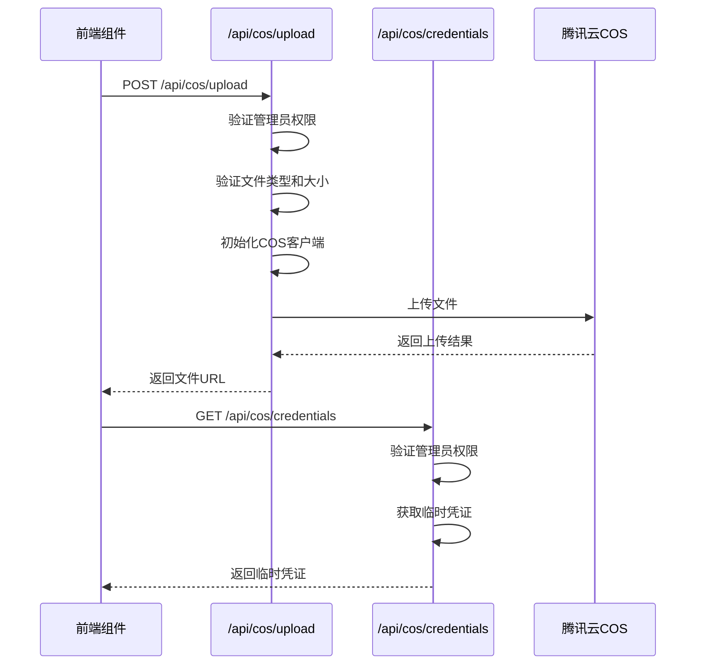
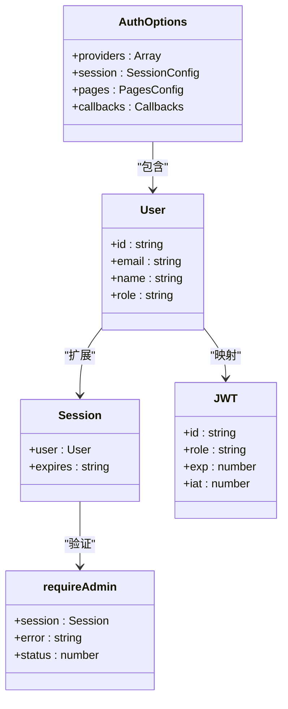
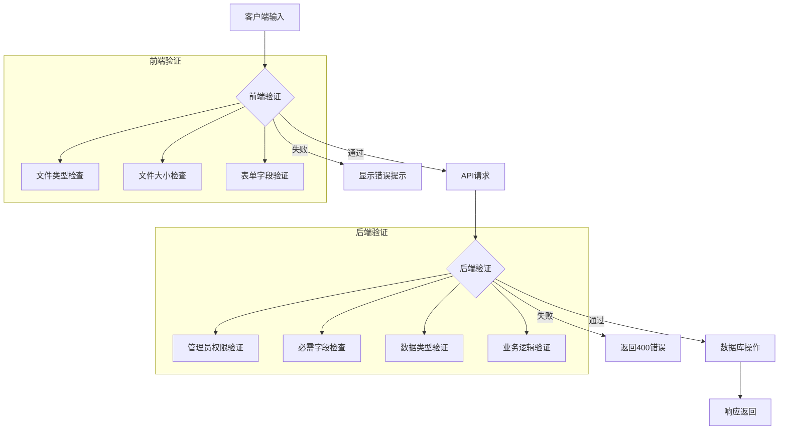
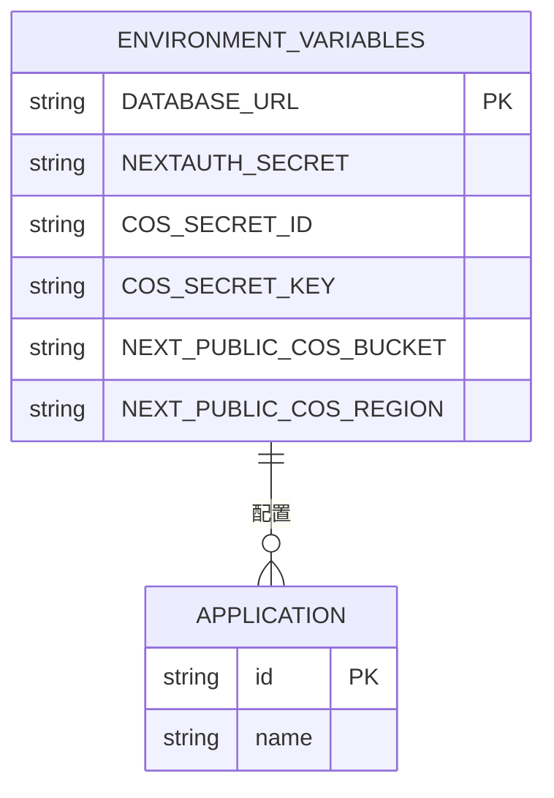

# 安全机制

<cite>
**本文档中引用的文件**
- [request-limiter.ts](file://lib/request-limiter.ts)
- [cos/credentials/route.ts](file://app/api/cos/credentials/route.ts)
- [cos/upload/route.ts](file://app/api/cos/upload/route.ts)
- [auth.ts](file://lib/auth.ts)
- [.env](file://.env)
- [db-utils.ts](file://lib/db-utils.ts)
- [prisma/schema.prisma](file://prisma/schema.prisma)
- [next.config.js](file://next.config.js)
- [vite.config.ts](file://vite.config.ts)
</cite>

## 目录
1. [引言](#引言)
2. [请求限流器机制](#请求限流器机制)
3. [COS API安全机制](#cos-api安全机制)
4. [身份验证与权限控制](#身份验证与权限控制)
5. [输入验证与数据安全](#输入验证与数据安全)
6. [环境变量与敏感信息保护](#环境变量与敏感信息保护)
7. [安全配置最佳实践](#安全配置最佳实践)
8. [潜在风险与缓解措施](#潜在风险与缓解措施)

## 引言
本系统通过多层次的安全机制保障后端服务的安全性，包括请求限流、文件上传安全、身份验证、输入验证和敏感信息保护等方面。系统采用基于JWT的认证机制，通过角色权限控制访问，使用临时凭证保障文件上传安全，并通过限流器防止数据库过载。这些安全措施共同构建了一个健壮的后端安全体系。

## 请求限流器机制

系统实现了基于并发控制的请求限流器，用于防止过多的数据库请求同时执行，保护数据库资源。

```mermaid
classDiagram
class RequestLimiter {
-queue : Array<() => void>
-activeRequests : number
-maxConcurrent : number
+acquire() : Promise<void>
+release() : void
+execute<T>(operation : () => Promise<T>) : Promise<T>
+getStats() : {active : number, queued : number, max : number}
}
class dbRequestLimiter {
<<instance>>
}
RequestLimiter --> dbRequestLimiter : "实例化"
```

**图示来源**
- [request-limiter.ts](file://lib/request-limiter.ts#L4-L49)

**节来源**
- [request-limiter.ts](file://lib/request-limiter.ts#L1-L52)
- [db-utils.ts](file://lib/db-utils.ts#L2-L16)

### 限流器工作原理
请求限流器采用简单的并发控制策略，通过维护一个活动请求数和等待队列来实现限流功能。当活动请求数小于最大并发数时，请求立即获得许可；否则，请求被加入等待队列，直到有资源释放。

### 限流策略配置
限流器的配置参数包括：
- **最大并发数**：默认为8，通过`dbRequestLimiter = new RequestLimiter(8)`设置
- **时间窗口**：基于实时并发控制，而非固定时间窗口
- **队列管理**：先进先出(FIFO)策略处理等待请求

### 限流触发后的响应行为
当系统达到最大并发限制时，新请求不会被拒绝，而是被放入等待队列。这种设计避免了直接拒绝请求导致的客户端重试风暴，通过平滑的队列机制处理高峰流量，确保系统稳定性。

## COS API安全机制

系统通过专门的API端点为腾讯云COS服务提供安全的文件上传功能，采用多层安全控制确保文件上传过程的安全性。



**图示来源**
- [cos/credentials/route.ts](file://app/api/cos/credentials/route.ts#L8-L42)
- [cos/upload/route.ts](file://app/api/cos/upload/route.ts#L9-L104)

**节来源**
- [cos/credentials/route.ts](file://app/api/cos/credentials/route.ts#L1-L43)
- [cos/upload/route.ts](file://app/api/cos/upload/route.ts#L1-L105)
- [CosUploader.tsx](file://components/CosUploader.tsx#L1-L189)

### 临时凭证安全机制
COS凭证API (`/api/cos/credentials`) 为管理员用户提供腾讯云COS的临时访问凭证，其安全机制包括：
- **权限验证**：通过`requireAdmin()`函数验证用户是否为管理员
- **临时性**：返回的凭证设置1小时过期时间，减少长期暴露风险
- **服务端生成**：凭证在服务端生成，避免前端直接接触永久密钥

### 文件上传安全控制
文件上传API (`/api/cos/upload`) 实现了严格的文件上传安全控制：
- **权限控制**：仅允许管理员用户上传文件
- **文件类型验证**：限制为音频文件类型（mp3, wav, ogg, aac, m4a）
- **文件大小限制**：最大50MB，通过API配置和代码双重验证
- **安全的文件命名**：使用时间戳和随机字符串生成唯一文件名，防止路径遍历攻击

### 安全漏洞与改进建议
当前COS安全机制存在以下潜在问题：
- **开发环境配置**：生产环境中应使用腾讯云STS服务获取真正的临时密钥，而非直接使用永久密钥
- **缺少文件内容扫描**：未对上传的音频文件进行恶意内容检测
- **凭证过期时间固定**：应根据使用场景动态调整凭证有效期

## 身份验证与权限控制

系统采用NextAuth实现完整的身份验证和权限控制机制，确保只有授权用户才能访问受保护资源。



**图示来源**
- [auth.ts](file://lib/auth.ts#L7-L100)
- [types/next-auth.d.ts](file://types/next-auth.d.ts#L1-L31)

**节来源**
- [auth.ts](file://lib/auth.ts#L1-L101)
- [types/next-auth.d.ts](file://types/next-auth.d.ts#L1-L31)
- [prisma/schema.prisma](file://prisma/schema.prisma#L11-L25)

### 认证流程
系统使用基于JWT的认证流程：
1. 用户通过邮箱和密码登录
2. 系统验证凭据并创建JWT令牌
3. 令牌中包含用户ID和角色信息
4. 后续请求通过JWT验证用户身份

### 权限控制机制
系统实现了基于角色的访问控制(RBAC)：
- **用户角色**：系统支持"admin"和"user"两种角色
- **管理员验证**：`requireAdmin()`函数检查用户角色，确保只有管理员可访问特定API
- **JWT扩展**：通过回调函数将用户角色注入JWT令牌和会话对象

### 安全配置
认证系统的安全配置包括：
- **密码加密**：使用bcrypt对用户密码进行哈希存储
- **JWT策略**：采用JWT会话策略，令牌存储在HTTP-only cookie中
- **错误处理**：统一的错误响应格式，避免泄露敏感信息

## 输入验证与数据安全

系统在多个层面实现了输入验证机制，防止常见的Web攻击，确保数据完整性和安全性。



**图示来源**
- [cos/upload/route.ts](file://app/api/cos/upload/route.ts#L31-L46)
- [admin/articles/route.ts](file://app/api/admin/articles/route.ts#L69-L110)
- [AuthForm.tsx](file://components/AuthForm.tsx#L75-L100)

**节来源**
- [cos/upload/route.ts](file://app/api/cos/upload/route.ts#L1-L105)
- [admin/articles/route.ts](file://app/api/admin/articles/route.ts#L1-L110)
- [AuthForm.tsx](file://components/AuthForm.tsx#L1-L100)

### 客户端验证
前端组件实现了多层输入验证：
- **文件上传**：验证文件类型和大小限制
- **表单输入**：确保必填字段不为空
- **即时反馈**：在用户输入时提供实时验证反馈

### 服务端验证
后端API实现了严格的输入验证：
- **权限验证**：所有管理功能均需管理员权限
- **字段验证**：检查必需字段是否存在
- **类型验证**：确保数据类型正确（如正整数验证）
- **业务规则验证**：检查数据是否符合业务逻辑

### 防御常见Web攻击
系统通过以下措施防御常见Web攻击：
- **XSS防护**：Next.js框架默认提供XSS防护，服务端渲染避免直接插入用户输入
- **CSRF防护**：NextAuth内置CSRF保护，使用同步令牌模式
- **SQL注入防护**：Prisma ORM自动参数化查询，防止SQL注入
- **文件上传攻击防护**：限制文件类型、大小和命名，防止恶意文件上传

## 环境变量与敏感信息保护

系统通过环境变量管理敏感配置信息，确保密钥和连接字符串等敏感数据的安全。



**图示来源**
- [.env](file://.env#L1-L14)
- [next.config.js](file://next.config.js#L1-L7)

**节来源**
- [.env](file://.env#L1-L14)
- [next.config.js](file://next.config.js#L1-L7)
- [vite.config.ts](file://vite.config.ts#L1-L23)

### 敏感信息管理
系统将敏感信息存储在环境变量中：
- **数据库连接**：包含连接字符串和认证信息
- **认证密钥**：NextAuth的加密密钥
- **云服务凭证**：腾讯云COS的访问密钥

### 环境变量分类
环境变量分为两类：
- **私有变量**：不以`NEXT_PUBLIC_`为前缀，仅在服务端可用（如数据库密码、COS密钥）
- **公共变量**：以`NEXT_PUBLIC_`为前缀，可在客户端访问（如COS存储桶名称）

### 安全风险与建议
当前环境变量管理存在以下风险：
- **开发密钥暴露**：`.env`文件中包含实际的云服务密钥，不应在生产环境中使用
- **缺少密钥轮换**：未实现定期轮换密钥的机制
- **无加密存储**：环境变量未加密存储

## 安全配置最佳实践

基于系统当前的安全机制，以下是推荐的安全配置最佳实践。

### 请求限流最佳实践
- **合理设置并发数**：根据服务器资源和数据库连接池大小调整最大并发数
- **监控限流状态**：定期检查`getStats()`返回的统计信息，优化限流配置
- **分层限流**：在API网关层和应用层实现多层级限流

### 文件上传安全最佳实践
- **使用真正的临时凭证**：集成腾讯云STS服务，获取有时效性的临时密钥
- **实现文件扫描**：对上传的文件进行病毒和恶意内容扫描
- **添加内容安全检查**：验证文件内容是否符合预期格式

### 身份验证最佳实践
- **定期轮换密钥**：定期更新`NEXTAUTH_SECRET`密钥
- **实施多因素认证**：为管理员账户添加额外的认证因素
- **会话管理**：实现会话超时和注销功能

### 环境安全最佳实践
- **使用密钥管理系统**：将敏感密钥存储在专用的密钥管理系统中
- **环境分离**：为开发、测试和生产环境使用不同的密钥
- **访问控制**：限制对包含敏感信息的环境变量的访问权限

## 潜在风险与缓解措施

### 潜在安全风险
1. **凭证硬编码风险**：`.env`文件中直接包含云服务密钥，存在泄露风险
2. **权限提升风险**：角色字段直接存储在JWT中，可能被篡改
3. **文件上传风险**：虽然限制了文件类型，但仍可能存在恶意音频文件
4. **数据库连接风险**：数据库连接字符串包含明文密码

### 风险缓解措施
1. **密钥管理改进**：
   - 使用云服务商的密钥管理服务(KMS)
   - 实现密钥自动轮换机制
   - 在生产环境中使用临时凭证而非永久密钥

2. **权限验证强化**：
   - 在关键操作时重新验证用户角色
   - 实现基于声明的访问控制
   - 定期审计权限分配

3. **文件安全增强**：
   - 实现文件内容验证，确保文件实际内容与声明类型一致
   - 添加文件上传后的安全扫描
   - 限制上传频率和总量

4. **监控与告警**：
   - 实现安全事件日志记录
   - 设置异常行为告警（如大量失败的登录尝试）
   - 定期进行安全审计