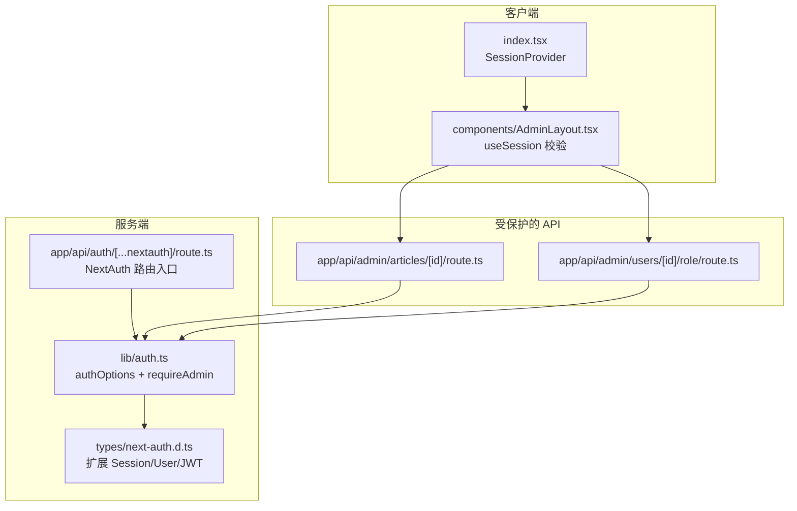
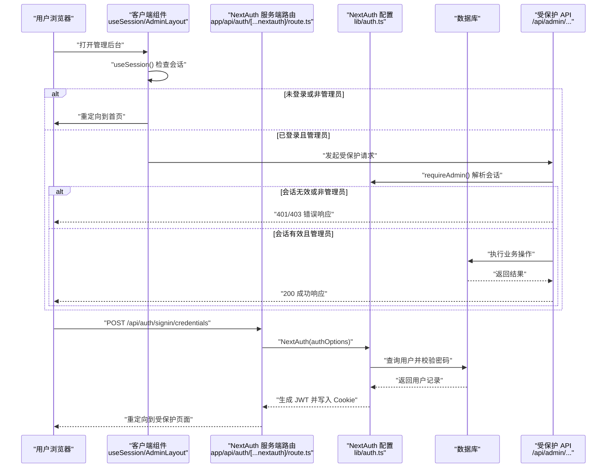
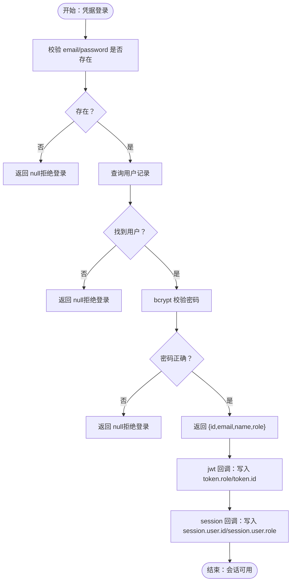
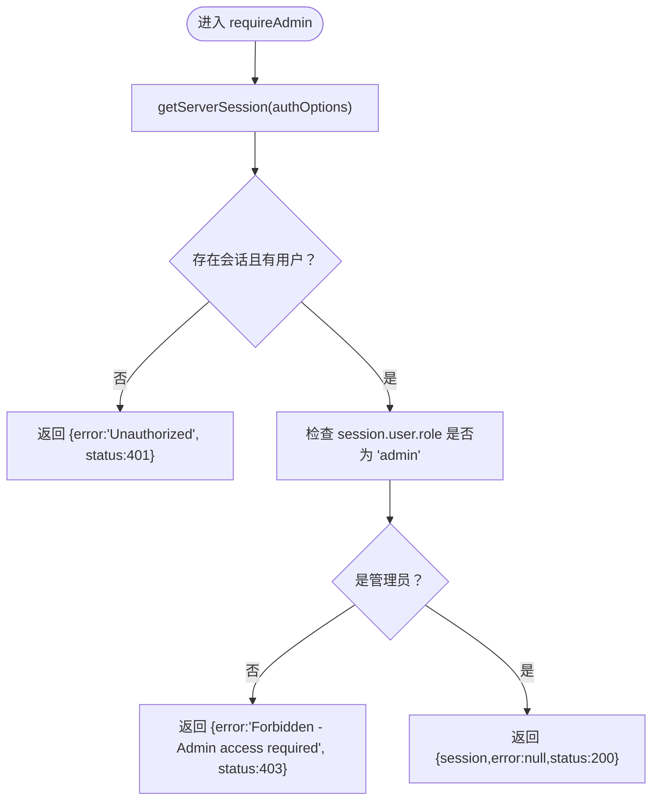
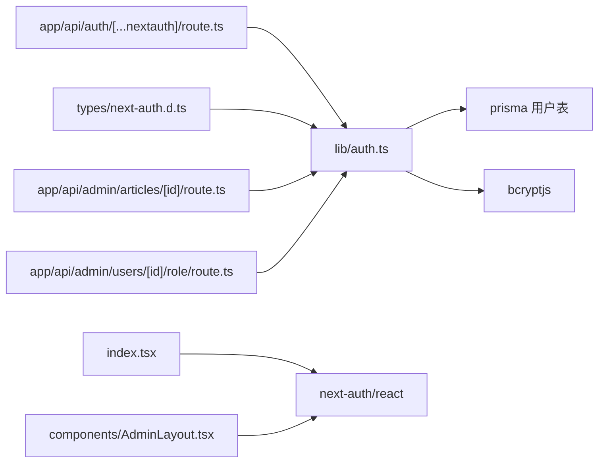

# 认证与授权

<cite>
**本文引用的文件**
- [app/api/auth/[...nextauth]/route.ts](file://app/api/auth/[...nextauth]/route.ts)
- [lib/auth.ts](file://lib/auth.ts)
- [types/next-auth.d.ts](file://types/next-auth.d.ts)
- [index.tsx](file://index.tsx)
- [components/AdminLayout.tsx](file://components/AdminLayout.tsx)
- [app/api/admin/articles/[id]/route.ts](file://app/api/admin/articles/[id]/route.ts)
- [app/api/admin/users/[id]/role/route.ts](file://app/api/admin/users/[id]/role/route.ts)
</cite>

## 目录
1. [简介](#简介)
2. [项目结构](#项目结构)
3. [核心组件](#核心组件)
4. [架构总览](#架构总览)
5. [详细组件分析](#详细组件分析)
6. [依赖关系分析](#依赖关系分析)
7. [性能考量](#性能考量)
8. [故障排查指南](#故障排查指南)
9. [结论](#结论)

## 简介
本文件系统性地文档化本项目的认证与授权机制，重点覆盖：
- NextAuth.js 在服务端的配置与集成：凭据登录提供者、JWT 会话策略、登录页重定向与回调扩展。
- 服务端会话解析与管理员权限校验：通过 requireAdmin 中间件统一保护敏感 API。
- 自定义类型扩展：为 Session、User、JWT 增加 id 与 role 字段，确保类型安全。
- 登录流程时序图：从用户提交凭据到建立安全会话的完整链路。
- API 路由保护实践：如何在后端路由中使用 requireAdmin 实现管理员访问控制。

## 项目结构
围绕认证与授权的关键文件组织如下：
- NextAuth 入口与配置
  - app/api/auth/[...nextauth]/route.ts：NextAuth 服务端路由入口，导出 GET/POST。
  - lib/auth.ts：NextAuth 配置（凭据提供者、JWT 回调、登录页）、requireAdmin 权限校验。
  - types/next-auth.d.ts：扩展 NextAuth 类型，补充 id 与 role 字段。
- 客户端会话提供器
  - index.tsx：根组件包裹 SessionProvider，使客户端可感知会话状态。
  - components/AdminLayout.tsx：管理员页面布局，基于 useSession 校验并重定向。
- 管理员受保护的 API 路由示例
  - app/api/admin/articles/[id]/route.ts：文章增删改查的管理员接口。
  - app/api/admin/users/[id]/role/route.ts：修改用户角色的管理员接口。

图表来源
- [app/api/auth/[...nextauth]/route.ts](file://app/api/auth/[...nextauth]/route.ts#L1-L6)
- [lib/auth.ts](file://lib/auth.ts#L1-L101)
- [types/next-auth.d.ts](file://types/next-auth.d.ts#L1-L32)
- [index.tsx](file://index.tsx#L1-L18)
- [components/AdminLayout.tsx](file://components/AdminLayout.tsx#L1-L105)
- [app/api/admin/articles/[id]/route.ts](file://app/api/admin/articles/[id]/route.ts#L1-L205)
- [app/api/admin/users/[id]/role/route.ts](file://app/api/admin/users/[id]/role/route.ts#L1-L73)

章节来源
- [app/api/auth/[...nextauth]/route.ts](file://app/api/auth/[...nextauth]/route.ts#L1-L6)
- [lib/auth.ts](file://lib/auth.ts#L1-L101)
- [types/next-auth.d.ts](file://types/next-auth.d.ts#L1-L32)
- [index.tsx](file://index.tsx#L1-L18)
- [components/AdminLayout.tsx](file://components/AdminLayout.tsx#L1-L105)
- [app/api/admin/articles/[id]/route.ts](file://app/api/admin/articles/[id]/route.ts#L1-L205)
- [app/api/admin/users/[id]/role/route.ts](file://app/api/admin/users/[id]/role/route.ts#L1-L73)

## 核心组件
- NextAuth 服务端路由入口
  - 将 NextAuth 与 authOptions 绑定，统一暴露 GET/POST，供 NextAuth 内部处理登录、登出、会话等请求。
- NextAuth 配置（lib/auth.ts）
  - 凭据提供者：接收 email/password，查询数据库用户并用 bcrypt 校验密码；成功时返回包含 id、email、name、role 的用户对象。
  - 会话策略：采用 JWT 策略，便于无状态存储与跨请求携带。
  - 登录页重定向：signIn 指向根路径，用于未登录或会话无效时跳转。
  - JWT 回调：首次登录时将用户 role/id 注入 token；随后在 session 回调中将 token 中的 id/role 注入 session.user，保证前后端一致。
  - requireAdmin：通过 getServerSession 获取当前会话，校验是否存在且用户 role 是否为 admin，返回统一的错误码与消息。
- 类型扩展（types/next-auth.d.ts）
  - 扩展 Session.user、User、JWT，新增 id 与 role 字段，避免运行时类型不匹配与 TS 报错。
- 客户端会话提供器（index.tsx）
  - 使用 SessionProvider 包裹应用，使 next-auth/react hooks（如 useSession）可在客户端组件中使用。
- 管理员页面布局（components/AdminLayout.tsx）
  - 使用 useSession 校验登录态与角色，非管理员或未登录则重定向至首页；提供登出按钮。
- 受保护的 API 示例
  - 文章管理与用户角色管理接口均在处理前调用 requireAdmin，失败即返回 401/403 或 404/500 等业务错误。

章节来源
- [app/api/auth/[...nextauth]/route.ts](file://app/api/auth/[...nextauth]/route.ts#L1-L6)
- [lib/auth.ts](file://lib/auth.ts#L1-L101)
- [types/next-auth.d.ts](file://types/next-auth.d.ts#L1-L32)
- [index.tsx](file://index.tsx#L1-L18)
- [components/AdminLayout.tsx](file://components/AdminLayout.tsx#L1-L105)
- [app/api/admin/articles/[id]/route.ts](file://app/api/admin/articles/[id]/route.ts#L1-L205)
- [app/api/admin/users/[id]/role/route.ts](file://app/api/admin/users/[id]/role/route.ts#L1-L73)

## 架构总览
下图展示从用户提交凭据到建立安全会话的整体流程，以及管理员受保护 API 的调用路径。

图表来源
- [app/api/auth/[...nextauth]/route.ts](file://app/api/auth/[...nextauth]/route.ts#L1-L6)
- [lib/auth.ts](file://lib/auth.ts#L1-L101)
- [components/AdminLayout.tsx](file://components/AdminLayout.tsx#L1-L105)
- [app/api/admin/articles/[id]/route.ts](file://app/api/admin/articles/[id]/route.ts#L1-L205)
- [app/api/admin/users/[id]/role/route.ts](file://app/api/admin/users/[id]/role/route.ts#L1-L73)

## 详细组件分析

### NextAuth.js 配置与集成（lib/auth.ts 与 app/api/auth/[...nextauth]/route.ts）
- 凭据登录提供者
  - 接收 email/password，查询用户并使用 bcrypt 对比密码；成功时返回包含 id/email/name/role 的用户对象，供 NextAuth 内部使用。
- 会话策略与登录页
  - session.strategy 设为 jwt；pages.signIn 指向根路径，用于未登录时重定向。
- JWT 与 Session 回调
  - jwt 回调：首次登录时将 user.role 与 user.id 写入 token。
  - session 回调：将 token.id 与 token.role 注入 session.user，确保前端与后端共享一致的用户身份信息。
- 服务端会话解析
  - getServerSession(authOptions) 用于在 API 层解析当前会话，配合 requireAdmin 实现统一的管理员权限校验。

图表来源
- [lib/auth.ts](file://lib/auth.ts#L1-L101)

章节来源
- [lib/auth.ts](file://lib/auth.ts#L1-L101)
- [app/api/auth/[...nextauth]/route.ts](file://app/api/auth/[...nextauth]/route.ts#L1-L6)

### 会话解析与管理员权限校验（lib/auth.ts）
- requireAdmin 的职责
  - 通过 getServerSession(authOptions) 获取当前会话。
  - 若无会话或无用户信息，返回 401 Unauthorized。
  - 若用户角色非 admin，返回 403 Forbidden。
  - 否则返回 200 与会话对象，供后续业务逻辑使用。
- 在 API 中的应用
  - 所有管理员专用接口在处理请求前调用 requireAdmin，失败即直接返回错误响应，成功后再执行业务逻辑。

图表来源
- [lib/auth.ts](file://lib/auth.ts#L73-L101)
- [app/api/admin/articles/[id]/route.ts](file://app/api/admin/articles/[id]/route.ts#L1-L205)
- [app/api/admin/users/[id]/role/route.ts](file://app/api/admin/users/[id]/role/route.ts#L1-L73)

章节来源
- [lib/auth.ts](file://lib/auth.ts#L73-L101)
- [app/api/admin/articles/[id]/route.ts](file://app/api/admin/articles/[id]/route.ts#L1-L205)
- [app/api/admin/users/[id]/role/route.ts](file://app/api/admin/users/[id]/role/route.ts#L1-L73)

### 自定义类型扩展（types/next-auth.d.ts）
- 扩展点
  - next-auth 的 Session 接口：为 user 增加 id 与 role 字段。
  - next-auth 的 User 接口：为用户模型增加 role 字段。
  - next-auth/jwt 的 JWT 接口：为 JWT 增加 id 与 role 字段。
- 作用
  - 保证在客户端与服务端对 session.user.id/role 的类型安全访问，避免运行时错误与 TS 警告。

章节来源
- [types/next-auth.d.ts](file://types/next-auth.d.ts#L1-L32)

### 客户端会话提供器与管理员页面布局（index.tsx 与 components/AdminLayout.tsx）
- 客户端提供器
  - index.tsx 使用 SessionProvider 包裹应用，使 useSession 等 hooks 可用。
- 管理员布局
  - AdminLayout 使用 useSession 校验登录态与角色，非管理员或未登录时重定向首页；提供登出按钮，登出后回到首页。

章节来源
- [index.tsx](file://index.tsx#L1-L18)
- [components/AdminLayout.tsx](file://components/AdminLayout.tsx#L1-L105)

### API 路由中的管理员权限保护
- 文章管理接口
  - GET/PUT/DELETE 均在处理前调用 requireAdmin，失败返回 401/403，成功后执行业务逻辑（查询、更新、删除）。
- 用户角色管理接口
  - PUT 修改用户角色前调用 requireAdmin，失败返回 401/403，成功后执行更新并返回用户信息（排除密码字段）。

章节来源
- [app/api/admin/articles/[id]/route.ts](file://app/api/admin/articles/[id]/route.ts#L1-L205)
- [app/api/admin/users/[id]/role/route.ts](file://app/api/admin/users/[id]/role/route.ts#L1-L73)

## 依赖关系分析
- 组件耦合
  - app/api/auth/[...nextauth]/route.ts 仅依赖 lib/auth.ts 导出的 authOptions。
  - lib/auth.ts 依赖 Prisma 数据库与 bcrypt 进行用户查询与密码校验。
  - types/next-auth.d.ts 为类型声明文件，被 NextAuth 默认类型模块引用。
  - 客户端 index.tsx 依赖 next-auth/react 的 SessionProvider。
  - 管理员页面布局 components/AdminLayout.tsx 依赖 next-auth/react 的 useSession。
  - 受保护 API 路由依赖 lib/auth.ts 的 requireAdmin。
- 外部依赖
  - NextAuth（服务端与客户端）、Prisma（数据库访问）、bcryptjs（密码校验）。

图表来源
- [app/api/auth/[...nextauth]/route.ts](file://app/api/auth/[...nextauth]/route.ts#L1-L6)
- [lib/auth.ts](file://lib/auth.ts#L1-L101)
- [types/next-auth.d.ts](file://types/next-auth.d.ts#L1-L32)
- [index.tsx](file://index.tsx#L1-L18)
- [components/AdminLayout.tsx](file://components/AdminLayout.tsx#L1-L105)
- [app/api/admin/articles/[id]/route.ts](file://app/api/admin/articles/[id]/route.ts#L1-L205)
- [app/api/admin/users/[id]/role/route.ts](file://app/api/admin/users/[id]/role/route.ts#L1-L73)

## 性能考量
- 会话策略
  - 使用 JWT 会话策略，避免每次请求都查询数据库会话表，降低服务器压力。
- 密码校验
  - bcrypt 校验发生在登录阶段，建议在生产环境合理设置成本参数，平衡安全性与性能。
- API 调用
  - requireAdmin 在每个管理员接口前执行一次会话解析，属于轻量级操作；若接口频繁调用，可结合缓存策略减少重复校验（需谨慎设计）。
- 数据库查询
  - 登录与管理员接口通常只做少量查询（用户/文章），建议在数据库层为常用查询字段建立索引（如用户邮箱）。

## 故障排查指南
- 401 未授权
  - 可能原因：未登录或会话无效。
  - 处理建议：确认已通过凭据登录并正确携带 Cookie；检查 NextAuth 登录页重定向是否生效。
- 403 禁止访问
  - 可能原因：当前会话用户角色非 admin。
  - 处理建议：确认用户角色为 admin；检查 JWT 回调是否正确写入 token.role 与 session.user.role。
- 登录后仍被重定向
  - 可能原因：客户端 useSession 未正确获取会话或角色校验失败。
  - 处理建议：检查 AdminLayout 的 useSession 逻辑与重定向条件；确认 types/next-auth.d.ts 类型扩展已生效。
- API 返回 500
  - 可能原因：数据库异常或业务逻辑错误。
  - 处理建议：查看对应 API 路由的错误日志与 try/catch 分支，定位具体问题。

章节来源
- [lib/auth.ts](file://lib/auth.ts#L73-L101)
- [components/AdminLayout.tsx](file://components/AdminLayout.tsx#L1-L105)
- [app/api/admin/articles/[id]/route.ts](file://app/api/admin/articles/[id]/route.ts#L1-L205)
- [app/api/admin/users/[id]/role/route.ts](file://app/api/admin/users/[id]/role/route.ts#L1-L73)

## 结论
本项目采用 NextAuth.js 提供的凭据登录与 JWT 会话策略，结合自定义类型扩展与 requireAdmin 中间件，实现了从客户端到服务端的一致性认证与管理员权限控制。通过在关键 API 前统一调用 requireAdmin，确保了敏感操作的安全边界；同时，客户端 AdminLayout 与 useSession 的配合，提供了良好的用户体验与即时的权限反馈。整体方案简洁、可维护性强，适合在中大型 Next.js 应用中推广使用。