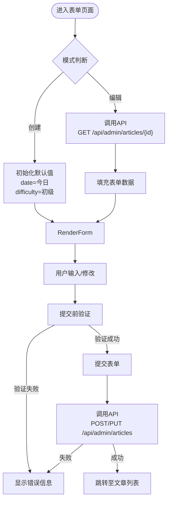
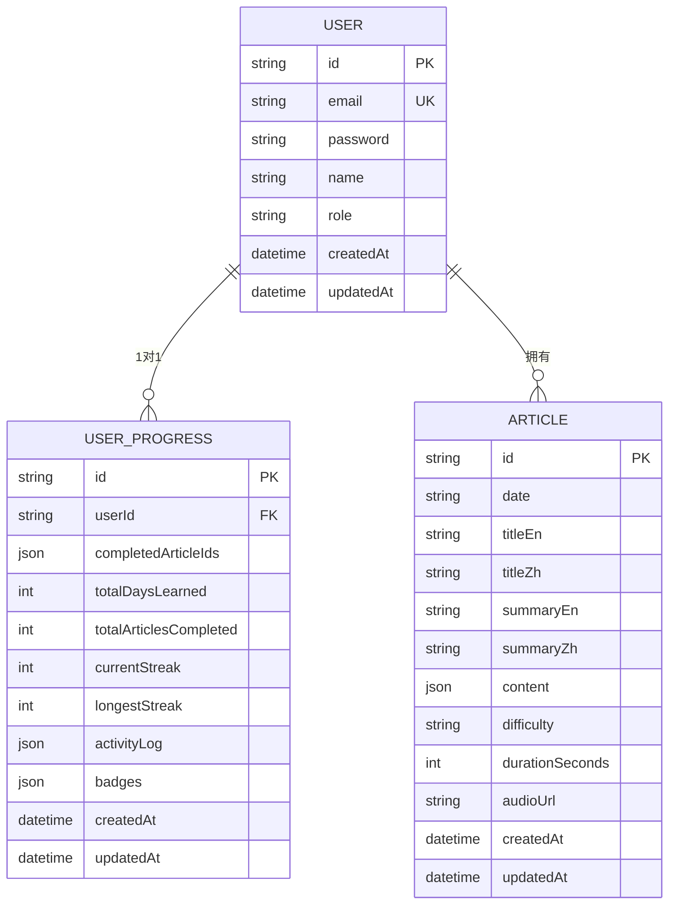

# 开发者指南

<cite>
**本文档中引用的文件**  
- [README.md](file://README.md)
- [package.json](file://package.json)
- [prisma/schema.prisma](file://prisma/schema.prisma)
- [components/ArticleForm.tsx](file://components/ArticleForm.tsx)
- [app/admin/articles/new/page.tsx](file://app/admin/articles/new/page.tsx)
- [app/admin/articles/[id]/edit/page.tsx](file://app/admin/articles/[id]/edit/page.tsx)
- [app/api/admin/articles/route.ts](file://app/api/admin/articles/route.ts)
- [app/api/admin/articles/[id]/route.ts](file://app/api/admin/articles/[id]/route.ts)
- [components/CosUploader.tsx](file://components/CosUploader.tsx)
- [app/api/cos/upload/route.ts](file://app/api/cos/upload/route.ts)
- [lib/prisma.ts](file://lib/prisma.ts)
- [lib/db-utils.ts](file://lib/db-utils.ts)
- [types.ts](file://types.ts)
- [constants.ts](file://constants.ts)
</cite>

## 目录
1. [简介](#简介)
2. [项目结构](#项目结构)
3. [本地开发环境搭建](#本地开发环境搭建)
4. [启动开发服务器](#启动开发服务器)
5. [添加新的英语阅读文章](#添加新的英语阅读文章)
6. [通过ArticleForm组件创建和编辑文章](#通过articleform组件创建和编辑文章)
7. [数据库初始化与管理](#数据库初始化与管理)
8. [测试运行与编写](#测试运行与编写)
9. [调试技巧与常见问题排查](#调试技巧与常见问题排查)
10. [代码贡献流程](#代码贡献流程)
11. [推荐的开发工具配置](#推荐的开发工具配置)

## 简介
本指南旨在为新加入项目的开发者提供全面的入门指导，涵盖从环境搭建到功能开发、测试调试的完整流程。项目是一个每日英语阅读学习平台，支持管理员创建和管理双语阅读文章，用户可进行学习并记录进度。

**Section sources**
- [README.md](file://README.md#L1-L21)

## 项目结构
项目采用Next.js App Router架构，主要目录包括：
- `app/`：页面和路由逻辑
- `components/`：可复用UI组件
- `lib/`：工具函数和核心逻辑
- `prisma/`：数据库模型定义
- `services/`：API服务封装
- `types/`：类型定义
- `constants.ts`：常量数据（如示例文章）

**Section sources**
- [project_structure](file://project_structure)

## 本地开发环境搭建
### Node.js版本要求
项目依赖Node.js环境，请确保安装Node.js版本不低于v16。

### 依赖安装
在项目根目录执行以下命令安装依赖：
```bash
npm install
```

### 环境变量配置
复制`.env.example`为`.env.local`，并配置以下关键环境变量：
- `GEMINI_API_KEY`：Gemini API密钥
- `DATABASE_URL`：MySQL数据库连接字符串
- `COS_SECRET_ID` 和 `COS_SECRET_KEY`：腾讯云COS密钥
- `NEXT_PUBLIC_COS_BUCKET` 和 `NEXT_PUBLIC_COS_REGION`：COS存储桶信息

**Section sources**
- [README.md](file://README.md#L13-L18)
- [package.json](file://package.json#L1-L41)

## 启动开发服务器
配置完成后，运行以下命令启动开发服务器：
```bash
npm run dev
```
应用将在`http://localhost:3000`启动，支持热重载。

**Section sources**
- [README.md](file://README.md#L19-L20)
- [package.json](file://package.json#L6)

## 添加新的英语阅读文章
### 数据格式要求
文章数据结构定义在`types.ts`中，关键字段包括：
- `id`：文章唯一标识
- `date`：发布日期（YYYY-MM-DD）
- `titleEn` / `titleZh`：英文/中文标题
- `summaryEn` / `summaryZh`：摘要
- `content`：内容块数组，每块包含`en`和`zh`字段
- `difficulty`：难度（Beginner/Intermediate/Advanced）
- `durationSeconds`：阅读时长（秒）
- `audioUrl`：音频文件URL（可选）

### 内容填充流程
1. 进入管理员面板 `/admin/articles`
2. 点击“创建新文章”
3. 填写表单信息，支持Markdown格式输入
4. 可上传音频文件，系统将自动计算时长
5. 提交后文章将保存至数据库

**Section sources**
- [types.ts](file://types.ts#L17-L26)
- [constants.ts](file://constants.ts#L10-L114)

## 通过ArticleForm组件创建和编辑文章
`ArticleForm`组件是文章管理的核心UI，位于`components/ArticleForm.tsx`。

### 创建新文章
访问 `/admin/articles/new` 路由，该页面使用`ArticleForm`组件并传入`mode="create"`。

### 编辑现有文章
访问 `/admin/articles/[id]/edit` 路由，组件通过API获取文章数据并填充表单。

### 功能特性
- 支持动态添加/删除内容块
- 自动计算阅读时长（基于英文内容，50词/分钟）
- 集成COS音频上传组件
- 客户端表单验证



**Diagram sources**
- [components/ArticleForm.tsx](file://components/ArticleForm.tsx#L42-L432)
- [app/admin/articles/new/page.tsx](file://app/admin/articles/new/page.tsx#L1-L6)
- [app/admin/articles/[id]/edit/page.tsx](file://app/admin/articles/[id]/edit/page.tsx#L1-L6)

**Section sources**
- [components/ArticleForm.tsx](file://components/ArticleForm.tsx#L1-L432)

## 数据库初始化与管理
### 数据库模型
使用Prisma ORM管理MySQL数据库，核心模型包括：
- `User`：用户信息
- `UserProgress`：学习进度
- `Article`：阅读文章

### 初始化步骤
1. 确保MySQL服务运行
2. 配置`.env.local`中的`DATABASE_URL`
3. 执行Prisma迁移：
```bash
npx prisma migrate dev --name init
```
4. 生成Prisma客户端：
```bash
npx prisma generate
```

### 数据库操作
所有数据库操作通过`lib/prisma.ts`中的`prisma`实例进行，并集成重试机制和请求限流。



**Diagram sources**
- [prisma/schema.prisma](file://prisma/schema.prisma#L1-L81)
- [lib/prisma.ts](file://lib/prisma.ts#L1-L30)
- [lib/db-utils.ts](file://lib/db-utils.ts#L1-L60)

**Section sources**
- [prisma/schema.prisma](file://prisma/schema.prisma#L1-L81)
- [lib/prisma.ts](file://lib/prisma.ts#L1-L30)

## 测试运行与编写
项目未提供明确的测试脚本配置，但可通过以下方式进行功能验证：
1. 使用Postman或curl测试API端点
2. 手动操作UI流程验证功能
3. 添加单元测试可使用Jest框架

建议补充测试脚本到`package.json`中。

**Section sources**
- [package.json](file://package.json#L9)

## 调试技巧与常见问题排查
### 常见问题
1. **数据库连接失败**：检查`DATABASE_URL`配置和MySQL服务状态
2. **API权限错误**：确保管理员身份登录
3. **文件上传失败**：检查COS密钥配置和文件大小（≤50MB）
4. **环境变量未生效**：确认文件名为`.env.local`

### 调试方法
- 查看浏览器开发者工具的Network面板
- 检查服务器控制台日志输出
- 使用`console.log`进行代码级调试
- 利用Prisma Studio可视化数据库：`npx prisma studio`

**Section sources**
- [lib/db-utils.ts](file://lib/db-utils.ts#L51-L60)
- [app/api/cos/upload/route.ts](file://app/api/cos/upload/route.ts#L40-L45)

## 代码贡献流程
1. Fork仓库并创建特性分支
2. 实现功能并确保代码风格一致
3. 提交更改并推送至远程分支
4. 创建Pull Request
5. 等待代码审查和合并

请遵循项目已有的代码规范和架构设计。

**Section sources**
- [project_structure](file://project_structure)

## 推荐的开发工具配置
- **编辑器**：VS Code
- **插件**：
  - Prisma
  - ESLint
  - Prettier
  - Tailwind CSS IntelliSense
- **数据库工具**：Prisma Studio 或 MySQL Workbench
- **API测试**：Postman 或 Thunder Client