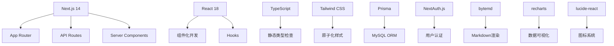
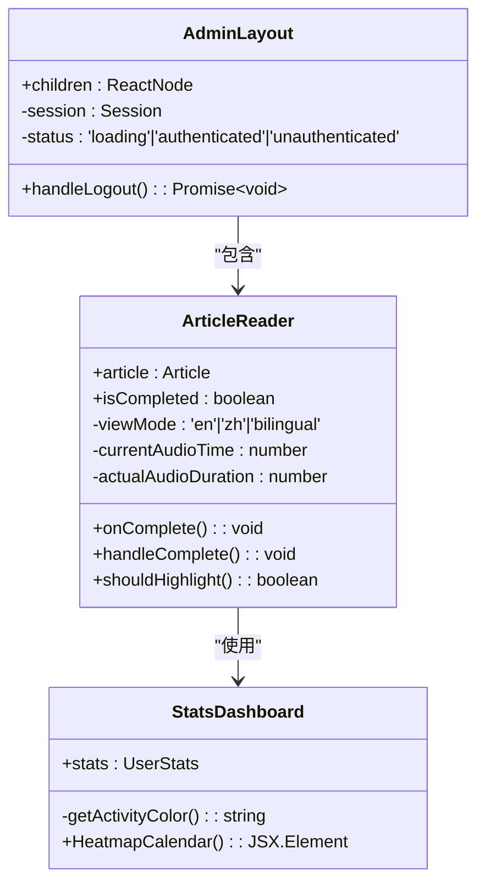
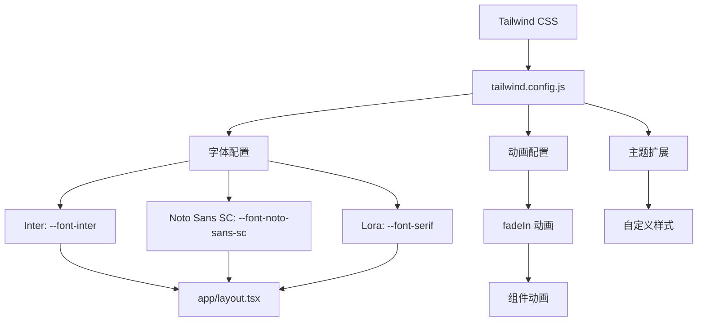
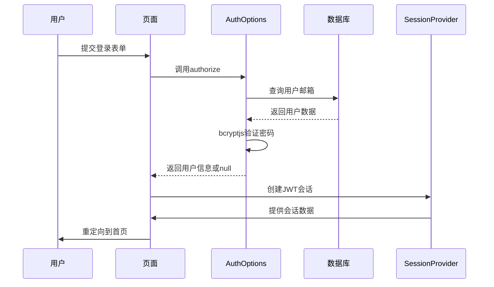
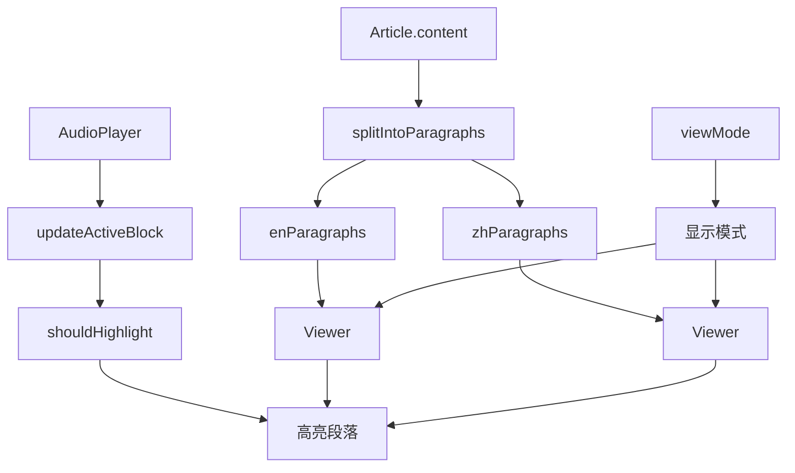
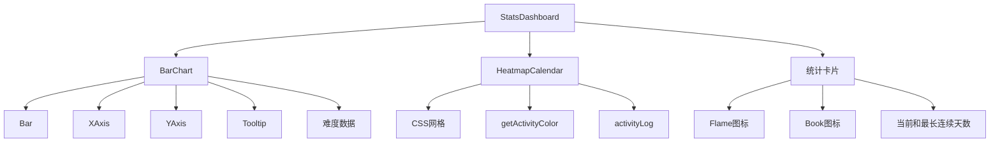
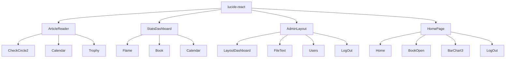
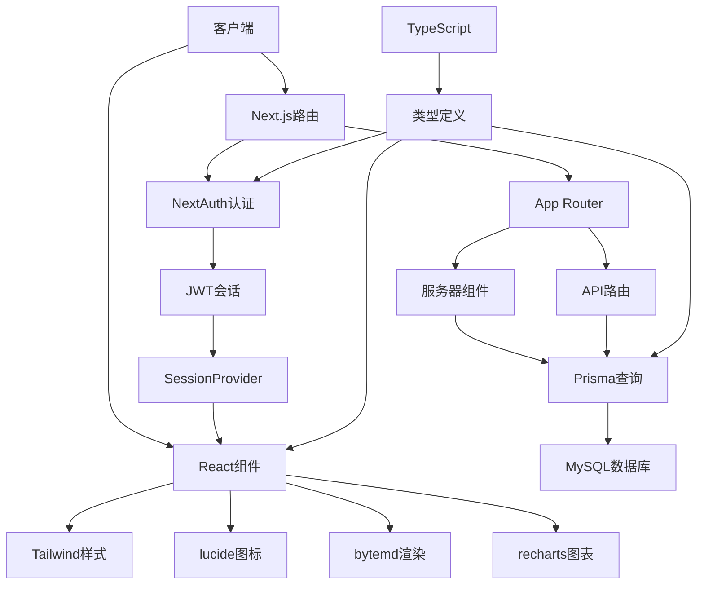

# 技术栈

<cite>
**本文档中引用的文件**  
- [package.json](file://package.json)
- [next.config.js](file://next.config.js)
- [tsconfig.json](file://tsconfig.json)
- [tailwind.config.js](file://tailwind.config.js)
- [prisma/schema.prisma](file://prisma/schema.prisma)
- [lib/prisma.ts](file://lib/prisma.ts)
- [lib/auth.ts](file://lib/auth.ts)
- [types/next-auth.d.ts](file://types/next-auth.d.ts)
- [app/providers.tsx](file://app/providers.tsx)
- [components/StatsDashboard.tsx](file://components/StatsDashboard.tsx)
- [components/ArticleReader.tsx](file://components/ArticleReader.tsx)
- [components/AdminLayout.tsx](file://components/AdminLayout.tsx)
- [app/layout.tsx](file://app/layout.tsx)
- [constants.ts](file://constants.ts)
</cite>

## 目录
1. [简介](#简介)
2. [项目结构](#项目结构)
3. [核心技术栈](#核心技术栈)
4. [Next.js 14 全栈框架](#nextjs-14-全栈框架)
5. [React 18 组件化开发](#react-18-组件化开发)
6. [TypeScript 静态类型检查](#typescript-静态类型检查)
7. [Tailwind CSS 原子化样式](#tailwind-css-原子化样式)
8. [Prisma ORM 与数据库管理](#prisma-orm-与数据库管理)
9. [NextAuth.js 用户认证系统](#nextauthjs-用户认证系统)
10. [bytemd Markdown 渲染](#bytemd-markdown-渲染)
11. [recharts 数据可视化](#recharts-数据可视化)
12. [lucide-react 图标集成](#lucide-react-图标集成)
13. [性能优化与开发体验](#性能优化与开发体验)
14. [技术集成模式](#技术集成模式)

## 简介
本项目是一个每日英语阅读应用，采用现代化的全栈技术栈构建。系统基于 Next.js 14 构建，充分利用其 App Router 的服务端渲染能力，结合 React 18 的组件化特性，通过 TypeScript 提供完整的类型安全。前端样式采用 Tailwind CSS 实现原子化设计，数据持久化通过 Prisma 管理 MySQL 数据库，用户认证由 NextAuth.js 处理，内容渲染使用 bytemd 库，统计图表通过 recharts 生成，图标资源来自 lucide-react。本文档详细说明各技术选型的版本、配置、作用及集成方式。

## 项目结构
项目采用标准的 Next.js 14 App Router 结构，主要目录包括：
- `app/`：基于文件系统的路由，包含用户和管理员界面
- `components/`：可复用的 React 组件
- `lib/`：工具函数和库配置
- `prisma/`：数据库模式和迁移
- `services/`：业务逻辑服务
- `types/`：类型定义
- 根目录：配置文件和全局设置

**Section sources**
- [app/page.tsx](file://app/page.tsx)
- [app/layout.tsx](file://app/layout.tsx)
- [components/ArticleReader.tsx](file://components/ArticleReader.tsx)

## 核心技术栈
项目采用以下核心技术栈：



**Diagram sources**
- [package.json](file://package.json)
- [next.config.js](file://next.config.js)
- [tsconfig.json](file://tsconfig.json)

## Next.js 14 全栈框架
项目采用 Next.js 14 作为全栈框架，利用其 App Router 实现服务端渲染和 API 路由。App Router 提供了基于文件系统的路由机制，支持服务器组件和客户端组件的混合使用。

服务端渲染通过 `app/page.tsx` 中的服务器组件实现，确保页面内容在服务器端生成，提高首屏加载性能和 SEO 优化。API 路由位于 `app/api/` 目录下，每个 `.ts` 文件对应一个 API 端点，如 `app/api/articles/route.ts` 处理文章相关请求。

配置文件 `next.config.js` 中设置了 `reactStrictMode: false`，这是为了避免开发环境下的双重渲染导致重复 API 调用，特别是在处理用户认证和数据获取时。

```mermaid
graph TD
A[App Router] --> B[app/page.tsx]
A --> C[app/admin/page.tsx]
A --> D[app/api/articles/route.ts]
A --> E[app/api/auth/[...nextauth]/route.ts]
B --> F[服务端渲染]
D --> G[API路由]
E --> H[认证API]
```

**Diagram sources**
- [next.config.js](file://next.config.js)
- [app/page.tsx](file://app/page.tsx)
- [app/api/articles/route.ts](file://app/api/articles/route.ts)
- [app/api/auth/[...nextauth]/route.ts](file://app/api/auth/[...nextauth]/route.ts)

**Section sources**
- [next.config.js](file://next.config.js#L1-L7)
- [app/page.tsx](file://app/page.tsx#L1-L203)

## React 18 组件化开发
项目采用 React 18 的组件化开发模式，将 UI 拆分为可复用的组件。主要组件包括 `ArticleReader`、`StatsDashboard`、`AdminLayout` 等。

组件通过 props 接收数据和回调函数，使用 React Hooks 管理状态。例如，`ArticleReader` 组件使用 `useState` 管理视图模式和音频时间，`useMemo` 优化段落时间计算。`AdminLayout` 使用 `useSession` 和 `useRouter` 实现管理员权限控制。

组件遵循单一职责原则，每个组件专注于特定功能。布局组件（如 `AdminLayout`）负责页面结构，展示组件（如 `ArticleReader`）负责内容呈现，表单组件（如 `AuthForm`）负责用户输入。



**Diagram sources**
- [components/ArticleReader.tsx](file://components/ArticleReader.tsx#L1-L394)
- [components/StatsDashboard.tsx](file://components/StatsDashboard.tsx#L1-L180)
- [components/AdminLayout.tsx](file://components/AdminLayout.tsx#L1-L105)

**Section sources**
- [components/ArticleReader.tsx](file://components/ArticleReader.tsx#L1-L394)
- [components/StatsDashboard.tsx](file://components/StatsDashboard.tsx#L1-L180)
- [components/AdminLayout.tsx](file://components/AdminLayout.tsx#L1-L105)

## TypeScript 静态类型检查
项目采用 TypeScript 提供静态类型检查，确保代码质量和类型安全。`tsconfig.json` 配置了现代 TypeScript 选项，目标为 ES2022，模块系统为 ESNext。

类型定义位于 `types/` 目录和各组件的 props 接口中。通过接口定义数据结构，如 `Article`、`UserStats` 等。NextAuth.js 的类型通过 `types/next-auth.d.ts` 扩展，添加了 `id` 和 `role` 字段。

TypeScript 配置启用了 `strict: false` 以平衡开发体验和类型安全，同时使用 `paths` 配置了 `@/*` 别名，简化模块导入。

```mermaid
classDiagram
class Article {
+id : string
+date : string
+title : {en : string, zh : string}
+summary : {en : string, zh : string}
+content : {en : string, zh : string}[]
+difficulty : Difficulty
+durationSeconds : number
+audioUrl? : string
}
class UserStats {
+totalDaysLearned : number
+totalArticlesCompleted : number
+currentStreak : number
+longestStreak : number
+articlesByDifficulty : {Beginner : number, Intermediate : number, Advanced : number}
+activityLog : Record~string, number~
+badges : string[]
}
class Badge {
+id : string
+name : string
+description : string
+icon : string
+condition : (stats : UserStats) => boolean
}
Article --> UserStats : "影响"
Badge --> UserStats : "基于"
```

**Diagram sources**
- [types/next-auth.d.ts](file://types/next-auth.d.ts#L1-L32)
- [constants.ts](file://constants.ts#L1-L152)
- [components/StatsDashboard.tsx](file://components/StatsDashboard.tsx#L2)

**Section sources**
- [tsconfig.json](file://tsconfig.json#L1-L48)
- [types/next-auth.d.ts](file://types/next-auth.d.ts#L1-L32)
- [constants.ts](file://constants.ts#L1-L152)

## Tailwind CSS 原子化样式
项目采用 Tailwind CSS 实现原子化样式设计，通过实用类直接在 JSX 中编写样式。`tailwind.config.js` 配置了自定义字体和动画。

配置中定义了三种字体：Inter（无衬线）、Noto Sans SC（中文字体）和 Lora（衬线，用于文章阅读）。通过 CSS 变量 `--font-inter`、`--font-noto-sans-sc` 和 `--font-serif` 在 `app/layout.tsx` 中应用。

自定义了 `fadeIn` 动画，用于页面和组件的淡入效果。原子化类的使用使得样式与组件紧密耦合，提高了开发效率和样式的可维护性。



**Diagram sources**
- [tailwind.config.js](file://tailwind.config.js#L1-L30)
- [app/layout.tsx](file://app/layout.tsx#L1-L30)

**Section sources**
- [tailwind.config.js](file://tailwind.config.js#L1-L30)
- [app/layout.tsx](file://app/layout.tsx#L1-L30)

## Prisma ORM 与数据库管理
项目使用 Prisma 作为 ORM 管理 MySQL 数据库模式和迁移。`prisma/schema.prisma` 定义了数据模型，包括 `User`、`UserProgress` 和 `Article`。

Prisma Client 通过 `lib/prisma.ts` 单例模式导出，避免在开发环境中创建多个实例。配置了生产环境不记录日志，开发环境只记录错误日志。实现了优雅关闭和连接健康检查。

数据库迁移通过 Prisma Migrate 管理，`prisma/migrations/` 目录包含版本化的 SQL 迁移文件。模型关系通过 `@relation` 定义，如 `User` 与 `UserProgress` 的一对一关系。

```mermaid
erDiagram
USER {
string id PK
string email UK
string password
string? name
string role
datetime createdAt
datetime updatedAt
}
USER_PROGRESS {
string id PK
string userId UK
json completedArticleIds
int totalDaysLearned
int totalArticlesCompleted
int currentStreak
int longestStreak
int beginnerCount
int intermediateCount
int advancedCount
string? lastCompletedDate
json activityLog
json badges
datetime createdAt
datetime updatedAt
}
ARTICLE {
string id PK
string date
text titleEn
text titleZh
text summaryEn
text summaryZh
json content
string difficulty
int durationSeconds
text? audioUrl
datetime createdAt
datetime updatedAt
}
USER ||--|| USER_PROGRESS : "一对一"
USER_PROGRESS }o--|| USER : "外键"
ARTICLE ||--o{ USER_PROGRESS : "完成记录"
```

**Diagram sources**
- [prisma/schema.prisma](file://prisma/schema.prisma#L1-L81)
- [lib/prisma.ts](file://lib/prisma.ts#L1-L30)

**Section sources**
- [prisma/schema.prisma](file://prisma/schema.prisma#L1-L81)
- [lib/prisma.ts](file://lib/prisma.ts#L1-L30)

## NextAuth.js 用户认证系统
项目采用 NextAuth.js 处理用户认证和会话管理。配置位于 `lib/auth.ts`，使用 CredentialsProvider 实现邮箱密码登录。

认证流程：用户提交凭证 → 服务端查询数据库 → bcryptjs 验证密码 → 返回用户信息。会话策略为 JWT，用户角色通过 `jwt` 和 `session` 回调添加到令牌和会话中。

`types/next-auth.d.ts` 扩展了默认类型，添加了 `id` 和 `role` 字段。`app/providers.tsx` 中的 `SessionProvider` 提供会话上下文。管理员权限通过 `requireAdmin` 函数验证。



**Diagram sources**
- [lib/auth.ts](file://lib/auth.ts#L1-L101)
- [types/next-auth.d.ts](file://types/next-auth.d.ts#L1-L32)
- [app/providers.tsx](file://app/providers.tsx#L1-L14)

**Section sources**
- [lib/auth.ts](file://lib/auth.ts#L1-L101)
- [types/next-auth.d.ts](file://types/next-auth.d.ts#L1-L32)
- [app/providers.tsx](file://app/providers.tsx#L1-L14)

## bytemd Markdown 渲染
项目使用 bytemd 库在 `ArticleReader` 组件中渲染 Markdown 内容。通过 `@bytemd/react` 的 `Viewer` 组件实现，集成 `@bytemd/plugin-gfm` 支持通用 Markdown 扩展。

Markdown 内容存储在文章的 `content` 字段中，每个段落包含英文和中文版本。渲染时根据用户选择的视图模式显示相应内容。自定义样式通过 `bytemd-custom.css` 和 Tailwind 类实现。

段落高亮功能结合音频播放，通过计算每个段落的单词数和音频时长比例，确定高亮时机，提升阅读体验。



**Diagram sources**
- [components/ArticleReader.tsx](file://components/ArticleReader.tsx#L1-L394)
- [app/bytemd-custom.css](file://app/bytemd-custom.css)

**Section sources**
- [components/ArticleReader.tsx](file://components/ArticleReader.tsx#L1-L394)

## recharts 数据可视化
项目使用 recharts 在 `StatsDashboard` 组件中生成学习统计图表。主要图表包括：
- 条形图：显示不同难度文章的完成数量
- 日历热力图：可视化每日学习活动
- 统计卡片：展示连续打卡、总文章数等关键指标

条形图通过 `BarChart`、`Bar`、`XAxis`、`YAxis` 和 `Tooltip` 组件构建，使用 `ResponsiveContainer` 确保响应式。热力图通过 CSS 网格实现，根据活动日志中的数据量确定颜色深浅。



**Diagram sources**
- [components/StatsDashboard.tsx](file://components/StatsDashboard.tsx#L1-L180)

**Section sources**
- [components/StatsDashboard.tsx](file://components/StatsDashboard.tsx#L1-L180)

## lucide-react 图标集成
项目集成 lucide-react 图标库，在多个组件中使用。通过按需导入所需图标，减少包体积。

主要使用场景：
- `ArticleReader`：CheckCircle2、Calendar、Trophy
- `StatsDashboard`：Flame、Book、Calendar
- `AdminLayout`：LayoutDashboard、FileText、Users、LogOut
- `HomePage`：Home、BookOpen、BarChart3、LogOut

图标作为 React 组件使用，可直接在 JSX 中渲染，支持通过 `size`、`className` 等属性定制样式和大小。



**Diagram sources**
- [components/ArticleReader.tsx](file://components/ArticleReader.tsx#L5)
- [components/StatsDashboard.tsx](file://components/StatsDashboard.tsx#L5)
- [components/AdminLayout.tsx](file://components/AdminLayout.tsx#L7)
- [app/page.tsx](file://app/page.tsx#L6)

**Section sources**
- [components/ArticleReader.tsx](file://components/ArticleReader.tsx#L5)
- [components/StatsDashboard.tsx](file://components/StatsDashboard.tsx#L5)
- [components/AdminLayout.tsx](file://components/AdminLayout.tsx#L7)
- [app/page.tsx](file://app/page.tsx#L6)

## 性能优化与开发体验
项目在性能优化和开发体验方面采取了多项措施：

1. **Next.js 优化**：禁用开发环境的 React Strict Mode，避免双重渲染导致的重复 API 调用
2. **Prisma 优化**：生产环境不记录日志，开发环境定期检查连接健康状态
3. **组件优化**：使用 `useMemo` 缓存计算结果，避免重复计算段落时间
4. **资源优化**：按需导入图标和组件，减少包体积
5. **用户体验**：实现音频同步高亮、学习徽章、激励语等增强功能

开发体验方面，TypeScript 提供了完整的类型检查，Tailwind CSS 实现了快速样式开发，Next.js 的热重载提高了开发效率。

**Section sources**
- [next.config.js](file://next.config.js#L3-L4)
- [lib/prisma.ts](file://lib/prisma.ts#L9-L11)
- [components/ArticleReader.tsx](file://components/ArticleReader.tsx#L105-L182)
- [package.json](file://package.json)

## 技术集成模式
各技术栈通过以下模式集成：



这种集成模式实现了前后端分离、类型安全、组件化和可维护性的平衡，为用户提供流畅的英语阅读体验。

**Diagram sources**
- [app/page.tsx](file://app/page.tsx)
- [lib/prisma.ts](file://lib/prisma.ts)
- [lib/auth.ts](file://lib/auth.ts)
- [components/ArticleReader.tsx](file://components/ArticleReader.tsx)