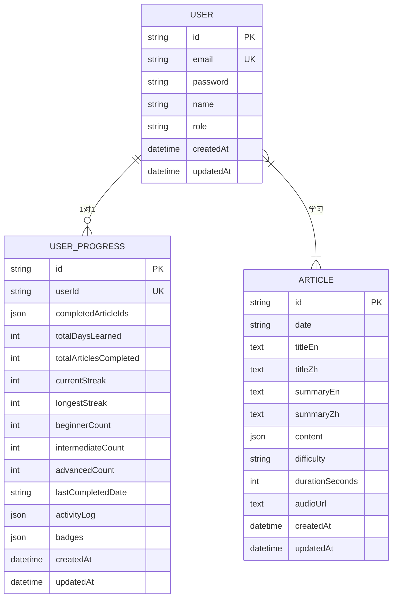
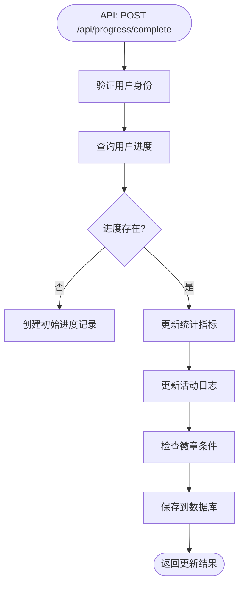
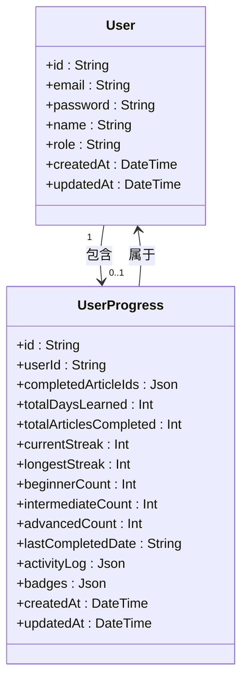
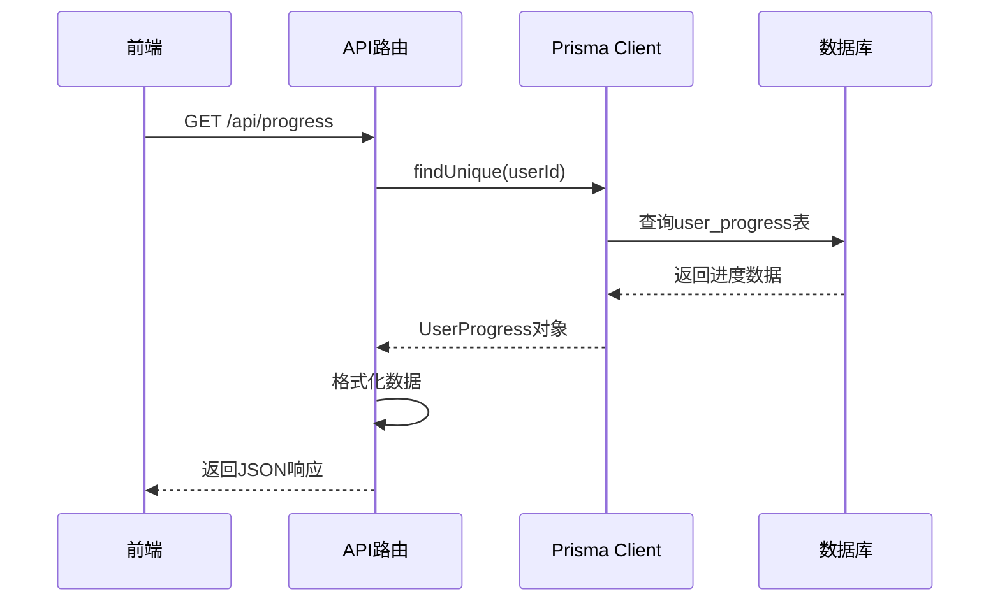

# 数据库设计

<cite>
**本文档中引用的文件**  
- [schema.prisma](file://prisma/schema.prisma)
- [migration.sql](file://prisma/migrations/20241217000000_add_user_role/migration.sql)
- [prisma.ts](file://lib/prisma.ts)
- [db-utils.ts](file://lib/db-utils.ts)
- [progress/route.ts](file://app/api/progress/route.ts)
- [complete/route.ts](file://app/api/progress/complete/route.ts)
- [admin/users/[id]/route.ts](file://app/api/admin/users/[id]/route.ts)
- [types.ts](file://types.ts)
- [next-auth.d.ts](file://types/next-auth.d.ts)
</cite>

## 目录
1. [项目结构](#项目结构)
2. [核心数据模型](#核心数据模型)
3. [实体关系图（ERD）](#实体关系图（erd）)
4. [用户模型（User）详解](#用户模型（user）详解)
5. [用户进度模型（UserProgress）详解](#用户进度模型（userprogress）详解)
6. [文章模型（Article）详解](#文章模型（article）详解)
7. [模型间关联关系](#模型间关联关系)
8. [数据库约束与索引](#数据库约束与索引)
9. [数据操作与查询模式](#数据操作与查询模式)
10. [示例数据记录](#示例数据记录)
11. [迁移历史与字段演进](#迁移历史与字段演进)

## 项目结构

本项目采用基于Next.js的全栈架构，数据库层使用Prisma ORM进行模型定义和数据访问。核心数据库相关文件位于`prisma/`目录下，包括数据模型定义和迁移脚本。

```mermaid
graph TB
subgraph "数据库层"
A[schema.prisma] --> B[Prisma Client]
C[migrations/] --> A
end
subgraph "服务层"
B --> D[lib/prisma.ts]
D --> E[db-utils.ts]
end
subgraph "API路由"
F[progress/route.ts] --> D
G[complete/route.ts] --> D
H[admin/users/[id]/route.ts] --> D
end
subgraph "类型定义"
I[types.ts] --> F
I --> G
J[next-auth.d.ts] --> D
end
```

**图源**  
- [schema.prisma](file://prisma/schema.prisma)
- [prisma.ts](file://lib/prisma.ts)
- [types.ts](file://types.ts)

**本节来源**  
- [prisma/schema.prisma](file://prisma/schema.prisma)
- [lib/prisma.ts](file://lib/prisma.ts)

## 核心数据模型

系统包含三个核心数据模型：`User`（用户）、`UserProgress`（用户进度）和`Article`（文章）。这些模型通过Prisma Schema定义，映射到MySQL数据库中的对应表。

- `User` 模型存储用户身份信息
- `UserProgress` 模型存储用户学习行为和统计信息
- `Article` 模型存储文章内容和元数据

这些模型共同构成了英语阅读应用的核心数据架构，支持用户管理、学习进度跟踪和内容展示功能。

**本节来源**  
- [schema.prisma](file://prisma/schema.prisma)
- [types.ts](file://types.ts)

## 实体关系图（ERD）



**图源**  
- [schema.prisma](file://prisma/schema.prisma#L12-L62)

## 用户模型（User）详解

`User`模型是系统的核心身份实体，定义了用户的基本信息和权限角色。

### 字段结构

| 字段名 | 类型 | 约束 | 说明 |
|--------|------|------|------|
| id | String | @id, @default(cuid()) | 唯一标识符，使用cuid生成 |
| email | String | @unique | 用户邮箱，唯一约束 |
| password | String | 无 | 加密存储的密码 |
| name | String? | 可选 | 用户昵称 |
| role | String | @default("user") | 用户角色，默认为"user" |
| createdAt | DateTime | @default(now()) | 创建时间 |
| updatedAt | DateTime | @updatedAt | 更新时间 |

### role字段详解

`role`字段用于区分用户权限级别，支持两种角色：
- `user`：普通用户，可学习文章
- `admin`：管理员，可管理用户和文章

该字段在创建时默认值为`"user"`，确保新注册用户具有基本权限。

**本节来源**  
- [schema.prisma](file://prisma/schema.prisma#L12-L25)
- [types/next-auth.d.ts](file://types/next-auth.d.ts#L8-L20)
- [types.ts](file://types.ts#L7-L10)

## 用户进度模型（UserProgress）详解

`UserProgress`模型用于存储用户的学习统计和行为数据，采用JSON字段存储复杂结构。

### 核心字段解析

#### 完成记录
- `completedArticleIds`: JSON数组，存储已完成文章的ID列表，默认为空数组`[]`

#### 统计指标
- `totalDaysLearned`: 整数，累计学习天数
- `totalArticlesCompleted`: 整数，累计完成文章数
- `currentStreak`: 整数，当前连续学习天数
- `longestStreak`: 整数，最长连续学习天数

#### 按难度统计
- `beginnerCount`: 初级文章完成数量
- `intermediateCount`: 中级文章完成数量
- `advancedCount`: 高级文章完成数量

#### 活动日志
- `activityLog`: JSON对象，格式为`{日期: 完成数量}`，记录每日学习活动

#### 徽章系统
- `badges`: JSON数组，存储用户获得的徽章ID列表

### 数据初始化
当新用户注册时，系统会自动创建对应的`UserProgress`记录，所有计数字段初始化为0，JSON字段初始化为空对象或数组。



**图源**  
- [schema.prisma](file://prisma/schema.prisma#L28-L62)
- [app/api/progress/complete/route.ts](file://app/api/progress/complete/route.ts#L20-L124)

**本节来源**  
- [schema.prisma](file://prisma/schema.prisma#L28-L62)
- [app/api/progress/complete/route.ts](file://app/api/progress/complete/route.ts)
- [types.ts](file://types.ts#L47-L50)

## 文章模型（Article）详解

`Article`模型定义了文章内容的结构和元数据。

### 字段设计

| 字段名 | 类型 | 约束/说明 |
|--------|------|-----------|
| id | String | 主键，唯一标识 |
| date | String | 发布日期（YYYY-MM-DD格式） |
| titleEn | String | 英文标题，存储为TEXT类型 |
| titleZh | String | 中文标题，存储为TEXT类型 |
| summaryEn | String | 英文摘要，TEXT类型 |
| summaryZh | String | 中文摘要，TEXT类型 |
| content | Json | 正文内容，JSON格式存储双语段落 |
| difficulty | String | 难度等级（Beginner/Intermediate/Advanced） |
| durationSeconds | Int | 预计阅读时长（秒） |
| audioUrl | String? | 音频文件URL，可选字段 |
| createdAt | DateTime | 创建时间 |
| updatedAt | DateTime | 更新时间 |

### content字段结构

`content`字段以JSON格式存储，结构为：
```json
[
  {
    "en": "English paragraph",
    "zh": "中文段落"
  }
]
```
这种设计支持逐段对照阅读，提升学习体验。

**本节来源**  
- [schema.prisma](file://prisma/schema.prisma#L65-L80)
- [types.ts](file://types.ts#L17-L26)
- [constants.ts](file://constants.ts#L10-L31)

## 模型间关联关系

系统中的模型通过明确的关系进行连接，形成完整的数据网络。

### User与UserProgress的一对一关系

`User`和`UserProgress`之间存在一对一关系：
- `User`模型通过`progress`字段引用`UserProgress`
- `UserProgress`模型通过`userId`字段和`user`关系字段关联`User`
- 删除用户时，`onDelete: Cascade`确保级联删除对应的进度记录

这种设计确保每个用户有且仅有一个进度记录，保持数据一致性。

### 外键约束
`UserProgress.userId`是外键，引用`User.id`，确保进度记录必须对应存在的用户。



**图源**  
- [schema.prisma](file://prisma/schema.prisma#L22-L23)
- [schema.prisma](file://prisma/schema.prisma#L59-L60)

**本节来源**  
- [schema.prisma](file://prisma/schema.prisma#L12-L62)
- [app/api/admin/users/[id]/route.ts](file://app/api/admin/users/[id]/route.ts#L27-L39)

## 数据库约束与索引

系统通过多种数据库约束确保数据完整性和查询性能。

### 唯一性约束
- `User.email`: 确保邮箱唯一，防止重复注册
- `UserProgress.userId`: 确保每个用户只有一个进度记录

### 外键约束
- `UserProgress.userId` 引用 `User.id`，设置`onDelete: Cascade`，删除用户时自动清理进度数据

### 默认值约束
| 字段 | 默认值 | 说明 |
|------|--------|------|
| User.role | "user" | 新用户默认为普通用户 |
| User.createdAt | now() | 自动记录创建时间 |
| User.updatedAt | @updatedAt | 自动更新修改时间 |
| UserProgress字段 | 0或空值 | 所有计数和JSON字段均有合理默认值 |

### 表映射
通过`@@map`指令将模型映射到具体表名：
- `User` → `users`
- `UserProgress` → `user_progress`
- `Article` → `articles`

**本节来源**  
- [schema.prisma](file://prisma/schema.prisma#L14-L18)
- [schema.prisma](file://prisma/schema.prisma#L30-L31)
- [schema.prisma](file://prisma/schema.prisma#L59-L60)

## 数据操作与查询模式

系统通过Prisma Client进行数据库操作，并采用重试机制确保稳定性。

### 查询示例

#### 获取用户进度
```typescript
prisma.userProgress.findUnique({
  where: { userId: userId }
})
```

#### 更新学习进度
```typescript
prisma.userProgress.update({
  where: { id: progress.id },
  data: {
    totalDaysLearned: newTotalDays,
    totalArticlesCompleted: { increment: 1 },
    currentStreak: newStreak,
    activityLog: updatedLog
  }
})
```

### 错误处理
系统在`db-utils.ts`中实现了带重试机制的数据库操作包装器，针对连接相关错误（如P2024、P1001）进行指数退避重试。

### API调用流程


**图源**  
- [app/api/progress/route.ts](file://app/api/progress/route.ts#L8-L78)
- [lib/db-utils.ts](file://lib/db-utils.ts#L10-L46)

**本节来源**  
- [app/api/progress/route.ts](file://app/api/progress/route.ts)
- [lib/db-utils.ts](file://lib/db-utils.ts)
- [lib/prisma.ts](file://lib/prisma.ts)

## 示例数据记录

### 用户记录示例
```json
{
  "id": "clv1a2b3c4d5e6f7g8h9i0j1k",
  "email": "user@example.com",
  "name": "张三",
  "role": "user",
  "createdAt": "2024-01-15T10:30:00Z",
  "updatedAt": "2024-01-15T10:30:00Z"
}
```

### 用户进度记录示例
```json
{
  "id": "clv2m3n4o5p6q7r8s9t0u1v",
  "userId": "clv1a2b3c4d5e6f7g8h9i0j1k",
  "completedArticleIds": ["art-001", "art-002"],
  "totalDaysLearned": 5,
  "totalArticlesCompleted": 8,
  "currentStreak": 3,
  "longestStreak": 5,
  "beginnerCount": 5,
  "intermediateCount": 3,
  "advancedCount": 0,
  "lastCompletedDate": "2024-01-15",
  "activityLog": {
    "2024-01-13": 1,
    "2024-01-14": 2,
    "2024-01-15": 1
  },
  "badges": ["first_day", "three_day_streak"],
  "createdAt": "2024-01-15T10:30:00Z",
  "updatedAt": "2024-01-15T15:45:00Z"
}
```

### 文章记录示例
```json
{
  "id": "art-001",
  "date": "2024-01-15",
  "titleEn": "The Benefits of Morning Sunlight",
  "titleZh": "清晨阳光的益处",
  "summaryEn": "Discover why getting sunlight early in the morning can improve your sleep and mood.",
  "summaryZh": "探索为什么早晨晒太阳可以改善你的睡眠和情绪。",
  "content": [
    {
      "en": "Exposure to sunlight in the morning is crucial for maintaining a healthy circadian rhythm.",
      "zh": "早晨接触阳光对于维持健康的昼夜节律至关重要。"
    }
  ],
  "difficulty": "Beginner",
  "durationSeconds": 300,
  "audioUrl": "https://example.com/audio/art-001.mp3",
  "createdAt": "2024-01-14T08:00:00Z",
  "updatedAt": "2024-01-14T08:00:00Z"
}
```

**本节来源**  
- [schema.prisma](file://prisma/schema.prisma)
- [types.ts](file://types.ts)
- [constants.ts](file://constants.ts)

## 迁移历史与字段演进

系统通过Prisma迁移系统管理数据库模式变更。

### role字段迁移历史

`User`模型的`role`字段是通过迁移脚本添加的，迁移文件位于`prisma/migrations/20241217000000_add_user_role/migration.sql`。

迁移SQL语句：
```sql
ALTER TABLE `users` ADD COLUMN `role` VARCHAR(191) NOT NULL DEFAULT 'user';
```

此迁移：
1. 向`users`表添加`role`列
2. 数据类型为VARCHAR(191)
3. 设置`NOT NULL`约束
4. 默认值为`'user'`

该迁移确保了现有用户在升级后自动获得`user`角色，新用户注册时也默认为此角色。

### 迁移策略
项目采用基于时间戳的迁移命名策略（`YYYYMMDDHHMMSS_description`），便于排序和识别。每次模式变更都会生成新的迁移文件，确保数据库模式与代码同步。

**本节来源**  
- [prisma/migrations/20241217000000_add_user_role/migration.sql](file://prisma/migrations/20241217000000_add_user_role/migration.sql)
- [schema.prisma](file://prisma/schema.prisma#L17)
- [types/next-auth.d.ts](file://types/next-auth.d.ts#L19)