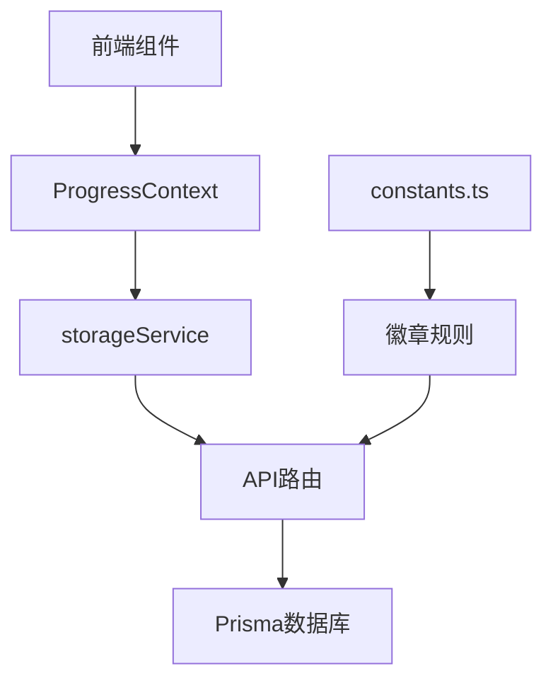
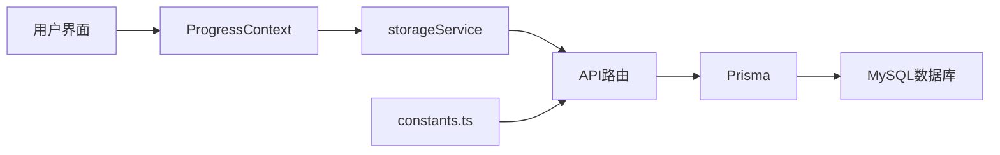
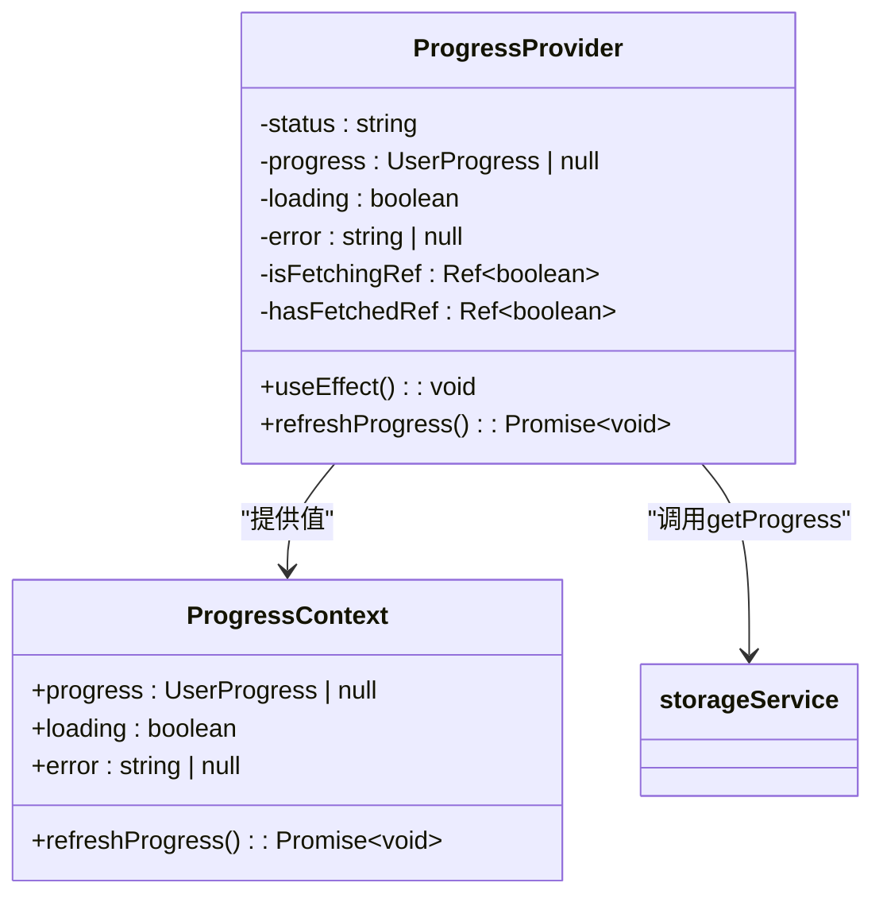
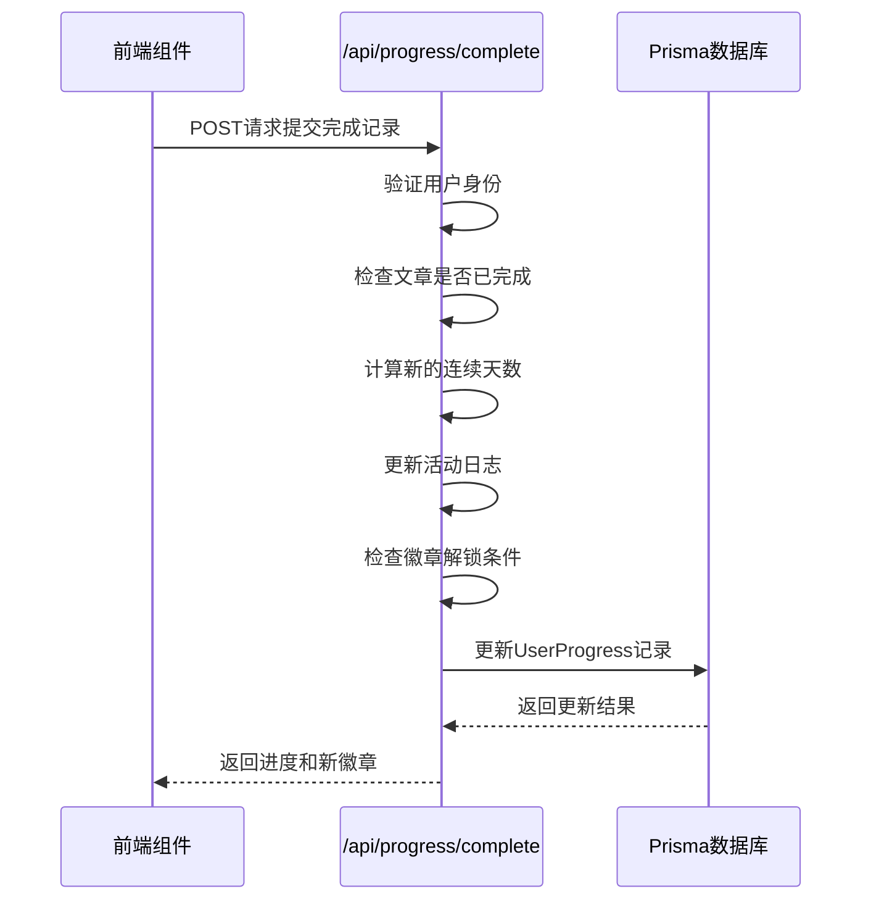
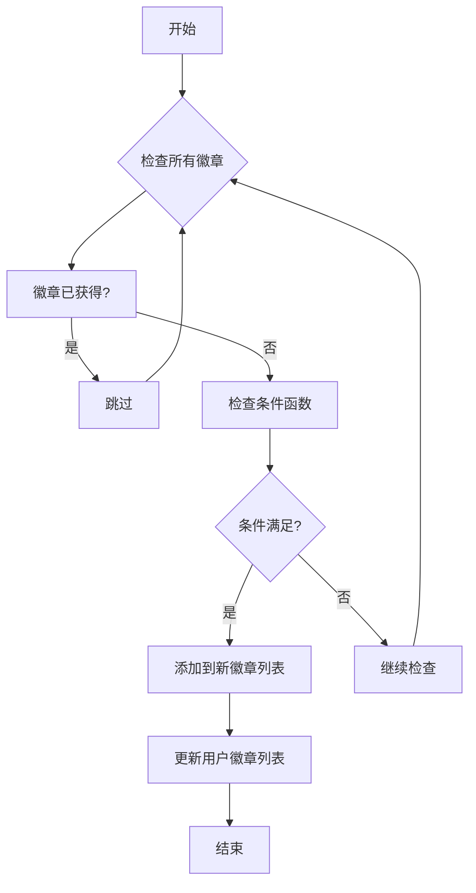

# 学习进度追踪

<cite>
**本文档引用文件**  
- [ProgressContext.tsx](file://contexts/ProgressContext.tsx)
- [complete/route.ts](file://app/api/progress/complete/route.ts)
- [constants.ts](file://constants.ts)
- [prisma/schema.prisma](file://prisma/schema.prisma)
- [storageService.ts](file://services/storageService.ts)
- [providers.tsx](file://app/providers.tsx)
- [ArticleReader.tsx](file://components/ArticleReader.tsx)
- [article/[id]/page.tsx](file://app/(user)/article/[id]/page.tsx)
</cite>

## 目录
1. [项目结构](#项目结构)
2. [核心组件](#核心组件)
3. [架构概述](#架构概述)
4. [详细组件分析](#详细组件分析)
5. [依赖分析](#依赖分析)
6. [性能考虑](#性能考虑)
7. [故障排除指南](#故障排除指南)
8. [结论](#结论)

## 项目结构

该学习进度追踪系统采用Next.js框架构建，具有清晰的模块化结构。核心功能围绕用户学习进度管理展开，主要包含以下几个关键目录：

- `app/`：包含所有页面路由和API端点，其中`(user)`目录为用户功能区，`api/progress/`为进度相关API
- `contexts/`：存放React Context实现，特别是`ProgressContext.tsx`作为全局状态容器
- `services/`：提供与后端交互的服务层，如`storageService.ts`
- `prisma/`：数据库模型定义和迁移文件
- `constants.ts`：系统常量和徽章规则定义



**图表来源**  
- [ProgressContext.tsx](file://contexts/ProgressContext.tsx)
- [storageService.ts](file://services/storageService.ts)
- [prisma/schema.prisma](file://prisma/schema.prisma)

**章节来源**  
- [ProgressContext.tsx](file://contexts/ProgressContext.tsx)
- [prisma/schema.prisma](file://prisma/schema.prisma)

## 核心组件

系统的核心是`ProgressContext`，它作为全局状态容器管理用户的学习进度数据。该上下文在用户认证后自动初始化，通过`getProgress`服务获取用户进度，并提供`refreshProgress`方法供手动刷新。状态包含`progress`、`loading`和`error`三个主要属性，确保UI能正确反映数据加载状态。

前端通过调用`POST /api/progress/complete`接口提交完成记录，后端验证请求后更新数据库中的`UserProgress`模型。系统结合`constants.ts`中定义的徽章规则，计算并返回新解锁的成就。

**章节来源**  
- [ProgressContext.tsx](file://contexts/ProgressContext.tsx#L1-L95)
- [complete/route.ts](file://app/api/progress/complete/route.ts#L1-L124)

## 架构概述

系统采用典型的前后端分离架构，前端通过React Context管理全局状态，后端通过Next.js API路由处理业务逻辑，数据持久化使用Prisma ORM与MySQL数据库交互。



**图表来源**  
- [ProgressContext.tsx](file://contexts/ProgressContext.tsx)
- [storageService.ts](file://services/storageService.ts)
- [prisma/schema.prisma](file://prisma/schema.prisma)

## 详细组件分析

### ProgressContext分析

`ProgressContext`作为全局状态容器，实现了用户学习进度的集中管理。它通过`useSession`监听用户认证状态，在用户登录后自动获取进度数据，并通过`useRef`标记防止并发请求。



**图表来源**  
- [ProgressContext.tsx](file://contexts/ProgressContext.tsx#L3-L85)

**章节来源**  
- [ProgressContext.tsx](file://contexts/ProgressContext.tsx#L1-L95)

### API路由分析

`/api/progress/complete`路由处理学习完成记录的提交。它首先验证用户身份，然后检查文章是否已完成后，更新用户的连续学习天数、总学习天数等统计信息，并根据徽章规则计算新解锁的成就。



**图表来源**  
- [complete/route.ts](file://app/api/progress/complete/route.ts#L8-L124)

**章节来源**  
- [complete/route.ts](file://app/api/progress/complete/route.ts#L1-L124)

### 徽章系统分析

徽章系统通过`constants.ts`中的`BADGES`数组定义，每个徽章包含ID、名称、描述、图标和条件函数。系统在更新进度时会检查所有未获得的徽章条件，自动解锁符合条件的徽章。



**图表来源**  
- [constants.ts](file://constants.ts#L116-L145)

**章节来源**  
- [constants.ts](file://constants.ts#L1-L152)
- [complete/route.ts](file://app/api/progress/complete/route.ts#L83-L92)

## 依赖分析

系统各组件之间存在明确的依赖关系。`ProgressContext`依赖于`storageService`进行数据获取，`storageService`又依赖于API路由，而API路由最终依赖Prisma与数据库交互。

```mermaid
graph TD
A[ProgressContext] --> B[storageService]
B --> C[/api/progress/complete]
C --> D[Prisma]
D --> E[MySQL]
F[constants.ts] --> C
G[providers.tsx] --> A
```

**图表来源**  
- [ProgressContext.tsx](file://contexts/ProgressContext.tsx)
- [storageService.ts](file://services/storageService.ts)
- [prisma/schema.prisma](file://prisma/schema.prisma)

**章节来源**  
- [ProgressContext.tsx](file://contexts/ProgressContext.tsx#L5)
- [storageService.ts](file://services/storageService.ts#L17)
- [prisma/schema.prisma](file://prisma/schema.prisma)

## 性能考虑

系统在性能方面做了多项优化：
1. 使用`useRef`标记防止`ProgressContext`的并发请求
2. 在`ProgressProvider`中使用`useCallback`优化`refreshProgress`函数
3. 数据库操作使用Prisma的批量更新功能
4. 前端通过`useMemo`优化过滤计算

对于进度同步和离线缓存，建议实现以下方案：
- 使用IndexedDB进行离线数据存储
- 实现冲突解决策略，如时间戳比较或版本号机制
- 添加网络状态监听，自动同步离线数据

## 故障排除指南

常见问题及调试方法：

1. **重复提交问题**：检查前端按钮是否正确禁用，后端是否验证了文章完成状态
2. **时间戳校验失败**：确保前后端日期格式一致，建议统一使用ISO 8601格式
3. **徽章未解锁**：检查`BADGES`数组中的条件函数是否正确实现
4. **进度不更新**：检查`refreshProgress`是否在操作后被正确调用

**章节来源**  
- [ProgressContext.tsx](file://contexts/ProgressContext.tsx#L22-L23)
- [complete/route.ts](file://app/api/progress/complete/route.ts#L29-L31)

## 结论

该学习进度追踪系统通过`ProgressContext`实现了用户学习进度的高效管理。系统架构清晰，组件职责分明，从前端UI到后端API再到数据库持久化，形成了完整的闭环。徽章系统的实现激励用户持续学习，而合理的错误处理和状态管理确保了良好的用户体验。