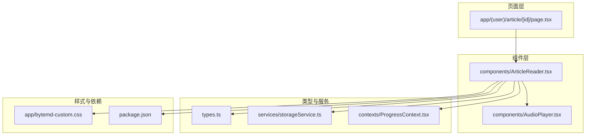
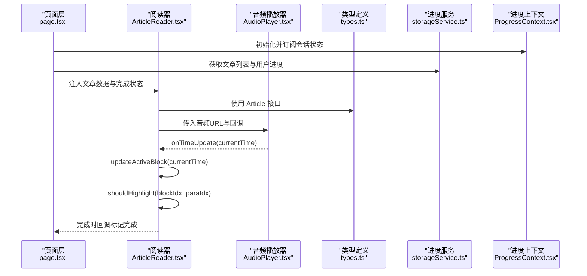
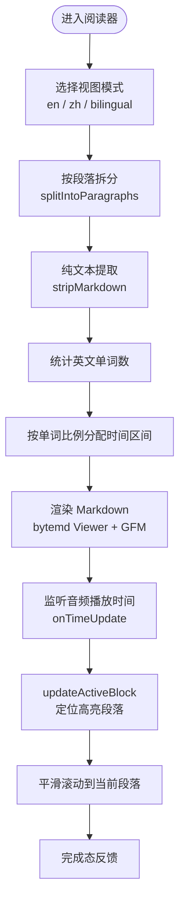
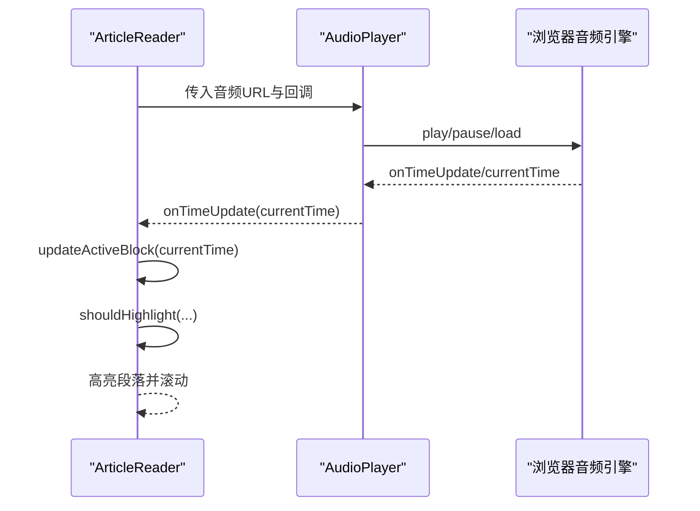
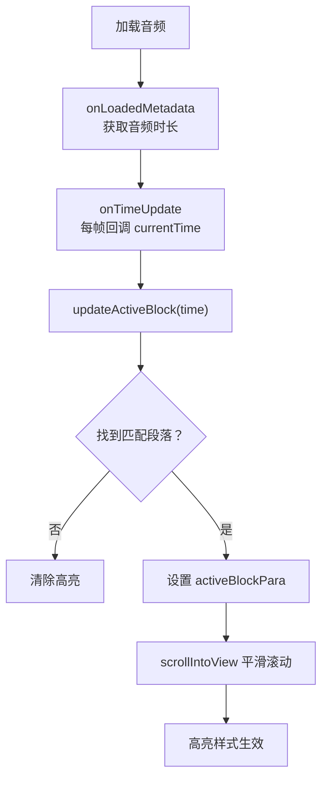
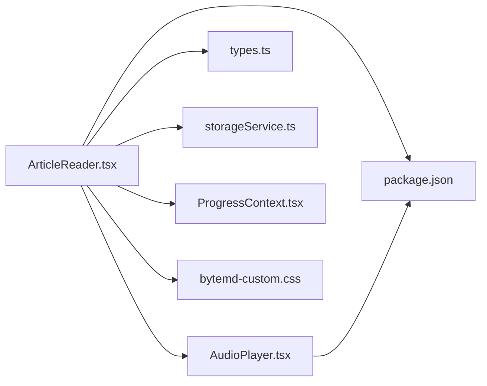
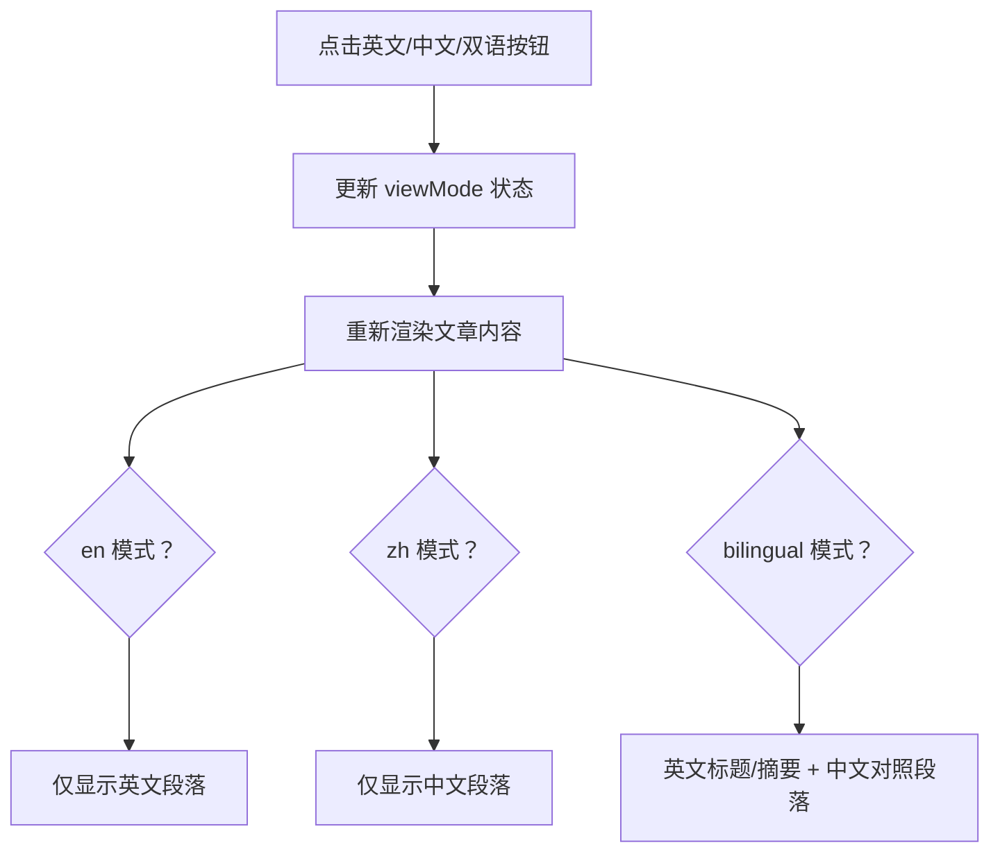

# 文章阅读功能

<cite>
**本文引用的文件**
- [ArticleReader.tsx](file://components/ArticleReader.tsx)
- [AudioPlayer.tsx](file://components/AudioPlayer.tsx)
- [page.tsx](file://app/(user)/article/[id]/page.tsx)
- [types.ts](file://types.ts)
- [storageService.ts](file://services/storageService.ts)
- [ProgressContext.tsx](file://contexts/ProgressContext.tsx)
- [bytemd-custom.css](file://app/bytemd-custom.css)
- [constants.ts](file://constants.ts)
- [package.json](file://package.json)
</cite>

## 目录
1. [简介](#简介)
2. [项目结构](#项目结构)
3. [核心组件](#核心组件)
4. [架构总览](#架构总览)
5. [组件详解](#组件详解)
6. [依赖关系分析](#依赖关系分析)
7. [性能考量](#性能考量)
8. [故障排查指南](#故障排查指南)
9. [结论](#结论)
10. [附录](#附录)

## 简介
本文件围绕“文章阅读功能”的实现进行深入技术文档化，重点涵盖：
- 中英双语切换与视图模式（英文/中文/双语）的状态管理与UI交互
- Markdown 内容渲染（基于 bytemd 的 GFM 插件）
- 音频同步高亮播放：通过 splitIntoParagraphs 按单词比例分配段落时间区间，结合 AudioPlayer 的 onTimeUpdate 回调驱动 updateActiveBlock 实现精准的文本-音频同步
- 视图模式切换与 stripMarkdown 在纯文本提取中的作用
- 性能优化策略（useMemo 对段落时间计算的缓存）
- 扩展建议（多语言支持、自定义渲染插件）

## 项目结构
该功能主要由以下层次构成：
- 页面层：负责加载文章数据、注入进度上下文、传递给阅读器组件
- 组件层：ArticleReader（阅读器）、AudioPlayer（音频播放器）
- 类型与服务：Article 结构、进度 API、进度上下文
- 样式层：bytemd 自定义样式以适配预览渲染

图表来源
- [page.tsx](file://app/(user)/article/[id]/page.tsx#L1-L99)
- [ArticleReader.tsx](file://components/ArticleReader.tsx#L1-L394)
- [AudioPlayer.tsx](file://components/AudioPlayer.tsx#L1-L143)
- [types.ts](file://types.ts#L1-L70)
- [storageService.ts](file://services/storageService.ts#L1-L50)
- [ProgressContext.tsx](file://contexts/ProgressContext.tsx#L1-L95)
- [bytemd-custom.css](file://app/bytemd-custom.css#L1-L215)
- [package.json](file://package.json#L1-L41)

章节来源
- [page.tsx](file://app/(user)/article/[id]/page.tsx#L1-L99)
- [ArticleReader.tsx](file://components/ArticleReader.tsx#L1-L394)
- [AudioPlayer.tsx](file://components/AudioPlayer.tsx#L1-L143)
- [types.ts](file://types.ts#L1-L70)
- [storageService.ts](file://services/storageService.ts#L1-L50)
- [ProgressContext.tsx](file://contexts/ProgressContext.tsx#L1-L95)
- [bytemd-custom.css](file://app/bytemd-custom.css#L1-L215)
- [package.json](file://package.json#L1-L41)

## 核心组件
- ArticleReader：负责视图模式切换、Markdown 渲染、段落拆分与时间分配、音频同步高亮、完成态反馈
- AudioPlayer：封装 HTMLAudioElement，提供播放/暂停、拖拽进度、重置、时长变更回调等能力

章节来源
- [ArticleReader.tsx](file://components/ArticleReader.tsx#L1-L394)
- [AudioPlayer.tsx](file://components/AudioPlayer.tsx#L1-L143)

## 架构总览
下面的序列图展示了从页面加载到音频播放与文本高亮联动的关键流程。

图表来源
- [page.tsx](file://app/(user)/article/[id]/page.tsx#L1-L99)
- [ArticleReader.tsx](file://components/ArticleReader.tsx#L1-L394)
- [AudioPlayer.tsx](file://components/AudioPlayer.tsx#L1-L143)
- [types.ts](file://types.ts#L1-L70)
- [storageService.ts](file://services/storageService.ts#L1-L50)
- [ProgressContext.tsx](file://contexts/ProgressContext.tsx#L1-L95)

## 组件详解

### ArticleReader 组件
职责与要点：
- 视图模式切换：英文(en)、中文(zh)、双语(bilingual)，通过按钮组切换
- Markdown 渲染：使用 bytemd 的 Viewer 与 GFM 插件渲染段落
- 段落拆分：splitIntoParagraphs 智能处理空行与列表，保证段落边界合理
- 时间分配：allParagraphsData useMemo 计算每个段落的起止时间，按英文单词数比例分配
- 同步高亮：AudioPlayer 的 onTimeUpdate 回调触发 updateActiveBlock，动态更新当前高亮段落并平滑滚动
- 纯文本提取：stripMarkdown 仅保留纯文本，用于单词计数与调试输出
- 完成态反馈：完成时显示庆祝动画与徽章解锁提示

关键实现路径（不直接展示代码，仅给出路径）：
- 视图模式切换与渲染逻辑：[ArticleReader.tsx](file://components/ArticleReader.tsx#L250-L394)
- Markdown 渲染与插件配置：[ArticleReader.tsx](file://components/ArticleReader.tsx#L29-L33)
- 段落拆分算法：[ArticleReader.tsx](file://components/ArticleReader.tsx#L34-L81)
- 纯文本提取（stripMarkdown）：[ArticleReader.tsx](file://components/ArticleReader.tsx#L83-L99)
- 段落时间分配（useMemo）：[ArticleReader.tsx](file://components/ArticleReader.tsx#L104-L182)
- 高亮更新与滚动定位：[ArticleReader.tsx](file://components/ArticleReader.tsx#L184-L218)
- 高亮判定：[ArticleReader.tsx](file://components/ArticleReader.tsx#L220-L233)
- 完成态处理：[ArticleReader.tsx](file://components/ArticleReader.tsx#L235-L241)

图表来源
- [ArticleReader.tsx](file://components/ArticleReader.tsx#L34-L218)

章节来源
- [ArticleReader.tsx](file://components/ArticleReader.tsx#L1-L394)

### AudioPlayer 组件
职责与要点：
- 封装 HTMLAudioElement，提供播放/暂停、拖拽进度、重置、错误处理
- onTimeUpdate 回调：向父组件传递当前播放时间
- onDurationChange 回调：向父组件报告音频时长（优先使用实际加载时长）
- 错误处理：当音频加载失败时显示错误提示

关键实现路径（不直接展示代码，仅给出路径）：
- 播放/暂停与错误处理：[AudioPlayer.tsx](file://components/AudioPlayer.tsx#L37-L45)
- 时间更新回调：[AudioPlayer.tsx](file://components/AudioPlayer.tsx#L47-L56)
- 时长变更回调：[AudioPlayer.tsx](file://components/AudioPlayer.tsx#L58-L67)
- 拖拽进度与格式化时间：[AudioPlayer.tsx](file://components/AudioPlayer.tsx#L70-L82)
- 重置播放位置：[AudioPlayer.tsx](file://components/AudioPlayer.tsx#L129-L139)

图表来源
- [AudioPlayer.tsx](file://components/AudioPlayer.tsx#L1-L143)
- [ArticleReader.tsx](file://components/ArticleReader.tsx#L184-L218)

章节来源
- [AudioPlayer.tsx](file://components/AudioPlayer.tsx#L1-L143)

### 视图模式切换与状态管理
- 视图模式枚举：en、zh、bilingual
- UI 交互：右上角按钮组，点击切换当前模式
- 渲染策略：
  - en：仅英文段落
  - zh：仅中文段落
  - bilingual：英文标题/摘要与中文对照显示，中文段落采用浅色背景与边框
- 状态来源：页面层从进度上下文中获取用户完成态，决定“已完成”按钮的禁用与文案

关键实现路径（不直接展示代码，仅给出路径）：
- 视图模式切换与按钮组：[ArticleReader.tsx](file://components/ArticleReader.tsx#L253-L274)
- 标题/摘要/正文渲染条件：[ArticleReader.tsx](file://components/ArticleReader.tsx#L276-L356)
- 完成态按钮与反馈：[ArticleReader.tsx](file://components/ArticleReader.tsx#L358-L394)
- 页面层进度注入：[page.tsx](file://app/(user)/article/[id]/page.tsx#L74-L88)
- 进度上下文与刷新：[ProgressContext.tsx](file://contexts/ProgressContext.tsx#L1-L95)

章节来源
- [ArticleReader.tsx](file://components/ArticleReader.tsx#L250-L394)
- [page.tsx](file://app/(user)/article/[id]/page.tsx#L74-L88)
- [ProgressContext.tsx](file://contexts/ProgressContext.tsx#L1-L95)

### Markdown 内容渲染（bytemd + GFM）
- 渲染器：Viewer
- 插件：仅启用 GFM 插件，保证表格、任务列表等语法正常渲染
- 自定义样式：bytemd-custom.css 覆盖默认样式，提升标题、列表、段落、代码块等的可读性
- 仅英文段落参与时间分配，中文段落用于对照阅读

关键实现路径（不直接展示代码，仅给出路径）：
- 插件配置与渲染：[ArticleReader.tsx](file://components/ArticleReader.tsx#L29-L33)
- 自定义样式规则：[bytemd-custom.css](file://app/bytemd-custom.css#L1-L215)

章节来源
- [ArticleReader.tsx](file://components/ArticleReader.tsx#L29-L33)
- [bytemd-custom.css](file://app/bytemd-custom.css#L1-L215)

### 音频同步高亮播放
- 时间分配策略：
  - 以英文段落为基准，统计每段英文单词数，计算总单词数
  - 按比例分配每段起止时间，最后一段确保到达音频结束时间
  - 使用 useMemo 缓存 allParagraphsData，避免重复计算
- 同步逻辑：
  - AudioPlayer 的 onTimeUpdate 回调将 currentTime 传回 ArticleReader
  - updateActiveBlock 根据时间查找当前应高亮段落
  - shouldHighlight 判定高亮状态，若变化则滚动到对应段落
- 滚动策略：使用 paragraphRefs Map 存储段落 DOM 引用，平滑滚动至中心位置

关键实现路径（不直接展示代码，仅给出路径）：
- 段落时间分配与缓存：[ArticleReader.tsx](file://components/ArticleReader.tsx#L104-L182)
- 高亮更新与滚动：[ArticleReader.tsx](file://components/ArticleReader.tsx#L184-L218)
- 高亮判定：[ArticleReader.tsx](file://components/ArticleReader.tsx#L220-L233)
- 音频播放器回调注入：[ArticleReader.tsx](file://components/ArticleReader.tsx#L300-L306)
- 音频播放器时间回调：[AudioPlayer.tsx](file://components/AudioPlayer.tsx#L47-L56)

图表来源
- [AudioPlayer.tsx](file://components/AudioPlayer.tsx#L47-L56)
- [ArticleReader.tsx](file://components/ArticleReader.tsx#L184-L218)

章节来源
- [ArticleReader.tsx](file://components/ArticleReader.tsx#L104-L218)
- [AudioPlayer.tsx](file://components/AudioPlayer.tsx#L47-L56)

### 纯文本提取与单词计数
- stripMarkdown 用于移除标题、粗体、斜体、删除线、链接、图片、行内代码、代码块、引用、列表、HTML 标签等 Markdown 语法，仅保留纯文本
- 英文段落经 stripMarkdown 后按空格分割统计单词数，作为时间分配权重
- 开发环境下打印段落时间分配日志，便于调试

关键实现路径（不直接展示代码，仅给出路径）：
- 纯文本提取：[ArticleReader.tsx](file://components/ArticleReader.tsx#L83-L99)
- 单词计数与时间分配：[ArticleReader.tsx](file://components/ArticleReader.tsx#L124-L168)
- 调试日志输出：[ArticleReader.tsx](file://components/ArticleReader.tsx#L170-L179)

章节来源
- [ArticleReader.tsx](file://components/ArticleReader.tsx#L83-L179)

### 完成态与徽章反馈
- 页面层根据进度上下文判断文章是否已完成
- 完成后调用进度 API 标记完成，刷新进度并展示随机激励语与徽章解锁提示
- 阅读器层在完成时触发 confetti 动画反馈

关键实现路径（不直接展示代码，仅给出路径）：
- 完成态按钮与回调：[ArticleReader.tsx](file://components/ArticleReader.tsx#L358-L394)
- 页面层完成处理与激励语：[page.tsx](file://app/(user)/article/[id]/page.tsx#L53-L73)
- 进度上下文刷新：[ProgressContext.tsx](file://contexts/ProgressContext.tsx#L63-L80)

章节来源
- [page.tsx](file://app/(user)/article/[id]/page.tsx#L53-L73)
- [ProgressContext.tsx](file://contexts/ProgressContext.tsx#L63-L80)
- [ArticleReader.tsx](file://components/ArticleReader.tsx#L358-L394)

## 依赖关系分析
- 组件依赖：
  - ArticleReader 依赖 AudioPlayer、bytemd Viewer/GFM、types.Article、进度上下文、storageService
  - AudioPlayer 依赖浏览器原生音频接口与回调约定
- 外部依赖：
  - bytemd 与 @bytemd/plugin-gfm 提供 Markdown 渲染能力
  - lucide-react 提供图标
  - next-auth 提供会话状态
- 样式依赖：
  - bytemd-custom.css 覆盖 bytemd 预览样式，确保阅读体验一致

图表来源
- [ArticleReader.tsx](file://components/ArticleReader.tsx#L1-L394)
- [AudioPlayer.tsx](file://components/AudioPlayer.tsx#L1-L143)
- [types.ts](file://types.ts#L1-L70)
- [storageService.ts](file://services/storageService.ts#L1-L50)
- [ProgressContext.tsx](file://contexts/ProgressContext.tsx#L1-L95)
- [bytemd-custom.css](file://app/bytemd-custom.css#L1-L215)
- [package.json](file://package.json#L1-L41)

章节来源
- [ArticleReader.tsx](file://components/ArticleReader.tsx#L1-L394)
- [AudioPlayer.tsx](file://components/AudioPlayer.tsx#L1-L143)
- [package.json](file://package.json#L1-L41)

## 性能考量
- useMemo 缓存段落时间分配结果：在文章内容与音频时长不变的情况下，避免重复计算 allParagraphsData，显著降低渲染与高亮判定开销
- 按需渲染：视图模式切换时仅渲染当前模式下的段落，减少 DOM 数量
- 滚动优化：仅在高亮段落变化时触发滚动，避免频繁滚动造成卡顿
- 纯文本提取：stripMarkdown 仅在计算阶段使用，避免在渲染阶段重复处理

章节来源
- [ArticleReader.tsx](file://components/ArticleReader.tsx#L104-L182)

## 故障排查指南
- 音频无法播放：
  - 检查音频 URL 是否有效
  - 查看 AudioPlayer 的错误提示与 onLoadedMetadata 回调
  - 确认浏览器权限与网络状况
- 高亮不生效：
  - 确认音频时长已正确传入（优先使用实际加载时长）
  - 检查段落时间分配是否为空（总单词数为 0 或音频时长为 0）
  - 开发环境可查看段落时间分配日志辅助定位
- Markdown 渲染异常：
  - 确认 bytemd 插件已启用 GFM
  - 检查 bytemd-custom.css 是否正确引入
- 视图模式切换无效：
  - 确认按钮事件绑定正常
  - 检查文章数据中英文/中文段落是否存在

章节来源
- [AudioPlayer.tsx](file://components/AudioPlayer.tsx#L18-L26)
- [ArticleReader.tsx](file://components/ArticleReader.tsx#L101-L103)
- [ArticleReader.tsx](file://components/ArticleReader.tsx#L170-L179)
- [bytemd-custom.css](file://app/bytemd-custom.css#L1-L215)

## 结论
该阅读器通过“段落级时间分配 + 音频时间回调 + DOM 引用 + 平滑滚动”的组合，实现了稳定且流畅的音频-文本同步高亮体验。配合 bytemd 的 GFM 渲染与自定义样式，提供了良好的阅读体验。useMemo 的使用有效降低了计算成本。未来可扩展的方向包括：支持更多语言（按语言统计单词数）、自定义渲染插件（如 highlight）、更精细的滚动策略与高亮动画。

## 附录

### 视图模式切换 UI 流程

图表来源
- [ArticleReader.tsx](file://components/ArticleReader.tsx#L253-L356)

### 扩展建议
- 多语言支持：
  - 在段落时间分配前，增加语言选择参数，分别统计各语言的单词数并按比例分配
  - 在 stripMarkdown 中保留目标语言的纯文本，避免跨语言干扰
- 自定义渲染插件：
  - 在 bytemd 插件数组中添加所需插件（如数学公式、图表等），并在 Viewer 中启用
  - 注意样式覆盖与性能影响，必要时拆分插件按需加载
- 性能优化：
  - 对于长文章，可考虑分页或虚拟滚动以减少 DOM 数量
  - 高亮判定可使用二分查找优化（当 allParagraphsData 已排序且不频繁变动）

章节来源
- [ArticleReader.tsx](file://components/ArticleReader.tsx#L104-L182)
- [bytemd-custom.css](file://app/bytemd-custom.css#L1-L215)
- [package.json](file://package.json#L1-L41)