# 核心功能模块

<cite>
**本文档引用的文件**
- [ArticleReader.tsx](file://components/ArticleReader.tsx)
- [AudioPlayer.tsx](file://components/AudioPlayer.tsx)
- [progress/route.ts](file://app/api/progress/route.ts)
- [progress/complete/route.ts](file://app/api/progress/complete/route.ts)
- [constants.ts](file://constants.ts)
- [ProgressContext.tsx](file://contexts/ProgressContext.tsx)
- [page.tsx](file://app/(user)/article/[id]/page.tsx)
- [AdminLayout.tsx](file://components/AdminLayout.tsx)
- [admin/page.tsx](file://app/admin/page.tsx)
- [admin/articles/page.tsx](file://app/admin/articles/page.tsx)
- [admin/users/page.tsx](file://app/admin/users/page.tsx)
- [admin/stats/route.ts](file://app/api/admin/stats/route.ts)
- [admin/articles/route.ts](file://app/api/admin/articles/route.ts)
- [admin/users/route.ts](file://app/api/admin/users/route.ts)
- [types.ts](file://types.ts)
</cite>

## 目录
1. [文章阅读功能](#文章阅读功能)
2. [学习进度追踪系统](#学习进度追踪系统)
3. [管理后台](#管理后台)

## 文章阅读功能

文章阅读功能是本应用的核心，为用户提供沉浸式的双语英语学习体验。该功能通过 `ArticleReader` 组件实现，支持中英双语切换、Markdown 内容渲染和音频同步高亮播放。

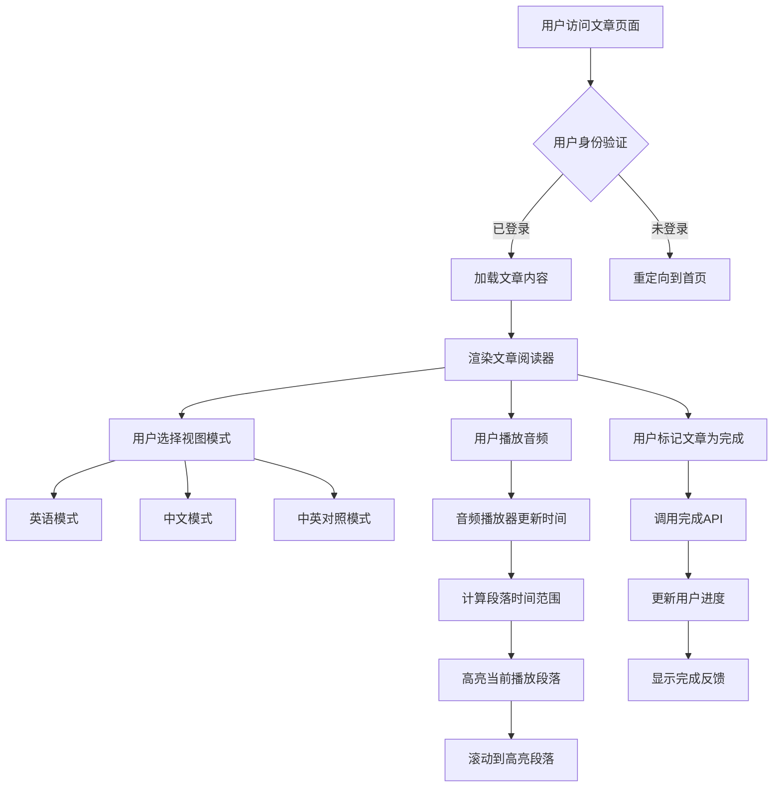

**用户工作流图**
- [ArticleReader.tsx](file://components/ArticleReader.tsx#L19-L394)
- [page.tsx](file://app/(user)/article/[id]/page.tsx#L13-L99)

### 中英双语切换

文章阅读器支持三种视图模式：纯英语、纯中文和中英对照。用户可以通过顶部的切换按钮自由选择。视图模式由 `viewMode` 状态管理，初始值为 `'en'`。

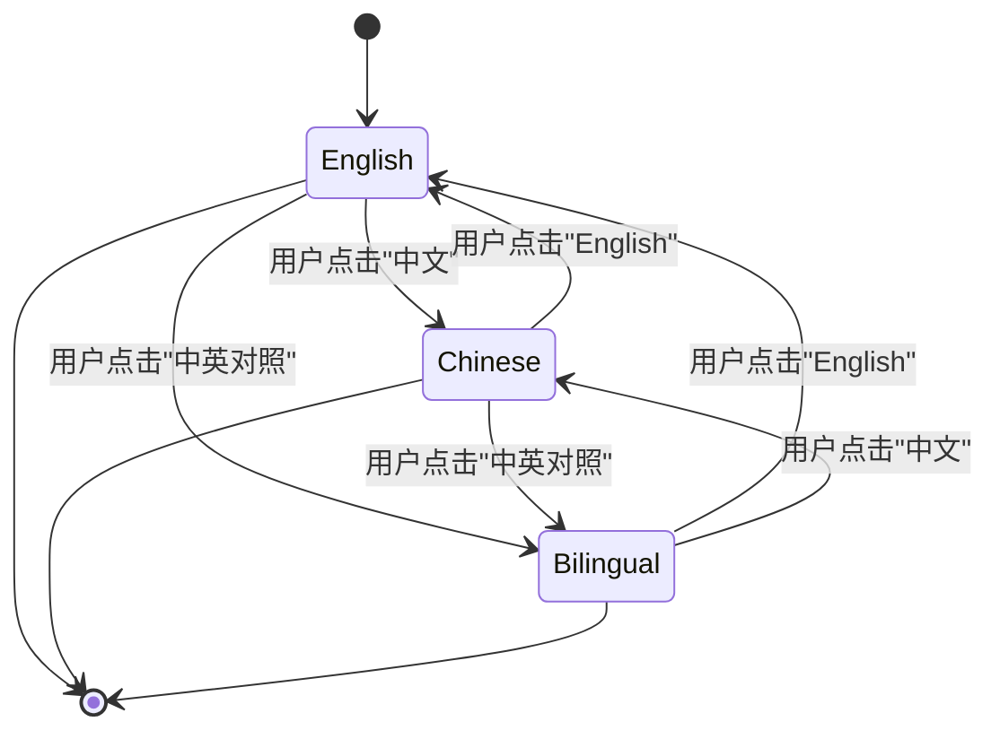

**视图模式状态转换图**
- [ArticleReader.tsx](file://components/ArticleReader.tsx#L21-L274)

### Markdown内容渲染

文章内容使用 `bytemd` 库进行渲染，支持标准的 Markdown 语法。系统通过 `@bytemd/react` 组件集成 `bytemd`，并配置了 GFM（GitHub Flavored Markdown）插件以支持更丰富的格式。

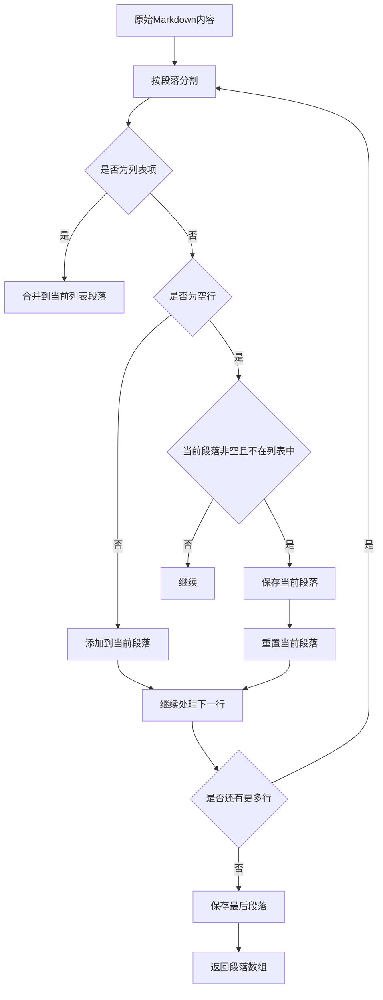

**段落分割算法流程图**
- [ArticleReader.tsx](file://components/ArticleReader.tsx#L35-L81)

### 音频同步高亮播放

音频同步高亮播放功能通过 `AudioPlayer` 组件和 `ArticleReader` 组件的协同工作实现。系统根据文章内容的单词数比例，将音频时长分配给各个段落，实现精准的同步高亮。

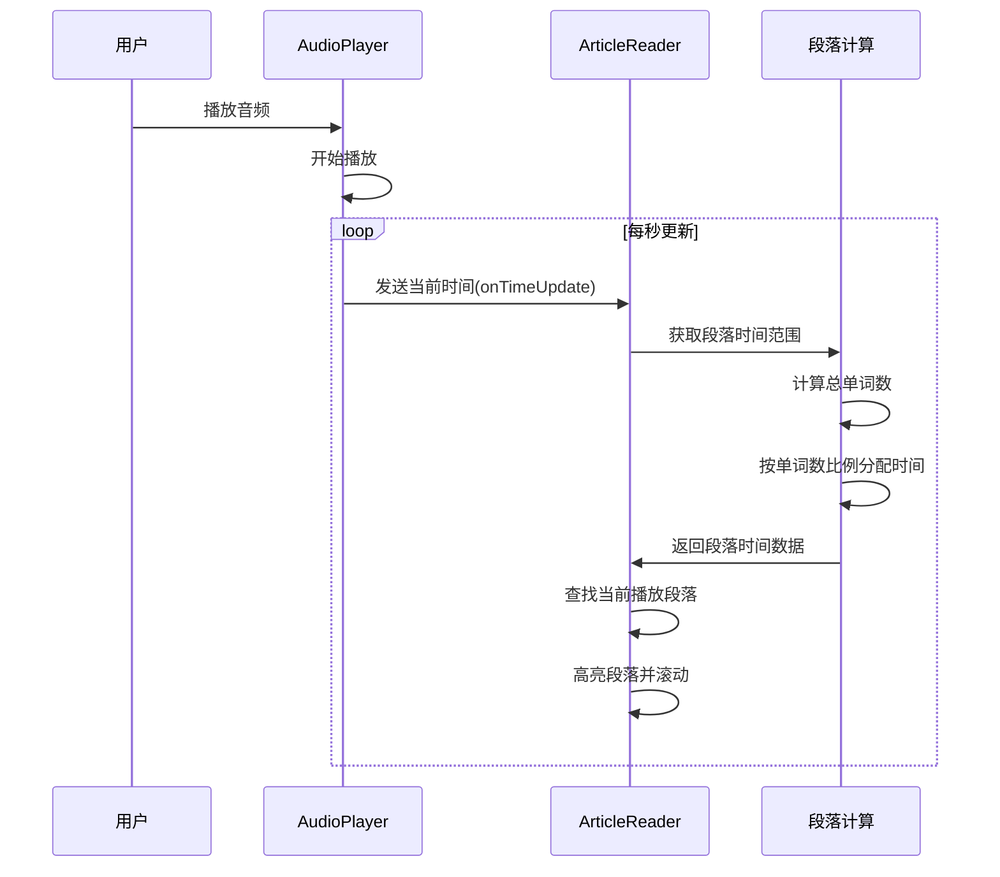

**音频同步高亮序列图**
- [AudioPlayer.tsx](file://components/AudioPlayer.tsx#L1-L143)
- [ArticleReader.tsx](file://components/ArticleReader.tsx#L105-L182)

**Section sources**
- [ArticleReader.tsx](file://components/ArticleReader.tsx#L19-L394)
- [AudioPlayer.tsx](file://components/AudioPlayer.tsx#L1-L143)

## 学习进度追踪系统

学习进度追踪系统通过 `ProgressContext` 和 `/progress` API 端点实现，记录用户的完成状态、连续签到和徽章解锁等信息。

### ProgressContext实现

`ProgressContext` 使用 React Context API 提供全局的用户进度状态。当用户登录时，系统自动获取进度数据，并在用户完成文章时刷新进度。

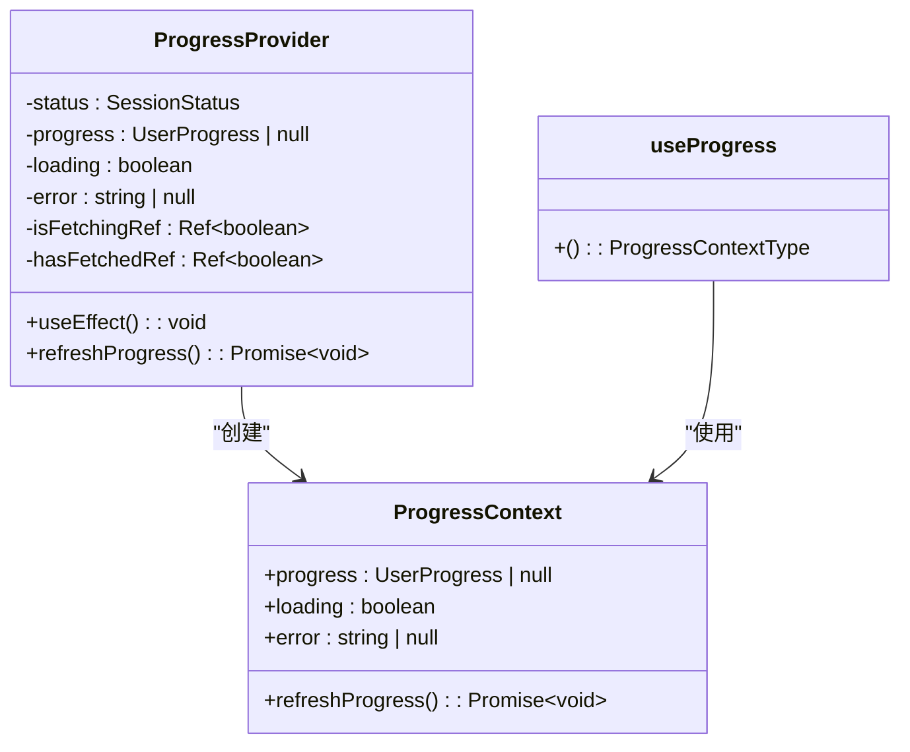

**进度上下文类图**
- [ProgressContext.tsx](file://contexts/ProgressContext.tsx#L1-L95)

### /progress API端点

`/progress` API 端点提供两个主要功能：GET 请求获取用户进度，POST 请求更新用户进度。

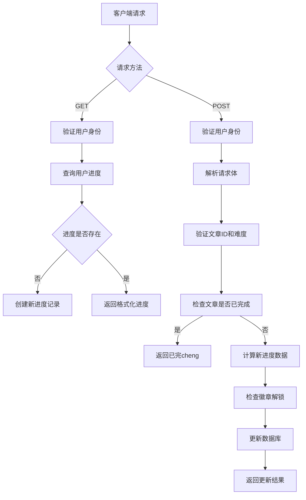

**进度API流程图**
- [progress/route.ts](file://app/api/progress/route.ts#L1-L78)
- [progress/complete/route.ts](file://app/api/progress/complete/route.ts#L1-L124)

### 连续签到与徽章解锁

系统通过 `currentStreak` 字段记录用户的连续签到天数，并基于 `constants.ts` 中定义的规则实现徽章解锁机制。

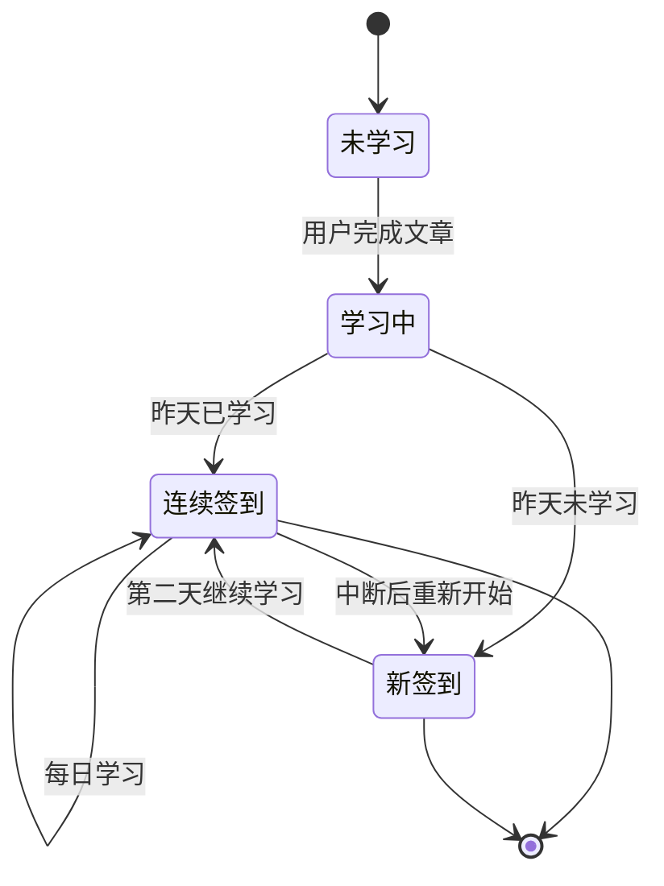

**连续签到状态转换图**
- [progress/complete/route.ts](file://app/api/progress/complete/route.ts#L37-L52)

**Section sources**
- [ProgressContext.tsx](file://contexts/ProgressContext.tsx#L1-L95)
- [progress/route.ts](file://app/api/progress/route.ts#L1-L78)
- [progress/complete/route.ts](file://app/api/progress/complete/route.ts#L1-L124)
- [constants.ts](file://constants.ts#L116-L145)

## 管理后台

管理后台为管理员提供文章管理、用户管理和统计仪表板功能，通过角色权限控制确保只有管理员可以访问。

### 功能概览

管理后台包含以下主要功能：
- **文章管理**：CRUD 操作，支持创建、编辑、查看和删除文章
- **用户管理**：查看用户列表，管理用户角色
- **统计仪表板**：显示系统关键指标，如用户总数、文章总数等

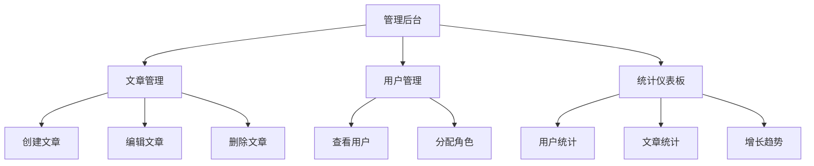

**管理后台功能架构图**
- [AdminLayout.tsx](file://components/AdminLayout.tsx#L1-L105)

### 文章管理

文章管理功能通过 `/admin/articles` 路由实现，管理员可以查看所有文章并进行 CRUD 操作。

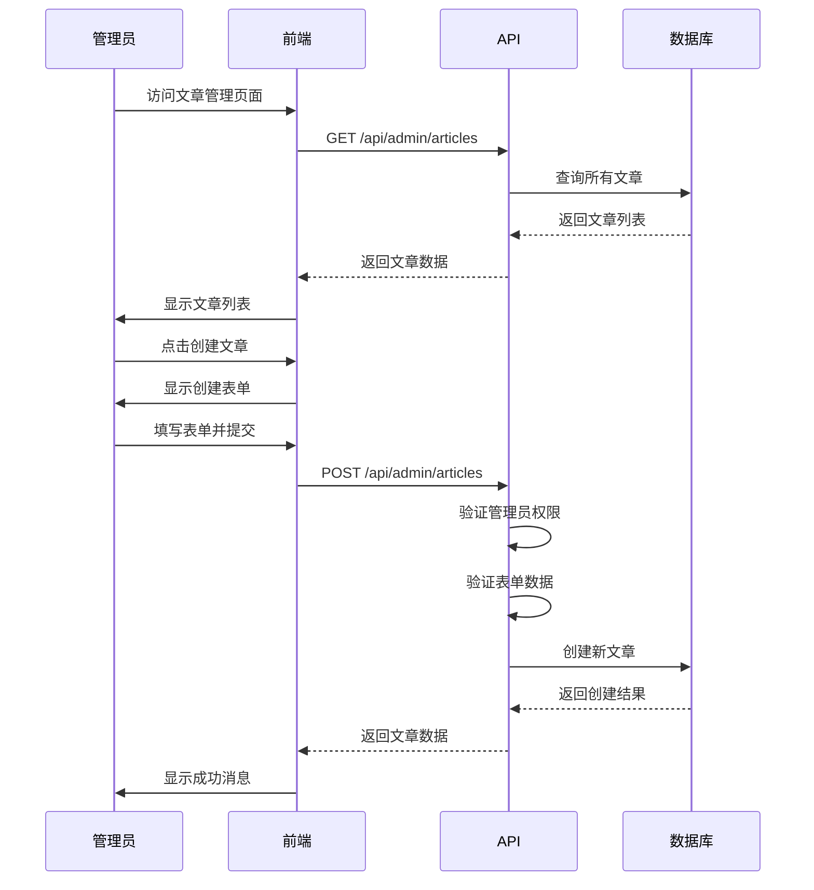

**文章管理序列图**
- [admin/articles/page.tsx](file://app/admin/articles/page.tsx#L1-L6)
- [admin/articles/route.ts](file://app/api/admin/articles/route.ts#L1-L137)

### 用户管理

用户管理功能通过 `/admin/users` 路由实现，管理员可以查看用户列表并管理用户角色。

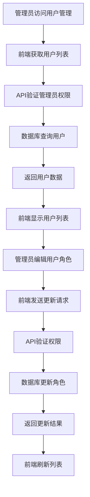

**用户管理流程图**
- [admin/users/page.tsx](file://app/admin/users/page.tsx#L1-L6)
- [admin/users/route.ts](file://app/api/admin/users/route.ts#L1-L46)

### 统计仪表板

统计仪表板显示系统的关键指标，帮助管理员了解平台的运营状况。

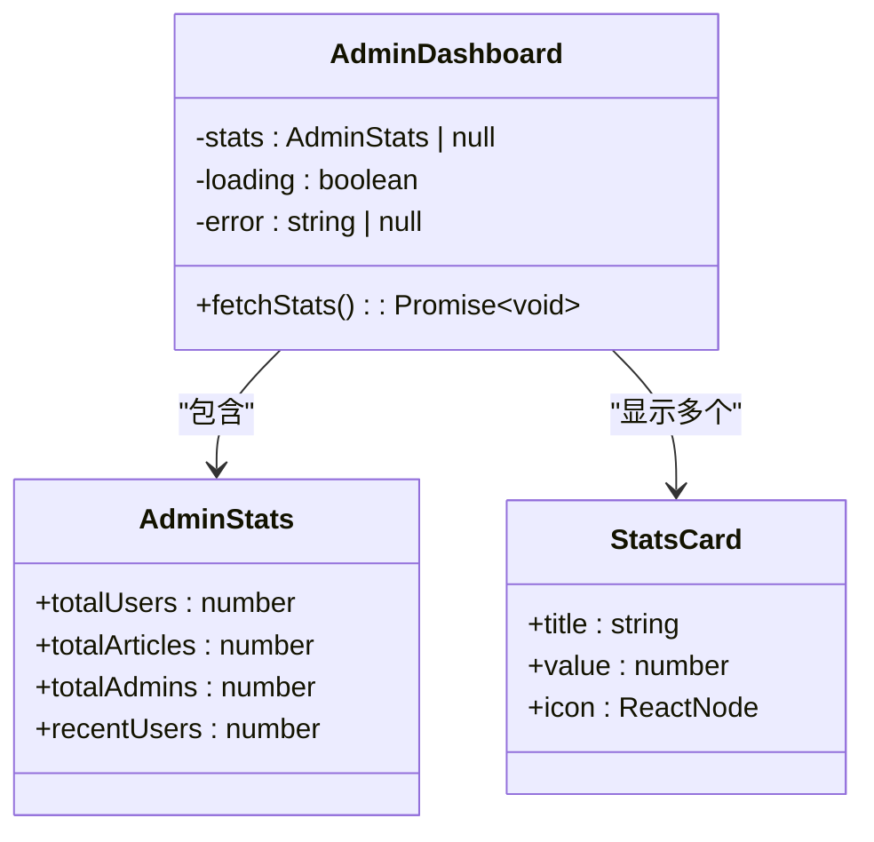

**统计仪表板类图**
- [admin/page.tsx](file://app/admin/page.tsx#L1-L155)
- [admin/stats/route.ts](file://app/api/admin/stats/route.ts#L1-L59)

**Section sources**
- [AdminLayout.tsx](file://components/AdminLayout.tsx#L1-L105)
- [admin/page.tsx](file://app/admin/page.tsx#L1-L155)
- [admin/articles/page.tsx](file://app/admin/articles/page.tsx#L1-L6)
- [admin/users/page.tsx](file://app/admin/users/page.tsx#L1-L6)
- [admin/stats/route.ts](file://app/api/admin/stats/route.ts#L1-L59)
- [admin/articles/route.ts](file://app/api/admin/articles/route.ts#L1-L137)
- [admin/users/route.ts](file://app/api/admin/users/route.ts#L1-L46)