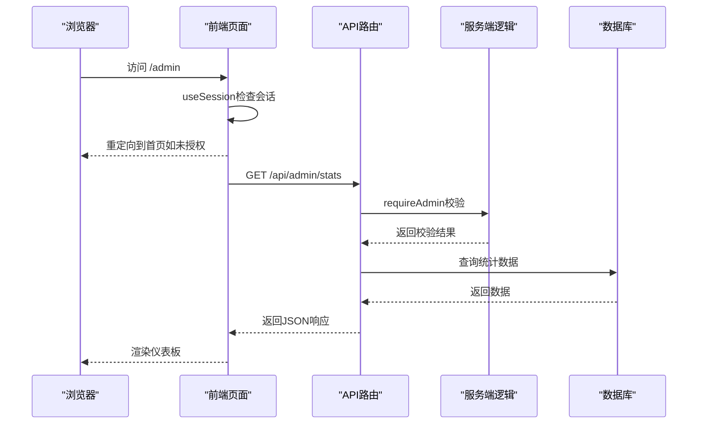
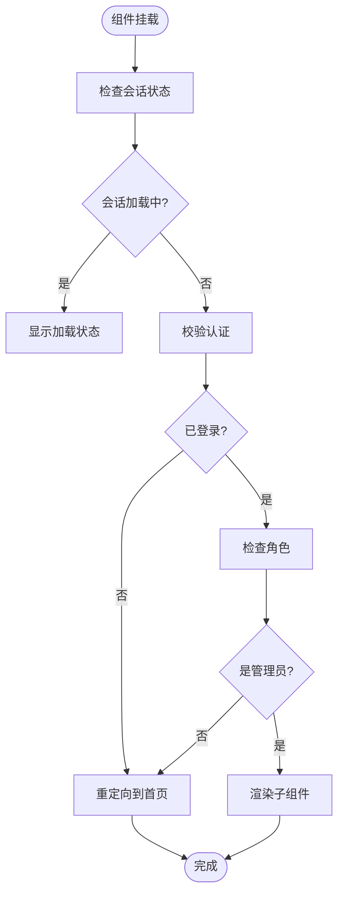
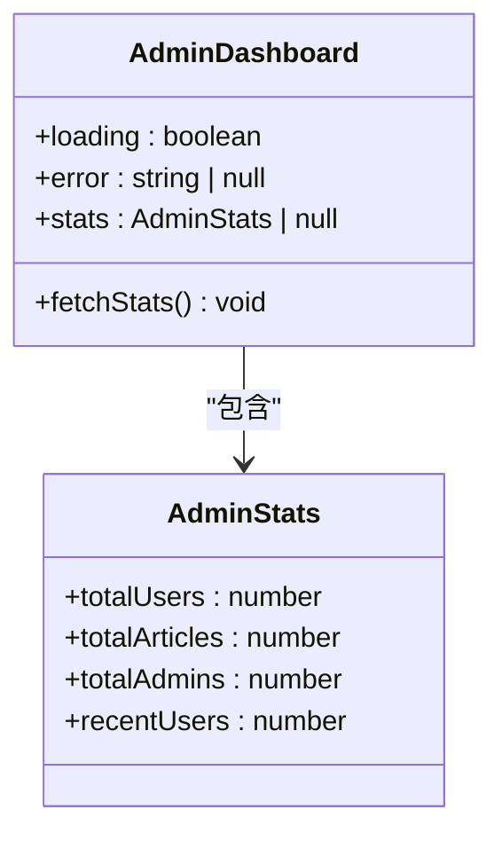
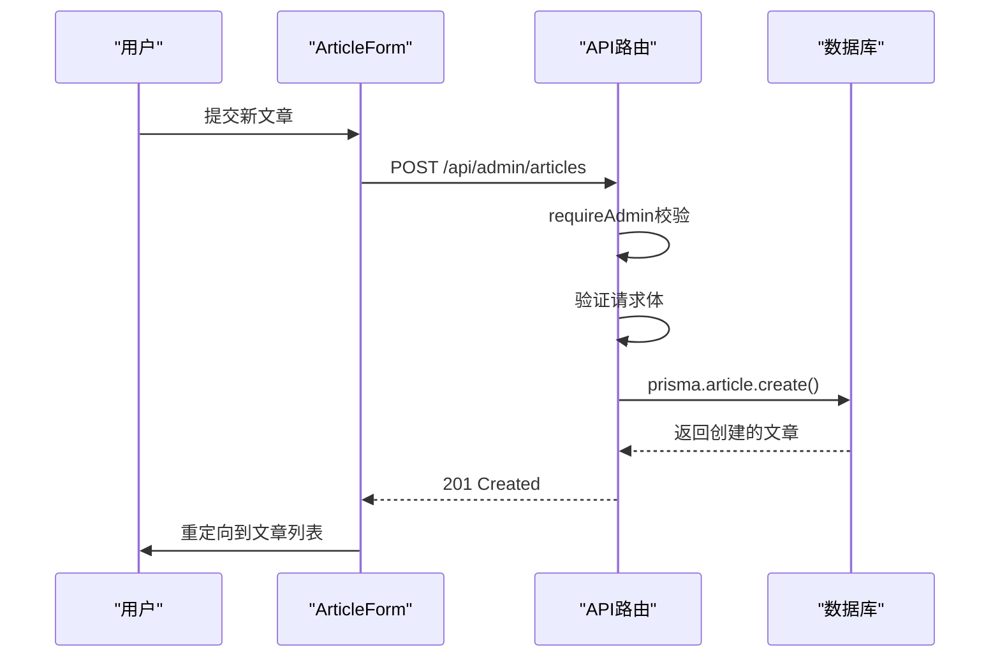
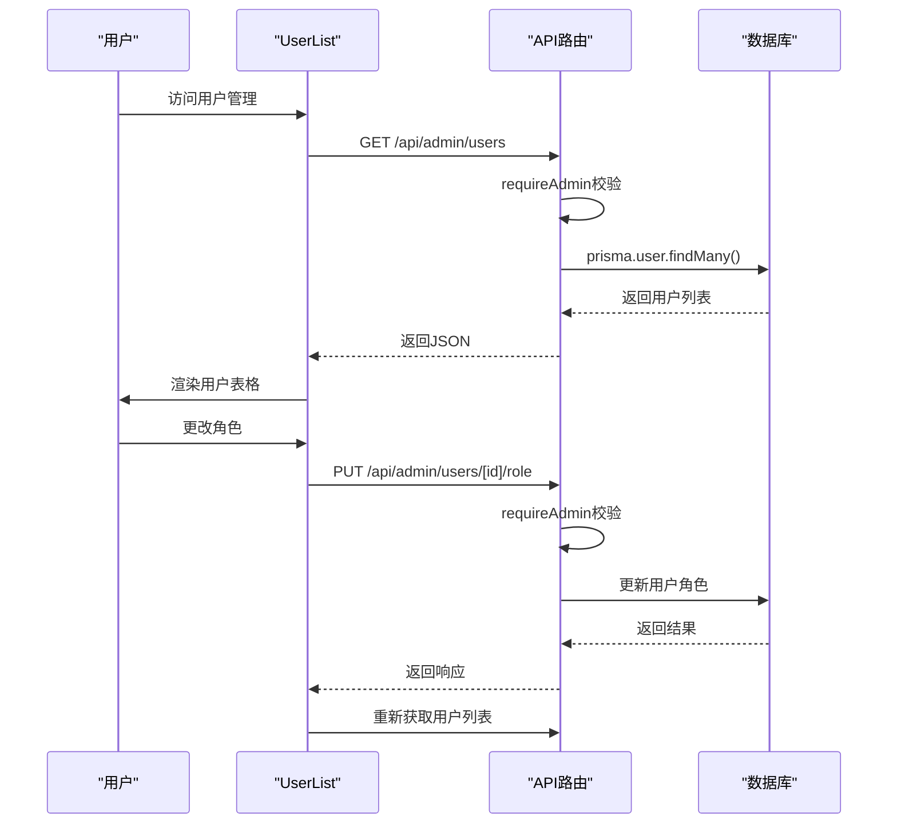

# 管理后台

<cite>
**本文档中引用的文件**  
- [AdminLayout.tsx](file://components/AdminLayout.tsx)
- [admin/page.tsx](file://app/admin/page.tsx)
- [admin/articles/page.tsx](file://app/admin/articles/page.tsx)
- [admin/articles/new/page.tsx](file://app/admin/articles/new/page.tsx)
- [admin/articles/[id]/edit/page.tsx](file://app/admin/articles/[id]/edit/page.tsx)
- [admin/users/page.tsx](file://app/admin/users/page.tsx)
- [admin/users/[id]/page.tsx](file://app/admin/users/[id]/page.tsx)
- [lib/auth.ts](file://lib/auth.ts)
- [api/admin/stats/route.ts](file://app/api/admin/stats/route.ts)
- [api/admin/articles/route.ts](file://app/api/admin/articles/route.ts)
- [api/admin/users/route.ts](file://app/api/admin/users/route.ts)
- [api/admin/users/[id]/route.ts](file://app/api/admin/users/[id]/route.ts)
- [api/admin/users/[id]/role/route.ts](file://app/api/admin/users/[id]/role/route.ts)
- [ArticleForm.tsx](file://components/ArticleForm.tsx)
- [ArticleList.tsx](file://components/ArticleList.tsx)
- [UserList.tsx](file://components/UserList.tsx)
- [UserDetail.tsx](file://components/UserDetail.tsx)
</cite>

## 目录
1. [简介](#简介)
2. [项目结构](#项目结构)
3. [核心组件](#核心组件)
4. [架构概览](#架构概览)
5. [详细组件分析](#详细组件分析)
6. [依赖分析](#依赖分析)
7. [性能考虑](#性能考虑)
8. [故障排除指南](#故障排除指南)
9. [结论](#结论)

## 简介
本文档全面记录了管理后台的功能架构与实现细节，涵盖仪表板、文章管理、用户管理和权限控制。重点说明了AdminLayout如何通过useSession钩子校验管理员角色，并在非授权访问时进行重定向。详细描述了/admin页面作为仪表板展示统计数据的结构设计。深入解析了文章管理模块如何通过调用/admin/articles接口实现CRUD操作，包括新建、编辑和删除文章的流程。阐述了用户管理功能如何通过/admin/users接口获取用户列表，并支持角色变更（如普通用户升级为管理员）。结合API路由文件说明了服务端权限校验逻辑（如auth.ts中的管理员检查），并提供了扩展新管理功能（如内容审核、日志查看）的最佳实践。

## 项目结构
管理后台的项目结构遵循Next.js的约定，采用基于功能的组织方式。核心管理功能位于app/admin目录下，包含仪表板、文章管理和用户管理三个主要模块。每个模块都有独立的页面和API路由。前端组件集中存放在components目录中，服务端逻辑通过app/api目录下的路由处理程序实现。权限控制逻辑封装在lib/auth.ts中，确保前后端的一致性。

```mermaid
graph TB
subgraph "前端页面"
A[/admin] --> B[/admin/articles]
A --> C[/admin/users]
B --> D[/admin/articles/new]
B --> E[/admin/articles/[id]/edit]
C --> F[/admin/users/[id]]
end
subgraph "API路由"
G[/api/admin/stats] --> H[GET]
I[/api/admin/articles] --> J[GET, POST]
K[/api/admin/articles/[id]] --> L[PUT, DELETE]
M[/api/admin/users] --> N[GET]
O[/api/admin/users/[id]] --> P[GET, DELETE]
Q[/api/admin/users/[id]/role] --> R[PUT]
end
subgraph "共享组件"
S[AdminLayout]
T[ArticleForm]
U[ArticleList]
V[UserList]
W[UserDetail]
end
S --> A
T --> D & E
U --> B
V --> C
W --> F
```

**图示来源**
- [app/admin/page.tsx](file://app/admin/page.tsx)
- [app/admin/articles/page.tsx](file://app/admin/articles/page.tsx)
- [app/admin/users/page.tsx](file://app/admin/users/page.tsx)
- [components/AdminLayout.tsx](file://components/AdminLayout.tsx)
- [components/ArticleForm.tsx](file://components/ArticleForm.tsx)
- [components/ArticleList.tsx](file://components/ArticleList.tsx)
- [components/UserList.tsx](file://components/UserList.tsx)
- [components/UserDetail.tsx](file://components/UserDetail.tsx)

**章节来源**
- [app/admin/page.tsx](file://app/admin/page.tsx)
- [app/admin/articles/page.tsx](file://app/admin/articles/page.tsx)
- [app/admin/users/page.tsx](file://app/admin/users/page.tsx)

## 核心组件
管理后台的核心组件包括AdminLayout、仪表板、文章管理模块和用户管理模块。AdminLayout作为所有管理页面的布局组件，负责权限校验和导航。仪表板提供关键统计数据的可视化展示。文章管理模块支持文章的全生命周期管理，用户管理模块则允许管理员查看和修改用户信息及角色。

**章节来源**
- [components/AdminLayout.tsx](file://components/AdminLayout.tsx)
- [app/admin/page.tsx](file://app/admin/page.tsx)
- [components/ArticleList.tsx](file://components/ArticleList.tsx)
- [components/UserList.tsx](file://components/UserList.tsx)

## 架构概览
管理后台采用前后端分离的架构模式。前端使用Next.js App Router构建，后端通过API路由处理请求。权限控制在前后端同时实施：前端使用useSession进行实时校验，后端通过requireAdmin函数确保API调用的安全性。数据持久化通过Prisma ORM与数据库交互。



**图示来源**
- [components/AdminLayout.tsx](file://components/AdminLayout.tsx)
- [app/admin/page.tsx](file://app/admin/page.tsx)
- [app/api/admin/stats/route.ts](file://app/api/admin/stats/route.ts)
- [lib/auth.ts](file://lib/auth.ts)

## 详细组件分析
### AdminLayout权限校验
AdminLayout组件通过useSession钩子获取当前会话信息，并在useEffect中进行管理员角色校验。如果用户未登录或角色不是admin，则使用router.push重定向到首页。



**图示来源**
- [components/AdminLayout.tsx](file://components/AdminLayout.tsx#L15-L32)

**章节来源**
- [components/AdminLayout.tsx](file://components/AdminLayout.tsx)

### 仪表板设计
/admin页面作为管理后台的仪表板，通过fetchStats函数从/api/admin/stats接口获取统计数据，并以卡片形式展示总用户数、总文章数、管理员数量和最近新用户等关键指标。



**图示来源**
- [app/admin/page.tsx](file://app/admin/page.tsx#L8-L13)
- [app/admin/page.tsx](file://app/admin/page.tsx#L24-L39)

**章节来源**
- [app/admin/page.tsx](file://app/admin/page.tsx)

### 文章管理CRUD流程
文章管理模块通过调用/admin/articles接口实现完整的CRUD操作。新建文章时提交POST请求，编辑时发送PUT请求，删除时使用DELETE请求。前端通过ArticleForm和ArticleList组件提供用户界面。



**图示来源**
- [components/ArticleForm.tsx](file://components/ArticleForm.tsx#L160-L205)
- [app/api/admin/articles/route.ts](file://app/api/admin/articles/route.ts#L43-L128)

**章节来源**
- [components/ArticleForm.tsx](file://components/ArticleForm.tsx)
- [app/api/admin/articles/route.ts](file://app/api/admin/articles/route.ts)

### 用户管理功能
用户管理功能通过/admin/users接口获取用户列表，并支持通过下拉选择器变更用户角色。点击用户可查看详细信息，包括学习统计和账户信息。



**图示来源**
- [components/UserList.tsx](file://components/UserList.tsx#L67-L87)
- [app/api/admin/users/[id]/role/route.ts](file://app/api/admin/users/[id]/role/route.ts)

**章节来源**
- [components/UserList.tsx](file://components/UserList.tsx)
- [components/UserDetail.tsx](file://components/UserDetail.tsx)

## 依赖分析
管理后台的组件依赖关系清晰，遵循单向数据流原则。AdminLayout作为根布局组件，包裹所有管理页面。各功能模块（文章管理、用户管理）通过独立的API路由与后端通信，避免了组件间的直接耦合。

```mermaid
graph TD
A[AdminLayout] --> B[/admin]
A --> C[/admin/articles]
A --> D[/admin/users]
C --> E[ArticleList]
C --> F[ArticleForm]
D --> G[UserList]
D --> H[UserDetail]
E --> I[/api/admin/articles]
F --> I
G --> J[/api/admin/users]
H --> K[/api/admin/users/[id]]
I --> L[requireAdmin]
J --> L
K --> L
L --> M[prisma]
```

**图示来源**
- [app/admin/layout.tsx](file://app/admin/layout.tsx)
- [components/AdminLayout.tsx](file://components/AdminLayout.tsx)
- [app/api/admin/articles/route.ts](file://app/api/admin/articles/route.ts)
- [app/api/admin/users/route.ts](file://app/api/admin/users/route.ts)
- [lib/auth.ts](file://lib/auth.ts)

**章节来源**
- [app/admin/layout.tsx](file://app/admin/layout.tsx)
- [lib/auth.ts](file://lib/auth.ts)

## 性能考虑
管理后台在性能方面进行了多项优化。前端采用懒加载策略，仅在需要时获取数据。后端API通过Prisma的查询优化减少数据库负载。对于频繁访问的统计数据，建议实现缓存机制以提高响应速度。

## 故障排除指南
常见问题包括权限校验失败、API调用错误和数据加载异常。排查时应首先检查会话状态和角色信息，然后验证API路由的权限校验逻辑，最后确认数据库连接和查询语句的正确性。

**章节来源**
- [components/AdminLayout.tsx](file://components/AdminLayout.tsx#L15-L32)
- [lib/auth.ts](file://lib/auth.ts#L77-L99)
- [app/api/admin/articles/route.ts](file://app/api/admin/articles/route.ts)

## 结论
管理后台实现了完整的功能架构，通过前后端协同的权限控制确保了系统的安全性。各模块职责清晰，代码结构合理，便于维护和扩展。建议未来增加操作日志记录和批量操作功能，进一步提升管理效率。