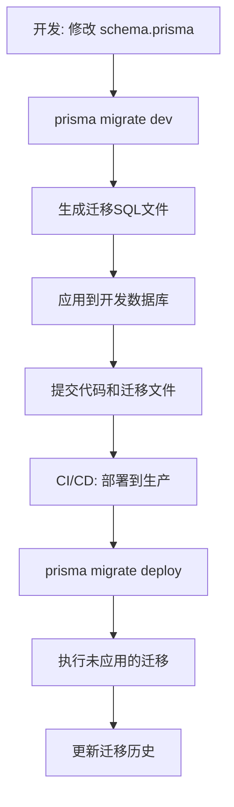
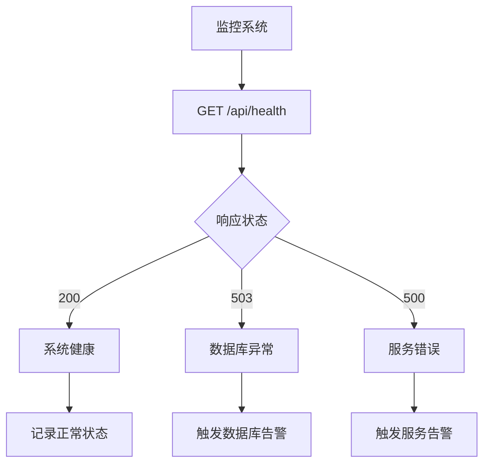

# 部署与配置

<cite>
**本文档引用的文件**  
- [package.json](file://package.json)
- [.env](file://.env)
- [prisma/schema.prisma](file://prisma/schema.prisma)
- [lib/prisma.ts](file://lib/prisma.ts)
- [lib/auth.ts](file://lib/auth.ts)
- [app/api/health/route.ts](file://app/api/health/route.ts)
- [app/api/cos/upload/route.ts](file://app/api/cos/upload/route.ts)
- [lib/db-utils.ts](file://lib/db-utils.ts)
- [next.config.js](file://next.config.js)
- [tailwind.config.js](file://tailwind.config.js)
- [app/api/cos/credentials/route.ts](file://app/api/cos/credentials/route.ts)
- [services/storageService.ts](file://services/storageService.ts)
</cite>

## 目录
1. [简介](#简介)
2. [环境变量配置](#环境变量配置)
3. [Next.js 构建与启动流程](#nextjs-构建与启动流程)
4. [Prisma 数据库迁移工作流](#prisma-数据库迁移工作流)
5. [腾讯云COS集成配置](#腾讯云cos集成配置)
6. [Docker化部署建议](#docker化部署建议)
7. [云平台部署最佳实践](#云平台部署最佳实践)
8. [健康检查与监控配置](#健康检查与监控配置)
9. [日志管理建议](#日志管理建议)

## 简介
本指南详细说明如何将“每日英语阅读”应用从本地环境部署到生产环境。涵盖环境变量配置、Next.js构建流程、Prisma数据库迁移、腾讯云COS集成、Docker化部署以及云平台部署最佳实践。同时提供健康检查端点和日志管理建议，确保应用在生产环境中的稳定运行。

## 环境变量配置
生产环境必须正确配置关键环境变量，以确保应用正常运行。以下是核心环境变量的设置方法：

### 数据库连接配置
**DATABASE_URL** 是应用连接数据库的核心配置，需包含连接池参数以优化性能：
- **格式**: `mysql://用户名:密码@主机:端口/数据库名?connection_limit=10&pool_timeout=60&connect_timeout=30`
- **connection_limit**: 连接池最大连接数（建议10）
- **pool_timeout**: 获取连接的超时时间（建议60秒）
- **connect_timeout**: 建立连接的超时时间（建议30秒）

该变量在 `prisma/schema.prisma` 中通过 `env("DATABASE_URL")` 引用，并在 `lib/prisma.ts` 中由 Prisma Client 使用。

### 认证安全配置
**NEXTAUTH_SECRET** 用于加密 NextAuth 会话令牌，必须在生产环境中设置为强随机密钥：
- **长度**: 至少32字符
- **生成方法**: 使用 `openssl rand -base64 32` 生成
- **安全性**: 绝对不可在版本控制中暴露

该变量在 `lib/auth.ts` 中用于 JWT 令牌的签名和验证，确保用户会话的安全性。

### 腾讯云COS配置
COS 相关变量用于文件上传和存储服务：
- **COS_SECRET_ID**: 腾讯云API密钥ID（服务端使用）
- **COS_SECRET_KEY**: 腾讯云API密钥Key（服务端使用）
- **NEXT_PUBLIC_COS_BUCKET**: COS存储桶名称（客户端可见）
- **NEXT_PUBLIC_COS_REGION**: 存储桶所在区域（客户端可见）

注意：以 `NEXT_PUBLIC_` 开头的变量会被暴露给前端，因此不应包含敏感信息。

**Section sources**
- [.env](file://.env#L1-L14)
- [prisma/schema.prisma](file://prisma/schema.prisma#L8)
- [lib/prisma.ts](file://lib/prisma.ts#L8)
- [lib/auth.ts](file://lib/auth.ts#L6)
- [app/api/cos/upload/route.ts](file://app/api/cos/upload/route.ts#L50-L52)

## Next.js 构建与启动流程
应用的构建和启动遵循标准的 Next.js 生命周期，通过 `package.json` 中的脚本进行管理。

### 构建流程 (next build)
`next build` 命令执行以下操作：
1. 编译 TypeScript 和 React 组件
2. 生成静态资源和优化的 JavaScript 包
3. 预渲染所有静态页面
4. 生成 `.next` 输出目录

该命令在 `package.json` 中定义为 `"build": "next build"`，是部署前的必要步骤。

### 启动流程 (next start)
`next start` 命令启动生产环境服务器：
1. 从 `.next` 目录加载构建产物
2. 启动 Node.js 服务器，监听指定端口
3. 处理动态路由和 API 请求
4. 提供静态资源服务

该命令在 `package.json` 中定义为 `"start": "next start"`，通常在 Docker 容器或云环境中执行。

**Section sources**
- [package.json](file://package.json#L7-L8)
- [next.config.js](file://next.config.js#L2)

## Prisma 数据库迁移工作流
Prisma 提供了强大的数据库迁移工具，确保数据库模式与代码保持同步。

### 开发环境迁移 (prisma migrate dev)
在开发过程中使用 `prisma migrate dev` 命令：
1. 检测 `schema.prisma` 文件的变更
2. 生成新的迁移文件（SQL脚本）
3. 将变更应用到本地数据库
4. 更新 Prisma Client

此命令会自动创建迁移历史记录，确保团队成员之间的数据库一致性。

### 生产环境部署 (prisma migrate deploy)
在生产环境中使用 `prisma migrate deploy` 命令：
1. 读取迁移历史表（_prisma_migrations）
2. 执行所有未应用的迁移
3. 验证迁移成功
4. 更新迁移历史

该命令设计为无交互式执行，适合 CI/CD 流水线自动化部署。



**Diagram sources**
- [prisma/schema.prisma](file://prisma/schema.prisma#L1-L81)
- [package.json](file://package.json#L10)

**Section sources**
- [prisma/schema.prisma](file://prisma/schema.prisma#L1-L81)
- [package.json](file://package.json#L10)

## 腾讯云COS集成配置
应用通过腾讯云COS服务存储音频文件，需要正确配置密钥和权限。

### 密钥配置
- **SecretId 和 SecretKey**: 在 `.env` 文件中配置永久密钥
- **安全建议**: 生产环境应使用临时密钥（STS），避免永久密钥泄露
- **权限**: 密钥需具备存储桶的读写权限

### 上传流程
1. 管理员通过前端界面选择音频文件
2. 前端调用 `/api/cos/credentials` 获取临时凭证
3. 直接从前端上传到COS（减少服务器负载）
4. 上传成功后返回文件URL用于文章关联

`app/api/cos/upload/route.ts` 实现了服务端上传逻辑，包含文件类型和大小验证。

**Section sources**
- [.env](file://.env#L10-L13)
- [app/api/cos/upload/route.ts](file://app/api/cos/upload/route.ts#L48-L52)
- [app/api/cos/credentials/route.ts](file://app/api/cos/credentials/route.ts#L27-L30)

## Docker化部署建议
为实现环境一致性，推荐使用Docker进行容器化部署。

### Dockerfile 建议配置
```dockerfile
FROM node:18-alpine

WORKDIR /app

COPY package*.json ./
RUN npm install -g pnpm && pnpm install

COPY . .

RUN pnpm build

EXPOSE 3000

CMD ["pnpm", "start"]
```

### 关键配置要点
- 使用多阶段构建优化镜像大小
- 设置非root用户运行容器
- 通过环境变量注入敏感配置
- 挂载日志目录以便外部监控

**Section sources**
- [package.json](file://package.json#L6-L8)
- [next.config.js](file://next.config.js#L2)

## 云平台部署最佳实践
### Vercel 部署
1. 连接 GitHub 仓库
2. 配置环境变量（DATABASE_URL, NEXTAUTH_SECRET等）
3. 设置构建命令 `pnpm build`
4. 设置输出目录 `.next`
5. 配置自定义域名和SSL

### 其他云平台
- **AWS Amplify**: 支持自动CI/CD，需配置环境变量
- **Netlify**: 类似Vercel，注意API路由支持
- **自建服务器**: 使用PM2管理进程，Nginx反向代理

**Section sources**
- [package.json](file://package.json#L7-L8)
- [next.config.js](file://next.config.js#L2)

## 健康检查与监控配置
### 健康检查端点
`/api/health` 端点提供系统健康状态：
- 检查数据库连接状态
- 返回响应时间和时间戳
- HTTP状态码反映系统健康度（200正常，503异常）

该端点在 `app/api/health/route.ts` 中实现，使用 `checkDatabaseHealth()` 函数验证数据库连接。

### 监控建议
- **频率**: 每30秒轮询一次
- **告警**: 连续3次失败触发告警
- **集成**: 与Prometheus、Grafana等监控系统集成
- **日志**: 记录健康检查结果用于故障排查



**Diagram sources**
- [app/api/health/route.ts](file://app/api/health/route.ts#L8)
- [lib/db-utils.ts](file://lib/db-utils.ts#L51)

**Section sources**
- [app/api/health/route.ts](file://app/api/health/route.ts#L8-L38)
- [lib/db-utils.ts](file://lib/db-utils.ts#L51-L58)

## 日志管理建议
### 日志级别配置
- **生产环境**: 仅记录错误日志（'error'）
- **开发环境**: 记录错误和警告
- **调试环境**: 启用详细日志

在 `lib/prisma.ts` 中通过 `log` 配置项实现环境差异化日志。

### 日志收集
- **集中化**: 使用ELK或Fluentd收集日志
- **结构化**: JSON格式日志便于分析
- **保留策略**: 生产日志保留90天
- **安全**: 敏感信息脱敏处理

### 关键日志点
- 数据库连接异常
- 认证失败事件
- 文件上传错误
- 健康检查失败
- API请求错误

**Section sources**
- [lib/prisma.ts](file://lib/prisma.ts#L10)
- [app/api/health/route.ts](file://app/api/health/route.ts#L30)
- [app/api/cos/upload/route.ts](file://app/api/cos/upload/route.ts#L89)