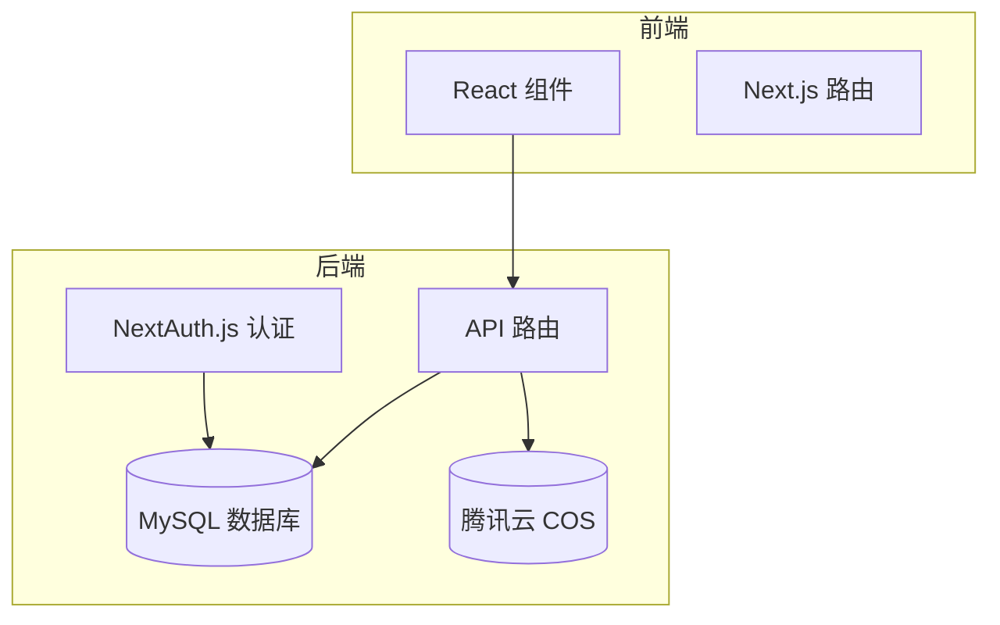
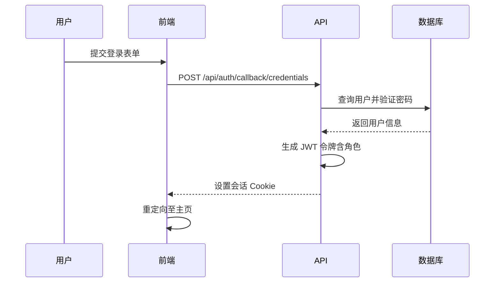
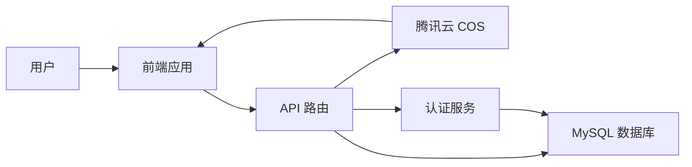

# 项目概述

<cite>
**本文档引用文件**  
- [page.tsx](file://app/page.tsx)
- [layout.tsx](file://app/layout.tsx)
- [prisma.ts](file://lib/prisma.ts)
- [auth.ts](file://lib/auth.ts)
- [next-auth.d.ts](file://types/next-auth.d.ts)
- [schema.prisma](file://prisma/schema.prisma)
- [route.ts](file://app/api/auth/[...nextauth]/route.ts)
- [articles/route.ts](file://app/api/articles/route.ts)
- [progress/route.ts](file://app/api/progress/route.ts)
- [admin/articles/route.ts](file://app/api/admin/articles/route.ts)
- [admin/users/route.ts](file://app/api/admin/users/route.ts)
- [ArticleReader.tsx](file://components/ArticleReader.tsx)
- [AudioPlayer.tsx](file://components/AudioPlayer.tsx)
- [StatsDashboard.tsx](file://components/StatsDashboard.tsx)
</cite>

## 目录
1. [引言](#引言)
2. [项目结构](#项目结构)
3. [核心功能与用户价值](#核心功能与用户价值)
4. [技术架构](#技术架构)
5. [用户认证与权限控制](#用户认证与权限控制)
6. [关键工作流分析](#关键工作流分析)
7. [系统上下文图](#系统上下文图)
8. [技术愿景与目标用户](#技术愿景与目标用户)
9. [结论](#结论)

## 引言

daily-english-reader 是一个全栈英语学习应用，旨在通过每日阅读材料、音频同步播放、学习进度追踪和徽章激励系统，帮助用户持续提升英语能力。该应用采用 Next.js 全栈架构，结合 React 前端组件与后端 API 路由，利用 Prisma ORM 实现数据库操作，并通过腾讯云 COS 存储音频资源。系统支持用户与管理员两种角色，提供个性化的学习体验和内容管理功能。

**Section sources**
- [page.tsx](file://app/page.tsx#L1-L203)
- [layout.tsx](file://app/layout.tsx#L1-L30)

## 项目结构

项目采用标准的 Next.js 应用结构，主要分为以下几个部分：

- `app/`：包含所有页面路由，分为用户端 `(user)` 和管理员端 `admin`。
- `components/`：可复用的 UI 组件，如文章阅读器、音频播放器、统计仪表盘等。
- `lib/`：核心工具库，包括数据库连接（Prisma）、认证逻辑（NextAuth.js）等。
- `prisma/`：数据库模型定义与迁移脚本。
- `services/`：业务逻辑服务，如存储服务。
- `types/`：类型定义文件，扩展 NextAuth 的用户类型以支持角色字段。

**Section sources**
- [project_structure](file://#L1-L100)

## 核心功能与用户价值

该应用的核心功能包括：

- **每日阅读**：用户每天可阅读一篇精选英语文章，支持中英对照模式。
- **音频同步**：文章配有音频，播放时自动高亮对应段落，实现视听同步学习。
- **进度追踪**：记录用户完成的文章数量、连续打卡天数、学习热度图等。
- **徽章激励**：通过完成特定目标解锁成就徽章，增强学习动力。
- **管理员后台**：管理员可新增、编辑文章，管理用户角色。

这些功能共同构建了一个闭环的学习激励系统，帮助用户养成每日学习的习惯。

**Section sources**
- [page.tsx](file://app/page.tsx#L1-L203)
- [ArticleReader.tsx](file://components/ArticleReader.tsx#L1-L394)
- [StatsDashboard.tsx](file://components/StatsDashboard.tsx#L1-L180)

## 技术架构

系统采用 Next.js 全栈架构，整合前端 React 组件与后端 API 路由。Prisma ORM 用于定义数据模型并执行数据库操作，确保数据一致性与类型安全。

**Diagram sources**
- [schema.prisma](file://prisma/schema.prisma#L1-L81)
- [prisma.ts](file://lib/prisma.ts#L1-L30)
- [route.ts](file://app/api/articles/route.ts#L1-L52)

## 用户认证与权限控制

用户认证基于 NextAuth.js 实现，支持凭据登录（邮箱/密码）。通过扩展 `next-auth.d.ts` 文件，将用户角色（`role`）集成到会话中，实现细粒度权限控制。

管理员权限通过 `requireAdmin` 函数验证，确保只有管理员可访问 `/admin` 路径及管理 API。

**Diagram sources**
- [auth.ts](file://lib/auth.ts#L1-L101)
- [next-auth.d.ts](file://types/next-auth.d.ts#L1-L32)
- [route.ts](file://app/api/auth/[...nextauth]/route.ts#L1-L6)

**Section sources**
- [auth.ts](file://lib/auth.ts#L1-L101)
- [next-auth.d.ts](file://types/next-auth.d.ts#L1-L32)

## 关键工作流分析

### 用户登录流程

用户访问首页后，若未登录则显示登录表单。登录成功后，系统获取用户角色并渲染相应界面，普通用户进入阅读页，管理员额外显示管理后台入口。

### 文章阅读与进度更新

用户阅读文章时，可切换英文、中文或双语模式。音频播放时，系统根据单词数比例计算各段落时间，并高亮当前播放内容。完成阅读后，点击“标记为已完成”按钮，触发 `/api/progress/complete` 接口更新进度，并检查是否解锁新徽章。

### 管理员文章管理

管理员通过 `/admin/articles/new` 页面创建新文章，填写标题、摘要、内容、难度、音频链接等信息，提交后调用 `/api/admin/articles` 接口存入数据库。

**Section sources**
- [page.tsx](file://app/page.tsx#L1-L203)
- [ArticleReader.tsx](file://components/ArticleReader.tsx#L1-L394)
- [admin/articles/route.ts](file://app/api/admin/articles/route.ts#L1-L137)

## 系统上下文图

**Diagram sources**
- [schema.prisma](file://prisma/schema.prisma#L1-L81)
- [services/storageService.ts](file://services/storageService.ts#L1-L20)
- [app/api/cos/upload/route.ts](file://app/api/cos/upload/route.ts#L1-L15)

## 技术愿景与目标用户

本项目的技术愿景是打造一个高效、可扩展、用户体验优秀的全栈英语学习平台。目标用户包括：

- **英语学习者**：希望通过每日阅读提升英语水平的用户。
- **管理员**：负责内容运营与用户管理的后台人员。

核心价值主张在于通过科学的内容设计、智能的音频同步和游戏化的激励机制，降低英语学习门槛，提升用户粘性与学习效果。

**Section sources**
- [README.md](file://README.md#L1-L21)
- [package.json](file://package.json#L1-L41)

## 结论

daily-english-reader 是一个功能完整、架构清晰的全栈英语学习应用。通过 Next.js 与 Prisma 的结合，实现了前后端的高效协同；通过 NextAuth.js 与角色扩展，保障了系统的安全性与可管理性；通过音频同步与徽章系统，提升了用户的学习体验与积极性。未来可进一步优化推荐算法、增加社交功能，打造更丰富的学习生态。